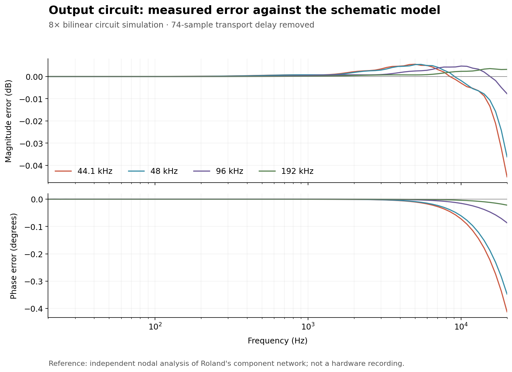
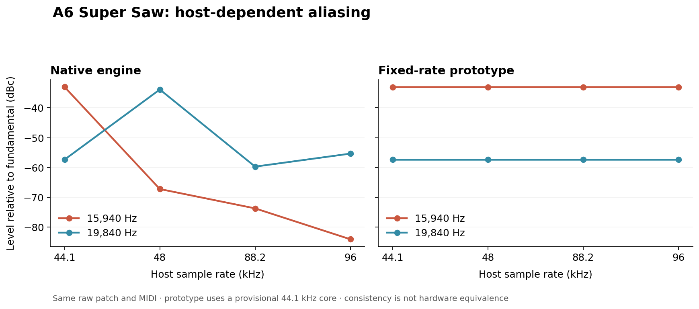

# SH-201 fidelity work

The [2026-09-15 source audit](source-audits/2026-09-15-new-sources.md) adds
published hardware LFO periods and six dry filter recordings with original
performance MIDI. The [dry filter calibration](dry-filter-calibration.md)
corrects the zero-resonance response, with measured improvements across notes
and both slopes. The recorded patch remains a recipe rather than a SysEx dump.
The [equivalence assessment](equivalence-assessment.md) measures spectrum,
envelope and stereo differences and prevents missing evidence from becoming
an output-equivalence claim. Whole-instrument equivalence remains open.

The [current goal status](goal-status.md) records implemented corrections,
rejected candidates and active investigations. [Phase-only controls](source-audits/dry-phase-sensitivity-2026-09-15.md)
now quantify how strongly short-window metrics can vary without a parameter
change other than waveform origin. Their distances cannot be subtracted from
hardware errors or used as a perceptual acceptance margin.

The [new public reverb checks](source-audits/reverb-new-preset-validation-2026-09-15.md)
support halving the current wet return as a provisional correction. Five
independent neutral-damping recordings improve; Club Bass and Ambient SQR
retain damped-tail regressions. Frozen performance variants, common gain and
timing, all counterexamples and independent verification remain available.
The exact Roland return coefficient, decay law and damping topology are open.
The [synchronized seven-preset player](http://127.0.0.1:58513/) compares original
recordings, the previous return and the corrected return, with
[verified audio provenance](source-audits/reverb-listening-player-2026-09-15.md).
The [additional SINGLE/damped reference](source-audits/reverb-mode-damping-followup-2026-09-15.md)
has small spectral gains and worse stereo spread; it does not resolve the
tail mismatch. A [numerical alignment fix](source-audits/alignment-silence-regression-2026-09-15.md)
corrects one near-silent timing fit while preserving the lag/gain of the
other 170 historical comparisons checked.

The [synchronized dry listening comparison](source-audits/dry-listening-player-2026-09-15.md)
presents original-MIDI hardware, current DSP and the retained envelope
experiment with frozen gain and timing. Source and model uncertainties
remain explicit; the experiment has not replaced production.

The [strict search for exact recording inputs](exact-reference-search.md) found no verified public set with both original performance MIDI and the exact preset used for a hardware recording. The estimated comparisons below do not qualify for that stricter requirement.

The [ten-recording hardware A/B set](ten-recording-ab.md) pairs real official Roland recordings with unchanged published presets and explicitly reconstructed MIDI, including six new bass/lead transcriptions and current-engine renders.

The [timbre calibration implementation](timbre-calibration/README.md) adds isolated filter, envelope, waveform and Super Saw models, plus causal configurable-rate comparison rendering. Its diagnostic profiles remain separate from the default plug-in sound.

The latest [ten additional improvements](ten-more-improvements.md) include a ranked source review, per-candidate audits, and [combined validation](ten-more-validation.md).

[Five further improvements](five-further-improvements.md) ranks the remaining
behavioral and timbral candidates and documents the selected clock, portamento,
reverb-damping and FB OSC sync changes. It supersedes older notes that describe
external clock reception or FB OSC slave sync as unimplemented.

This work separates a circuit correction supported by Roland's schematic from
an experimental synthesis-clock change. No physical SH-201 was available for
matched recordings. A successful numerical test is not proof that the complete
instrument sounds identical to the hardware.

The following circuit and reference-rate measurements describe the first audio
round (`c29a21f`). [Round 2](quality-round2.md) adds five shipping quality fixes for
MIDI timing, gain/pan transitions and effects, with separate regression evidence.
[Round 3](hardware-round3.md) implements ten further corrections from Roland's
manuals, the AK4552 datasheet and a firsthand SH-201 hardware review, including
polyphonic keyed LFOs and the reported one-octave pitch-envelope limit.

[Hardware audio benchmark](hardware-audio-benchmark.md) adds 64 acquired demo
recordings, 400 published Roland patches and three rendered comparisons using
unmodified published presets with explicitly reconstructed MIDI. Original
performance MIDI remains unverified; the report preserves that limitation.

The [benchmark audit](hardware-benchmark-audit.md) independently checks the
librarian bytes against eight author-supplied SysEx SMFs, measures all 127
uniform velocities for each comparison, and fixes fragmented multibyte SysEx
in the shipping importer and live MIDI receiver. It also restores Super Saw
oscillator SYNC with an explicitly unmeasured phase-reset topology, and adds
an independently revised Moogie 1 reconstruction.

The [filter darkness investigation](filter-darkness-investigation.md) rules out
an import/coefficient arithmetic error and identifies an overly fast Moogie
filter decay. Its selected production correction uses a dedicated linear filter
decay, approximately 419 ms at raw 49, with provisional power interpolation
between 2 ms and 12 s. Other slider values are unmeasured; cutoff, filter
release, amplifier and pitch envelopes retain their existing behavior.
Fresh [production renders](source-audits/filter-production-renders.json) for all
three comparisons are byte-identical to the accepted linear candidate; the
[before/after/hardware player](http://127.0.0.1:8897/) is available while its
local server runs. Historical candidate recordings retain their original labels.
These are historical filter-stage renders with the earlier coarse-tuning interpretation.

The [WIDE pitch correction](wide-pitch-correction.md) fixes normal-range hardware
coarse tuning from three octaves to one, including live SysEx and pitch CCs.
Cotton/Pedal and a new SupaJuce comparison establish the oscillator interval.
The [pitch-correction player](http://127.0.0.1:8898/player/) uses revised,
explicitly reconstructed MIDI and unchanged published presets. Cotton loses
most of its excess sub-bass; waveform and filter differences remain. Native
sessions retain their sounding pitches; re-import original SysEx for this fix.

The [resonance investigation](resonance-investigation.md) identifies insufficient
moderate-resonance emphasis and calibrates the voice filter against SupaJuce 1
and Air Lead 1. A bounded second resonant section improves the 24 dB response;
zero-resonance and AUDIO FILTER behavior are preserved. The
[resonance-stage player](http://127.0.0.1:8899/) compares identical MIDI/preset
inputs before and after. Cutoff position and waveform differences remain;
the exact hardware topology and full control table are unverified.

The [envelope brightness investigation](brightness-investigation.md) finds
that the filter envelope's former 10-octave range leaves SupaJuce's peak cutoff
about an octave too low. A 12-octave range restores its early upper harmonics
across multiple notes; cutoff, resonance and envelope timing remain unchanged.
The [latest comparison player](http://127.0.0.1:8900/) retains the same published
presets and reconstructed MIDI, with before/after/hardware listening copies.

The [Cotton Wool investigation](cotton-wool-investigation.md) independently
verifies all 22 published preset blocks and native decoded values, then traces
the actual filter envelope and tests reconstructed note gates. Preset identity
is confirmed; envelope calibration, Super Saw phase and wet tails remain
distinct from the unknown original performance.

## Implemented output circuit

The earlier output model treated the capacitors as two independent passive RC
filters. In the [Roland service schematic, printed pages 36–37](https://www.synthxl.com/wp-content/uploads/2020/01/Roland-SH-201-Service-Manual.pdf#page=30),
C219 returns to the output of IC25B. That makes the network an active Sallen–Key
filter. The right channel repeats the same topology.

`Source/DSP/AnalogOutput.h` derives its rational transfer from the actual values:

| Component | Value | Role |
| --- | --- | --- |
| C216 / R179 | 22 µF / 22 kΩ | DAC output coupling |
| R175 / R176 | 4.7 kΩ / 8.2 kΩ | Filter resistors |
| C219 / C220 | 270 pF / 820 pF | Feedback and grounded filter capacitors |
| R169 / R170 | 22 kΩ / 33 kΩ | Non-inverting gain of 2.5 |
| C358 | 10 pF | Frequency-dependent amplifier feedback |

The model normalises the nominal gain to preserve existing patch headroom. It
uses an ideal op-amp and treats the first coupling stage independently; solving
the complete loaded input node changes the 20 Hz–20 kHz magnitude by less than
0.0002 dB. The remaining master-volume/load network, line/headphone stages,
op-amp bandwidth and nonlinearities are still open.

The circuit is evaluated at 8× using bilinear discretisation, with half-band
interpolation and decimation. Its 74-sample transport delay is reported to the
host in addition to the existing overdrive delay. The input monitor retains
only the overdrive alignment delay before joining the shared circuit, so the
same output delay is not counted twice. Reset and All Sounds Off clear the
circuit and conversion history.

`SeptumAnalogOutputTests` measures the actual sampled impulse/sinusoid response
against an independent complex nodal-equation solution, including phase after
removing only the known transport delay:

| Engine rate | Maximum magnitude error | Maximum phase error | Total plug-in latency |
| --- | --- | --- | --- |
| 44.1 kHz | 0.0452 dB | 0.413° | 93 samples |
| 48 kHz | 0.0362 dB | 0.348° | 93 samples |
| 96 kHz | 0.0078 dB | 0.087° | 90 samples |
| 192 kHz | 0.0036 dB | 0.022° | 74 samples |



The [AK4552 datasheet, page 5](https://www.rxelectronics.com.ua/datasheet/61/ak4552vt.pdf#page=5)
assigns its 3.4 Hz digital high-pass to the **ADC**, not the synth output. It is
therefore not added here. The DAC's digital reconstruction filter is a separate,
unimplemented stage. Likewise, the service test's approximately −4 dB at 20 kHz
is an analog-input loop-through measurement, not an isolated synth-output curve.

## Fixed-rate prototype

`ReferenceRateEngine` renders the complete core at a provisional 44.1 kHz and
converts host input/output with causal, tabled, windowed-sinc filters. The
[interpolation method](https://www.dsprelated.com/freebooks/pasp/Windowed_Sinc_Interpolation.html)
is numerical infrastructure, not a claim about Roland's exact converter.

The reference choice follows the documented 44.1 kHz USB stream. That does not
prove that every synthesis block inside the hardware runs at this rate.

For one A6 Super Saw note, spread zero, the following probes demonstrate the
host-dependent aliasing in the native engine and its removal in the prototype.
Both datasets include the corrected output circuit. Values are dB relative to
the fundamental; the native 44.1 kHz and reference values differ slightly
because their control cadences differ.

| Host rate | Native 15,940 Hz | Reference 15,940 Hz | Reference 19,840 Hz |
| --- | --- | --- | --- |
| 44.1 kHz | −33.008 | −33.038 | −57.396 |
| 48 kHz | −67.230 | −33.038 | −57.396 |
| 88.2 kHz | −73.716 | −33.038 | −57.396 |
| 96 kHz | −84.070 | −33.038 | −57.396 |



The prototype is **not used by the plug-in**. It evaluates controls once per
internal sample instead of the native engine's eight-sample ticks. Indicative
ten-voice measurements cost roughly 3.3× native at 44.1/48 kHz. These are elapsed
render-time measurements on the development machine under concurrent load, not a
portable performance guarantee.

Tests cover exact block-partition invariance with identical timestamped events,
no render allocations, in-place input, converter rejection and explicit
latencies. Remaining integration gates are:

- Preserve the intended control cadence while retaining a continuous internal
  clock and sample-accurate events.
- Align MIDI and external input, or expose their difference deliberately. At
  48 kHz the prototype reports 171 host samples for MIDI-generated sound and
  241 for external input. Input FIR support grows with the rate ratio.
- Resolve low-rate event timing: at 32 kHz an immediate inherited event can
  affect a pending internal frame 23.24 µs early, within one host sample but
  beyond one 44.1 kHz sample.
- Measure and reduce CPU cost before replacing the shipping renderer.

The initial circuit/reference-rate round did not retune the native voice filter,
envelopes, Super Saw or FB OSC. Later work adopts an empirical filter-decay
anchor from the Moogie recording; the remaining time curve and synthesis
calibrations are still provisional. Round 2 changes effects bypass and numerical
delay interpolation; exact hardware effects calibration remains open. Listening
decisions remain in `Docs/decisions.md`; a preference does not close a hardware
calibration question.

## Reproduce measurements

Run from the repository root. The DSP tools do not need JUCE; raw audio stays
under ignored build directories.

```sh
cmake -S . -B build-fidelity -DCMAKE_BUILD_TYPE=Release -DSEPTUM_BUILD_PLUGIN=OFF -DBUILD_TESTING=ON
cmake --build build-fidelity --parallel
ctest --test-dir build-fidelity --output-on-failure

build-fidelity/SeptumAnalogOutputTests --response-csv build-fidelity/output-circuit.csv
build-fidelity/SeptumAnalyzeFidelity --output build-fidelity/native --source-id local-circuit-revision --renderer native --quick
build-fidelity/SeptumAnalyzeFidelity --output build-fidelity/reference --source-id local-circuit-revision --renderer reference --baseline build-fidelity/native --quick
python3 -B Tools/plot_fidelity.py --circuit build-fidelity/output-circuit.csv --native build-fidelity/native --reference build-fidelity/reference --output build-fidelity/plots
```

Plotting requires matplotlib. Omit `--quick` for the complete fixture matrix:
three registers, Super Saw spread 0/64/127, FB OSC, noise, all three filter
modes and both slopes at midpoint settings, and ADSR values 0/32/64/96/127.
Use a fresh output directory for each run. `--block-size` changes host block
partitioning; `--listening-copies` writes separate level-matched copies and the
applied gains. Raw float WAV samples are never normalised or clipped by the tool.

Each dataset carries the executable fingerprint, source label, raw `.syx`
patches, `.mid` events and per-rate offsets, initial random seeds, system and
performance values, output path, latency, raw gain, and source-manifest identity.
It writes JSON/TSV summaries, FFT spectra and RMS envelope curves. The original
native baseline was captured before the circuit integration and retained for
comparison; committed summaries under `measurements/` contain no Roland audio
or patch data.

Envelope curves use approximately 5 ms RMS bins; the actual sample count is
recorded for each rate. Physical attack/release estimates are only reported for
isolated sine fixtures, not beating oscillator stacks or imported performances.
Spectral values use a Hann-windowed held segment and state the measurement
window. Filter fixtures characterize the current model, not measured hardware
transfer functions. These tools support the later detailed filter/envelope and
oscillator calibration steps in the improvement plan.

The complete native and reference matrices each produced 112 finite, audible
renders across 28 fixtures and four rates. The greatest cross-rate RMS spread
was 0.3745 dB for native and 0.000239 dB for reference. These are consistency
results, not hardware-error measurements. The coarse envelope estimator also
has carrier/window bias: one slow reference attack measured 3,984 ms at
44.1 kHz and 4,000 ms at the other rates. Those output-RMS estimates should not
be interpreted as sample-accurate event timing; the dedicated timestamped
event and block-partition tests cover that separately. Compact results and
executable identities are preserved in `measurements/full-matrix.json`.

## Verification of this change

- All six DSP/tool CTest suites passed, including 4,313 engine checks and
  2,666 reference-rate checks.
- The JUCE processor suite passed 315 checks; Standalone, VST3 and AU built.
- The 11 demonstration WAVs were regenerated with the corrected circuit and
  their measured levels updated in the main README.
- Regression checks now account for the added output delay. Isolated mutation
  builds confirmed that they still reject the original sync-reset, stale
  overdrive, crossfade-retarget and stepped-SUSTAIN defects.

## Use official patch references locally

Roland's [PAD patch page](https://www.rolandus.com/go/sh-201_patches/patch_pad.html)
pairs downloadable librarian data with named audio demos. Download the bank
locally, then extract a selected parameter record without changing its bytes:

```sh
python3 -B Tools/extract_reference_patch.py path/to/SH-201_Patch_PAD.zip --list
python3 -B Tools/extract_reference_patch.py path/to/SH-201_Patch_PAD.zip --patch "Cotton Wool" --output build-fidelity/references/cotton-wool.syx --source-url https://www.rolandus.com/go/sh-201_patches/shl/SH-201_Patch_PAD.zip --reference-audio-url https://www.rolandus.com/go/sh-201_patches/mp3/PAD/TOP8_Cotton_Wool.mp3
build-fidelity/SeptumAnalyzeFidelity --output build-fidelity/cotton-wool --source-id local-circuit-revision --patch build-fidelity/references/cotton-wool.syx --note 69 --velocity 100
```

The extractor validates the observed `SH2LibrarianFile0000` container, all 22
documented parameter-block sizes and 7-bit payloads, then writes checksum-valid
temporary-patch DT1 messages plus SHA-256 provenance. It does not download files
or add a bank to the plug-in. `--dry-import` explicitly disables overdrive and
effect sends/switches and labels the render as modified.

The known patch association still leaves MIDI, velocity, controller movements,
system settings, recording gain/path, mastering and patch revision uncertain.
Imported references are useful for bounded comparisons, not sample-aligned
calibration. The full evidence ledger is in `reference-manifest.json`.
