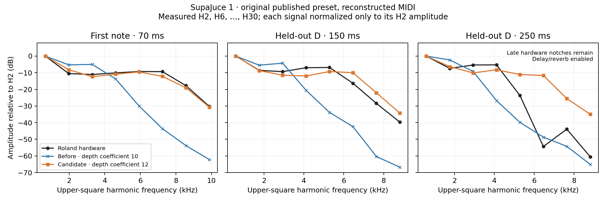

# Filter-envelope brightness calibration

The remaining SupaJuce brightness deficit came primarily from an envelope modulation range that was too small. With the previous resonance correction in place, the model produced the right sort of peak at roughly half the required frequency. Increasing the filter-envelope range from **±10 to ±12 octaves** restores much of the missing upper-harmonic energy without changing the original preset, cutoff knob or resonance curve.

[Listen to hardware, corrected Septum and previous Septum](http://127.0.0.1:8900/). Each software pair receives identical reconstructed MIDI, unmodified published SysEx and identical replay settings. Original hardware performance MIDI remains unavailable. Listening copies use one scalar RMS adjustment per excerpt, without EQ, compression or time stretching.

## Evidence and interpretation

Roland's [Owner's Manual, pp. 36–37 and 61](https://cdn.roland.com/assets/media/pdf/SH-201_OM.pdf) describes envelope depth as the direction and amount of cutoff movement. Its [MIDI Implementation, p. 5](https://cdn.roland.com/assets/media/pdf/SH-201_MI.pdf) gives signed depth −63…+63 encoded as raw 1…127. The public Editor agrees with those controls. None specifies the octave range, cutoff-to-Hz curve or sustain interpolation. The [parameter audit](source-audits/cutoff-parameter-audit.md) checks the actual imported fields and separates documented semantics from the numerical assumptions in the engine.

The correction is therefore an empirical calibration against recordings, not a recovered Roland table. It changes one existing mapping:

```text
previous filter envelope contribution = envelope level × depth × 10 / 63 octaves
corrected contribution                = envelope level × depth × 12 / 63 octaves
```

This is a 20% increase in modulation range, not a 20% frequency or treble boost. At SupaJuce's depth 31 and early envelope level around 0.97, it raises the corner almost one octave: **about 3.77 kHz to 7.30 kHz at 70 ms**. Depth zero remains neutral; cutoff calibration, key tracking, velocity sensitivity, LFO depth, resonance, envelope timing and effects remain unchanged. Signed negative depth follows the existing symmetric interpolation with a larger magnitude. Negative and extreme depths have not been independently measured on hardware.

## SupaJuce: peak position rather than insufficient resonance

Roland's [LEAD page](https://www.rolandus.com/go/sh-201_patches/patch_lead.html) associates the [SupaJuce 1 demo](https://www.rolandus.com/go/sh-201_patches/mp3/LEAD/TOP8_SupaJuce1.mp3) with the published patch. Its single active tone uses two square oscillators one octave apart, LP24, resonance 40, cutoff 27, key follow 50 and filter-envelope depth 31. The WIDE pitch interpretation and resonance correction are held fixed throughout this experiment.

The upper square's odd harmonics fall at H2/H6/H10/H14/H18/H22/H26/H30 relative to the lower square fundamental. They isolate an informative spectral family under the symmetric-waveform and linear-path assumptions. Fitting the current filter shape to the first note gives an equivalent maximum envelope range of **12.042 octaves**. Other early notes imply approximately 11.92–12.17, without fitting individual note cutoff offsets. Window-width and channel checks give approximately 12.037–12.044; shifting the assumed onset by ±15 ms broadens that to about 11.96–12.13. These are sensitivity results conditional on the current filter, oscillator and timing model, not hardware confidence intervals.

The selected round value is 12. A stronger 14-octave diagnostic overshoots the early spectral shape. Actual engine renders, with no preset intervention or fitted harmonic offsets, give these RMS errors for H6…H30 relative to H2 over early 40–100 ms windows where the gate permits:

| Note | Previous, 10 octaves | Corrected, 12 octaves | Diagnostic, 14 octaves |
|---|---:|---:|---:|
| 1, used for range estimation | 23.90 dB | **1.91 dB** | 7.02 dB |
| 2 | 22.33 dB | **5.09 dB** | 9.51 dB |
| 3 | 21.74 dB | **4.68 dB** | 9.22 dB |
| 4 | 22.08 dB | **4.00 dB** | 8.96 dB |
| 5 | 23.34 dB | **2.34 dB** | 7.14 dB |
| 6 | 18.73 dB | **1.92 dB** | 6.37 dB |

These selected spectral errors are not an overall fidelity percentage. They use more harmonics than the previous resonance report's H6…H22 summary, so the two tables are not directly comparable. Five notes are withheld from first-note range estimation, but all belong to the same patch and recording.



The long fifth note improves through roughly 200 ms, but not every later window improves. At 250 ms, a hardware spectrum with deep notches gives an error increase from about 11.48 to 20.73 dB. Delay/reverb interference and the remaining envelope trajectory both matter there. An independently fitted faster decay can reduce some residuals, but it is confounded with depth, sustain and the unknown performance. The production decay curve is unchanged. The [full SupaJuce analysis](source-audits/supajuce-brightness.md) preserves the late failures and exact input, renderer and audio identities.

## Independent checks and remaining differences

Cotton Wool provides an independent patch with a larger envelope depth, zero resonance and Super Saw plus sine. For its isolated opening note, the hardware's 900–2000 Hz energy relative to 110–155 Hz is about −1.76 dB. The old render is −7.30 dB; the 12-octave candidate is −1.61 dB. This supports restoring high-frequency energy, while the unknown original velocity, detuned oscillator phases, sustain response and recording effects limit precision. Individual Super Saw partials remain unreliable fitting targets, and later chord windows remain too dark. [Control-patch analysis](source-audits/brightness-controls.md)

Broader bands reduce sensitivity to individual detuned partials. The 700–3000 Hz / 200–700 Hz power ratio improves across the opening note, held chord and repeated bass passage. Testing all 127 uniform velocities in the old model cannot reach the corrected version's ratios in those passages:

| Cotton passage | Hardware | Previous at velocity 100 | Best previous uniform velocity | Corrected at velocity 100 |
|---|---:|---:|---:|---:|
| Opening note | −4.35 dB | −12.46 dB | −9.80 dB | −7.72 dB |
| Held chord | −7.35 dB | −12.91 dB | −11.17 dB | −9.88 dB |
| Repeated bass | −4.00 dB | −12.04 dB | −10.37 dB | −8.83 dB |

Cotton independently supports a partial brightness correction but does not uniquely select 12: the 14-octave diagnostic improves these broad bands further while overshooting SupaJuce. Arbitrary per-note velocities and accumulated wet effects remain confounded in later polyphonic passages. The single opening note is the strongest velocity check.

Air Lead's filter-envelope depth is zero. Its original-preset opening-note renders are byte-identical under the 10- and 12-octave engines. Its separate inferred cutoff mismatch argues against applying a universal cutoff increase. Moogie and Dist gain only a little brightness: their previously recorded oscillator-shape, phase and distortion residuals remain unresolved. No waveform inversion, per-preset adjustment or fitted EQ was introduced.

Whole-excerpt power centroids provide a separate, broad description:

| Preset | Hardware | Previous | Corrected |
|---|---:|---:|---:|
| SupaJuce 1 | 1,642 Hz | 1,127 Hz | 1,338 Hz |
| Cotton Wool | 316 Hz | 188 Hz | 211 Hz |
| Moogie 1 | 75.54 Hz | 60.75 Hz | 61.63 Hz |
| Dist Bs 1 | 64.63 Hz | 49.54 Hz | 49.90 Hz |

These 20 Hz–16 kHz power centroids depend heavily on bass balance and performance. A higher value is not automatically more accurate; the rejected 14-octave candidate illustrates why the harmonic shape also matters.

## Implementation and validation

The functional change is confined to `mapping::filterEnvOctaves` in `Source/DSP/SeptumEngine.h`. Existing native and imported resonant or nonresonant patches receive the corrected modulation directly. There are no new parameters, allocations, locks or session migrations, and no re-import is needed for this correction.

The isolated 10-octave control reproduces all four previous production WAVs byte for byte. All four fresh production WAVs are byte-identical to the accepted 12-octave candidate. New quiet-input tests locate the sustained resonant corner through the full engine at positive, negative and zero envelope depths, at 44.1, 48 and 96 kHz.

The final Release build passes all **12 CTest suites**, including 4,599 existing core-engine checks and 360 hardware-voice checks. The local arm64 AU, VST3 and standalone bundles pass strict deep ad-hoc signature verification. Browser checks confirm corrected audio playback, switching to the hardware reference and pausing. Final source, binary, test-log and comparison identities are recorded in the [production manifest](source-audits/production-brightness-comparison.json). The bundles are local development builds, not notarized distribution packages.

## Reproduction

Use fresh output directories to retain earlier evidence:

```sh
python3 Tools/build_brightness_candidates.py \
  --output build-fidelity/hardware-benchmark/fresh-brightness-candidates

cmake --build build-fidelity --parallel
ctest --test-dir build-fidelity --output-on-failure

python3 Tools/compare_hardware.py \
  --sources build-fidelity/hardware-benchmark/sources \
  --renderer build-fidelity/SeptumRenderMidi \
  --output build-fidelity/hardware-benchmark/fresh-brightness-production

python3 Tools/summarize_brightness_comparison.py \
  --before build-fidelity/hardware-benchmark/resonance-investigation/production-after \
  --after build-fidelity/hardware-benchmark/fresh-brightness-production \
  --figure Docs/fidelity/figures/supajuce-brightness.png \
  --output build-fidelity/hardware-benchmark/fresh-brightness-player
```

The candidate builder freezes source/header/library copies and records their hashes. It explicitly sets each tested envelope range, including the historical 10-octave control, so it can reconstruct the control from the promoted source. Renderer profiles contain the actual candidate source hashes; comparison manifests also record the contemporaneous shipping source, which must not be mistaken for the isolated variant. Original third-party audio and preset payloads remain in ignored build directories. The [hardware catalog](hardware-reference-catalog.json) records the source associations and their limits; it does not authenticate the exact patch revision or capture processing used for each published recording.
