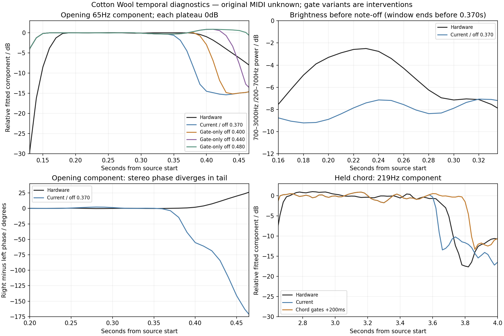

# Cotton Wool: preset identity and envelope behavior

**Septum uses the exact published Cotton Wool preset, with matching stored values.** Both software versions in the current listening page use the same full SysEx extraction from patch 1 of Roland's PAD bank. All 22 parameter blocks, containing 1,240 parameter bytes, match the bank. The served corrected audio also matches the latest production listening copy.

That establishes the published preset match. It does not establish identical knob/controller state when Roland recorded the demo, or identical performance MIDI. Roland associates the named recording and patch on its [official PAD page](https://www.rolandus.com/go/sh-201_patches/patch_pad.html), and specifically describes Cotton Wool as responding to velocity. Original velocities, gates and controllers are unavailable. The current 27-note reconstruction uses velocity 100 throughout and estimated note-off times.

## Published and loaded values

| Parameter | Published Cotton Wool | Loaded by Septum |
|---|---|---|
| Active tone | Single, Upper | Same |
| Filter | LPF, 24 dB/octave | Same |
| Cutoff / resonance | 0 / 0 | Same |
| Key follow / cutoff velocity sensitivity | +60 / +18 | Same |
| Filter envelope A / D / S / R | 10 / 58 / 87 / 105 | Same |
| Filter envelope depth | +39 | Same |
| Amplifier envelope A / D / S / R | 0 / 0 / 127 / 39 | Same |
| Amplifier level / velocity sensitivity | 70 / 0 | Same |
| Oscillator 1 | Super Saw, spread 41, coarse 0, fine 0 | Same |
| Oscillator 2 | Sine, WIDE off, signed coarse control −36, fine −7 | Converted to −12 physical semitones, −7 cents |
| Oscillator balance / LOW FREQ | Center / FLAT | Same |
| Delay / reverb sends | 0 / 35 | Same |
| Reverb pre-delay | Raw 125, corresponding to 100 ms | Same |

The coarse-control conversion is the earlier [WIDE correction](wide-pitch-correction.md), not a modified preset. The [full preset verification](source-audits/cotton-preset-verification.md) checks the official bank, complete SysEx and fresh native decoder output, including inactive stored tone and effect settings. Complete SysEx SHA-256:

```text
e7f23e39445895f2158482037b37a19dfe413e536869c0e6f78352de6e49fbef
```

## Why matching values can still sound different

The documentation defines the controls and their stored ranges, but does not publish the numerical conversion from those values to envelope times, filter frequency, sustain response or effect behavior. The previous corrections changed those DSP assumptions while leaving all preset values intact. An identical sustain value therefore does not yet guarantee an identical hardware cutoff trajectory.

Cutoff 0 is the starting control, not the playing frequency. In the current engine, depth, velocity and key follow raise the first reconstructed note's cutoff to about **3,584 Hz** at the envelope peak. At the modeled sustain value 87/127, it would settle to about **708 Hz**. The sustain fraction applies to logarithmic cutoff modulation; it is not 68.5% of peak frequency. This interpolation remains an unmeasured model choice.

Actual production instrumentation gives the first peak at about **2 ms** after note-on, then a decline to 3,412 Hz at 25 ms and 2,875 Hz at 105 ms. An apparent early rise in the recording's high/mid energy is partly sensitive to analysis windows crossing the onset, so it cannot establish a slower hardware attack. A cleaner discrepancy occurs from 0.230 to 0.330 seconds, entirely before the estimated note-off: hardware high/mid energy falls from about −2.50 to −7.55 dB, while the current render stays near −7.41 to −7.10 dB. The spectral motion differs even before release.

Super Saw phase interference remains a material alternative to incorrect filter motion: at this spread, the outer oscillators beat about every 567 ms at the fundamental but about every 57 ms at the tenth harmonic. Filter motion and detuned harmonic interference must be distinguished before changing attack or sustain. [Measured model trace and interpretation](source-audits/cotton-envelope-model.md)

The preset also has **100 ms of reverb pre-delay**. For an onset near 0.125 seconds, that places the earliest possible delayed return near 0.225 seconds, before additional reverberator delays. This overlaps the changing-brightness interval. It is a concrete competing explanation, not proof that reverb alone accounts for the mismatch.

There is also a performance/release discrepancy. The first reconstructed note-off is at 0.370 seconds. Our current AMP release mapping turns raw 39 into only **28.9 ms to −60 dB**, so dry audio drops sharply there. The long filter release, raw 105, cannot keep a voice audible after its amplifier closes. Shifting the gate changes this sharp cutoff but does not identify the hardware release law. The recording's later low-frequency tail becomes increasingly different between left and right channels, consistent with wet effects or capture processing rather than a purely mono dry-envelope fade; its length cannot be read directly as an amplifier-envelope duration. [Temporal recording and gate diagnostics](source-audits/cotton-envelope.md)

## Conclusion



The remaining difference is not explained by an accidentally different published filter or envelope value. The unresolved questions are the conversion of those values into sound, Super Saw/effect behavior and the estimated performance. The initial brightness trajectory deserves further filter/source isolation; note-off timing and the wet tail prevent a reliable release calibration from this excerpt alone.

This investigation preserves the production audio and preset values. It adds a byte/native-decoder audit, an actual cutoff trace and explicitly labeled performance diagnostics. Two stale code comments about WIDE were corrected; no DSP behavior changed in this investigation.
