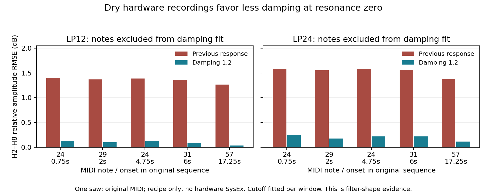

# Dry SH-201 filter calibration

2026-09-15. **Adopt less damping at voice resonance zero. Overall hardware
output equivalence remains unestablished.** The new dry recordings support this
specific response correction more directly than the wet factory demos. The
factory-demo residuals remain mixed and are not an overall improvement claim.

## Original evidence

deep!sonic's [filter comparison](https://www.deepsonic.ch/deep/htm/deepsonic_analytics_filter_comparison.php)
provides LP12/LP24 SH-201 recordings at resonance 0%, 50% and 100%, plus the
[original performance MIDI](https://www.deepsonic.ch/deep/audio_midi/deepsonic_-_filter_demo_-_comparsion_sequence.mid).
The documented recipe isolates a saw oscillator, disables effects and
modulation, uses octave-per-octave filter key tracking, and describes a
three-octave filter-envelope fall to the fundamental in about one second.

The original 320 kbit/s mono MP3 files fully decode at 44.1 kHz. Their bytes,
the MIDI, and source pages are pinned in the
[acquisition catalog](source-audits/deepsonic-acquisition-2026-09-15.json).
The MIDI contains actual notes and gates, but **the recorded hardware SysEx,
raw envelope settings, capture calibration and a bypass-saw recording are
absent**. This is a documented patch recipe, not an exact preset dump.

## Response identification

`Tools/analyze_deepsonic_filter.py` measures the two zero-resonance recordings.
Joint sine/cosine fitting on the original sample grid estimates harmonics with
local amplitude/phase ramps. A constant plus linear trend absorbs DC drift.
It uses nominal MIDI pitch, without pitch, EQ or per-harmonic gain fitting.

Each window has one independently fitted nuisance cutoff. That lets the test
distinguish damping from an unknown cutoff envelope. These cutoffs are **not**
measurements of the raw cutoff or envelope control tables. An ideal saw's
1/harmonic slope is removed before comparing the relative filter response.

- Fit one shared damping coefficient from H2–H8 of MIDI note 36 at 1.5 seconds,
  at offsets 100, 180, 260 and 340 ms in each slope recording.
- Test five other note occurrences: MIDI 24 at 0.75 and 4.75 seconds, 29 at
  2 seconds, 31 at 6 seconds, and 57 at 17.25 seconds.
- Predict H9–H16 without fitting those harmonics. Include only harmonics above
  −45 dB relative to the hardware fundamental; the floor never depends on the
  candidate's predicted output.
- Repeat with ±10 ms shifts and a 100 ms window instead of 80 ms. Every window
  starts at least 50 ms after its MIDI onset and ends before its note release.
  Earlier exploratory windows entered the attack transient and were rejected
  by the signal-fit guard. No exact capture latency is inferred from this.

The shared fitted damping is **1.19235**. Rounded **1.2** gives:

| Response model | LP12 H2–H8 error | LP24 H2–H8 error | LP12 withheld H9–H16 | LP24 withheld H9–H16 |
| --- | ---: | ---: | ---: | ---: |
| Previous first/second damping 2.0 / 1.2 | 1.358 dB | 1.534 dB | 4.274 dB | 3.868 dB |
| First/second damping 1.2 / 1.2 | **0.100 dB** | **0.201 dB** | **0.173 dB** | **0.427 dB** |

Values are root-mean-square relative-harmonic errors on the five note
occurrences excluded from fitting (six total occurrences across five distinct
pitches). Lower-harmonic errors weight each window's RMSE equally; upper
errors pool the surviving harmonic observations. They are not a perceptual score. All 48
primary windows, including training, improve in H2–H8; all 192 windows across
the four timing/window configurations improve. Those overlapping windows are
sensitivity checks, not independent statistical observations. The harmonic signal model's
worst residual power is 0.123% and its worst matrix condition number is 4.36.

Upper-harmonic evidence is more limited in LP24: attenuation leaves fewer
harmonics above the measurement floor. The validation LP12 set contains 106
upper-harmonic observations over 20 windows; LP24 contains only 25 observations
over 10 windows. Exact window and observation counts
are retained with each summary in the
[complete numerical audit](source-audits/dry-filter-shape-2026-09-15.json).
All six notes were inspected during exploration; “excluded from fitting” does
not mean the recordings were previously unexamined.



Two independent reviewers checked the estimator. A
[dynamic-filter negative control](source-audits/filter-estimator-bias-2026-09-15.md)
recovers the previous 2.0/1.2 model when that model actually generated a moving
cutoff. It does not falsely infer 1.2 from envelope motion. A separate full-rate
review confirms the result after correcting an exploratory subsampling error.
The estimator self-test checks known harmonic amplitudes and cutoff recovery;
the audio regression renders the full engine to check that the selected
response reaches the output.

The full-engine test passes 48 cases at 44.1/48/96 kHz with maximum transfer
error 0.0000148 dB against the selected mathematical response. Restoring the
previous zero-resonance response fails all 24 zero-resonance cases by
1.14–3.86 dB, while the 24 raw-40 controls pass. These very small implementation
errors are numerical checks, not the precision of the hardware measurement.

## Production change

`mapping::voiceResonanceDamping` now starts at 1.2 and linearly interpolates to
the previous raw-40 anchor, 0.5591507918157866. Raw 40 and above retain the
previous curve, including the self-oscillation threshold. Stage two continues
to use `clamp(k1, 0.5, 1.2)`. The separate AUDIO FILTER uses its existing law.

Only the zero-resonance endpoint is newly measured here. The straight bridge
is a provisional interpolation between that endpoint and the previous
conditional factory-demo anchor. At nonzero low values the derived second
stage also changes; its unchanged code does not imply unchanged audio. The
LP12/LP24 data do not independently establish HP/BP topology or the entire
resonance table.

An initial candidate instead subtracted a quadratic correction from the old
curve below raw 40. That introduced a much steeper low-resonance response
without additional hardware evidence. Its complete
[ten-preset audit](source-audits/zero-resonance-candidate-2026-09-15.md) is retained.
All notable regressions there occur at raw zero, so choosing the straight
bridge does not remove those conflicting results. Only Dist Bs 1 exercises
the changed nonzero interior among the ten cases.

## Factory-demo conflict and limits

The [full-engine dry replay](source-audits/dry-end-to-end-2026-09-15.md) also
improves with one fixed, training-note recipe reconstruction: spectral distance
falls 0.34231→0.28779 for LP12 and 0.34903→0.29495 for LP24. The nominal
one-second envelope sensitivity worsens, demonstrating why damping and envelope
claims must remain separate. The [fresh reproduction](source-audits/zero-resonance-reproduction-2026-09-15.md)
rebuilds three experimental binaries and reproduces all 37 audio renders exactly
in the recorded environment. All ten actual production renders also
[match their tested candidates](source-audits/final-production-verification-2026-09-15.json).

The factory comparisons keep the same published preset bytes and reconstructed
MIDI. They have unknown original velocities, gates, recording gain, phase and
possible preset revisions. Energy-weighted spectral distances, log spectral
errors and envelope errors change in different directions. Brassy worsens in
both spectral measures while its envelope statistic improves; Pedal's spectral
direction changes when the baseline gain/delay is frozen. So Juno's largest
envelope difference is dominated by an already mismatched quiet tail and
uncertain next-note onset. These residuals are retained, not dismissed.

The dry set isolates a structural response with original performance MIDI
across two slopes and several pitches. That supports correcting the zero
endpoint while keeping broader equivalence open. The correction does not
prove bit equality, perceptual transparency, complete patch equality, or
superiority over other products. One owner's device and lossy recordings
cannot establish an exact firmware topology or variation between units.

The follow-up [envelope-shape audit](source-audits/deepsonic-envelope-shape-2026-09-15.md)
also detects a curved effective cutoff decay in the zero- and maximum-resonance
recordings. Two different curved models fit the short held notes similarly,
so this does not yet identify a replacement envelope-control law. Envelope
timing and shape remain unchanged in this correction.
The [longer chord follow-up](source-audits/deepsonic-chord-envelope-2026-09-15.md)
favors the frozen exponential-in-Hz model for this recipe. It still does not
identify raw controls, initial peak or final floor well enough to promote a
general envelope law.

## Validation

All 34 configured DSP/tool CTests pass across the integrated and isolated
build-test runs. The integrated run initially found three historical assertions
that required the old zero-resonance response; those now check the response
derived above, while retaining the independent AUDIO FILTER control. A
separate LFO continuity test needed a phase-independent carrier reference;
its deliberate broken-smoothing control is documented in the
[source audit](source-audits/2026-09-15-new-sources.md).

Local logs: `build-fidelity/validation-integrated.log`,
`validation-hardware-voice.log`, and `validation-isolated-build-tests.log`.
Earlier packaging/candidate timeouts under simultaneous compilation passed
when rerun sequentially with their existing limits. No timeout was increased.

Release AU, VST3 and standalone builds also succeed, each containing arm64 and
x86_64 slices. Artifacts are under `build-plugin-fidelity/Septum_artefacts/Release`;
the VST3 build successfully generates its module manifest. This is build
validation, not installation, notarization or a host listening test.

## Reproduce

Obtain the hash-pinned originals using the catalog URLs into an ignored source
directory; no original media is committed. Python analysis requires NumPy,
SciPy and ffmpeg; plotting additionally requires matplotlib.

```sh
OPENBLAS_NUM_THREADS=1 python3 Tools/analyze_deepsonic_filter.py \
  --sources build-fidelity/deepsonic --output build-fidelity/deepsonic/new-analysis
python3 Tools/plot_deepsonic_filter.py \
  build-fidelity/deepsonic/new-analysis/results.json \
  build-fidelity/deepsonic/new-analysis/filter-shape.png
ctest --test-dir build-fidelity -R 'Septum.(DryFilterAnalysis|DryFilterFidelity)' \
  --output-on-failure
```

The result includes source/tool hashes, selected windows, full harmonic
measurements, nuisance cutoffs, and per-window predictions for every model.
