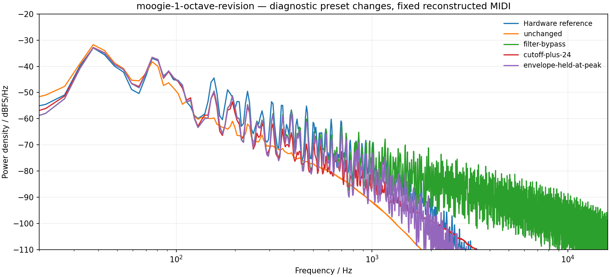
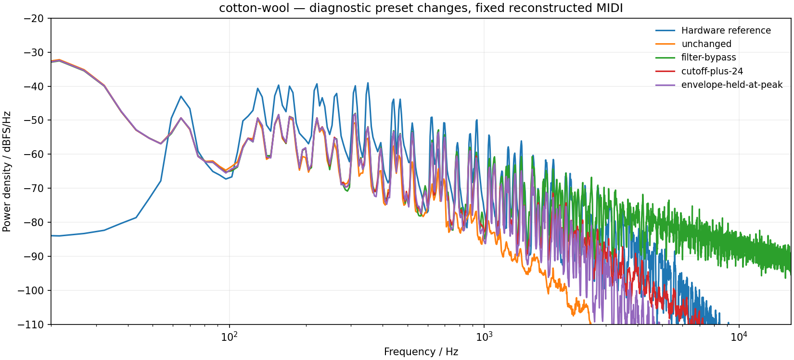

# SH-201 darkness investigation

2026-09-13. **This investigation identified an overly fast filter decay in the Moogie comparison and led to a dedicated linear filter decay, anchored at approximately 419 ms for raw D=49.** No filter summing, coefficient, or filter-parameter import arithmetic bug was found. The correction retains a provisional interpolation at other slider values.

**Subsequent tuning correction:** the [Cotton/Pedal recording audit](source-audits/cotton-tuning-audit.md), independently supported by [SupaJuce 1's two-square-oscillator recording](https://www.rolandus.com/go/sh-201_patches/mp3/LEAD/TOP8_SupaJuce1.mp3), supersedes this investigation's earlier literal-coarse interpretation. With WIDE off, signed coarse endpoints ±36 correspond to physical ±12 semitones. Editor XML establishes raw/display values, not DSP pitch units. That correction, together with a revised Cotton note octave, explains much of Cotton's excess sub-bass. All spectra, candidate WAV hashes and build results below remain historical records of the filter-decay stage, using the old coarse mapping and its associated reconstructed MIDI; they are not fresh measurements of the subsequent tuning correction.

Open the [filter-change before/after/hardware player](http://127.0.0.1:8897/) while
its server is running. It is retained at
`build-fidelity/hardware-benchmark/filter-implementation/after/index.html` and
includes the production renders made immediately after filter adoption and before
the tuning correction. The [historical candidate player](http://127.0.0.1:8896/)
remains available separately at
`build-fidelity/hardware-benchmark/filter-candidates/index.html`. Its baseline
means the pre-change Septum version, and its two candidates preserve the original
linear/exponential experiment. All software versions received identical original
patch bytes and identical reconstructed MIDI. Listening copies use one constant
gain per excerpt, with no EQ or time stretching. The original performance MIDI
and capture processing remain unknown.

## Filter-decay production adoption

The production change selects the linear candidate's filter-decay behavior: a
linear movement toward sustain, taking **0.4189852819747085 seconds at raw 49**.
A provisional power interpolation retains the existing **2 ms and 12 s**
duration endpoints. This is an empirical anchor from conditional hardware-audio
analysis, not a manufacturer envelope table. The other slider values and the
choice of linear curvature remain unmeasured.

That change was confined to FILTER ENV decay. Cutoff/depth scaling, resonance,
filter attack/release, amplifier and pitch envelopes, and published patch bytes
retained their existing behavior at that stage. Existing patches with an active filter decay
will sound different; parameter values and stored preset formats are unchanged.
Dist's remaining darkness was unresolved at that stage. Cotton's low-frequency
imbalance was subsequently traced primarily to coarse tuning and note-octave
interpretation; the [tuning audit](source-audits/cotton-tuning-audit.md) records
that evidence and its remaining limits.

The production renders made at filter adoption for Moogie 1, Dist Bs 1 and Cotton Wool were
**byte-identical to the accepted linear candidate**. Each uses the same original
SysEx and reconstructed MIDI, retains 93 samples of latency at 44.1 kHz, and
finishes with zero active voices. All three output peaks remain below full
scale. The source/input/output hashes and renderer metadata are recorded in
[production render verification](source-audits/filter-production-renders.json).
This confirms adoption of the chosen filter behavior at that stage, not identity
to the hardware or validation of the old coarse-pitch interpretation.

At filter adoption, the complete production build succeeded, and **all 12 CTest suites passed in
15.50 seconds**. The hardware-voice suite contains 339 checks, including 54 new
checks; deliberately restoring exponential filter decay caused 12 failures,
and introducing a sustain-127 stall caused six. The test log is retained at
`build-fidelity/hardware-benchmark/filter-implementation/ctest.log`.

Native arm64 macOS AU, VST3 and Standalone builds completed, and their local
ad-hoc signatures passed strict/deep verification. Browser playback, switching
between before/after clips, and stopping were checked in the new player.
Historical verification below remains the record of the earlier experiment.

## What was checked

1. **Filter preset interpretation:** Roland's MIDI map and public Editor resources agree with the imported type, slope, cutoff, signed envelope depth, key tracking and velocity sensitivity. At this audit stage, all six tone blocks matched between the shipping importer and offline loader; identical initialization and a fixed MIDI test produced zero sample difference. This agreement did not establish oscillator coarse values as physical semitones: both loaders shared the same old assumption, since superseded by the [tuning audit](source-audits/cotton-tuning-audit.md). [Import audit](source-audits/filter-import-audit.json), [Roland MIDI Implementation, p. 5](https://static.roland.com/assets/media/pdf/SH-201_MI.pdf), [Roland Editor 1.10](https://static.roland.com/assets/media/dmg/SH201_Editor110_osx.dmg)
2. **Filter arithmetic:** 72 rendered sine probes match an independent calculation of the intended two-stage state-variable filter. Maximum response error above −60 dB attenuation is 0.000409 dB. The −24 dB path has two two-pole stages, and cutoff has the correct units in its coefficient calculation. This validates implementation of the chosen model, not that model's equivalence to Roland. [Transfer audit and reproducible probe](source-audits/filter-transfer-audit.md)
3. **Timing:** the current time curves and cutoff/depth curves are explicitly provisional. The inspected Roland manuals explain segment roles and parameter ranges, but do not specify their numerical calibration or the digital filter topology. [Owner's Manual, pp. 34–38, 60–61](https://static.roland.com/assets/media/pdf/SH-201_OM.pdf)

## The clearest discrepancy: Moogie's filter closes too soon

Moogie Upper has cutoff 30, envelope depth +22, and filter ADSR 0/49/0/0. The unchanged cutoff/depth mappings give a 103 Hz resting cutoff and a 1,157 Hz peak. Before adoption, decay 49 became 57.38 ms **to −60 dB of the envelope distance to sustain**, equivalent to an 8.31 ms exponential time constant. After 35 ms, cutoff was already about 107 Hz.

The hardware's upper harmonics remain strong for roughly 150–200 ms before decaying. Conditional fits to the first low note favor a much slower trajectory; the same fitted timing and constant harmonic-ratio offsets also improve two other notes excluded from fitting. A linear control segment takes 419 ms; an exponential control segment has a 266 ms time constant. Simply removing the factor `ln(1000)` performs worse than the old curve on those held-out notes. [Full method, assumptions, sensitivity and results](source-audits/filter-envelope-conditional-fit.md)

These are conditional models. Isolating the Upper tone through even harmonics assumes a symmetric lower square/triangle and a linear signal path. Different filter topologies also fit well, and only the raw decay value 49 was estimated. Neither candidate establishes Roland's complete decay table.

Actual renderer outputs confirm that slowing decay restores much of the missing upper-harmonic energy. For a 40 ms window centered 150 ms after the estimated first note-on:

| Version | H6/H2 | H8/H2 |
|---|---:|---:|
| Roland hardware | −6.0 dB | −9.6 dB |
| Pre-change Septum baseline | −41.4 dB | −51.2 dB |
| Historical linear candidate | −16.9 dB | −17.7 dB |
| Historical exponential candidate | −17.5 dB | −19.1 dB |

These direct ratios have **no fitted offsets**, unlike the temporal model fits. The candidates still lack upper harmonics, so envelope timing is not the only unresolved parameter. Pulse shape/width, oscillator levels, filter response and capture processing remain possible contributors. [Direct render measurements](source-audits/filter-render-harmonic-check.json)

## Why a universal brightness adjustment would be insufficient

Twenty-four historical diagnostic renders held MIDI and other patch fields fixed while changing only filter bypass, cutoff, slope, or envelope controls. All used the old literal-coarse mapping. Modified presets are explicitly labeled interventions. Each unchanged render is byte-identical to its previous baseline.

| Whole-excerpt power spectral centroid, 20 Hz–16 kHz | Hardware | Pre-change baseline | Filter bypass | Cutoff +24 | Historical linear candidate | Historical exponential candidate |
|---|---:|---:|---:|---:|---:|---:|
| Moogie 1, revised reconstruction | 75.54 Hz | 50.62 Hz | 72.77 Hz | 59.95 Hz | 60.75 Hz | 60.68 Hz |
| Dist Bs 1 | 64.63 Hz | 48.81 Hz | 54.27 Hz | 51.47 Hz | 49.38 Hz | 49.53 Hz |
| Cotton Wool | 316.28 Hz | 51.16 Hz | 182.81 Hz | 93.07 Hz | 74.59 Hz | 74.90 Hz |

This descriptive statistic is sensitive to bass energy and performance; it is not a perceptual accuracy score. Bypass and cutoff changes alter the preset, whereas the slower-decay columns keep the published preset intact and change the experimental renderer. [All intervention measurements](source-audits/filter-interventions.csv), [candidate manifests](source-audits/filter-candidate-renders.json)



**Dist Bs remains too dark even with filter bypass.** Its overdrive, waveform balance, and reconstructed performance complicate attribution. A slower decay makes little difference to the whole-excerpt spectrum. The current evidence does not identify a unique correction for that patch.

**Cotton Wool's earlier low-frequency mismatch was largely a tuning interpretation error.** Its published patch mixes Super Saw with a sine whose WIDE-off signed coarse/display value is −36 and fine value is −7 cents. The old renderer treated that coarse value as −36 physical semitones; the recording audit supports −12. With the old reconstructed voicing, the mistaken conversion produced strong roughly 19–27 Hz energy absent from the reference. The historical 127-velocity sweep retained a 20–40 Hz to 40 Hz–16 kHz power ratio of about +7 to +14 dB, versus −49 dB in the recording. Filter bypass could not fix that oscillator interval. Those measurements remain valid for the old renderer; they do not establish a missing hardware high-pass or incorrect sine level.

The earlier assertion that the patch bytes ruled out retuning was too strong: the bytes must be preserved, but their WIDE-dependent conversion to physical pitch needed correction. Cotton Wool, Pedal Bs 1 and the independent SupaJuce 1 square-wave example support a one-octave interval at the normal-mode endpoints. A clearly labeled pre-correction diagnostic that combined the corrected interval with revised reconstructed notes reduced Cotton's excess sub-bass without EQ or oscillator-level fitting. Remaining spectral differences do not establish exact interior coarse quantization, Super Saw normalization or capture response. [Corrected tuning evidence and diagnostic measurements](source-audits/cotton-tuning-audit.md), [historical velocity and provenance audit](hardware-benchmark-audit.md)



## Historical candidate implementation and verification

The isolated investigation renderers are retained under `build-fidelity/hardware-benchmark/filter-candidates/`. Their exact source hashes, fitted values, input hashes and output statistics accompany each profile. The linear candidate used a provisional power interpolation between the existing 2 ms and 12 s endpoints, passing through 419 ms at raw 49; this is the behavior selected for production. The exponential candidate scaled the old time curve to reach a 266 ms time constant at raw 49 and remains an experiment; its other values, including endpoints, are uncalibrated. Both changed only filter decay. Amp/pitch envelopes, filter release, cutoff, resonance, MIDI and preset bytes were held fixed.

The six historical candidate renders are finite, have no samples at or above full scale, retain the expected 93-sample latency, and finish with no active voices. Original preset and MIDI hashes match for every candidate. Native browser playback and switching between clips were checked. At that investigation stage the two analysis scripts compiled, shipping engine source was unchanged, and no production regression suite was rerun. Production adoption and its verification are recorded separately above.

At filter adoption, the [isolated builder](../../Tools/build_filter_candidates.py) was updated to use the
production linear implementation unchanged for its default `linear-slow`
profile and preserves the experimental exponential comparison in
`exponential-slow`. It works in copied source without editing the instrument.
Historical profile names remain valid, and timing overrides are labeled
experiments. A fresh rebuild after production adoption reproduced both Moogie
WAV hashes exactly; the default linear source copy remains unchanged and custom
duration overrides were verified. [Build instructions](../../Tools/build_filter_candidates.md),
[production builder verification](source-audits/filter-production-builder-rebuild.json),
[historical rebuild verification](source-audits/filter-candidate-rebuild.json)

The commands below reproduce the workflow with the source available when run.
Exact historical WAV reproduction requires the retained source snapshots and
old reconstructed MIDI; a newer renderer with corrected coarse tuning must use
the corresponding revised reconstruction to preserve sounding pitches.

Reproduce the filter interventions and conditional hardware analysis:

```sh
python3 Tools/build_filter_candidates.py --output /tmp/filter-candidates-new

python3 Tools/render_midi.py \
  --renderer /tmp/filter-candidates-new/linear-slow/SeptumRenderMidi \
  --syx build-fidelity/hardware-benchmark/comparison-audit/moogie-1-octave-revision/original-patch.syx \
  --midi build-fidelity/hardware-benchmark/comparison-audit/moogie-1-octave-revision/reconstructed-performance.mid \
  --tempo-policy preserve-patch --strict --output /tmp/moogie-linear-new.wav

python3 Tools/analyze_filter_fidelity.py \
  --comparison build-fidelity/hardware-benchmark/comparison-audit \
  --renderer build-fidelity/SeptumRenderMidi --output /tmp/filter-isolation-new

OPENBLAS_NUM_THREADS=1 python3 Tools/analyze_hardware_filter_envelope.py \
  --hardware build-fidelity/hardware-benchmark/comparison-final/moogie-1/hardware-decoded-full.wav \
  --output /tmp/filter-envelope-new
```

Use a new output directory for interventions. Source acquisition and baseline rendering are documented in the [hardware benchmark](hardware-audio-benchmark.md). The next calibration dataset should isolate one oscillator with effects and drive disabled: static filter responses at several cutoffs/resonances, then envelope decays at raw 37/49/58/64 with known gate times, followed by isolated Super Saw/sine level and low-frequency captures. The named public demos were screened for such controls; none of the 24 inspected BASS/PAD/LEAD examples supplies a dry, single-oscillator bypass recording. [Candidate inventory](source-audits/named-reference-filter-candidates.json)
