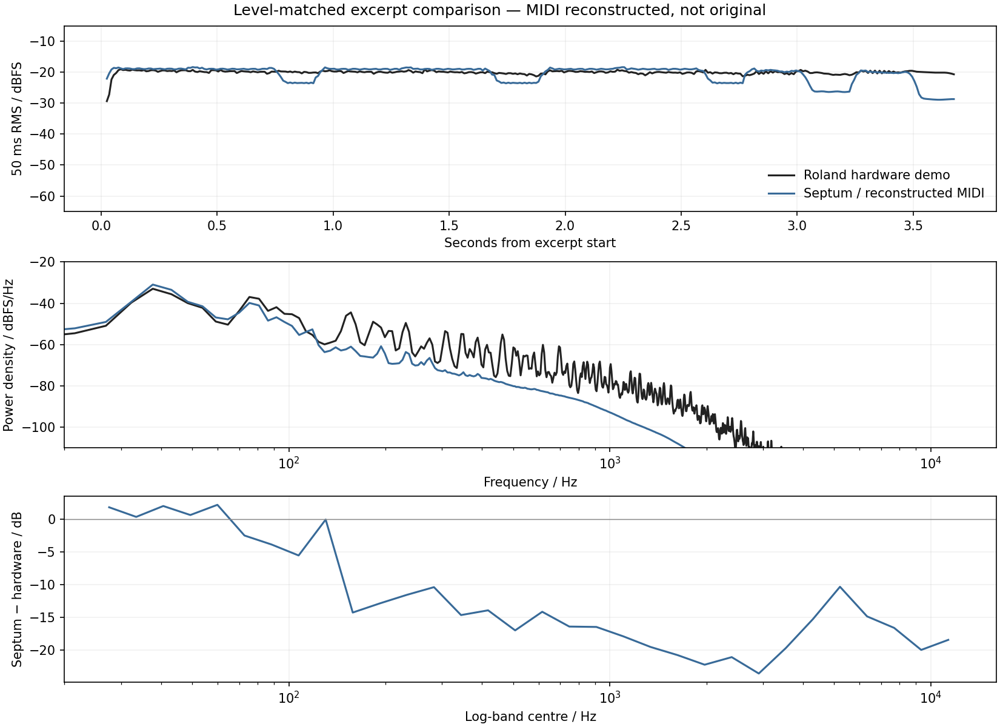
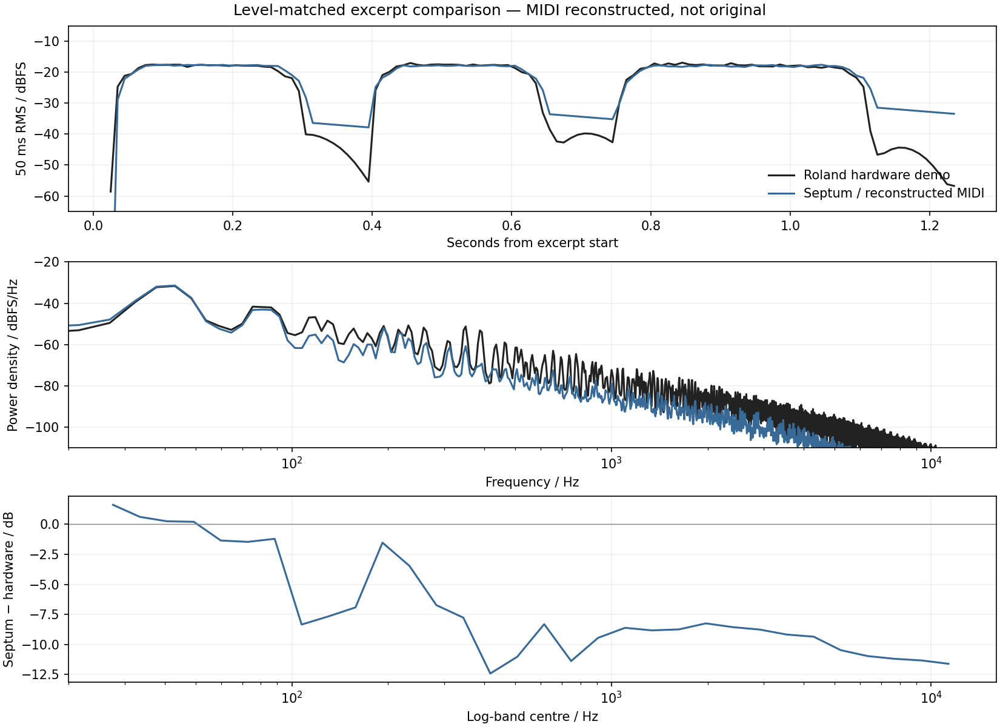
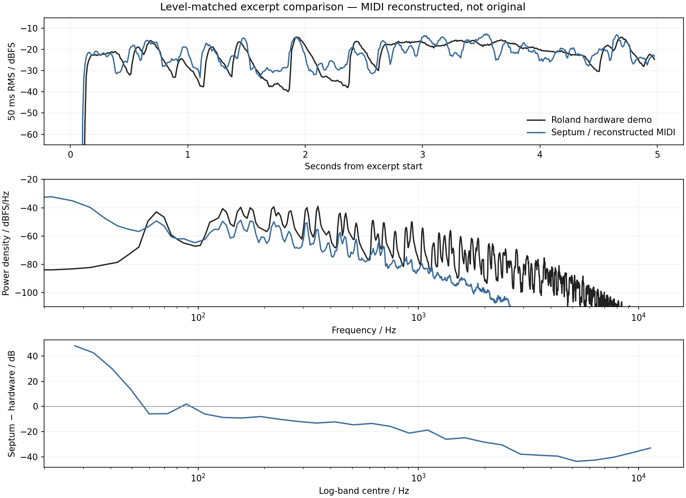

# SH-201 hardware audio benchmark

This report preserves the initial three-case benchmark. The [current WIDE pitch correction](wide-pitch-correction.md) adds a fourth case, fixes oscillator intervals and revises the explicitly reconstructed MIDI; original hardware preset bytes remain unchanged.

The acquired reference corpus contains **64 recordings**: 32 official Roland demos and 32 numbered preset examples from Pier Calderan's contemporary review. Four official librarian banks supply **400 published patches**. Of the official recordings, **24 identify an individual patch by name**; eight demonstrate FX categories containing multiple sounds. Three short comparisons now render Septum with unmodified published presets and explicitly reconstructed note MIDI.

**No original performance MIDI was verified.** These are exploratory listening benchmarks, not controlled same-original-MIDI measurements. The recording/preset association is supported by Roland's pages, but the exact recorded patch revision, system settings and production chain remain unknown. The available data support audible comparisons and priorities for subsequent hardware capture; they do not support a waveform null test or a percentage-accuracy score. [Roland's reference pages](https://www.rolandus.com/go/sh-201_patches/), [Calderan's review attachment](https://www.calderan.info/downloads.asp?id=44)

## Deliverables

The generated listening page is `build-fidelity/hardware-benchmark/comparison-final/index.html`. Each example provides hardware/Septum switching at the same position, sequential A/B audio, the published patch converted to SysEx, the reconstructed MIDI, an untouched float render, plots and a complete provenance record. In each sequential A/B file, **hardware plays first**, followed by half a second of silence and Septum.

The [follow-up audit](hardware-benchmark-audit.md) preserves these three baselines and adds a revised 16-note Moogie 1 transcription, a 381-render velocity experiment, independent preset-byte verification, and two shipping corrections. Its updated four-comparison page is `build-fidelity/hardware-benchmark/comparison-audit/index.html`.

| Comparison | Original recording excerpt | Reconstructed input | Published patch |
|---|---:|---|---|
| Moogie 1 | 0–3.70 s | 13 estimated bass notes; octave jumps | BASS bank, record 1 |
| Dist Bs 1 | 1.94–3.20 s | Three separated notes: MIDI 63, 63, 65 | BASS bank, record 3 |
| Cotton Wool | 0–5.00 s | 27 estimated note-ons, bass plus chords | PAD bank, record 1 |

The [reference catalog](hardware-reference-catalog.json) contains original URLs, archive members, sizes, hashes and association evidence for all 36 official assets. The separate [reviewer catalog](reviewer-reference-catalog.json) identifies the 32-file review archive and hashes each contained recording. The [reconstruction files](reconstructions) retain note-level estimates, methods and uncertainty. Downloaded recordings, banks and generated audio remain under the ignored build directory; the repository carries analysis, metadata and tools.

## Source qualification

| Source | Material obtained or inspected | Benchmark qualification |
|---|---|---|
| Roland Patch 100 BASS | 100-patch SHL, patch list, eight named MP3s | Eight published patch/audio pairs |
| Roland Patch 100 PAD | 100-patch SHL, patch list, eight named MP3s | Eight published patch/audio pairs |
| Roland Patch 100 LEAD | 100-patch SHL, patch list, eight named MP3s | Eight published patch/audio pairs |
| Roland Patch 100 FX | 100-patch SHL, patch list, eight category MP3s | Category montages; no single-patch mapping |
| Pier Calderan, AV&M review | ZIP with `sh-201-000.mp3` through `sh-201-031.mp3` | Preset demonstrations; exact names, bank mapping and matching SysEx not verified |
| RCS Analog Basses | Free SHL plus eight SMFs; author-linked audio demo inspected | Strong named patch/audio association; all eight SMFs contain patch SysEx and no notes |
| Roland artist and Bass/Pads packages | Three additional banks, 96 patches | Patch data only; no performance MIDI in archives |

The official BASS, PAD and LEAD demo headings identify records 1–8 of their respective downloadable banks. Each association was checked against the binary patch name, not inferred solely from an MP3 filename. The LEAD page's “SupaJuice 1” and bank's “SupaJuce 1” spelling difference is preserved in the catalog. The FX page describes categories, so its first recording is not assigned to patch 1. [BASS](https://www.rolandus.com/go/sh-201_patches/patch_bass.html), [PAD](https://www.rolandus.com/go/sh-201_patches/patch_pad.html), [LEAD](https://www.rolandus.com/go/sh-201_patches/patch_lead.html), [FX](https://www.rolandus.com/go/sh-201_patches/patch_fx.html)

Calderan's original page describes 32 preset MP3s with their arpeggios. The recovered ZIP contains exactly those 32 numbered MP3s and no other files. It supplies useful historical recordings, but numbering alone does not authenticate a particular factory SysEx dump. These recordings are retained as a separate corpus and excluded from the three patch-matched renders. [Review attachment and original download](https://www.calderan.info/downloads.asp?id=44)

The RCS author explicitly identifies his free `.mid` downloads as patch settings. Binary inspection independently found 22 SysEx events and one end-of-track event in each file, with zero note events. The linked audio demonstrates those patches, but the performed MIDI is absent. Public availability and a patch-use license also do not automatically establish permission to redistribute every accompanying recording. [RCS free Analog Basses](https://www.rcssound.com/index.php?page=6), [author's sound demonstration](https://soundcloud.com/user-495684465/roland-sh-201-fresh-analog-basses-free-soundset-2020-demo)

## Search for original performance data

Six official patch ZIPs were inspected, containing 496 patch records in total. All records fit the 22 published parameter blocks plus short librarian metadata; no performance SMF was present. The Mac Editor 1.10 distribution was inventoried without installing it: its software, manuals and artist bank did not provide the demo performances. The bundled Editor and Librarian manuals describe SMF export of settings, which explains why a `.mid` extension often appears in patch downloads. [Official Editor distribution](https://www.roland.com/global/support/by_product/sh-201/updates_drivers/abf3343d-8110-4f36-8175-7511fb58dd71/)

Stored arpeggio rows are useful evidence but cannot automatically substitute for a performance. A patch can retain a populated pattern while its arpeggiator is off. The pattern also does not establish which keys were held, transposition, real-time velocity, controller movements or the clock source during recording. The separate onboard recorder stores a performance; its contents are not part of the published patch blocks. [Owner's Manual, recorder and arpeggio sections](https://static.roland.com/assets/media/pdf/SH-201_OM.pdf), [MIDI Implementation, parameter map](https://static.roland.com/assets/media/pdf/SH-201_MI.pdf)

Other primary-source leads were checked to distinguish missing data from merely unfamiliar formats:

- An original creator's Petricca Lead SMF contained 23 SysEx messages, 16 control changes and tempo metadata, but no notes. Its linked video therefore did not provide a complete replayable triplet. [Creator's original post](https://www.reddit.com/r/walkthemoon/comments/1sh8zss/updated_lead_patch_for_sh201/)
- ILJah's Freesound pack identifies real SH-201 recordings and supplies explicit licenses, but no named preset, SysEx or captured note sequence. A public lossy preview was obtained for inspection; it is not the original WAV. [Original recording pack](https://freesound.org/people/ILJah/packs/20668/)
- A hardware owner's filter comparison describes hand-set patches, mono mixer capture, normalization and light compression. Its settings and unavailable attachments do not establish a reproducible match. [Original experiment](https://www.sequencer.de/synthesizer/threads/2sawtooths-1filter-guess-the-synth-jetzt-mit-aufloesung.159784/)
- evilsoft's 2007 sample-pack announcement promises raw oscillator cycles, multisampled leads and technical notes. Its recovered MediaFire link returned 404, so the described note metadata could not be inspected. [Original sample-pack announcement](https://www.dogsonacid.com/threads/sh-201-sample-pack-a.485074/)

This is a bounded search result, not proof that original MIDI never existed. The audited public packages do not provide it, and no SH-201 audio device was available locally for a new capture.

## Preset and MIDI reconstruction

The extractor reads the original SHL bank, verifies its record structure and copies the 22 sound-parameter payloads into checksum-valid Roland DT1 messages addressing the temporary patch. No sound parameter is edited, no Septum factory preset is substituted, and no preset is fitted to a recording. The renderer refuses incomplete or corrupt dumps. SysEx assembly preserves complete parameter bytes even when a valid dump splits multibyte values across packets. [Roland MIDI Implementation](https://static.roland.com/assets/media/pdf/SH-201_MI.pdf)

Moogie 1 uses both tones in SOLO mode, with all oscillators tuned down 36 semitones. Hardware fundamental plateaus and short-time spectral changes were used to estimate the opening melody and note renewals; adding 36 semitones gives the likely keyboard notes. Timing uncertainty is roughly 20–40 ms. Note-offs are assumed to coincide with the next note-on because the nearly continuous bass signal does not uniquely reveal releases. The excerpt ends before the next phrase, so its final crop is not evidence about hardware release behavior.

Dist Bs 1 also uses two SOLO tones with oscillators at −36 semitones, no portamento, and no delay or reverb. A cleaner three-note passage was selected after an earlier note exhibited obvious pitch movement. Its inferred onsets and gates have approximately 10 ms and 12 ms uncertainty respectively. The hardware excerpt begins after a quiet gap; Septum starts from reset, so hidden oscillator and filter states are still not identical.

Cotton Wool combines a Super Saw and a low sine in a single polyphonic upper tone, with delay and reverb enabled. Spectral families support the recurring Eb/F/Bb and Eb/F/A chord shapes. Bass octave allocation and exact releases are less certain because harmonics overlap and effects continue after note-off. Its filter velocity sensitivity is +18, so an unknown velocity directly affects brightness. This comparison is useful for hearing polyphony, spectral character and effects together, with correspondingly weaker diagnostic isolation.

Every reconstructed note uses velocity **100 as an explicit placeholder**, not a recovered measurement. No unknown controller curves were invented. Transcriptions were derived from hardware audio and published patch bytes without fitting to Septum output. The displayed timing runs from the decoded recording timeline; it cannot distinguish original MIDI onset from the hardware's latency or MP3 encoder history.

## Rendering and measurement method

`SeptumRenderMidi` links the same JUCE-free `SeptumDSP` engine as the shipping plug-in. Its Python wrapper reads format 0/1 MIDI, running status, tempo maps and SMPTE time divisions, preserving event order and converting rational timestamps to the nearest output sample. Unsupported sound-changing events fail by default. Program and bank changes also fail unless explicitly acknowledged, avoiding accidental substitution of the supplied preset.

The three comparisons run at **44.1 kHz**, master level **100**, MIDI channel **1**, with **patch tempo preserved**. The reconstruction MIDI's constant clock only expresses absolute event times. The engine's **93-sample latency** is retained. Rendering includes two seconds after the MIDI end; only the documented matching excerpt is analyzed. The raw result is unnormalized stereo float32 WAV, with no post-render alignment or time warping.

The original MP3 is retained and separately decoded to stereo float32 PCM. Comparison crops are selected by exact sample index. Listening copies apply one constant gain per excerpt to reach −20 dBFS RMS; if necessary, both then receive the same extra attenuation to prevent playback clipping. No EQ, compression or limiting is applied. The sequential A/B file alone adds 5 ms fades at its cut boundaries to avoid clicks.

Plots show 50 ms RMS traces sampled every 10 ms, Welch power spectra using 8,192-sample windows, and differences in 32 logarithmic frequency bands. These traces include low-frequency offset tails and are not isolated amplifier envelopes. The spectral centroid reported below is a **power-weighted mean frequency from 20 Hz to 16 kHz**, not a perceptual similarity score. The lower bound includes the bass examples' fundamental near 38.9 Hz. Per-case JSON records source hashes, source/tool versions, decoder command, exact crops, gains, sample rate, latency, patch details, MIDI events and generated-file hashes. `plot-data.json` preserves all plotted values.

## Results and interpretation

| Excerpt | Hardware power centroid | Septum power centroid | Raw render peak |
|---|---:|---:|---:|
| Moogie 1 | 75.5 Hz | 47.8 Hz | −3.42 dBFS |
| Dist Bs 1 | 64.6 Hz | 48.8 Hz | −5.19 dBFS |
| Cotton Wool | 316.3 Hz | 51.2 Hz | −16.29 dBFS |

These figures describe the acquired and rendered excerpts. They do not identify the sole cause of the difference. All three renders are finite and below full scale; scalar matching brings their listening copies to the same RMS as their paired hardware excerpt. [Machine-readable results](hardware-benchmark-results.json) and [all chart data as CSV](hardware-benchmark-plot-data.csv) accompany the figures. In the CSV, `envelope` uses seconds and linear RMS, `spectrum` uses Hz and power density, and `log_band_difference` uses Hz and dB.



Moogie 1 shows less upper-harmonic energy in Septum across much of the excerpt after level matching. Its octave notes also change the amplitude envelope differently. That makes oscillator balance, filter/envelope scaling and note-dependent level behavior sensible targets for a controlled capture. Unknown performance velocity, undocumented knob movement or production processing remain alternative explanations; none is silently absorbed into fitted preset values here.



Dist Bs 1 provides the clearest short gating comparison. The separated events are easier to time than the other examples, and the published preset disables time-based effects. Its upper tone includes overdrive, so oscillator mix, drive and filter behavior cannot be isolated from this patch alone. Slow offset tails dominate parts of the gaps; their RMS difference is not evidence of an amplifier-release error. The small stereo component in the hardware recording may come from capture or encoding; the effect-free Septum render has identical left and right channels. It would be premature to add stereo noise to the model on this basis.



Cotton Wool has substantially more 20–40 Hz energy in Septum, which dominates the power-centroid difference. The preset's low sine oscillator, uncertain octave/voicing estimates and undocumented recording high-pass processing must all be considered before assigning a cause. The higher-frequency spectral balance and stereo distribution also differ. Unknown filter-sensitive velocities and uncertain note overlaps are further confounders. Retain this as a listening reference while a simpler, captured MIDI sequence establishes the oscillator, envelope and filter responses separately.

No synthesis parameters were changed to improve these plots. The result is a reproducible starting point for calibration, preserving the differences and the uncertainty rather than presenting a fitted performance as recovered evidence.

## Validation

All 12 CTest suites passed. After the fragmented-SysEx correction, the MIDI renderer suite passed again with 18 tests, including full/fragmented/shuffled dump equivalence, exact tempo-map timing, running status, multiple tracks, SMPTE timing, unsupported-event rejection and repeatable float WAV output. The three actual source-based renders were independently checked for source/output hashes, finite PCM, exact crop lengths, zero remaining voices, preserved 93-sample latency, scalar-only gain matching and −20 dBFS listening RMS. Browser checks covered playback, switching, Stop, replay after a clip ends and the displayed reconstruction qualifications.

## Reproduce the comparisons

Build the tool using the existing CMake build, or configure a DSP-only build:

```sh
cmake -S . -B build-hardware -DSEPTUM_BUILD_PLUGIN=OFF -DSEPTUM_BUILD_UNIVERSAL=OFF -DCMAKE_BUILD_TYPE=Release
cmake --build build-hardware --target SeptumRenderMidi -j
python3 -m pip install -r Tools/requirements-hardware.txt
python3 Tools/obtain_hardware_references.py --output build-hardware/sources
python3 Tools/compare_hardware.py --sources build-hardware/sources --renderer build-hardware/SeptumRenderMidi --output build-hardware/comparison
python3 -m http.server 8765 --bind 127.0.0.1 --directory build-hardware/comparison
```

`ffmpeg` and `curl` must also be installed. Open `http://127.0.0.1:8765/` in a browser. The comparison output directory must be new; existing raw results are never silently overwritten. Source download retries retain the pinned hashes and fail if upstream contents change. To obtain only the three used references, repeat `--recording bass-01 --recording bass-03 --recording pad-01` on the downloader command.

The additional review corpus can be retrieved from the URL in `reviewer-reference-catalog.json`; verify its archive hash before extraction. It is intentionally outside the matched-preset renderer because no exact patch mapping was established.

## Completing a verified same-MIDI benchmark

The missing evidence is a hardware recording made from a known MIDI file and a verified patch state. The generated `reconstructed-performance.mid` and `original-patch.syx` files are already suitable inputs for a new controlled take: although the melody was reconstructed, replaying that exact file on hardware and Septum would establish identical input for the new recording.

A capture should record the selected input route, system transpose and tuning, controller reset state, master level, tempo/clock policy, firmware revision when available, sample rate and audio interface. Save a patch dump immediately before and after the take to detect unintended parameter changes. Keep an unprocessed stereo WAV and the exact MIDI file, including note-offs, sustain, bend and controller events. Repeat the take to measure hardware-to-hardware variation before attributing differences to the model.

For an externally supplied verified performance, the strict renderer is available independently of the reconstruction tool:

```sh
python3 Tools/render_midi.py --renderer build-hardware/SeptumRenderMidi --midi original-performance.mid --syx matching-patch.syx --output build-hardware/original-performance-septum.wav --tempo-policy preserve-patch --strict
```

Use a different tempo policy only when the source recording documents it. Arpeggiated patches require explicit keyboard-mode replay; this is not interchangeable with directly replaying hardware-generated arpeggio notes. Unsupported MIDI is reported instead of silently discarded. The original-MIDI/patch/audio association must be verified externally; a successful render alone cannot authenticate it.

## Sources

Sources were accessed on 12 September 2026. Original publication dates are retained where supplied; current accessibility is not treated as a publication date.

1. Roland. [SH-201 Additional Patch Download Page](https://www.rolandus.com/go/sh-201_patches/). Public manufacturer patches and audio; date not specified.
2. Roland. [Patch 100 BASS](https://www.rolandus.com/go/sh-201_patches/patch_bass.html), [PAD](https://www.rolandus.com/go/sh-201_patches/patch_pad.html), [LEAD](https://www.rolandus.com/go/sh-201_patches/patch_lead.html), [FX](https://www.rolandus.com/go/sh-201_patches/patch_fx.html). Exact asset URLs and SHA-256 values are in the accompanying catalog.
3. Roland. [SH-201 MIDI Implementation v1.00](https://static.roland.com/assets/media/pdf/SH-201_MI.pdf), 1 March 2006, parameter map and DT1 framing.
4. Roland. [SH-201 Owner's Manual](https://static.roland.com/assets/media/pdf/SH-201_OM.pdf), 2006, performance recorder, velocity, effects and arpeggio descriptions.
5. Roland. [SH-201 Editor 1.10 Mac distribution](https://www.roland.com/global/support/by_product/sh-201/updates_drivers/abf3343d-8110-4f36-8175-7511fb58dd71/), bundled English Editor §3-1 and Librarian §4-1 manuals.
6. Pier Calderan. [ALL. AV&M 05 — TEST ROLAND SH-201](https://www.calderan.info/downloads.asp?id=44), attachment to the June 2007 issue listed in the author's download catalog.
7. Csaba Rozgonyi / RCS. [Free Analog Basses soundset](https://www.rcssound.com/index.php?page=6) and [audio demonstration](https://soundcloud.com/user-495684465/roland-sh-201-fresh-analog-basses-free-soundset-2020-demo), demo published 20 November 2020.
8. ILJah. [Tuno & Roland recording pack](https://freesound.org/people/ILJah/packs/20668/), recordings published 2016–2017.
9. Scenturio. [Two sawtooths and one filter comparison](https://www.sequencer.de/synthesizer/threads/2sawtooths-1filter-guess-the-synth-jetzt-mit-aufloesung.159784/), 2021, original hardware-owner experiment.
10. evilsoft. [SH-201 Sample Pack A](https://www.dogsonacid.com/threads/sh-201-sample-pack-a.485074/), 1 April 2007, original announcement; archive unavailable during this audit.
11. TransistorBased. [Updated lead patch for SH-201](https://www.reddit.com/r/walkthemoon/comments/1sh8zss/updated_lead_patch_for_sh201/), April 2026, creator patch and demo links.
