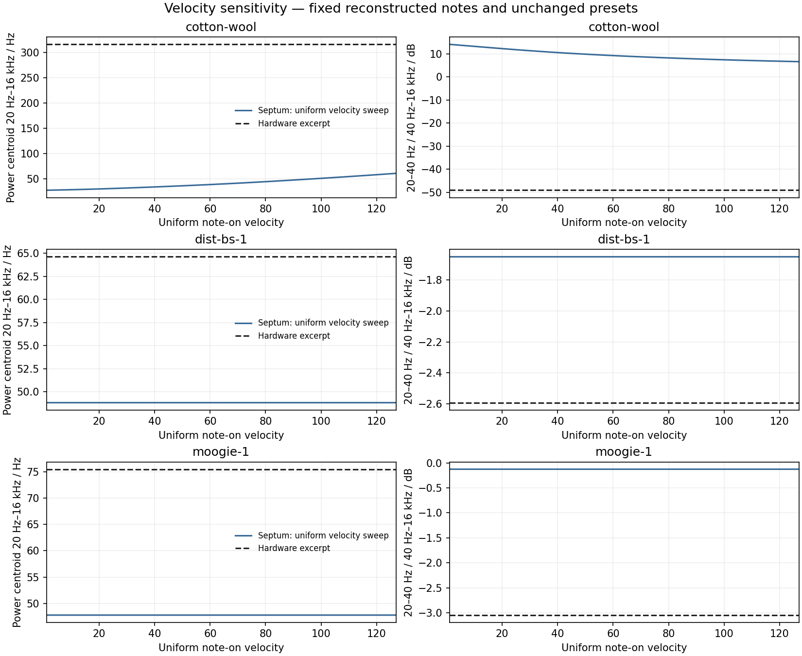
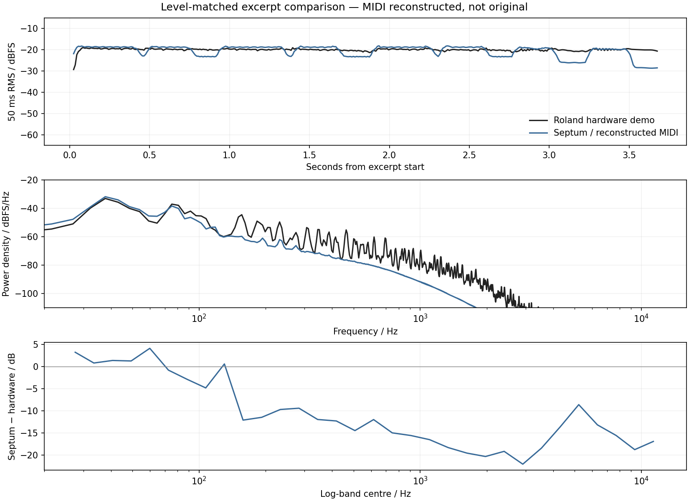

# SH-201 benchmark audit

This follow-up fixes fragmented SysEx reception and restores Super Saw oscillator SYNC, while checking the preset bytes and performance assumptions behind the [hardware comparisons](hardware-audio-benchmark.md). The recordings and published presets remain unchanged; the performed MIDI is still an explicitly labeled reconstruction.

## Preset bytes and oscillator settings

Eight RCS patches are distributed in both librarian and Standard MIDI File form. Every extracted DT1 message matches the author's companion SMF: **176 messages, 9,920 parameter bytes, zero differences**. These SMFs contain settings, not performed notes. This independently validates the librarian extraction layout, including the unusual raw coarse-tuning value `0x1c`. The [byte audit](source-audits/rcs-shl-smf-byte-audit.json) records source URLs, file hashes and per-block hashes without copying the third-party payloads. [RCS original soundset](https://www.rcssound.com/index.php?page=6)

**Superseded tuning conclusion:** the initial audit inferred that displayed −36 meant physical −36 semitones with WIDE off. Editor XML establishes raw/display values, not DSP units. Later Cotton/Pedal and SupaJuce recordings support the documented normal ±1-octave range, with ±3 octaves only under WIDE. See the [implemented correction](wide-pitch-correction.md). The byte extraction remains valid; historical spectra and tuning diagnostics below used the earlier decoder and reconstructions.

## Velocity sensitivity

The sensitivity experiment renders each original comparison at every **uniform note-on velocity from 1 through 127**: 381 takes in total. Notes, gates, SysEx, master level, sample rate and tempo policy stay fixed. Velocity 100 reproduces all three prior raw WAV hashes exactly. The generated takes are measured before normalization, using the same 44.1 kHz excerpt lengths as the baseline. Moogie 1 here uses the original 13-note reconstruction; the separate octave revision below does not replace these fixed-input measurements.

| Case | Hardware power centroid, 20 Hz–16 kHz | Septum range over all 127 uniform velocities |
|---|---:|---:|
| Cotton Wool | 316.28 Hz | 27.64–61.03 Hz |
| Dist Bs 1 | 64.63 Hz | 48.80737–48.80739 Hz |
| Moogie 1 | 75.54 Hz | 47.75193–47.75194 Hz |

Cotton Wool responds to velocity through its filter, but the full uniform-velocity sweep retains much more low-frequency energy than the recording. Its 20–40 Hz / 40 Hz–16 kHz power ratio ranges from +6.65 to +14.14 dB; the hardware excerpt measures −49.05 dB. In the two bass presets, changing uniform velocity changes overall level with effectively invariant spectral proportions.



These results reject **one shared velocity value as the sole explanation** for the measured differences with these reconstructed notes and gates. They do not bound arbitrary per-note velocities, missing notes, controller movements, different voicings, a different recorded patch revision, or recording processing. In particular, they do not establish the hardware filter's transfer function or justify fitting an output high-pass filter to Cotton Wool.

The measurements use channel-mean Welch power spectra with 8,192-sample Hann segments, 50% overlap and constant detrending: bins are approximately 5.383 Hz apart. Centroids and band ratios use the explicitly stated frequency limits; gain does not affect them. The 40 Hz boundary crosses spectral leakage from the bass fundamentals, so these are estimator-specific band ratios rather than separated oscillator levels. The figure's samples, MIDI hashes and raw render hashes are in [velocity-sensitivity.csv](source-audits/velocity-sensitivity.csv), with executable/tool fingerprints and summary ranges in [velocity-sensitivity.json](source-audits/velocity-sensitivity.json).

Reproduce against an existing comparison directory:

```sh
python3 Tools/analyze_reference_velocity.py --comparison build-fidelity/hardware-benchmark/comparison-final --renderer build-fidelity/SeptumRenderMidi --output build-fidelity/hardware-benchmark/velocity-audit-new --jobs 4
```

## Revised Moogie 1 reconstruction

A hardware-only periodicity and harmonic audit identifies three brief octave-up segments missed by the original transcription. The revised reconstruction adds MIDI 75 near 0.400, 1.315 and 2.245 seconds, followed by MIDI 63, for 16 notes in total. Their approximately 12.90 ms waveform periods match an already identified high Eb; the following low Eb notes require approximately 25.90 ms. The recording's odd harmonics are suppressed throughout the brief high segments, supporting the octave interpretation. Transition times remain uncertain by roughly 20 ms. [Full measurement method and data](source-audits/moogie-harmonic-audit.md)

The [revised event file](source-audits/moogie-1-octave-revision.json) is separate from the original. Notes and times were estimated from the hardware recording without fitting Septum output. The original performance MIDI remains unavailable.



The revised take measures a 50.62 Hz power centroid over 20 Hz–16 kHz, versus 47.75 Hz for the original reconstruction and 75.54 Hz for hardware. This describes the effect of correcting notes; it is not a DSP accuracy score. [Figure data](source-audits/moogie-octave-revision-plot-data.csv), [final comparison results](source-audits/comparison-audit-results.json)

The same audit also finds a temporal timbre difference: during the low note starting at 1.901 seconds, hardware H3/H1 rises by 7.20–8.26 dB across the tested timing windows, while Septum rises by 0.01–0.40 dB. This comparison approximately cancels a fixed gain and linear recording response, but does not eliminate dynamic processing, oscillator cancellation or controller uncertainty. It supplies a more specific calibration target than a whole-excerpt centroid without identifying a unique filter or envelope correction.

## Fragmented SysEx defect

A complete valid patch with tempo 260 imported as 260 when sent in complete parameter blocks, but as **8** when the same bytes arrived in one-byte DT1 messages. This was reproduced in the shared bank parser, the plug-in's file-import path, and live MIDI across event timestamps and audio blocks. An intermediate decode rejected an out-of-range partially assembled tempo, and the next fragment reconstructed its untouched bytes from the previous valid tempo, losing the pending data. Roland defines tempo and arpeggio fields using multiple payload bytes; packet boundaries must not alter the reconstructed value. [MIDI Implementation, parameter address map](https://static.roland.com/assets/media/pdf/SH-201_MI.pdf)

The shipping decoder now keeps fixed-size raw block images between messages and rebases edited fields from current parameters. It preserves host and CC edits, and invalidates pending fragments on program changes, file imports and state restores, including replacements whose visible values happen to be identical. The cache belongs to the audio thread; other threads signal invalidation through an atomic revision.

The offline comparison renderer already assembled raw bytes correctly, so this defect does not explain the existing three full-block benchmark renders. Correcting the shipping path makes imported and live-transferred presets retain the same multibyte values regardless of packet splitting.

## Super Saw oscillator SYNC

Septum previously bypassed SYNC whenever OSC1 used Super Saw. Roland's manual describes OSC1 restarting at OSC2's period without a waveform exclusion. The published LEAD bank's record 20, **Super Sync**, uses Super Saw in both oscillators of both tones; its upper tone places OSC1 at +26 semitones and OSC2 at −36. An owner's report also describes Super Saw sync working on an SH-201, although it does not identify the oscillator assignment. Together these support restoring the function, with the exact implementation treated as an inference. [Owner's Manual, p. 32](https://static.roland.com/assets/media/pdf/SH-201_OM.pdf), [Roland LEAD bank](https://www.rolandus.com/go/sh-201_patches/shl/SH-201_Patch_LEAD.zip), [qualified source audit](source-audits/oscillator-semantics.md)

The implementation restarts all seven saw phases at each master cycle, retains their individual detuned rates, accounts for the fractional sample at which the master wraps, and preserves the downstream high-pass state. **The all-seven reset topology is a modeling choice, not a measured Roland algorithm.** A center-only reset would leave most of the current stack freely detuned and sound materially different. FB OSC, noise and external-input slave behavior remain unresolved.

The three original benchmark patches use MIX, so this change cannot explain or correct their measured timbre differences. An additional local before/after render uses the unmodified published Super Sync preset and the same generated MIDI notes; it demonstrates the restored function, not agreement with a hardware recording of that preset.

The Super Sync check plays MIDI notes 63, 67 and 70 at velocity 100. Both eight-second raw renders are finite and unclipped, with zero voices remaining at the end. The local `super-sync-validation/septum-before-then-after.wav` plays the old bypass first and the restored function second, separated by half a second of silence. Listening copies use scalar −20 dBFS RMS matching and 221-sample edge fades only in the sequential file. [Input/output hashes, exact generated events and transformations](source-audits/super-sync-render-check.json)

## Validation and listening artifacts

All **12 CTest suites pass** on the final Release build, including 4,030 processor checks and 285 voice-fidelity checks. AU, VST3 and Standalone targets build successfully. The new SYNC tests reject isolated mutations restoring the old bypass or rounding the master wrap to a whole sample. SysEx regressions cover full, fragmented and shuffled messages, live timestamps and separate audio blocks, host/CC edits, and patch/state replacement.

The final four comparisons are under `build-fidelity/hardware-benchmark/comparison-audit/`. Their source and output hashes were checked independently, along with finite PCM, no full-scale samples, exact excerpt lengths, zero voices at the tail, 93-sample latency and −20 dBFS listening RMS. The original three raw renders are **byte-identical** to `comparison-final`; only the separately identified revised Moogie MIDI produces new audio. The browser player was checked for hardware and Septum playback, Stop, and the visible reconstruction qualifications.

Recreate the updated page in a new output directory:

```sh
python3 Tools/compare_hardware.py --sources build-fidelity/hardware-benchmark/sources --renderer build-fidelity/SeptumRenderMidi --output build-fidelity/hardware-benchmark/comparison-audit-new --case Docs/fidelity/source-audits/moogie-1-octave-revision.json --case Docs/fidelity/reconstructions/moogie-1.json --case Docs/fidelity/reconstructions/dist-bs-1.json --case Docs/fidelity/reconstructions/cotton-wool.json
python3 -m http.server 8895 --bind 127.0.0.1 --directory build-fidelity/hardware-benchmark/comparison-audit-new
```

The original source acquisition and dependency instructions remain in the [benchmark report](hardware-audio-benchmark.md#reproduce-the-comparisons). Downloaded third-party banks/audio and rendered WAVs stay in ignored build directories; source metadata, measurements and scripts are retained in the repository.

## Remaining calibration boundary

The preset extraction is independently corroborated, and uniform velocity alone is insufficient. The next useful evidence is a dry hardware take with captured performance MIDI and the exact dumped patch. Until then, the current comparisons remain useful for locating differences and testing hypotheses, with performance and recording uncertainty kept visible. No synthesis curve was adjusted to force these recordings to match.
