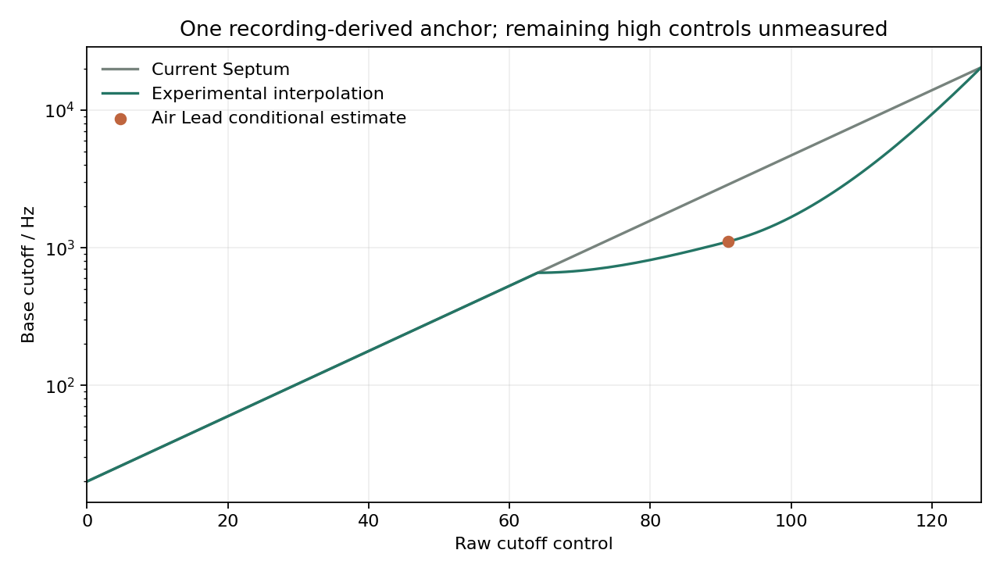
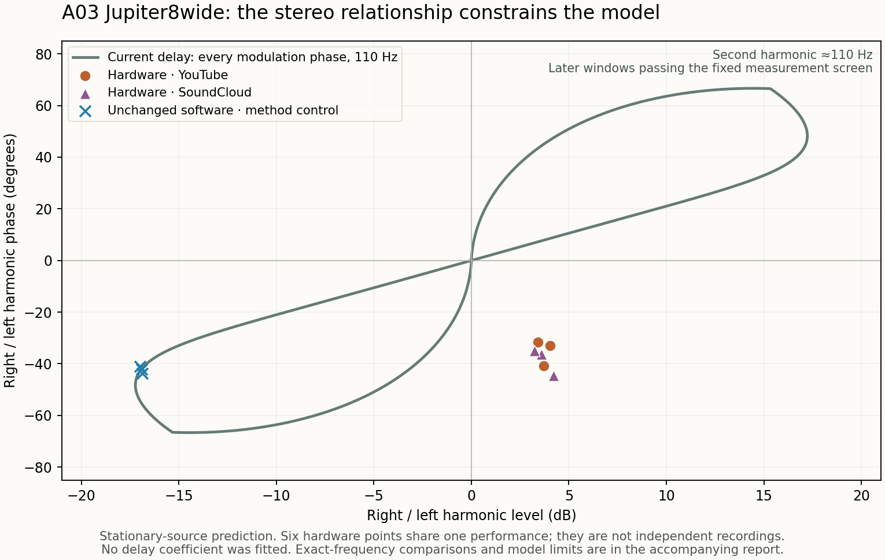

# Public-recording sound matching, 20 September 2026

The study now compares **17 named SH-201 presets** from free public recordings.
A playable, explicitly fitted Air Lead preset is substantially closer on the
measured phrase and is available on the [local study page](http://127.0.0.1:8920/).
The evidence does not yet establish a replacement global sound model;
the shipping engine remains unchanged. The latest
[gain-structure checks](source-audits/rcs-gain-structure-results-2026-09-20.md)
measure internal drive directly and reject two lower-drive models across the
original presets. Combining them with earlier envelope/depth probes still
fails to reproduce the recorded harmonics and closing motion.
The subsequent oscillator experiments also remain provisional: the triangle
candidate improves five whole-excerpt spectra but worsens Moogie's odd
harmonics; a stronger oscillator-balance bias improves SupaJuce but fails to
consistently improve Class A's harmonic ratios.
The initial ten-preset three-way listening comparison is at
`build-fidelity/public-match-2026-09-20/listen/index.html`, served locally at
<http://127.0.0.1:8920/listen/>.

The reference comparisons use unchanged published SH-201 presets. Separately
labelled fitted presets and mechanism experiments record every deliberate
parameter change. **All performance MIDI is reconstructed; none is an original
captured performance.** The named
demo associations do not authenticate the exact recorded preset revision.
The [new source search](source-audits/public-reference-follow-up-2026-09-20.md)
found no stronger complete audio/MIDI/preset set. All 32 cached official MP3s
and four banks passed their existing pinned hash checks.

## What improved

The [Air Lead experiment](source-audits/air-lead-cutoff.md) estimates one static
cutoff anchor from the opening note and holds it fixed across the remaining
nine notes. It changes raw91 from 2,870.89 to 1,106.45 Hz. The full-engine
later-note median H4…H12/H2 error falls from **39.72 to 6.10 dB**, with all 108
later-note observations improving. These overlapping channels/windows measure
sensitivity, not 108 independent recordings. Effects and unknown performance
controls still leave substantial residuals.

The [experimental profile](../../Tools/timbre-profiles/experimental-air-lead-cutoff.json)
preserves controls 0–64 and 127 by design and interpolates the unmeasured region.
The rest of that curve is a hypothesis. Both frozen renderers use identical
DSP/renderer source snapshots and compiler binaries; their profiles are the
only deliberate synthesis difference.



## Cross-preset results

The broad metric measures normalized stereo power in 32 fixed frequency bands,
25–12,500 Hz. It reports unweighted dB error on hardware bands within 50 dB of
the strongest band. This does not measure perceptual similarity, articulation,
phase accuracy or overall fidelity. No EQ, time warping or performance fitting
is used.
The [machine-readable matrix](source-audits/public-recording-matrix-2026-09-20.json)
retains per-band differences and source identities.

| Published preset | Current spectral residual | Candidate | Raw audio |
| --- | ---: | ---: | --- |
| Moogie 1 | 4.738 dB | 4.738 dB | Identical |
| So Juno 1 | 6.712 dB | 6.712 dB | Identical |
| Dist Bs 1 | 5.709 dB | 5.709 dB | Identical |
| Pedal Bs 1 | 7.813 dB | 7.813 dB | Identical |
| Club Bass | 7.734 dB | 7.739 dB | Slight regression |
| Cotton Wool | 6.348 dB | 6.348 dB | Identical |
| Air Lead 1 | 13.404 dB | **3.202 dB** | Improvement |
| Vangelead | 3.696 dB | 3.734 dB | Slight regression |
| SupaJuce 1 | 5.437 dB | 5.437 dB | Identical |
| Brassy Ld 1 | 6.510 dB | 6.510 dB | Identical |
| Sexy Back, additional held-out preset | 5.680 dB | 5.655 dB | Negligible improvement |
| Trancefloor, additional held-out preset | 2.892 dB | 3.358 dB | Regression |

The seven identical renders confirm isolation, not independent evidence for
the new high-control curve. Club Bass and Vangelead do not confirm it.
Two subsequently transcribed static-filter presets give stronger external
checks: [Sexy Back](http://127.0.0.1:8920/sexy-back-listen/) changes negligibly,
while [Trancefloor](http://127.0.0.1:8920/trancefloor-listen/) gets worse. These
are different recordings with hardware-derived notes selected before software
rendering, although performance and effects uncertainty remains. The global
candidate therefore remains experimental.

## Playable Air Lead match

`build-fidelity/public-match-2026-09-20/playable-preset/Air Lead 1 - Experimental Match.septum`
can be loaded through Septum's LOAD button. This is deliberately a **fitted
preset**, not the original Roland settings and not a new engine model.
The only sound-parameter change is Upper cutoff **91 → 74**; the wire/display
name also changes. Raw74 gives 1,135.18 Hz in the current model, the nearest
integer control to the conditional 1,106.45 Hz target.

Through the unchanged engine, it gives a broad spectral residual of **3.055 dB**
versus 13.404 dB for the original preset, and later-note median harmonic error
of **6.089 dB** versus 39.72 dB. These remain measurements on estimated MIDI.
The native converter loaded, saved and reloaded the preset, verified every
native parameter and all 22 sound blocks, and reported no unexpected byte
differences. [The preset audit](source-audits/air-lead-playable-match.json)
records exact edits, input/output hashes and render validation.

## Additional reference and rejected shortcut

[Class A](reconstructions/expanded/class-a.json) adds ten estimated notes in a
1.2-second excerpt. Alongside Sexy Back and Trancefloor, the available
named-preset listening set now contains thirteen sounds.
Its pitch families were analyzed from hardware before software rendering.
Listen at <http://127.0.0.1:8920/class-a-comparison/>. Short pitch ramps and
unknown legato overlap remain unresolved; the excerpt ends before an apparent
performed pitch bend. This is an additional listening reference, not a new
envelope calibration.

Sequence Bs looked promising because its published active tone uses sine and
square waves with a static open filter. Its recording instead moves from a
dominant component near 11,057 Hz at 0.12 seconds to about 65 Hz at 7.5 seconds.
The proportion of 25–16,000 Hz power below 1 kHz changes from 0.0016% to 99.8%.
Those descriptive measurements do not identify the control gesture. Without
the original controls, the early recording is unsuitable for calibrating the
published static waveform mixture. The ignored `sequence-screen.json` retains
source hashes and analysis windows; no engine correction was inferred from it.

## Reproducibility and integrity

`Tools/compare_hardware.py` now rejects silent, malformed and nonfinite audio.
For isolated candidates it verifies the executable, profile and every frozen
build input, and embeds the build manifest. Live checkout hashes are explicitly
separate from evidence of what actually built the renderer.

`Tools/evaluate_timbre_matrix.py` checks matched presets, MIDI, reference crops,
replay settings, latency, sample rate, summary/per-case agreement and artifact
hashes before comparing runs. It retains both model manifests and creates the
three-way player using constant RMS gains and common peak headroom only.
Baseline-versus-baseline QA gives zero deltas and identical listening audio
for all ten cases.

The generated results, WAVs, source snapshots and replay manifests remain under
`build-fidelity/public-match-2026-09-20/`. Third-party media and preset payloads
are outside Git. The repository analysis tools, experimental curve, transcription
and source-audit summaries contain the reproducible procedure and qualifications.

To rebuild the isolated renderers and repeat the detailed Air Lead experiment,
follow [its reproduction commands](source-audits/air-lead-cutoff.md#reproduction-and-identities).
To reproduce the ten cases, use the explicit case list in
[the existing A/B guide](ten-recording-ab.md#reproduce), once for each frozen
renderer. Then compare the two new output directories:

```sh
python3 Tools/evaluate_timbre_matrix.py \
  --baseline /path/to/new-baseline-comparison \
  --candidate /path/to/new-candidate-comparison \
  --output /path/to/new-listening-report
```

Use a Python interpreter with `Tools/requirements-hardware.txt` installed.
The two optional CTest suites skip when these analysis dependencies are absent;
that is not a passing execution of their checks.

## Oscillator cross-checks

The [triangle experiment](source-audits/triangle-crosscheck-2026-09-20.md)
compares seven fixed polarity/level/phase hypotheses over all thirteen presets.
Five use triangle; the other eight remain byte-identical and only confirm
isolation. Reversed polarity at 1.5 times amplitude lowers Dist's H2–H8/H1
error from 8.206/7.503/7.772 to 2.719/2.631/3.116 dB across three notes.
But Moogie's odd-harmonic error increases by 0.49–0.86 dB in every tested
note/channel/window-shift combination. Its broad score conceals that failure.
Listen to the [five affected presets](http://127.0.0.1:8920/triangle-listen/).

The [oscillator-balance experiment](source-audits/oscillator-balance-2026-09-20.md)
tests a normalized linear crossfade only inside each tone's oscillator mixer.
The shared Upper/Lower tone-balance law remains unchanged. At balance −26,
the dominant/quiet oscillator ratio rises from 1.703 to 2.405. SupaJuce's
separated octave-square families support stronger dominance conditionally,
but the independent Class A harmonic-family check is mixed. The whole-excerpt
scores improve for SupaJuce, Class A and Sexy Back, while So Juno, Club Bass
and Trancefloor get slightly worse. Listen to the
[seven affected presets](http://127.0.0.1:8920/balance-listen/).

[Paired timing probes](source-audits/candidate-gate-robustness-2026-09-20.md)
preserve these candidates' whole-excerpt rankings, yet expose local note
regressions. The [input audit](source-audits/benchmark-input-audit-2026-09-20.md)
documents estimated gate uncertainty, oscillator phase history and the limits
of the manual's BALANCE description. Neither experiment identifies a unique
hardware control law. No production waveform or balance change was made.

## Validation

All 37 pre-existing CTest suites passed. The new comparison and matrix suites
pass another 27 Python tests, including provenance tampering, input mismatch,
silent/nonfinite audio, gain-invariant metrics and identical-model controls.
The Air Lead estimator recovered 20 synthetic known cutoffs within 0.0064 Hz.
Browser QA verified hardware/candidate playback, position-preserving switching,
Stop resetting to zero, and the visible experimental/MIDI qualifications.
The new triangle sweep reproduced all 91 renders byte-for-byte, checked finite
audio and replay latency, and passed harmonic identity and synthetic-signal
controls. All 44 additional gate-variation renders were finite and unclipped.
The matrix suite still passes its 13 tests after generic model-player labels
replaced the earlier cutoff-only labels.

The remaining sound-matching work is an independent high-control cutoff anchor,
then oscillator, envelope and effects differences that the current public
performances cannot uniquely isolate. A verified same-MIDI hardware recording
would resolve much of that ambiguity; the current artifacts do not claim one.

## Further reference screening

The [unused-preset screen](source-audits/juicy-fat-static-cutoff-screen-2026-09-20.md)
correctly distinguishes 24 named Patch 100 recordings from eight FX category
montages. Juicy Fat is the most promising remaining dry static-pulse candidate,
but its overlapping moving saw layer cannot be separated in the short opening
windows. An attractive one-window filter fit is unstable and cannot establish
a hardware cutoff. Other unused named cases have additional modulation or
complex sources.

The [new waveform-pack and control-video search](source-audits/public-control-reference-screen-2026-09-20.md)
found an author-distributed cycle pack, but both linked archives are unavailable;
no PCM or settings README was recovered. An inspected patch-building video's
opening does not establish isolated oscillators or dry effects. The
[alternative cache audit](source-audits/alternate-reference-cache-audit-2026-09-20.md)
also found no independently verified parameter state in the numbered Calderan
clips or conflicting community Fat Bass patches. These are bounded findings,
not proof that a suitable public recording does not exist.

The study page now includes a generated waveform capture input ZIP: 14 exact
SysEx/MIDI pairs totaling 80.4 seconds, with instructions and explicit system
settings. These are **new test inputs awaiting hardware recording**, not original
MIDI from a public demo. All 14 replay through the frozen current engine at
96 kHz with finite nonzero audio, no clipping, strict MIDI handling and zero
voices at the end. Software validation remains separate from hardware evidence.
The existing `Tools/generate_timbre_capture.py --suite waveforms` reproduces
the inputs. No hardware port was accessed or creator contacted.

## Independent author references

The [RCS source audit](source-audits/rcs-reference-screen-2026-09-20.md) adds a
public author-linked hardware demo with visibly named patches and a matching
eight-patch download. Direct YouTube audio was acquired and decoded; six
cross-platform windows also establish a constant offset to the author's
SoundCloud copy. These are two encodes of the same performance, not two
independent recordings. All eight downloaded SMFs contain patch SysEx and
zero played-note events.

Two hardware-only reconstructions bring the comparison set to **15 named
presets**: [A01 Moog BASS](source-audits/rcs-a01-transcription-2026-09-20.md)
and [A02 Moog BASS PW](source-audits/rcs-a02-hardware-observations-2026-09-20.md).
Neither patch has an active internal spatial effect contribution; both use
overdrive. Notes were selected from hardware before software rendering.

The pre-existing triangle −1.5 candidate worsens A01's broad residual from
**3.469 to 5.470 dB** and median H2–H8/H1 error from **2.503 to 8.468 dB**.
All 27 note/channel/window-shift groups worsen; they are sensitivity checks
within one performance. The Air Lead cutoff curve worsens A02's broad residual
from **10.696 to 15.593 dB**. These new patches therefore provide additional
reasons not to promote either global candidate.

Listen to [A01](http://127.0.0.1:8920/rcs-a01-listen/) and
[A02](http://127.0.0.1:8920/rcs-a02-listen/).
The [RCS catalog](rcs-reference-catalog.json) pins the media and bank identities,
observed labels and conservative accepted excerpt intervals. The comparison
tool accepts it explicitly with `--catalog`; the official catalog remains the
default. Author references require two observations of the same patch
bracketing the accepted interval, and excerpts outside that interval fail.

The [RCS candidate checks](source-audits/rcs-candidate-checks-2026-09-20.md)
also test three slower filter-attack tables. They lower A02's broad residual,
but fail its predeclared sustained spectral-closure measurement and worsen
Brassy Ld1 under their unmeasured global interpolation. No attack table is
selected. The first-note result is separate from uncertainty in later SOLO
retrigger history. The [fixed-metric analysis](source-audits/rcs-a02-attack-probes-2026-09-20.md)
retains all missing crossings as censored observations.

## A03 baseline characterization

[A03 Jupiter8wide](source-audits/rcs-a03-hardware-observations-2026-09-20.md)
brings the current comparison set to **16 named presets**. Independently
inspected A03 labels at 35 and 40 seconds bracket the selected single-note
excerpt at 36.720–36.980 seconds. Its MIDI was reconstructed from hardware;
the original patch remains unchanged. A separate
[supplementary catalog](rcs-a03-reference-catalog.json) preserves the older
catalog and its existing pins.

The [frozen baseline characterization](source-audits/rcs-a03-baseline-comparison-2026-09-20.md)
misses all 81 measured hardware spectral-closure landmarks. Hardware median
10/20/30 dB drop times are 43.71/52.51/65.12 ms; baseline timings remain
censored. These are relative spectral measurements, not filter attack times.
The patch's modulation delay, overdrive and changing layer balance limit
filter-law inference. A03 is now baseline-characterized rather than an
untouched holdout. No modified candidate informed this case selection.
The later fixed-shaper tests below now include this case.

[Listen to A03 hardware and the frozen baseline](http://127.0.0.1:8920/rcs-a03-baseline/).
The case's final note-off is an artificial crop boundary, and all original
performance MIDI remains unavailable. Both relevant suites pass: 14 hardware
comparison tests and 13 timbre matrix tests.

## Joint filter-depth and attack experiment

A [predeclared 28-cell mechanism grid](source-audits/rcs-a02-mechanism-results-2026-09-20.md)
tested explicit temporary cutoff/depth changes with the four frozen attack
models. Two cells approximate the first note's early/late brightness features,
but fail the longer note: hardware retains H2/H1 near −7 dB, while the fixed
experiments reduce it to approximately −44 dB or negligible levels. Six gate
variants restore some transient closure but do not restore those harmonics.
Neither candidate is accepted; the shipping DSP remains unchanged.

[Listen to the mechanism comparison](http://127.0.0.1:8920/rcs-mechanism-listen/).
These are labelled modified presets, distinct from the unchanged-preset
reference comparisons. The experiment illustrates why a close short-window
spectral feature cannot establish a complete sound match. Unknown oscillator
phase and layer interference remain explicit limits.

## Distortion and pulse-phase diagnostics

The [24-cell distortion screen](source-audits/rcs-a02-distortion-results-2026-09-20.md)
tests lower drive gain, a linear replacement for the saturator, pulse DC
centering, their interaction, and amplitude-envelope placement. Four controls
reproduce the earlier audio exactly. These are mechanism tests on the already
inspected A02 performance, not independent validation of new hardware models.

With a linear shaper and explicitly modified depth −32, the longer note's
H3/H2 and H4/H2 approach the recording: **−17.35/−22.96 dB** versus
**−15.72/−24.37 dB** in hardware. But the second harmonic remains weak relative
to the fundamental. Under the 100 ms attack hypothesis, first-note high-band
power falls about **50 dB**, versus **31 dB** in the recording; low-band loss is
also excessive. Later adjacent notes start already dark. Removing saturation
therefore does not establish a sound match or identify Roland's transfer curve.

Eight fixed pulse phases provide another check. None reaches the recorded
H2/H1, H3/H2 or H4/H2 ranges in the fixed longer-note windows. This rules out
those eight settings as complete explanations; it does not exclude every
phase or oscillator-history model. Pulse DC centering also changes the
nonlinear model strongly, while barely changing the steady linear result.
That demonstrates a software interaction, not measured hardware routing.

[Hear the diagnostic examples](http://127.0.0.1:8920/rcs-distortion-listen/).
The examples were selected after analysis to illustrate the limitations.
No global waveform, filter, envelope or distortion proposal from these
experiments is accepted for release. The playable Air Lead fit remains a
local preset adjustment.

## A05 additional excerpt and the next discriminating recording

[A05 Jupiter8Perc](source-audits/rcs-a05-hardware-observations-2026-09-20.md)
brings the study to **17 named preset comparisons**. Its 63.130–63.370-second
excerpt was selected from hardware before the first software render. The
published preset is unchanged. [Baseline characterization](source-audits/rcs-a05-baseline-2026-09-20.md)
again misses the sustained spectral decay: hardware reaches the 20 dB drop
in all 27 channel/window/onset combinations and the 30 dB drop in 26; the
current model reaches neither. These sensitivity observations are not
independent trials. Active modulation delay, overdrive and the changing
amplitude envelopes still prevent a unique filter-law inference.

[Listen to A05](http://127.0.0.1:8920/rcs-a05-baseline/). Its played MIDI is
estimated and its final note-off is an artificial crop boundary. This first
comparison characterized the baseline; the later fixed-shaper tests below
now include this case.

The new `negative-attack` capture suite packages four exact SysEx/MIDI pairs,
**14.4 seconds** total: a single saw, LP24, cutoff 120, depth −22, zero
resonance, and raw filter attacks 0, 13, 24 and 36. Drive, effects, key follow
and velocity modulation are disabled. This removes the main coupled
variables in A02/A03/A05. These are **unrecorded hardware test inputs**;
software replay cannot supply the missing hardware evidence.

The [capture audit](source-audits/negative-attack-capture-inputs-2026-09-20.md)
records exact encoded settings, MIDI and software validation. Generate a new
copy with:

```sh
python3 Tools/generate_timbre_capture.py \
  --renderer build-fidelity/SeptumRenderMidi \
  --output build-fidelity/new-negative-attack-inputs --suite negative-attack
```

All four new inputs render strictly at 96 kHz with finite unclipped audio and
zero ending voices. The seven capture tests pass, including exact encoded
controls and MIDI events; existing suite payloads remain byte-identical.
Together with the 14 comparison and 13 matrix tests, the current focused
validation comprises **34 passing tests**. Production DSP remains unchanged.

## Linear-center distortion checks across the original presets

The [new distortion report](source-audits/rcs-linear-center-results-2026-09-20.md)
tests hard clipping and a shaper with a linear center and smooth shoulders.
Sixteen A02 diagnostic combinations vary pulse centering, attack and temporary
filter depth using the existing fixed measurement windows. None reproduces
the recorded late harmonic ratios together with the closing motion.

Before reading those results, both uncentered shapers with the current attack
were frozen for **34 comparisons across all 17 original presets**. A01's dry
median harmonic error worsens from **2.503 dB to 3.814/3.366 dB**. Both also
miss A03/A05's sustained spectral drops. Some broad spectrum scores improve,
but these more specific failures prevent accepting either model. All 20
overdrive-off control renders remain byte-identical. All 50 new renders are
finite and unclipped and end with zero active voices.

The source audit explains why a linear center does not make these examples
behave linearly: both oscillator legs are summed at full level before
overdrive, while most output attenuation follows it. A stationary calculation
puts the square's fundamental alone beyond either new linear region. This is
a calculation of the software's operating level, not a hardware measurement
or a calibrated replacement gain. Direct internal signal measurements would
be needed before testing a different gain structure. Those measurements and
tests are now recorded below.

A focused follow-up on primary magazine reviews found no additional accessible
audio with identifiable fixed settings and original MIDI. The controlled
capture inputs above remain the clearest way to separate negative filter
envelope timing from distortion, oscillator mixing and wet effects.

## Measured overdrive levels and gain-structure results

[Direct instrumented measurements](source-audits/rcs-gain-structure-results-2026-09-20.md)
confirm the high internal level. In A02's eight fixed late windows, the
Upper shaper input spans approximately **−5.46 to +5.52**, with RMS
**3.33–3.48**. A01 spends **33.84–35.57%** of its measured time beyond ±1.
All three instrumented WAVs are byte-identical to the matching baseline,
and warm-start replay is excluded from the statistics. These are software
operating levels, not measurements inside a Roland instrument.

Two fixed probes multiply the shaper input by **0.5** or **0.22**, then divide
its output by the same factor. This preserves infinitesimal gain while
changing saturation and large-signal level. The **34 original-preset renders**
preserve all 20 overdrive-off controls exactly. Neither probe gives a general
improvement: Dist's broad spectrum score improves while its harmonic errors
regress, A01's harmonic changes conflict, and A03 still misses every measured
sustained spectral drop.

A separate **eight-cell A02 diagnostic** combines both scales with current or
100 ms attack and original depth −22 or temporary depth −32. It reuses two
of the original-preset renders and adds six. At factor 0.22/depth −32, late
H4/H2 approaches hardware (**−25.17 versus −24.37 dB**), but H3/H2 remains
about **6 dB too strong**. With 100 ms attack, the first note loses about
**40 dB** of high-band and **8 dB** of low-band power, versus **31/2 dB** in
hardware. The longer note reaches each measured closure threshold in only
3 of 27 sensitivity settings, versus 27 in hardware. Changing the clean
Lower sine's phase cannot resolve those Upper-only harmonic ratios under
the stated linear-output assumption.

This round adds **43 actual renders**: 34 across the original presets, six
additional interaction renders, and three instrumented controls. All are
finite and unclipped and end with zero active voices. No global change is
accepted. [Listen to the gain probes](http://127.0.0.1:8920/rcs-gain-listen/)
on A01, A02 and A05; all twelve tracks and Stop controls passed browser checks.

The remaining obstacle is identifying a transferable model from recordings
with coupled envelopes, distortion, unknown phase and estimated performance.
These tests establish no justified global change; they do not establish that
the public recordings contain no further useful information. Controlled
hardware recordings would separate those causes, and the 14.4-second
negative-attack suite above is ready for that recording. The known wet A03/A05
patches also permit a separate investigation of stereo delay behavior using
the existing audio.

## Stereo delay: a new constraint from the existing audio

The [stereo-delay audit](source-audits/rcs-stereo-delay-results-2026-09-20.md)
finds a conditional mismatch in A03's channel relationship. Six stable
second-harmonic observations combine positive right/left gain with negative
phase in a region the current stationary delay model cannot reach at any
modulation phase. The unchanged software control stays close to that model.
This constrains the effects path without fitting oscillator or filter spectra.
A05's much smaller discrepancy is below its window variation and does not
justify a correction. No replacement delay coefficients or global DSP change
have been accepted.


