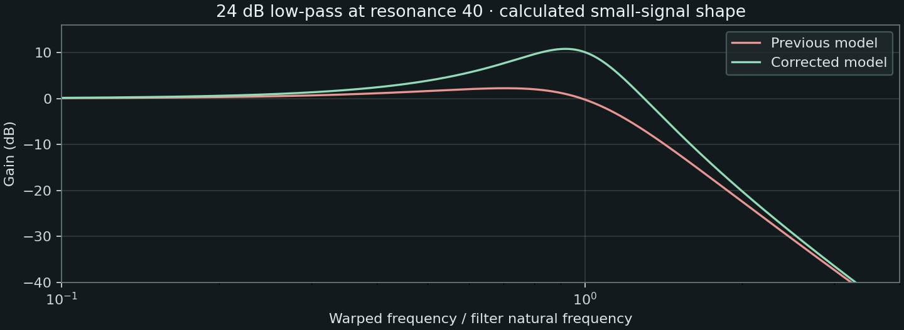

# Resonance calibration against hardware recordings

2026-09-13. **The previous voice filter had too little resonant emphasis at moderate settings.** The production correction strengthens its resonance curve and lets the second section of the 24 dB path contribute a bounded peak. It is an empirical calibration from recordings, not recovered Roland DSP code or a confirmed circuit topology.

Subsequent work calibrates the filter-envelope range in the [brightness investigation](brightness-investigation.md). The renders and cutoff residuals below remain the historical resonance-stage results, before that envelope-range correction.

[Listen to hardware, corrected Septum and previous Septum](http://127.0.0.1:8899/). Both Septum versions use identical reconstructed MIDI, identical original SysEx and identical replay settings. The original hardware performance MIDI remains unavailable. No preset values, EQ, velocity, gate timing or post-render alignment were adjusted for this comparison.

## What was wrong

Resonance bytes were decoded correctly: tone offset `0x16` stores 0–127, and the Editor uses the same range. The [MIDI Implementation, p. 5](https://static.roland.com/assets/media/pdf/SH-201_MI.pdf), official Editor resources and [Owner's Manual, p. 36](https://static.roland.com/assets/media/pdf/SH-201_OM.pdf) establish the parameter and qualitative boost/self-oscillation behavior. They do not specify Q, a damping table or the internal filter topology. Roland's [Synthesis 101 course](https://cdn.roland.com/assets/media/pdf/sh_201_synthesis_101.pdf) likewise explains resonant emphasis without giving a numerical calibration.

A new actual-engine input-sine probe agrees with the previous analytic transfer function within 0.000164 dB at moderate resonance. Neither state limiting nor output limiting explains its weak peak there. The mistake was in the assumed sound model: an ear-selected damping curve plus a second section fixed at `k=1.2`. At raw40 that combination peaks by only **2.24 dB**. See the [code/limiter audit](source-audits/resonance-code-audit.md) for the measurements, exact source identities and high-level limitations.

## Recording evidence

[SupaJuce 1](https://www.rolandus.com/go/sh-201_patches/mp3/LEAD/TOP8_SupaJuce1.mp3), associated with its original patch on Roland's [LEAD page](https://www.rolandus.com/go/sh-201_patches/patch_lead.html), provides two square oscillators one octave apart. After correcting WIDE pitch interpretation, H2/H6/H10/H14/H18/H22/H26/H30 isolate the upper square's odd harmonics. Normalizing out its ideal `1/n` spectrum and common gain reveals a much stronger resonant peak than our filter produces at the published resonance40.

Under the current TPT filter family, a shared damping near **0.513 per section (Q≈1.95)** fits the first note's early shape. A model with one variable section and a fixed `k=1.2` second section needs Q≈5.45 but fits less well. The shared-damping model improves the early shape fit on all six note groups. This is conditional on the waveform, recording and digital-frequency assumptions; an analog-frequency model makes the topology comparison much less decisive. Late notes develop effects-related comb notches and are explicitly retained as failures of a simple low-pass fit. [Detailed SupaJuce analysis and withheld harmonics](source-audits/supajuce-resonance-audit.md)

[Air Lead 1](https://www.rolandus.com/go/sh-201_patches/mp3/LEAD/TOP8_AirLead1.mp3) provides independent evidence at resonance44 with no filter-envelope modulation. Its measured even-harmonic contrast exceeds the previous filter-only model's possible contrast even with cutoff adjustable. With the existing LOW FREQ BOOST approximation included, early conditional equal-section fits give Q≈1.77–1.98. A conservative power1.5 mapping fits these early windows better than power1.6; later pitches favor somewhat stronger emphasis. Delay, reverb, oscillator assumptions, pitch LFO and unknown recording processing prevent identifying an exact hardware Q table. [Air Lead analysis](source-audits/air-lead-resonance.md)

Both sources, complete original patches and extracted MIDI/SysEx identities remain hash-pinned in the [hardware source catalog](hardware-reference-catalog.json) and the new audit JSON files. There was no new hardware capture by this project.

## Implemented model

The original curve remains the base function and remains the external AUDIO FILTER's curve:

```text
base = 2 − 2.04 √(clamp(resonance / 127, 0, 1))
voice k1 = 2 (base / 2)^1.5, when base > 0; otherwise base
voice k2 = clamp(k1, 0.5, 1.2)
```

This gives k1≈0.559 at raw40 and ≈0.505 at raw44 (Q≈1.79 and ≈1.98). The second section follows that resonance over the measured moderate region, with a maximum Q of 2. The positive damping interpolation is provisional away from the recording anchors. The cap is a conservative limit on unmeasured behavior, not a claimed Roland constant.

The zero-resonance response is preserved exactly. The first section retains the previous zero crossing and negative damping at the top, so self-oscillation remains available. The 12 dB voice path uses the stronger first section; the 24 dB path adds the bounded second section. The separate AUDIO FILTER, cutoff, key follow, envelope timing/depth and effects retain their existing behavior. There are no new parameters or session migrations; this changes the DSP response of resonant native and imported patches directly.

An unrestricted two-section candidate was finite in 1,536 static sine renders but failed independent HPF headroom, sample-and-hold modulation and slope-transition tests. The selected bounded candidate passes those tests without loosening them. The three older tests that required a weaker 24 dB peak encoded the previous unmeasured topology; they now check the intended stronger response. New quiet-input tests measure the actual engine at three sample rates, including the moderate-resonance gain, zero-resonance preservation, settled block-partition agreement and external-filter separation.

## Production results



| Measure | Previous | Corrected | Hardware/reference |
|---|---:|---:|---:|
| Calculated 24 dB peak at resonance40 | 2.24 dB | **10.81 dB** | Conditional early-note shape supports a peak of this order; no isolated hardware sweep |
| SupaJuce, whole-excerpt power centroid | 697 Hz | **1,127 Hz** | 1,642 Hz |
| SupaJuce first-note H6…H22/H2 RMS error | 20.24 dB | **18.33 dB** | Reference |
| SupaJuce other five note errors | 15.33 / 15.59 / 15.30 / 18.74 / 10.43 dB | **11.66 / 12.41 / 11.90 / 16.66 / 8.49 dB** | Reference |

The harmonic metric samples 40–95 ms after the reconstructed onset and compares H6/H10/H14/H18/H22 relative to H2. It is deliberately sensitive to the still-incorrect peak position; the remaining errors are substantial. It is not a percentage fidelity score. Whole-excerpt centroids use 20 Hz–16 kHz power, with original scalar gain removed only in listening copies.

**The cutoff/envelope mismatch remains.** SupaJuce's inferred early corner is around 7.3 kHz while the instrument's actual corner is around 3.77 kHz at 70 ms. Air Lead needs a lower inferred corner than its current render. A universal cutoff boost would therefore move the two patches in opposite directions. No global cutoff offset was added.

Moogie 1 and Cotton Wool use zero resonance in their active tones and are byte-identical before/after. Dist Bs 1 changes only slightly at its very low resonance setting. This round does not claim to resolve their oscillator-shape or phase residuals.

All four fresh production WAVs are byte-identical to the accepted bounded candidate. [Production comparison identities/statistics](source-audits/production-resonance-comparison.json) and [response/error measurements](source-audits/production-resonance-measurements.json) preserve the exact audio/binary hashes and limits. Listening copies use whole-excerpt RMS matching without EQ, compression or time warping. Raw third-party recordings and preset payloads stay in ignored build directories.

## Validation

The final Release build completed for the local arm64 AU, VST3 and standalone bundles. All **12 CTest suites passed**, including 4,599 core-engine checks and 351 hardware-voice checks. Each bundle passed strict deep ad-hoc code-signature verification. These are local development builds, not notarized distribution packages. The comparison player was checked in the browser for corrected-audio playback and switching to the hardware reference.

## Reproduction

```sh
cmake --build build-fidelity --parallel
ctest --test-dir build-fidelity --output-on-failure

python3 Tools/compare_hardware.py \
  --sources build-fidelity/hardware-benchmark/sources \
  --renderer build-fidelity/SeptumRenderMidi \
  --output build-fidelity/hardware-benchmark/fresh-resonance-run

python3 Tools/build_resonance_candidates.py \
  --output build-fidelity/hardware-benchmark/fresh-resonance-candidates
```

The candidate builder reconstructs the historical base response even from the promoted source. Profiles distinguish the historical control, two unrestricted hypotheses and the selected `bounded-coupled` version. The independent [static transfer/sweep runner](../../Tools/analyze_resonance.py) also accepts a frozen source directory. It covers 4,608 static candidate renders plus 56 transfer cases; it is not a replacement for the dynamic regression suite.

To regenerate the current listening page from the retained paired runs:

```sh
python3 Tools/summarize_resonance_comparison.py \
  --before build-fidelity/hardware-benchmark/wide-pitch-implementation/after \
  --after build-fidelity/hardware-benchmark/resonance-investigation/production-after \
  --output build-fidelity/hardware-benchmark/resonance-investigation/player
```
