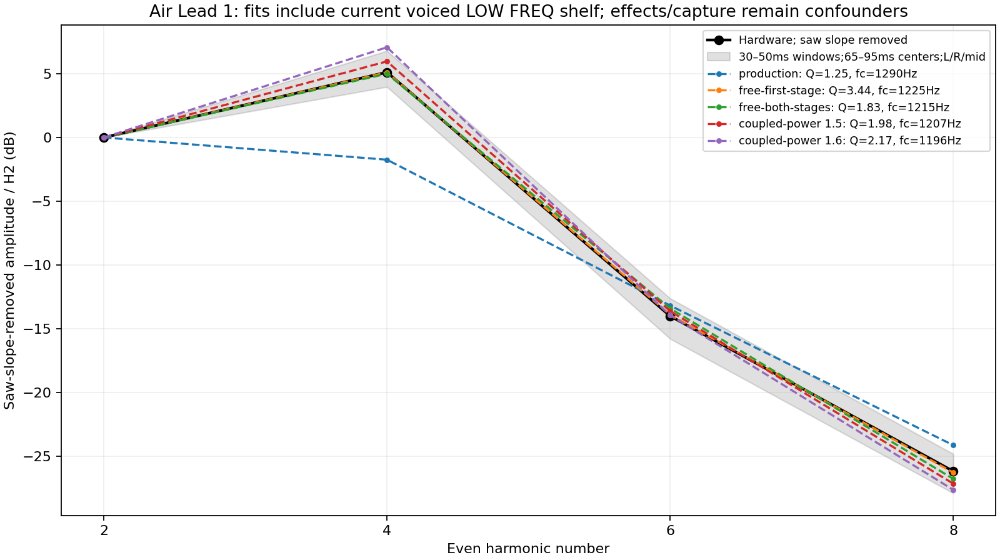

# Independent resonance evidence: Air Lead 1

2026-09-13. **Air Lead 1 supports a stronger resonant contrast than the pre-correction Septum filter provides.** Its static filter and saw harmonics give an independent reference alongside SupaJuce 1. The evidence does not uniquely determine Roland's Q curve, second-stage topology or cutoff law. Original-patch effects and an unknown recording chain remain material confounders.

This audit changes no shipping DSP. Its full-audio candidate renders use the initial experimental coupled power **1.6**. The later selected power **1.5**, with second-stage damping clamped to 0.5–1.2, is represented by the analytical fit below; the floor is inactive at this patch's resonance 44. Do not present the retained power-1.6 audio as that final production implementation.

## Reference selection and source parameters

The corpus has 32 official MP3s and four 100-patch banks. Only 24 recordings have a named individual-patch association; the eight FX recordings are category montages with unidentified patch/time mappings. The [existing candidate inventory](named-reference-filter-candidates.json) was screened as raw parameter data, not as a source of physical coarse-pitch units.

| Candidate | Useful property | Main limitation |
|---|---|---|
| Air Lead 1 | One active tone; saw plus triangle; resonance 44; static LP24 | Delay/reverb, small differential pitch modulation; triangle spectrum assumption |
| SupaJuce 1 | One active tone; octave-spaced squares; resonance 40 | Filter envelope, effects; analyzed independently in the companion investigation |
| Juicy Fat | Static Upper LP12 at resonance 33; no global delay/reverb | Dual tone; detuned Lower saws with a resonant filter envelope overlap the spectrum |
| Dist Bs 1 | Dry recording association and resonance 31 in Upper | Upper overdrive, two tones and waveform cancellation |
| Reso Sweep | Resonance 127/112 | Split Super Saw voices, filter LFO, delay/reverb; unsuitable for a clean moderate-Q fit |
| The Choir / Soundtrack | Resonant filters | Super Saw/noise or multiple voices with effects and modulation |

[Roland's LEAD page](https://www.rolandus.com/go/sh-201_patches/patch_lead.html) pairs [Air Lead 1's recording](https://www.rolandus.com/go/sh-201_patches/mp3/LEAD/TOP8_AirLead1.mp3) with record 3 of the [LEAD bank](https://www.rolandus.com/go/sh-201_patches/shl/SH-201_Patch_LEAD.zip). The [MIDI Implementation, p. 5](https://static.roland.com/assets/media/pdf/SH-201_MI.pdf), defines its parameter fields. The [Owner's Manual, pp. 35–36](https://static.roland.com/assets/media/pdf/SH-201_OM.pdf), describes 12/24 dB slopes, resonance boosting the region near cutoff, and possible self-oscillation at high settings; it supplies no Q calibration or internal digital-filter topology.

The original Upper tone has Triangle + Saw, center MIX, LOW FREQ BOOST, LP24, cutoff 91, resonance 44 and key follow +50. Filter-envelope depth, filter velocity sensitivity and filter LFO depths are zero. Overdrive is off. Triangle pitch-envelope depth +3 and LFO1 pitch depths +5/+7 are active. Delay and reverb are on, with sends 35/88. Thus the filter envelope cannot explain the measured early spectral shape, but the signal is not demonstrably dry.

Both oscillators have WIDE off and coarse byte 100, signed display +36. A runtime check through the current codec returns **+12 physical semitones for each oscillator and tone octave −1**, giving net zero transposition. The opening saw fundamental inferred from its second harmonic is about 308–309 Hz, consistent with MIDI 63 under default system settings and allowing the active pitch modulation/small tuning offset. SupaJuce's note/octave inference is not reused. Original played MIDI and system transposition remain unknown.

## Measurement and contrast bound

[analyze_air_lead_resonance.py](../../../Tools/analyze_air_lead_resonance.py) decodes the hash-verified MP3 to floating stereo PCM. It measures complex amplitudes through Hann windows centered at 65, 75, 85 and 95 ms, using widths 30, 40 and 50 ms, independently for left, right and their mean. Frequency is estimated from the second harmonic. The even harmonics are interpreted as the saw contribution, assuming a symmetric triangle contributes no even harmonics; the isolated hardware triangle remains unmeasured, as documented in the [waveform audit](oscillator-semantics.md#triangle-wording).

For saw harmonic amplitude `A[n]`, multiplying by `n` removes the ideal saw's `1/n` slope. The resulting contrast between H4 and H2 is:

| Signal | H4/H2 after removing the saw slope |
|---|---:|
| Hardware channel mean, across 12 windows | +4.99 to +5.18 dB |
| Hardware left channel | +3.97 to +5.02 dB |
| Hardware right channel | +5.97 to +6.80 dB |
| Pre-correction LP24 filter alone, maximum over every cutoff from 50–16000 Hz | +1.634 dB |

At raw resonance 44, the earlier mapping gives damping `k=0.799244`, or first-stage Q≈1.251; its fixed second stage has `k2=1.2`. Even allowing cutoff to move freely, this filter cannot generate the observed contrast from an ideal saw alone. Under that topology and without added frequency-dependent processing, the minimum observed channel/window contrast requires first-stage Q≥2.12. **This is a filter-only conditional bound, not a bound on the complete preset.** Delay/reverb comb coloration, capture response or nonideal triangle harmonics can also change the ratios. The channel differences demonstrate that such uncertainty is real.

## Q and topology fits

Fits use H2/H4/H6/H8, normalized to H2, with the TPT frequency response of two low-pass stages sharing a cutoff. There are three fitted spectral ratios: the freely fitted cutoff/Q models have only one residual degree of freedom. Very small residuals therefore do not validate the model. No external EQ is fitted.

The table uses the 50 ms channel-mean window centered at 75 ms. “Current shelf” means the existing, explicitly voiced 200 Hz/+8 dB LOW FREQ BOOST response, evaluated with its exact discrete-time coefficient. Its hardware gain/corner are not established. Including and omitting it tests sensitivity to this assumption.

| Model | Current shelf included | Fitted cutoff | First-stage Q | Second-stage Q | Ratio RMSE |
|---|---|---:|---:|---:|---:|
| Previous resonance curve; cutoff free | No | 1246 Hz | 1.251 fixed | 0.833 fixed | 3.901 dB |
| First Q free; second stage fixed | No | 1188 Hz | 3.380 | 0.833 fixed | 0.021 dB |
| Both stages share fitted damping | No | 1183 Hz | 1.803 | 1.803 | 0.363 dB |
| Previous resonance curve; cutoff free | Yes | 1290 Hz | 1.251 fixed | 0.833 fixed | 4.160 dB |
| First Q free; second stage fixed | Yes | 1225 Hz | 3.436 | 0.833 fixed | 0.080 dB |
| Both stages share fitted damping | Yes | 1215 Hz | 1.831 | 1.831 | 0.489 dB |
| Common coupled power 1.5; cutoff free | Yes | 1207 Hz | 1.979 fixed | 1.979 fixed | 0.779 dB |
| Common coupled power 1.6; cutoff free | Yes | 1196 Hz | 2.169 fixed | 2.169 fixed | 1.409 dB |

The common curves use `k = 2 × (old_k / 2)^power` in the positive-damping range. These powers were supplied as shared diagnostic choices, not optimized for this note. At resonance 44 the selected conservative second-stage floor of 0.5 does not change the power-1.5 result (`k≈0.505248`).



Across all 36 opening channel/windows, including the shelf, freely fitted common-stage Q ranges from **1.77–1.98**. Median errors are **4.24 dB** for the earlier resonance curve, **0.77 dB** for coupled power 1.5 and **1.30 dB** for power 1.6. These are sensitivity ranges, not statistical confidence intervals: overlapping windows and channels are not independent measurements.

Additional windows centered at 175 and 270 ms sample saw fundamentals near 415 and 469 Hz; windows at 500, 600, 700 ms and 4.98 s sample approximately 622 Hz. Cutoff is separately refitted for each window, while each common power stays fixed. Including the shelf, median shape errors across those 18 windows are **3.95 dB** for the earlier curve, **1.60 dB** for power 1.5 and **1.37 dB** for power 1.6. Effects and prior-note overlap are greater here. The disagreement between opening and later windows does not identify one exact exponent; both common curves improve the tested shapes, and the conservative 1.5 choice is compatible with this evidence.

Freely fitting only the first stage's Q often hits the numerical Q=100 boundary in later windows. That boundary is a failed identification, not evidence that the instrument has Q=100. Coupling both stages can fit those shapes more plausibly, but the data cannot separate filter topology from wet/capture coloration conclusively.

## Full-preset check and remaining cutoff issue

Six short renders replay the same original patch and one explicitly reconstructed opening note through the baseline, stronger-first-stage and initial coupled-1.6 renderers, with effects on and with a labeled effects-off preset intervention. Estimated note-on is 50 ms, note-off 140 ms, uncertainty approximately ±15 ms; velocity 100 is unknown. No later performance is synthesized. The original patch remains preserved separately; only the effects-off diagnostic changes its global delay/reverb switches.

| Renderer | Effects as published: H4/H2 contrast | Effects-off diagnostic |
|---|---:|---:|
| Baseline | −1.48 to −0.91 dB | −0.35 to −0.27 dB |
| Stronger first stage | −1.05 to −0.47 dB | +0.08 to +0.16 dB |
| Initial coupled power 1.6 | −0.41 to +0.17 dB | +0.72 to +0.80 dB |

The modeled effects do not produce the hardware's positive contrast in these windows. This does not establish the hardware effect transfer function. All candidates keep cutoff unchanged, so stronger resonance alone still misses the observed peak placement.

For the inferred MIDI 63 and default system settings, the pre-correction static cutoff model predicts approximately **3131 Hz**, compared with conditional fitted values around **1.2 kHz** for the opening recording. That is an inference tied to unknown original MIDI/system settings and an assumed topology. It points to unresolved cutoff/key-follow/recording interpretation and cannot justify a global cutoff shift, especially when another preset can require the opposite shift.

## Artifacts and reproduction

The [complete data](air-lead-resonance.json) retain source hashes, decoded patch interpretation, codec runtime check, all windows/fits, input/output hashes and exact render commands. Audio and manifests are retained at `build-fidelity/hardware-benchmark/resonance-investigation/air-lead-independent-v2/`; the preceding directory without `-v2` preserves the initial shelf-free investigation. Third-party recordings and preset payloads are not copied into this documentation directory.

```sh
OPENBLAS_NUM_THREADS=1 python3 Tools/analyze_air_lead_resonance.py \
  --sources build-fidelity/hardware-benchmark/sources \
  --output /tmp/air-lead-resonance-new \
  --renderers build-fidelity/hardware-benchmark/resonance-investigation/renderers
```

Omit `--renderers` to repeat the hardware measurements and mathematical fits without synthesizing diagnostics. The stored executable hashes identify the historical candidate builds; their descriptive directory names alone do not identify a production version.
