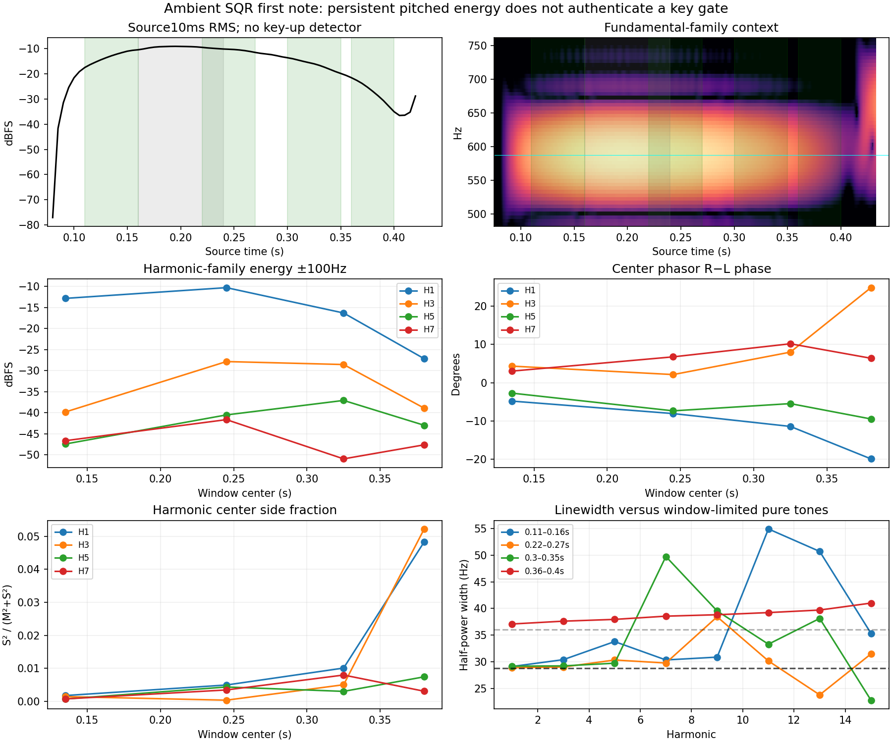

# Ambient SQR first note: key release remains ambiguous

**The original 0.160–0.240 s key-up bracket is an operational sensitivity, not an identified MIDI bound.** The first D5 retains strong narrow harmonics well beyond it. Their changing amplitudes and stereo relationships cannot uniquely distinguish a held/releasing oscillator from beating and coherent effects. A single new, explicitly exploratory first-gate extension is frozen below; earlier canonical cases remain unchanged.

This source audit follows known earlier candidate outcomes. It used only the original MP3, published patch/control inventory and mathematical measurement controls; no engine or candidate audio, new candidate scores, or source-model fit was used. The new case is not a prospective independent validation of the already selected reverb change.

## Fixed source measurements

The four windows were specified before analysis. They end before the previously identified second onset near 0.418 s. The original [Roland recording](https://www.rolandus.com/go/sh-201_patches/mp3/LEAD/TOP8_AmbientSQR.mp3) and unchanged [published bank](https://www.rolandus.com/go/sh-201_patches/shl/SH-201_Patch_LEAD.zip) were hash-verified and the MP3 freshly decoded at 44.1 kHz stereo, without normalization or downmix.

| Source interval | Overall RMS | H1 family | H3 family | H5 family | Side fraction | L/R correlation |
|---|---:|---:|---:|---:|---:|---:|
| 0.11–0.16 s | −12.71 dBFS | −12.86 | −39.83 | −47.43 | 0.20% | .996 |
| 0.22–0.27 s | −10.27 dBFS | −10.31 | −27.86 | −40.52 | 0.50% | .990 |
| 0.30–0.35 s | −15.95 dBFS | −16.33 | −28.56 | −37.08 | 0.97% | .981 |
| 0.36–0.40 s | −25.87 dBFS | −27.18 | −38.91 | −42.98 | 3.88% | .940 |

Harmonic-family columns are mean stereo Hann spectral energy within ±100 Hz of each nominal D5 harmonic, expressed in dBFS. At 0.30–0.35 s, H3/H5 are **11.27/10.35 dB stronger** than in the first window while H1 is 3.47 dB weaker. These differing trajectories make an overall amplitude maximum inadequate as a key-release detector. They do not disprove a release followed by interference and effects.

The source remains strongly concentrated in harmonic families: a joint H1–15 sinusoidal model with linearly moving amplitudes explains 99.87–99.99% of local weighted power. That total is dominated by the strongest components, particularly H1; it does not resolve the individual oscillators or authenticate a dry signal.

The H1 right-minus-left phase progresses approximately −4.82°, −8.08°, −11.45°, −19.93°; H3 progresses +4.33°, +2.12°, +7.99°, +24.86°. By the last window their fitted center side fractions are 4.8%/5.2%. Higher harmonics differ: H5 remains about 0.7% side. Overall right-minus-left level moves −0.10/−0.07/+0.19/+1.69 dB. The fixed right-channel −0.6 dB diagnostic still gives increasing side fractions, 0.36%/0.64%/1.02%/3.37%.

This is consistent with a changing mixture of near-common-channel and wider sound as the main note weakens. It does **not** uniquely identify dry/wet proportions: deterministic echoes and reverberant narrow tones can remain highly coherent, while detuned layers can interfere differently in each channel.

## Width and beating limits

The native Fourier bins are 20 Hz in the first three windows and 25 Hz in the last. Interpolated pure-tone half-power widths are **28.825 and 36.035 Hz** with these Hann windows. Actual H1–5 widths are mostly near these floors: about 28.9–33.8 Hz in the 50 ms windows and 37.1–38.0 Hz in the 40 ms window. Some higher harmonics broaden or develop narrower individual maxima; interference and moving amplitude can change those shapes. Zero padding does not resolve oscillator doublets below the native window limit.

The exact published patch has two Upper Squares at fine +1/−3 cents and two Lower Sines at −5/+6 cents, all with zero coarse/tone octave shifts. At nominal D5, 587.3295 Hz:

| Pair | Fundamental separation | Beat period | Relevant harmonic beating |
|---|---:|---:|---|
| Upper +1/−3 cents | 1.3562 Hz | 0.7373 s | H3: 0.2458 s; H5: 0.1475 s; H7: 0.1053 s |
| Lower −5/+6 cents | 3.7329 Hz | 0.2679 s | Sine-pair fundamental |

Those time scales overlap the observed rise and fall. Oscillator phases and layer amplitudes are unknown, so this is arithmetic plausibility, not a fit proving that beating caused a particular minimum. Upper also has drive 30, an active filter envelope, AMP A/D/S/R 23/72/118/30, and SOLO LEGATO with portamento 20. Lower has AMP 76/127/100/22, SOLO and no portamento. Both effects are active, and Lower's reverb send is much larger. Raw AMP release 30/22 does not supply an independently measured release time in seconds here.

A mathematical single-tone control with a fixed three-sample channel delay recovers its known −14.3836° phase within 4×10⁻¹² degrees and supplies the linewidth floors above. The identical narrowband observation can represent channel delay on a dry tone **or a wet echo**; the control demonstrates why coherence alone cannot separate them. No synthesizer renderer is invoked.

## Frozen exploratory case

The new [JSON](../reconstructions/reverb-validation/ambient-sqr-first-held-until-next.json) and [MIDI](../reconstructions/reverb-validation/ambient-sqr-first-held-until-next.mid) change only the first key-up:

| Note | On | Off | Velocity |
|---|---:|---:|---:|
| D5 / 74 | 0.085 s | **0.418 s** | 100 |
| E5 / 76 | 0.418 s | 0.530 s | 100 |
| F5 / 77 | 0.618 s | 0.730 s | 100 |

The first key-up now uses the already frozen next onset, without fitting a new time to model audio. At their shared sample, **note-off precedes note-on**. This is a contiguous-gate sensitivity, not a held-key overlap or recovered legato gesture. The first note crosses the 0.405 s calibration boundary by design.

Source start remains 0, calibration end 0.405 s and duration 0.775 s. All other event times, velocities, original MP3/SysEx pins and patch settings remain unchanged. The old 0.160–0.240 s first-key-up bracket is retained as historical metadata, not mislabeled as a bound containing the new gate. MIDI parsing verifies exactly one key-up sample changed; all other events, their ordering, tempo and end time are preserved.

Retain this case alongside the original nine gate/velocity scenarios without selecting the best-performing reconstruction. A later improved score would establish sensitivity to articulation assumptions, not prove that this longer gate was played or that the underlying DSP was identified.



## Reproduction

```sh
OPENBLAS_NUM_THREADS=1 python3 Tools/inspect_ambient_first_note_articulation.py \
  --sources build-fidelity/hardware-benchmark/sources \
  --output build-fidelity/reverb-reference-expansion/ambient-first-note/reproduction
```

Recorded final run: `ambient-first-note/run-03`. The [tool](../../../Tools/inspect_ambient_first_note_articulation.py) regenerates fresh source audio, exact SysEx, all measurements/controls, and the separate exploratory JSON/MIDI. The [durable receipt](ambient-first-note-articulation-2026-09-15.json) pins originals, decoder, measuring helpers, canonical parent, proposed case and MIDI, and preserves every harmonic row including weak or ambiguous diagnostics. Hardware measurements are unchanged from run 01; later runs added the frozen proposal and parser verification. Key-release identification and hardware equivalence remain unestablished.
