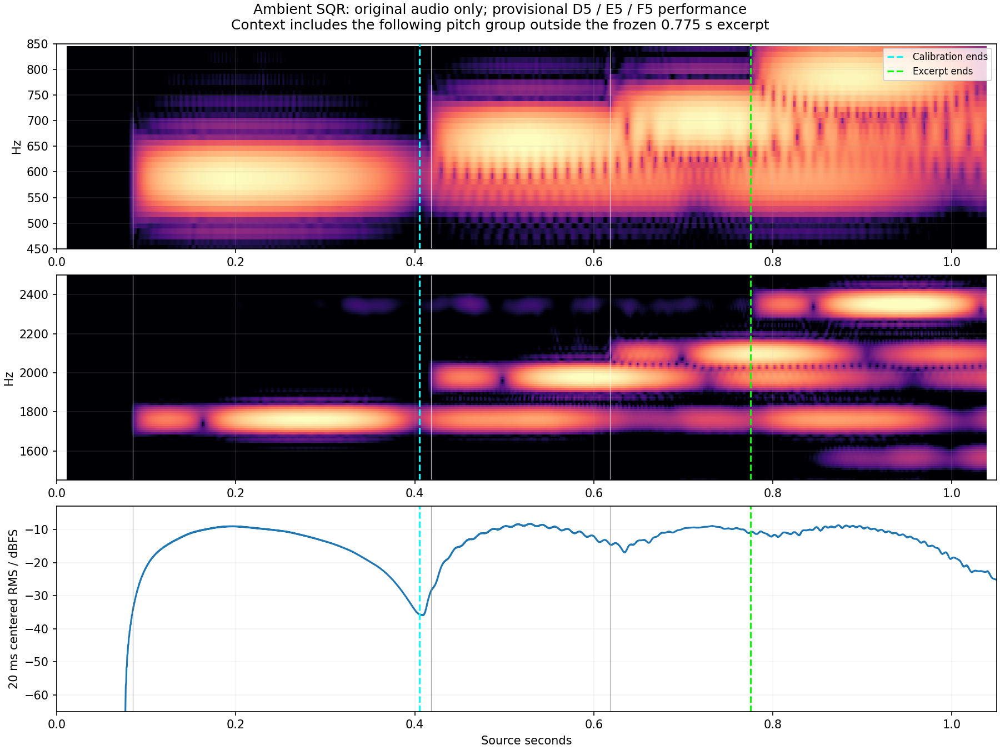

# Ambient SQR: independent performance reconstruction

**The first three pitches are sufficiently clear for a conditional replay.**
The frozen hypothesis is D5, E5, F5 (MIDI 74, 76, 77). Key-release times and
velocities remain substantially less certain. This case can test whether a
reverb change generalizes under an unchanged published preset; it cannot
establish matched hardware output or identify a reverb gain by itself.

Only the [original Roland MP3](https://www.rolandus.com/go/sh-201_patches/mp3/LEAD/TOP8_AmbientSQR.mp3)
and its associated published bank/preset were inspected. No candidate render,
gain-candidate score or synthesis error was consulted when choosing the notes,
times, crop or calibration split.

## Frozen performance

The canonical [reconstruction JSON](../reconstructions/reverb-validation/ambient-sqr.json)
and [estimated MIDI](../reconstructions/reverb-validation/ambient-sqr.mid) use
the existing `compare_hardware.write_midi` convention. Source time starts at
zero; the full prefix and every note in the excerpt are retained for effect
history. The excerpt ends at **0.775 s**, before the next obvious pitch group
near 0.79 s.

| Played-note hypothesis | Nominal on | Nominal off | Onset sensitivity | Off-time sensitivity |
|---|---:|---:|---|---|
| D5 / MIDI 74 | 0.085 s | 0.200 s | 0.075–0.095 s | 0.160–0.240 s |
| E5 / MIDI 76 | 0.418 s | 0.530 s | 0.408–0.428 s | 0.490–0.570 s |
| F5 / MIDI 77 | 0.618 s | 0.730 s | 0.608–0.628 s | 0.700–0.760 s |

All nominal velocities are 100. **Calibration uses 0–0.405 s**, covering the
first D5 and its decline/gap. **Later evaluation uses 0.405–0.775 s**, including
the distinct E5 and F5. The source does not determine original velocity;
80/100/120 are suggested fixed sensitivities. Likewise, compare nominal gates,
all early endpoints and all late endpoints without selecting the best error.
All such choices must apply equally to every DSP candidate.

The nominal key-ups follow the source's envelope roll-off near its level
maxima. The 20 ms centered RMS maxima occur at 0.1954, 0.5289 and 0.7323 s.
**These maxima are not detected key-release events.** Two layers, filter and
amplitude envelopes, interference, drive and effects prevent unique recovery.
The table contains operational sensitivity ranges, not confidence intervals
or certified bounds on hardware MIDI. A common latency is also unknown.

## Independent pitch evidence



| Original-audio interior | Main peak | Third-harmonic peak / 3 | Fifth-harmonic peak / 5 |
|---|---:|---:|---:|
| 0.10–0.35 s | 587.00 Hz | 587.00 Hz | 587.30 Hz |
| 0.45–0.58 s | 658.65 Hz | 660.26 Hz | 658.85 Hz |
| 0.64–0.76 s | 697.92 Hz | 700.35 Hz | 698.13 Hz |

Native window-bin spacings are 4.00, 7.69 and 8.33 Hz. Eightfold zero padding
interpolates peak positions but does not improve frequency resolution; the
numbers above are descriptive peak locations, not precision tuning estimates.
The new odd-harmonic families distinguish successive notes despite residual
older-note energy. Both layers have zero coarse/octave shifts and no stored
pitch-envelope or LFO depths. That makes MIDI 74/76/77 a defensible played-note
hypothesis for these named preset bytes. Unknown system transpose, controller
state and recorded patch revision remain possible confounds.

## Preset controls relevant to interpretation

The exact extracted SysEx is unchanged, SHA-256
`1e420e8a04502d790a1018f4547167377bdfd4470e21bb6602853d09218aff07`.

| Active layer | Upper | Lower |
|---|---|---|
| Oscillators | Square + Square, fine +1/−3 cents | Sine + Sine, fine −5/+6 cents |
| Drive and articulation | Drive on, amount 30; Solo Legato; portamento on, time 20 | Drive off; Solo; portamento off |
| AMP A/D/S/R | 23 / 72 / 118 / 30 | 76 / 127 / 100 / 22 |
| Cutoff / key follow / envelope depth | 11 / 110 / 20 | 101 / 0 / 0 |
| Cutoff velocity sensitivity | 0 | 0 |
| AMP velocity sensitivity | 0 | 8 |
| Delay / reverb sends | 40 / 43 | 40 / 112 |

Both effects are enabled. The original reverb block is
`89,10,7,19,127,127,19,36,0,28`, with stored HF gain −8 dB and LF gain 0 dB.
These are decoded control values, not physical DSP measurements. Lower's AMP
velocity sensitivity and larger reverb send mean that velocity can change the
layer and wet/dry balance; a scalar output gain cannot remove that uncertainty.
Residual energy does not establish held-key overlap or isolate an effects stem.

## Reproduction and verification

[Tools/reconstruct_ambient_sqr_opening.py](../../../Tools/reconstruct_ambient_sqr_opening.py)
checks the original MP3/bank/SysEx hashes, extracts the unmodified preset,
decodes native 44.1 kHz stereo without resampling or downmix, measures the
fixed interiors, and writes the frozen JSON/MIDI. No renderer is invoked.

```sh
python3 Tools/reconstruct_ambient_sqr_opening.py --out build-fidelity/reverb-reference-expansion/ambient-reproduction
```

The [receipt](ambient-sqr-performance-feasibility-2026-09-15.json) pins the
source, bank member, preset, decoder, measuring tools, native WAV, plot,
canonical JSON/MIDI and raw evidence. The nominal MIDI uses the existing
20,000-tick/second convention; all three note pairs and the final end time
were checked through the normal MIDI parser.

- Original MP3 SHA-256: `d113bb3d65c34bb6827d29561e29dd9c9d4a6236143d5528685643f84a86e565`.
- Canonical JSON SHA-256: `d9529fe92b8178dd1acc556feb54863b18e8dd1b30e724f28736765f4eeee532`.
- Estimated MIDI SHA-256: `b41bad02fc86b6e5e861e50afd7d519646292cf275d79cf65c7fd300a95b38de`.

No physical parameter or shipping DSP law was inferred or changed here.
