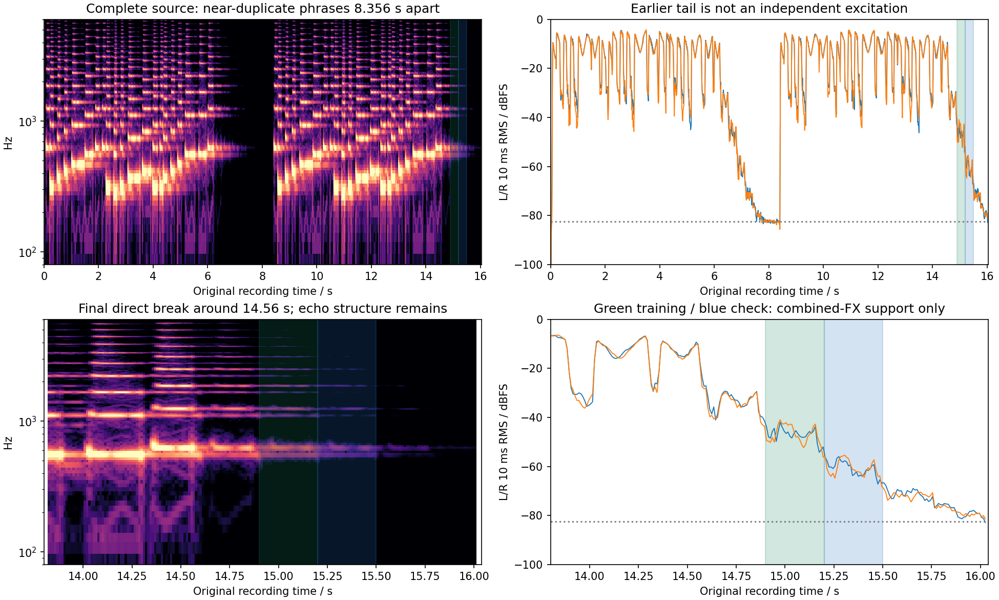

# Brassy Ld 1: complete-source reverb-tail feasibility

**This recording does not independently identify a third reverb-time anchor.** Its final tail is measurable, but strong delay echoes remain, the later frozen check approaches the noise floor, and the earlier tail is near-duplicate recorded audio. The retained intervals can support a qualified joint delay/reverb diagnostic. No decay slope, T60, DSP parameter or candidate score was fitted or consulted.

## Original identity and active patch

Brassy was selected before source analysis because its named original preset has neutral LF/HF damping, reverb TIME 64 and SIZE 7. The complete [official MP3](https://www.rolandus.com/go/sh-201_patches/mp3/LEAD/TOP8_BrassyLd1.mp3) is 16.039184 seconds. The [official LEAD bank](https://www.rolandus.com/go/sh-201_patches/shl/SH-201_Patch_LEAD.zip) contains patch 8, `Brassy Ld 1`; extraction preserves all 22 parameter blocks and reproduces the existing comparison SysEx exactly.

| Input | SHA-256 |
|---|---|
| Original MP3 | `37b1c739ad3e1df4611b542f745111b78b51d9b372034275f5f1ceab48ed4c00` |
| Original ZIP | `102c47ee393c09115779172b8cbbb2c2f2563e0b4fdb2f57e0c8fca2a23c3b29` |
| `SH-201_Patch_LEAD/100_LEAD.shl` | `d6649236cd89c1652480f9ae194bc20f0a3e33e147cb16828216871fba35b26c` |
| Unchanged SysEx | `daba0b97a4b9e2674c4832050bbd0d8e869a3b61e9ce867c7055d21b0f4a6f5a` |

The complete native decoded patch and raw common/Upper/FX blocks are retained in the [receipt](brassy-reverb-tail-feasibility-2026-09-15.json). Relevant active controls are:

- Single Upper, SOLO, centered pan, no arpeggio or portamento; Lower inactive. Two saws at the same coarse pitch, fine +5/−5 cents, centered oscillator balance, LOW FREQ BOOST. Patch/tone levels 80/127; overdrive off.
- LP24, cutoff 50, resonance 0, key follow +30%, cutoff velocity 0. Filter ADSR 12/44/53/42, depth +18. AMP ADSR 7/0/127/8, velocity sensitivity +8. Raw ADSR values do not authenticate hardware time curves or the unknown note-off.
- Pitch envelope A/D 2/18 with both depths 0. LFO1 triangle, free rate 92, no fade/key trigger, oscillator-1 pitch depth +2; all other modulation depths 0.
- Both FX switches on. Upper delay/reverb sends 16/20. Delay raw block `64,59,12,5,10`: TIME 64, feedback +20%, HF DAMP 3150 Hz, modulation rate/depth 5/10.
- Reverb raw block `64,10,7,19,127,127,19,36,0,36`: TIME 64, SIZE 7 (display 8), pre-delay 1 ms, HIGH CUT 12.5 kHz, density/diffusion 127, LF/HF gains 0 dB with stored corners both 4 kHz. Neutral shelves do not disable high-cut or delay.

The official name association does not authenticate the recording's exact patch revision, MIDI gates/controllers, recording gain or processing. No model WAV was opened by this analysis.

## Source coverage and frozen supports

The last obvious new pitch begins within **14.34–14.41 s**. A direct-level break occurs within **14.55–14.61 s**; **14.65 s** is a conservative bound for the obvious direct excitation. These are source spectrogram/RMS brackets, not recovered MIDI note-off. Renewed energy lobes repeat at roughly 0.30-second spacing after the break, consistent with the active delay; they are not new-note evidence or an isolated reverb impulse response.

The same-file quiet reference at **7.95–8.30 s** measures **−82.48 dBFS**. It is empirical background, not proven stationary hardware self-noise, and is not subtracted. The final 89 ms average −80.08 dBFS, and terminal samples remain nonzero. There is no obvious abrupt edit or forced digital silence within the selected support; undocumented smooth mastering fades cannot be excluded.

Intervals were fixed after full-source inspection, before the following measurements. The quality flag requires every complete 10 ms bin to remain at least 20 dB above the quiet-reference RMS; it is a measurement guard, not a perceptual threshold. Failed windows remain unchanged.

| Original seconds | Role | RMS dBFS | Worst 10 ms clearance | Quality flag |
|---|---|---:|---:|---|
| 14.65–14.90 | Early echo diagnostic | −32.77 | 40.12 dB | Pass |
| 14.90–15.20 | Conditional training | −46.00 | 28.81 dB | Pass |
| 15.20–15.50 | Conditional later check | −59.80 | 15.05 dB | **Fail** |
| 15.50–15.80 | Low-level sensitivity | −71.50 | 5.86 dB | **Fail** |

Each primary support spans only about one visible echo step. Side/mid power also changes from **+4.04 dB** in training to **−2.51 dB** in the later check. Coarse octave-power shapes remain similar within each window (half-window cosine 0.9995/0.9947), which does not remove delay, phase or input-history ambiguity. A precise broadband decay regression alone would not identify the reverb TIME control.

## The earlier tail is not an independent check

The two phrases align at **368500 samples = 8.356009 s**. A single-lag source waveform comparison gives stereo cosine **0.999979** across six seconds of playing. Earlier tail 6.25–7.60 s against its shifted final counterpart gives cosine **0.999625**, scalar gain **1.002166** and relative residual **0.027375** after that diagnostic gain. This is strong evidence of duplicated recorded material, with small encoding/background differences. It must not count as another performance or independent excitation. The scalar repetition diagnostic is not a decay fit and is not used to normalize the tail statistics.



## Reproduction

```sh
OPENBLAS_NUM_THREADS=1 VECLIB_MAXIMUM_THREADS=1 \
/Library/Frameworks/Python.framework/Versions/3.11/bin/python3 \
Tools/inspect_brassy_reverb_tail.py \
  --sources build-fidelity/hardware-benchmark/sources \
  --output build-fidelity/brassy-tail-feasibility/reproduction
```

Use a new output directory. Only hash-pinned original MP3/ZIP and the tracked native patch inventory are required; private float WAV decoding records the actual ffmpeg version/hash. The JSON preserves every interval, full 25 ms source history, 10 ms tail/noise histories, raw patch settings, tool hashes and duplication measurements. No shipping source changes.
