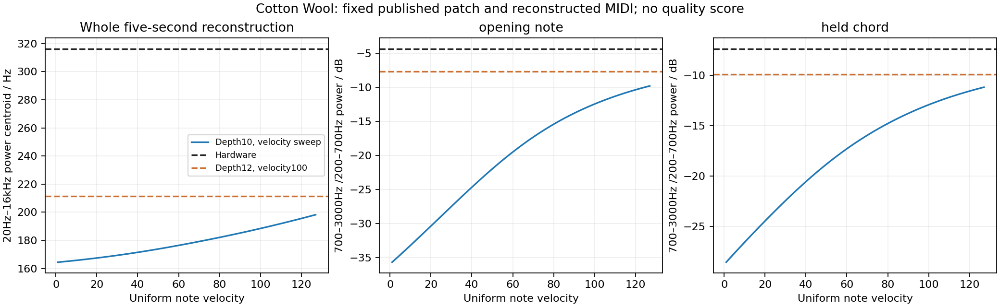

# Independent brightness controls: Cotton Wool and Air Lead 1

2026-09-13. **Cotton Wool independently supports a partial increase in filter-envelope range; velocity alone cannot explain its measured high-band deficit under the retained reconstruction.** The selected 12-octave range improves three passages beyond the previous model's complete uniform-velocity range. It leaves substantial spectral differences. Air Lead's depth-zero render remains byte-identical, preserving its separate unresolved cutoff issue.

The range was selected from [SupaJuce's harmonic analysis](supajuce-brightness.md), not fitted to Cotton. This audit changes no shipping code or preset bytes. The fixed 10/12/14-octave renderer snapshots retain the preceding pitch and resonance corrections. The [production investigation](../brightness-investigation.md) records adoption and validation separately.

## Sources and control settings

Roland's [PAD page](https://www.rolandus.com/go/sh-201_patches/patch_pad.html) associates [Cotton Wool's recording](https://www.rolandus.com/go/sh-201_patches/mp3/PAD/TOP8_Cotton_Wool.mp3) with the [published PAD bank](https://www.rolandus.com/go/sh-201_patches/shl/SH-201_Patch_PAD.zip). The imported first patch has one active tone: Super Saw plus sine, center balance, FLAT low-frequency setting, LP24, cutoff 0, resonance 0, key follow +60, filter-envelope depth +39, velocity sensitivity +18 and envelope A10/D58/S87/R105. AMP velocity sensitivity is zero. Published effects remain active. The [tuning audit](cotton-tuning-audit.md) establishes the approximately one-octave oscillator interval; the first reconstructed MIDI note is 48, with Super Saw around 130.8 Hz and sine around 65.15 Hz. No obsolete three-octave interpretation is used.

The [Owner's Manual, pp. 35–37 and 61](https://static.roland.com/assets/media/pdf/SH-201_OM.pdf), distinguishes cutoff, key follow, envelope depth and velocity response. The [MIDI Implementation, p. 5](https://static.roland.com/assets/media/pdf/SH-201_MI.pdf), defines their separate stored fields. Neither establishes the numerical depth-to-octaves or velocity-to-octaves law. Those remain model calibrations.

For this patch, changing the modeled maximum envelope range from 10 to 12 octaves adds **1.238 octaves at the envelope peak**, or **0.848 octaves at the modeled sustain level 87/127**. By comparison, changing note velocity from 100 to 127 adds only **0.486 octaves** under the unchanged velocity mapping. This predicts a distinguishable intervention without asserting that Roland uses these numerical laws.

## Method and velocity control

[analyze_brightness_controls.py](../../../Tools/analyze_brightness_controls.py) measures the preserved floating-point stereo WAVs. Ratios use mean left/right power, not a mono downmix, with a Hann periodogram and 65,536-point zero-padded FFT. Zero padding interpolates the spectrum; it does not increase the resolution of the short recording window. Render windows include the known 93-sample engine latency. No audio EQ, gain fitting, pitch correction or time stretching enters these ratios.

The principal broad-band ratio is **700–3000 Hz power divided by 200–700 Hz power**. Pooling partials is less sensitive to detuned oscillator beating than measuring one peak, but does not eliminate phase, effects or performance dependence. Three passages are inspected: the isolated opening note at 0.16–0.35 s, the held chord at 2.90–3.30 s and repeated bass at 4.16–4.35 s. The latter two contain earlier-note and effect tails; they are supporting passages, not isolated oscillator measurements.

The previous 10-octave renderer also replays all 27 reconstructed notes at each uniform velocity from **1 through 127**. Everything else stays fixed, including the published SysEx. The velocity-100 WAV exactly matches the preserved baseline. For the first isolated note this exhausts possible MIDI note velocities under the fixed reconstruction/model; later passages do not exhaust arbitrary independent velocities, changed gates, missing notes or controllers. Original performance MIDI and capture processing remain unknown.

| Passage | Hardware | Previous, velocity 100 | Brightest previous result over velocity 1–127 | 12 octaves, velocity 100 | 14 octaves, velocity 100 |
|---|---:|---:|---:|---:|---:|
| Opening note | −4.35 dB | −12.46 dB | −9.80 dB | −7.72 dB | −6.39 dB |
| Held chord | −7.35 dB | −12.91 dB | −11.17 dB | −9.88 dB | −8.78 dB |
| Repeated bass | −4.00 dB | −12.04 dB | −10.37 dB | −8.83 dB | −7.29 dB |

The previous maxima all occur at velocity 127. The 12-octave change reduces these three deficits, leaving **3.37, 2.54 and 4.83 dB** respectively. Across three overlapping opening-window variants, hardware ranges from −2.95 to −5.25 dB, the previous velocity-127 result from −9.49 to −10.17 dB, and the 12-octave result from −7.53 to −7.85 dB. The direction survives this timing sensitivity check; these overlapping windows are not independent samples or statistical confidence intervals.

The whole five-second power centroid is 316.28 Hz in the hardware recording. It spans **164.44–198.22 Hz** over the previous model's complete uniform-velocity sweep, compared with 188.44 Hz at velocity 100, **211.42 Hz at 12 octaves** and 238.92 Hz at 14 octaves. This broad statistic is dominated by bass balance and performance and is not a fidelity score.



## Why this does not calibrate the complete oscillator/filter model

The narrower opening-note ratio, 900–2000 Hz over 110–155 Hz, changes from −7.30 dB to −1.61 dB, close to the hardware's −1.76 dB. That favorable number is insufficient by itself. The third Super Saw harmonic band, 350–425 Hz relative to 110–155 Hz, is **−11.51 dB in hardware, +3.05 dB previously and +3.56 dB with 12 octaves**. Increasing the envelope range does not correct that notch and slightly increases this particular discrepancy. At other times the detuned partial amplitudes change considerably. Original oscillator phases, spread law and wet/capture response are not established.

Cotton therefore supports the direction of increased envelope modulation but does not independently identify an exact maximum range. Its broad-band metric continues improving at 14; SupaJuce's better isolated harmonic family rejects that larger setting. Choosing a global range from Cotton centroid alone would ignore conflicting evidence. The residual is also not proof of a universal oscillator rolloff: its strong third-harmonic shape difference and phase sensitivity need a separate, controlled oscillator measurement.

## Air Lead: unchanged negative control and opposite cutoff inference

[Air Lead's independent audit](air-lead-resonance.md) verifies the original patch's net oscillator/tone transposition and estimates an opening MIDI note 63 under default system settings. Its filter-envelope depth and filter velocity sensitivity are both zero. Current cutoff 91 with key follow +50 predicts approximately **3131 Hz** for that note. Conditional fits of the hardware's early saw-harmonic shape imply approximately **1.2 kHz**, depending on assumed filter topology and LOW FREQ BOOST response. Original delay/reverb, small pitch modulation, possible system transpose/controller state and recording processing remain confounders. The original MIDI is unavailable.

Replaying the unchanged Air Lead SysEx and the same explicitly reconstructed opening MIDI through the fixed 10- and 12-octave candidates produces **byte-identical WAVs**, SHA-256:

```text
26f6b0b7f7d90bc8d37b765017cf3270ad2ecffee28fdfd4ca2184df4afd5edc
```

This confirms that envelope-depth calibration does not alter the depth-zero control. It does not show that Air Lead now matches hardware. Its opposite conditional cutoff discrepancy argues against using one universal cutoff boost to correct the other demos. A dry, controlled hardware cutoff sweep would discriminate the base cutoff curve from envelope depth and recording coloration; these wet musical recordings cannot uniquely determine all three.

## Reproduction and retained evidence

The [JSON](brightness-controls.json) records all 127 velocity measurements, all candidate/window results, source and binary hashes, baseline reproduction and Air equality. The [script](../../../Tools/analyze_brightness_controls.py) completed the experiment and passed Python compilation. The plotted artifact was visually checked. Third-party audio and presets remain in ignored build directories, with no new redistributable PCM or SysEx added to documentation.

```sh
OPENBLAS_NUM_THREADS=1 python3 Tools/analyze_brightness_controls.py \
  --candidates build-fidelity/hardware-benchmark/brightness-investigation/candidate-renders \
  --renderers build-fidelity/hardware-benchmark/brightness-investigation/renderers \
  --air build-fidelity/hardware-benchmark/resonance-investigation/air-lead-independent-v2 \
  --output /tmp/brightness-controls-new \
  --jobs 4
```

Use the preserved renderer hashes to identify the experiment. Directory names alone do not establish the DSP version. The Air pair is retained in `build-fidelity/hardware-benchmark/brightness-investigation/independent-controls/`; the original controls and candidate comparisons remain untouched.
