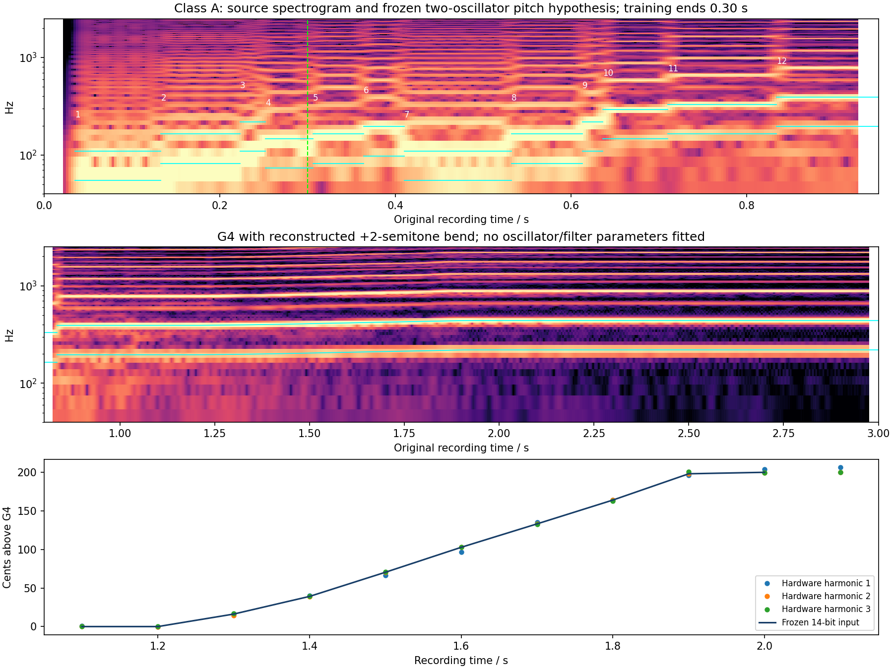

# Class A: source-only performance protocol

**The three Class A performance hypotheses are frozen before any renderer or candidate score was consulted.** They retain 12 early note events and an observed G4-to-A4 pitch rise as a continuous bend. Reverb gain, envelopes, oscillator shape and the original SysEx were not fitted or edited.

The [measurement receipt](class-a-performance-protocol-2026-09-15.json) contains all source windows, spectral peaks, periodicity alternatives, onset sensitivity, frequency knots and parsed MIDI events. The canonical inputs are:

- [Nominal JSON](../reconstructions/reverb-validation/class-a-nominal.json) and [MIDI](../reconstructions/reverb-validation/class-a-nominal.mid).
- [10 ms gap JSON](../reconstructions/reverb-validation/class-a-sensitivity/class-a-gap-10ms.json) and [MIDI](../reconstructions/reverb-validation/class-a-sensitivity/class-a-gap-10ms.mid).
- [20 ms overlap JSON](../reconstructions/reverb-validation/class-a-sensitivity/class-a-overlap-20ms.json) and [MIDI](../reconstructions/reverb-validation/class-a-sensitivity/class-a-overlap-20ms.mid).



## Original patch and pitch interpretation

The source is Roland's [Class A recording](https://www.rolandus.com/go/sh-201_patches/mp3/LEAD/TOP8_ClassA.mp3), MP3 SHA `88dc73e66c854e6ea57d976a96cd884dddb85275d56f73719000806f1609b886`. The exact published SysEx SHA is `5ac5ab7f052f6f17c48cc342bf4493ee5919572fc66dabf7daaddd25178b95e9`. The original bank and MP3 identities are verified before each run. The complete recording is decoded privately to float32 stereo at 44.1 kHz without gain changes.

Only Upper sounds. Both oscillators are saws with WIDE off. Received coarse bytes 100/64 mean physical +12/0 semitones; tone octave −1 gives net offsets 0/−12 relative to the played key. The lower observed family therefore need not be the played note. Fine tuning is 0/0, balance −26, and no pitch-envelope depth, LFO depth, portamento or drive is active. Bend range is 2 semitones. These stored controls guide source interpretation; original system transpose/tuning and recorded patch revision remain unknown.

Cutoff velocity sensitivity is raw 64, signed 0. AMP velocity sensitivity is +8. All notes use nominal velocity 100; no per-note velocity fitting occurred. Because cutoff velocity is zero, a 64/127 cutoff-velocity sensitivity is not needed. Unknown original dynamics still limit amplitude comparisons. Filter envelope controls remain unchanged and unverified against the hardware.

## Source-derived notes

Spectrograms, fixed-window spectral peaks and 60 ms stereo autocorrelation identify the two octave-related families. Autocorrelation alone is insufficient: octave/subharmonic peaks and prior wet notes are retained in the receipt. Short-window positive spectral flux is also ambiguous; phase, beating and filter motion can move its maximum. Each onset therefore retains a conservative source-inspection bracket separately from pitch and note-off confidence.

| Event | Nominal onset s | Played pitch | Onset bracket s | Pitch qualification |
|---|---:|---|---|---|
| 1 | .035 | A2 / MIDI 45 | .029–.041 | High |
| 2 | .133 | E3 / 52 | .123–.145 | High |
| 3 | .223 | A3 / 57 | .213–.237 | Medium-low; very brief |
| 4 | .252 | D3 / 50 | .240–.264 | Medium; low family supports octave |
| 5 | .306 | E3 / 52 | .296–.316 | High |
| 6 | .364 | G3 / 55 | .353–.380 | Medium; brief |
| 7 | .410 | A2 / 45 | .398–.425 | High |
| 8 | .532 | E3 / 52 | .521–.544 | High |
| 9 | .613 | A3 / 57 | .601–.625 | Medium-low; very brief |
| 10 | .636 | D4 / 62 | .628–.650 | Medium-high; octave checked |
| 11 | .710 | E4 / 64 | .699–.725 | High |
| 12 | .834 | G4 / 67 | .822–.848 | High; later bend retained |

The coarse first inspection missed three brief events. The frozen table follows the refined original-only evidence; no model score influenced that revision. Every preceding event remains in every variant to preserve the hypothesized effect-state history.

Nominal note-off coincides with the next onset. The gap variant releases 10 ms before the next onset; the overlap variant releases 20 ms after it. SOLO LEGATO makes this an important articulation uncertainty because overlapping notes can avoid envelope retriggering. These are fixed alternatives, not recovered key-release measurements. The final note-off is 3.0 s in every variant and is explicitly artificial: the original recording continues playing.

## Continuous pitch gesture

The last opening note's fundamental family is near 392 Hz at 1.1–1.2 s, then rises continuously toward 440 Hz by approximately 1.9–2.0 s. A later wobble outside this 3-second excerpt is not modeled. Encoding the rise as separate chromatic notes would add attacks unsupported by the recording.

Harmonics 1, 2 and 3 are measured independently in 80 ms Hann windows at 0.1-second centers. Log-parabolic interpolation refines each local spectral maximum; frequencies are divided by harmonic number. The median supplies each interior bend knot. All three estimates and their spread remain in the receipt; the spectral windows contain wet sound and the estimates are not exact controller measurements.

| Source center s | Median frequency Hz | Cents above nominal G4 |
|---|---:|---:|
| 1.10 | 392.058 | +0.278 |
| 1.20 | 391.960 | −0.158 |
| 1.30 | 395.684 | +16.215 |
| 1.40 | 400.953 | +39.116 |
| 1.50 | 408.270 | +70.422 |
| 1.60 | 415.976 | +102.795 |
| 1.70 | 423.338 | +133.167 |
| 1.80 | 430.959 | +164.055 |
| 1.90 | 439.521 | +198.114 |
| 2.00 | 439.925 | +199.703 |
| 2.10 | 440.008 | +200.032 |

The source supports a centered G4 endpoint and the stored +2-semitone maximum. The nominal controller remains centered through 1.2 s, follows the 1.3–1.9 s median knots by linear interpolation in cents, and reaches maximum at 2.0 s. Values are sampled every 10 ms and rounded to 14-bit MIDI: center 8192, maximum 16383. The approximately 0.024-cent numeric step is much finer than the observed harmonic-estimate spread, which reaches about 6.5 cents. Precision of the MIDI format must not be mistaken for certainty about original controller motion.

All three variants have the same 83 pitch-bend events. The independent SMF parser recovers every value exactly, with 12 note-ons, 12 note-offs and no ignored events. At equal ticks the shared MIDI writer orders note-off, bend, then note-on. No original performance MIDI was found.

## Frozen comparison boundaries

`source_start_seconds = 0`, with no hidden preroll. `calibration_end_seconds = 0.30`: the source prefix [0, .30] precedes eight later note-ons. It includes the first four events, with the fourth still sounding. The common evaluation support is [.30, 3.0]. No STFT analysis frame should bridge calibration and evaluation slices.

Additional fixed regions are later unbent notes [.32, .82], the new G4 plateau [.90, 1.16], the reconstructed bend [1.28, 1.90], and its held maximum [2.10, 3.0]. All are outside the training prefix. The input bend is estimated from the same public recording used to evaluate the later sound; this is a conditional comparison with reconstructed controls, not independent prediction of an unknown gesture.

The scorer should freeze production-only prefix alignment and gain across gain hypotheses, retaining candidate-specific prefix gain only as a separate sensitivity. Gate alternatives must remain visible rather than selecting one to improve a candidate's score. Hardware note-on/gate and capture uncertainty do not disappear when a numerical metric improves.

Synthetic output after the artificial 3.0-second release is excluded from matched-tail scoring. The complete Class A file has a useful final decay after roughly 17.3 s; [18.25, 19.25] is retained as a possible descriptive source-only tail region. Its final excitation has not been reconstructed here, so it cannot be paired with this opening's synthetic release.

## Reproduction and frozen identities

```sh
OPENBLAS_NUM_THREADS=1 python3 Tools/reconstruct_class_a_opening.py \
  --sources build-fidelity/hardware-benchmark/sources \
  --output build-fidelity/class-a-reconstruction/reproduction
```

The tracked tool verifies the original bank/MP3, extracts the unchanged SysEx, decodes private audio, measures the source evidence, emits all three canonical JSON/MIDI variants, independently checks the MIDI events and regenerates the plot. It calls no renderer and reads no synthesized audio. Recorded run: `class-a-reconstruction/run-04`. All three case JSONs and MIDIs remain byte-identical to their first complete generation before the later evidence/plot receipt additions.

| Variant | Canonical JSON SHA-256 | MIDI SHA-256 |
|---|---|---|
| Nominal | `49dfc292d90acdb759edfa3e963017b992625a1265ea0f84ceebd3a737027aae` | `dbf688772c203dd3201d711cac0b421f4b9fb2ae75aa9d48bd5dcf9e6e74e130` |
| Gap 10 ms | `54da5c323de0175a40bba4b6379ddd9969745b8f9d2c7f36ebd1ea690e8d90c2` | `60cb2ef071e3939181435a7776df1bbc392dbbece51ea4045a59c2542ec22265` |
| Overlap 20 ms | `7167a3d76f408298dafbbee6d1c3e6e89f2da8aeb42857e921c990f0a4de0f89` | `bfe72bef699327a4816d2a33dc2904fc8bce1aa0e8e942e333003d84d01a39e3` |
