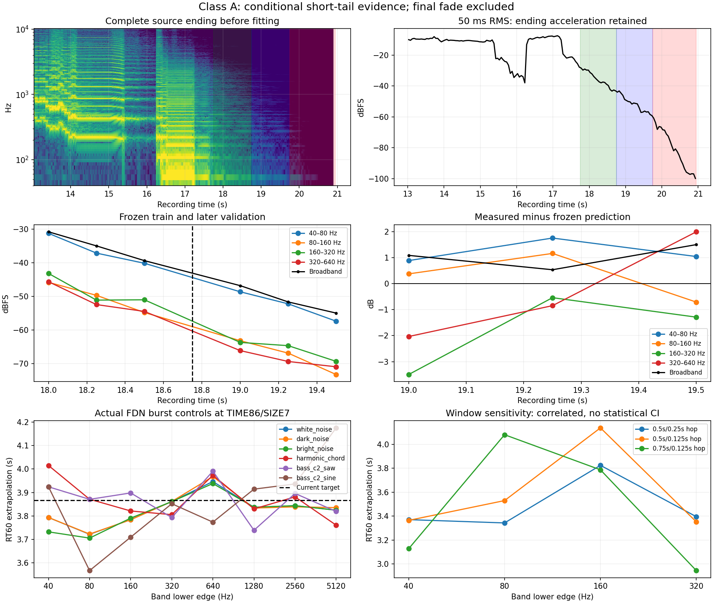

# Class A: a second, weaker conditional reverb decay observation

**Class A’s retained tail has an effective broadband decay of about 3.4–3.6 seconds, conditional on the recording and the published TIME 86 / SIZE 7 patch.** The current engine targets 3.866 seconds at those settings. The recording is too short, too concentrated in one low octave, and too close to a visibly accelerating ending to establish a precise intrinsic reverb-time anchor. This does not repeat Cotton’s longer-than-model direction and does not support globally lengthening the reverb.

No DSP, preset, raw control mapping, reverb amount or reconstruction was changed. The source interval selection, fits, final six-control run and report numerics were completed before the parent disclosed the Class A gain-validation summary; no candidate render or score file was read. These are complete-original-recording measurements, separate from the opening performance reconstruction.

## Source and interval freeze

The [unscored opening inventory](reverb-reference-openings-2026-09-15.md) identifies the original [Roland Class A MP3](https://www.rolandus.com/go/sh-201_patches/mp3/LEAD/TOP8_ClassA.mp3) and [published LEAD bank](https://www.rolandus.com/go/sh-201_patches/shl/SH-201_Patch_LEAD.zip). The analysis verifies both the original MP3 and unchanged complete SysEx hashes, freshly decodes the MP3 without normalization, and uses the frozen native reader to decode the exact reverb block again for the engine controls.

| Input | SHA-256 |
|---|---|
| Original MP3 | `88dc73e66c854e6ea57d976a96cd884dddb85275d56f73719000806f1609b886` |
| Unchanged published complete SysEx | `5ac5ab7f052f6f17c48cc342bf4493ee5919572fc66dabf7daaddd25178b95e9` |

The reverb block is `86,10,7,19,127,127,19,36,0,36`: TIME 86, SIZE 7, pre-delay 1 ms, HIGH CUT 12.5 kHz, maximum density/diffusion, LF/HF damping gains both 0 dB. The active Upper has AMP release 0, reverb send 48 and delay send 24; decoded delay feedback is +20%. Original MIDI gates and the exact raw patch revision used for the recording are not recovered. The matching published patch is evidence of intended settings, not authentication of the recorded state.

Before fitting, full-ending spectrogram and 50 ms RMS inspection showed a loud final excitation until about 17.24 s, a tail bump through about 17.55 s, and increasingly fast decline after about 19.7 s. We then froze:

- Training: **17.75–18.75 s**.
- Validation: **18.75–19.75 s**, with slope and intercept frozen from training.
- Excluded ending: **19.75 s to the 20.9502 s file end**, retained as a fade/noise diagnostic.

Primary windows are 500 ms long with 250 ms hops: three overlapping windows per interval, with disjoint training/validation sample supports. Fixed sensitivity windows are 500 ms / 125 ms hop and 750 ms / 125 ms hop. These overlapping estimates are correlated and provide no statistical confidence interval. Each spectral window contains at least 22,050 samples at the original 44.1 kHz rate.

The analysis uses full-rate Hann FFT energy in octaves from 40–80 Hz through 5120–10240 Hz, plus unwindowed stereo RMS. The 40–80 Hz band was declared before fitting because the inspection showed a strong ridge near 65 Hz. A band is eligible only if it supplies at least 1% of total Hann spectral power in every primary hardware training window. No model result selects this mask.

## Frozen-fit result

| Window / hop | Training-derived RT60 | Later RMS error | Maximum later error |
|---|---:|---:|---:|
| 500 / 250 ms, primary | 3.500 s | 1.116 dB | 1.503 dB |
| 500 / 125 ms | 3.405 s | 1.512 dB | 2.069 dB |
| 750 / 125 ms | 3.581 s | 0.398 dB | 0.639 dB |

The primary slope is −17.1451 dB/s. Its three later residuals, measured minus prediction, are **+1.089, +0.536 and +1.503 dB**. Training residuals stay within 0.064 dB, but the longer-horizon errors are material relative to the proposed model correction. The primary retained window centers span only 24.18 dB; RT60 is extrapolated, not a measured complete 60 dB decay. All retained primary windows pass the −65 dBFS broadband guard.

Left/right primary extrapolations are 3.492 / 3.511 s. Applying the earlier fixed right-channel −0.6 dB diagnostic changes the broadband primary result to 3.499 s; across window choices it gives 3.412–3.596 s. Constant channel/capture gain has little effect here.

| Eligible band | Primary RT60 | Later RMS error | Range across fixed windows |
|---|---:|---:|---:|
| 40–80 Hz | 3.370 s | 1.286 dB | 3.127–3.370 s |
| 80–160 Hz | 3.343 s | 0.817 dB | 3.343–4.080 s |
| 160–320 Hz | 3.824 s | 2.173 dB | 3.787–4.138 s |
| 320–640 Hz | 3.395 s | 1.716 dB | 2.944–3.395 s |

**The 40–80 Hz octave supplies 81–86% of training spectral power.** Broadband therefore largely tracks one bass region; it is not an independent average of many similarly decaying bands. Weak bands remain in the JSON, including the high-frequency noise-limited estimates, but are not accepted as anchors.

The excluded 500 ms windows starting at 19.75 / 20.00 / 20.25 s lie −1.28 / −3.79 / −10.33 dB below the frozen primary prediction. Their RMS levels are −66.35 / −73.15 / −83.97 dBFS and all fail the guard. This supports excluding the accelerated ending; it does not prove an editor applied a fade, or prove an earlier smooth fade was absent.

## Actual-engine controls

The tool freezes all DSP files and the complete-patch reader at `b0f6c03`. It renders through the actual engine, input/output circuits and reverb route at the exact native-decoded Class A reverb settings. The current target is

`0.15 * (10 / 0.15)^(86 / 127) * (0.5 + 7 / 7) = 3.866075 s`.

Deterministic 200 ms external-input bursts excite the network; delay is off and the voice remains held with zero subsequent input. Measurements begin 1.25 s after stimulus start, adding the known 93-sample renderer/output delay once. Training and validation use the same one-second supports as the hardware test. These noise-free float controls may fall below the hardware −65 dBFS guard; that guard is not a numerical floor for synthetic audio.

| Excitation | Primary RT60 | Later RMS error |
|---|---:|---:|
| White noise | 3.871 s | 0.007 dB |
| Dark noise | 3.817 s | 0.207 dB |
| Bright noise | 3.875 s | 0.024 dB |
| C3–E3–G3 harmonic chord | 3.893 s | 0.044 dB |
| C2 harmonic saw | 3.848 s | 0.106 dB |
| C2 sine | 3.842 s | 0.211 dB |

The last two controls were added after the first frozen fit revealed the hardware’s low-octave dominance. They test narrow-band excitation bias without changing any hardware fit, interval, model setting or original control. C2 is a nearby diagnostic pitch, not recovered original MIDI.

Across all six excitations and fixed windows, the known-model broadband result spans **3.740–4.237 s**. In particular, the 750 ms C2-sine estimate reaches 4.237 s with 1.609 dB later error despite the unchanged 3.866 s target. Individual control-band estimates span 3.365–4.189 s. The estimator works well on the primary broadband controls, but short, modal tails can produce meaningful slope and prediction bias.

## What this identifies

This establishes a second **conditional observed decay**, around 3.4–3.6 s for the retained Class A recording, with its intended TIME 86 / SIZE 7 settings pinned. It does not isolate an intrinsic RT60 to that precision. The unknown recorded revision, unknown final gates, active delay feeding the tail, finite modal beating, and possible capture fade remain relevant. A smooth recording fade could shorten a 3.866 s intrinsic tail; the data cannot separate that possibility from a reverb difference.

Compared with [Cotton’s stronger 8.2–8.5 s observation at TIME 104](cotton-reverb-decay-2026-09-15.md), Class A is useful contrary evidence against a universal multiplicative increase in reverb time. It warrants retaining a bounded diagnostic point, not fitting the global raw-control law or selecting a production parameter change.



## Reproduction

The [analysis tool](../../../Tools/analyze_class_a_reverb_decay.py) uses only the source inventory, pinned originals, and frozen engine source. It reads no reconstruction or gain candidate results. First regenerate the unchanged complete patches with the opening-inventory command if required; then run:

```sh
OPENBLAS_NUM_THREADS=1 python3 Tools/analyze_class_a_reverb_decay.py \
  --sources build-fidelity/hardware-benchmark/sources \
  --patch build-fidelity/reverb-reference-expansion/run-02/lead-01/original-patch.syx \
  --output build-fidelity/hardware-benchmark/class-a-decay/reproduction
```

The recorded final run is `class-a-decay/run-02`. The [durable JSON](class-a-reverb-decay-2026-09-15.json) contains every window, all rejected bands, the original MP3/SysEx and decoder hashes, full frozen-source hashes, generated native fixture and binary hashes, native reverb parameters, and control audio hashes. Run 02 preserves all hardware and original-four-control numerics from run 01 and adds only the two declared bass excitation diagnostics. Equivalence remains unestablished.
