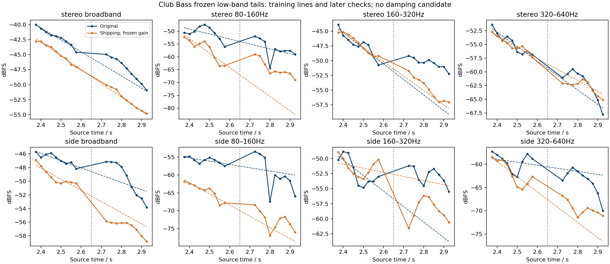

# Club Bass: conditional low-band tail comparison

**A constant output gain cannot remove the current tail mismatch, but these
short intervals do not identify a unique frequency-dependent decay law.**
All measurements retain the original six-note reconstruction and preset.
No damping candidate or DSP change was made.

The [protocol](club-reverb-decay-protocol-2026-09-15.json) was frozen before
slopes, model-tail measurements and control renders. It inherits the
[source-only tail supports](damped-reverb-tail-feasibility-2026-09-15.md):
training 2.30–2.65 s, later check 2.65–3.00 s, plus the retained 3.00–3.25 s
diagnostic. The existing production-prefix lag **232 samples** and gain
**1.8256797473972683** were reused exactly; neither was refitted.

The shipping WAV is byte-identical to the previously frozen half-return
candidate (`7450ab25…2670ddd`). Original audio, SysEx, MIDI, render receipt,
source files and compiled control fixtures are pinned in the
[measurement receipt](club-reverb-decay-2026-09-15.json).

## Results that survive window changes

Measurements use fixed 80–160, 160–320 and 320–640 Hz bands, whole stereo and
side, with 150 ms Hann windows / 25 ms hop. The unchanged 100/200 ms window
sensitivities retain all rows. These overlapping observations are not
independent trials; no confidence interval is inferred.

The difference between mean shipping-minus-hardware level in the check and
training supports is invariant to any additional constant gain:

| Channel / band | Primary change | Range across all three windows |
| --- | --- | --- |
| Stereo broadband | −2.31 dB | −2.42 to −2.31 dB |
| Side broadband | −4.41 dB | −4.58 to −4.41 dB |
| Stereo 160–320 Hz | −4.51 dB | −4.56 to −4.05 dB |
| Stereo 320–640 Hz | −0.23 dB | −0.59 to −0.12 dB |

The current output therefore grows quieter relative to the recording over
these supports, with differing changes by band and channel. This establishes
a conditional temporal/profile mismatch, not its cause. Initial modal state,
unknown original articulation, send behavior and capture processing remain
possible explanations.

## Why fitted slopes are not a calibration

Training-only linear dB slopes and later prediction errors, primary windows:

| Channel / band | Hardware / shipping slope, dB/s | Hardware / shipping later RMSE, dB |
| --- | --- | --- |
| Stereo broadband | −19.97 / −22.90 | 1.68 / 0.33 |
| Stereo 80–160 Hz | −19.36 / −56.26 | 3.09 / 12.36 |
| Stereo 160–320 Hz | −26.35 / −24.39 | 6.12 / 0.98 |
| Stereo 320–640 Hz | −26.28 / −20.08 | 2.21 / 1.14 |
| Side broadband | −10.58 / −16.37 | 1.91 / 1.79 |
| Side 160–320 Hz | −25.84 / −6.87 | 8.41 / 5.10 |

Several straight-line predictions fail materially in the later support.
Hardware side 160–320 Hz training slopes range from −15.38 to −36.16 dB/s
across the fixed windows; side 320–640 Hz ranges from −4.94 to −16.37 dB/s.
No reciprocal slope is promoted to a hardware reverberation time. All
hardware/shipping band fits pass the frozen level and relative-power guards,
so those instabilities cannot simply be removed as missing coverage.



## Actual-engine controls and shelf scale

Four deterministic 200 ms Hann-shaped bursts—white noise, dark noise, D2
harmonics and D2 sine—passed through the actual shipping engine with the
**exact native-decoded Club reverb block**. Other voice settings only route
known external input with delay off and filter bypass. Source files were
copied after checking the shipping integration hashes. EXT-IN includes the
current 3.4 Hz input high-pass and initial monitor/input slews, so these are
full-engine burst controls, not bare FDN impulses. The fixed 93-sample
engine/output latency is applied once to controls; it is not added to the
already fitted 232-sample music alignment.

Early controls use the same operational post-gate ages as the music:
0.29–0.64 / 0.64–0.99 s after a burst ending at 0.20 s. A fixed FDN produces
large apparent early slope changes without any parameter change:

- White-noise side 80–160 Hz: **−14.11 to +7.52 dB/s** across windows.
- Harmonic-burst side 160–320 Hz: **−9.53 to +5.95 dB/s**.
- Harmonic-burst stereo 80–160 Hz: **−45.93 to −25.34 dB/s**.

These populated early bands pass the coverage guards. They demonstrate
modal/excitation bias in this measurement, rather than positive physical
damping. Settled control supports 1.20–2.20 / 2.20–3.20 s are retained, but
every settled band fit reaches below the predeclared −120 dBFS level guard.
They are not accepted stationary reference slopes. The D2-sine control also
flags weak non-fundamental bands; these failures remain in the receipt.

A planted −20 dB/s exponential with known populated harmonics gives maximum
band-slope error **0.00615 dB/s**. Scaling the actual shipping WAV by 0.5
changes slopes by at most **1.39×10⁻¹³ dB/s**, while shifting intercepts by
−6.0206 dB. Thus the arithmetic detects a simple exponential and preserves
the expected constant-gain invariance; the engine-tail instability is not hidden by
those controls.

The actual current HF shelf impulse response gives these **single-pass
engine attenuations**, with the Club setting −36 dB / 4 kHz:

| Frequency | Attenuation per pass |
| --- | --- |
| 80 Hz | −0.00164 dB |
| 160 Hz | −0.00657 dB |
| 320 Hz | −0.02623 dB |
| 640 Hz | −0.10407 dB |

Eligible bands are far below the corner. Small losses can accumulate in a
feedback network, but this table does not identify the hardware topology or
attribute the discrepancy to HF damping. The manual documents control units;
per-loop shelf placement remains an assumption. Above-corner source coverage
was insufficient in the preceding feasibility audit.

An independent code review found no consequential normalization, support,
source or latency error, and retained the EXT-IN qualification above.

## Reproduction

[analyze_club_reverb_decay.py](../../../Tools/analyze_club_reverb_decay.py)
checks frozen identities, compiles only isolated control fixtures and writes
full window arrays, failed guards, fits and control hashes:

```sh
OPENBLAS_NUM_THREADS=1 VECLIB_MAXIMUM_THREADS=1 python3 Tools/analyze_club_reverb_decay.py --protocol Docs/fidelity/source-audits/club-reverb-decay-protocol-2026-09-15.json --output build-fidelity/club-reverb-decay/reproduce-01
```

This is a targeted follow-up to the prior envelope counterexample. It does
not recover original MIDI, authenticate the complete recorded signal path,
identify a damping law, or establish hardware equivalence.
