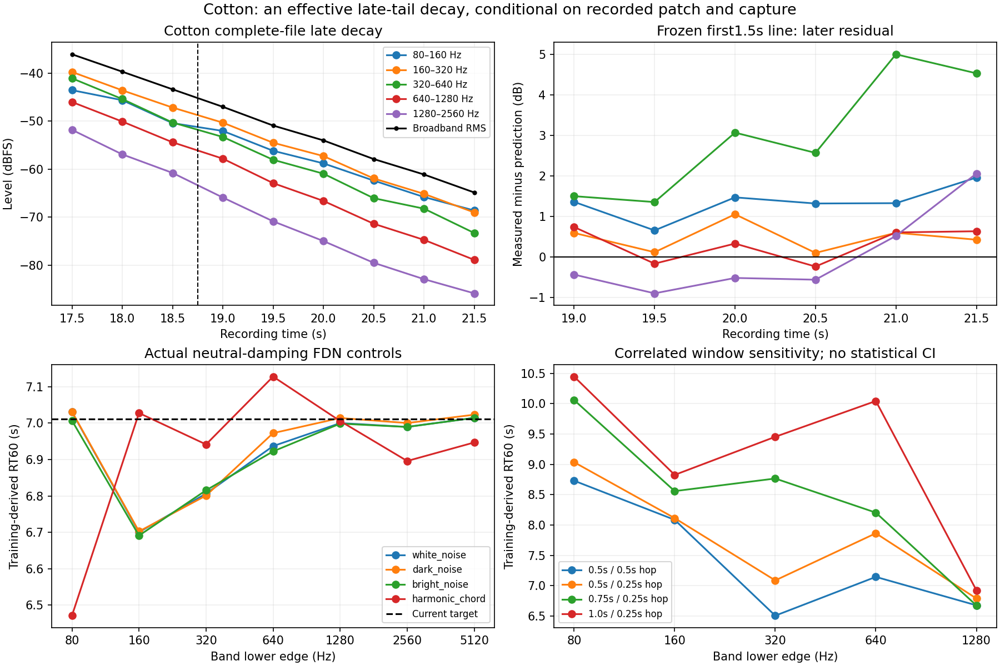

# Cotton's late tail supplies a conditional broadband decay anchor

**The retained hardware tail has an effective broadband RT60 of about 8.2–8.5 seconds.** A line fitted only to 17.25–18.75 s predicts the following three seconds within 0.50 dB. Forward controls using the current engine and Cotton's exact published neutral-damping reverb settings recover approximately 7.0 s, matching the current 7.01095 s target. The estimator does not invent the slower hardware decay.

This is sufficient for one **conditional effective broadband anchor associated with published TIME=104 / SIZE=7**. It is not an authenticated hardware control-law point: the recorded raw patch revision, continuing excitation and capture processing remain unknown. Per-band slopes are less stable, and no DSP or raw-control mapping is changed.

[Reproducible tool](../../../Tools/analyze_cotton_reverb_decay.py), [full data](cotton-reverb-decay-2026-09-15.json).

## Source, timing and frozen protocol

The original official [Cotton Wool MP3](https://www.rolandus.com/go/sh-201_patches/mp3/PAD/TOP8_Cotton_Wool.mp3) has SHA-256 `abf9d3ad400119ab0546fd724ab7a7442ea724bb164f8e9d024c642c791a1379`. The tool verifies this original and freshly decodes it without resampling or gain changes. It also verifies the unchanged published SysEx against the existing stereo-audit receipt. Original source/patch, decoder, decoded audio, tool, frozen DSP and control binary hashes are retained.

The [complete-tail inspection](official-reverb-tails-2026-09-15.md) placed the last obvious strong excitation before 16.20 s. These are coarse audio observations, not recovered MIDI gates. The present analysis keeps its declared primary range:

- **Training:** 17.25–18.75 s, three nonoverlapping 0.5 s windows.
- **Frozen evaluation:** 18.75–21.75 s, six additional 0.5 s windows. No slope or intercept is refitted there.
- **Excluded sensitivity:** 21.75–22.25 s has broadband RMS −68.26 dBFS and fails the existing −65 dBFS level guard. The edited final drop is not fitted.

Broadband level is ordinary stereo RMS. Each frequency-band measurement uses a full-rate, 22,050-sample Hann FFT, energy normalization and correct one-sided Parseval weighting. Octave edges are 80, 160, 320, 640, 1280, 2560, 5120 and 10240 Hz. A band is eligible for interpretation only if it carries at least 1% of full spectral power in **each hardware training window**; all other bands remain visible as diagnostics. This training criterion does not authenticate the noise floor of very weak late bands.

The fitted model is `level_dB = intercept + slope * elapsed_seconds`, with extrapolated `RT60 = -60/slope`. The observed window centers cover approximately 29 dB of decay, not a complete measured 60 dB drop. Constant capture gain and latency alter the intercept, not the slope.

## Broadband result and uncertainty

The primary slope is **−7.30265 dB/s**, giving **RT60=8.21620 s**. Training residuals are at most 0.016 dB. Frozen evaluation error is **0.307 dB RMS**, with maximum absolute error **0.498 dB**. Later measured levels range from −0.253 to +0.498 dB relative to the frozen prediction.

| Window length / hop | Training-derived RT60 | Frozen evaluation RMS error |
|---|---:|---:|
| 0.5 s / 0.5 s, primary | 8.216 s | 0.307 dB |
| 0.5 s / 0.25 s | 8.431 s | 0.308 dB |
| 0.75 s / 0.25 s | 8.492 s | 0.414 dB |
| 1.0 s / 0.25 s | 8.237 s | 0.202 dB |

Every sensitivity window remains entirely inside training or evaluation. These overlapping windows are correlated, and longer windows reduce the span between training centers. Their spread is **measurement sensitivity, not a statistical confidence interval**; no setting is selected afterward.

The left/right primary RT60 estimates are 8.352/8.119 s. Applying the previously declared fixed right-channel −0.6 dB sensitivity changes the combined primary estimate to 8.224 s; the complete sensitivity range becomes 8.224–8.510 s. The approximate 8.2–8.5 s broadband conclusion is stable to these choices.

## Bands do not justify one universal RT60

| Eligible band | Primary RT60 | Frozen evaluation RMS error | RT60 range across window specifications |
|---|---:|---:|---:|
| 80–160 Hz | 8.731 s | 1.405 dB | 8.731–10.447 s |
| 160–320 Hz | 8.087 s | 0.584 dB | 8.087–8.827 s |
| 320–640 Hz | 6.508 s | 3.309 dB | 6.508–9.455 s |
| 640–1280 Hz | 7.147 s | 0.504 dB | 7.147–10.044 s |
| 1280–2560 Hz | 6.678 s | 1.006 dB | 6.676–6.926 s |

The 320–640 Hz band becomes up to about 5 dB louder than the frozen line predicts. Several low/middle-band slope estimates change markedly with window length. Beating between reverberant modes, the excitation spectrum, spectral redistribution, remaining source release and low-level processing can affect these short fits. Higher bands fail the initial energy-fraction criterion and are not used as hardware anchors. A stable broadband envelope does not establish identical decay in every band or identify the hardware damping topology.

## Forward controls through the actual FDN

The tool snapshots the unmodified DSP at `b0f6c03`, compiles a small Engine renderer, and decodes the complete published patch with the native SysEx codec. Cotton's reverb block is:

| Control | Decoded value |
|---|---:|
| TIME / SIZE | 104 / 7 |
| PRE DELAY | raw 125, 100 ms |
| HIGH CUT | index 19, 12.5 kHz |
| DENSITY / DIFFUSION | 127 / 127 |
| LF / HF damping frequency indices | 19 / 0, both 4 kHz |
| LF / HF damping gains | 0 / 0 dB, already neutral |

The current mapping gives `0.15*(10/0.15)^(104/127)*1.5 = 7.010953 s`. The control preserves the exact reverb block and supplies four deterministic 200 ms Hann-shaped ExtIn bursts: white noise, darker noise, brighter noise and a C3/E3/G3 harmonic chord. Delay is off. No reverb coefficient is fitted or changed. All renders remain below the output limiter.

Analysis starts at stimulus time 1.25 s, more than one second after the burst ends, with the known 93-sample engine latency added once. The corresponding first 1.5 s trains the line and the following three seconds evaluate it. These are forward controls, not a reconstruction of the recorded final chord.

| Excitation | Primary broadband RT60 | Frozen evaluation RMS error |
|---|---:|---:|
| White noise | 6.999 s | 0.035 dB |
| Darker noise | 6.997 s | 0.025 dB |
| Brighter noise | 6.999 s | 0.038 dB |
| Harmonic chord | 6.983 s | 0.170 dB |

Across all four window specifications and excitations, broadband estimates span 6.953–7.036 s. Individual control bands also show finite-window/modal bias: primary band estimates span 6.471–7.128 s. Thus the broadband control recovers the known target closely while demonstrating why narrow-band fit precision should not be overstated.



## Fade interpretation and decision

The retained broadband range does **not** show the accelerated ending seen in Air: its frozen later error remains below 0.5 dB and tends slightly positive near the end. The visibly edited low-level ending remains excluded.

A smooth exponential recording fade would add a constant negative dB/s slope, making it indistinguishable from intrinsic exponential decay in this one recording. An ordinary monotonic fade-out would shorten apparent decay; by itself it cannot turn the current isolated 7.0 s control into the slower observed 8.2 s tail. That inference assumes excitation has ended and does not rule out continuing release, different recorded controls or other capture processing.

**Keep 8.2–8.5 s as an experimental effective broadband constraint for the published Cotton TIME=104 / SIZE=7 recipe.** Do not use it to fit a global raw-time law, assign a universal per-band RT60, or claim an original hardware match. Additional authenticated settings or recordings are needed before production calibration.

## Reproduce

```sh
python3 Tools/analyze_cotton_reverb_decay.py \
  --sources build-fidelity/hardware-benchmark/sources \
  --corpus build-fidelity/hardware-benchmark/final-production-linear-lfo \
  --output build-fidelity/hardware-benchmark/cotton-decay/replay
```

The output directory must be new. The command verifies the original inputs, writes the protocol before analysis, freshly decodes hardware, snapshots/compiles the native control and creates `results.json` plus `decay-analysis.png`. Tracked data and figure are from `run-02`. It corrects the unused near-Nyquist energy weight in odd-length FFT sensitivity windows and records the decoder identity; all fitted slopes, predictions and errors exactly match `run-01`.
