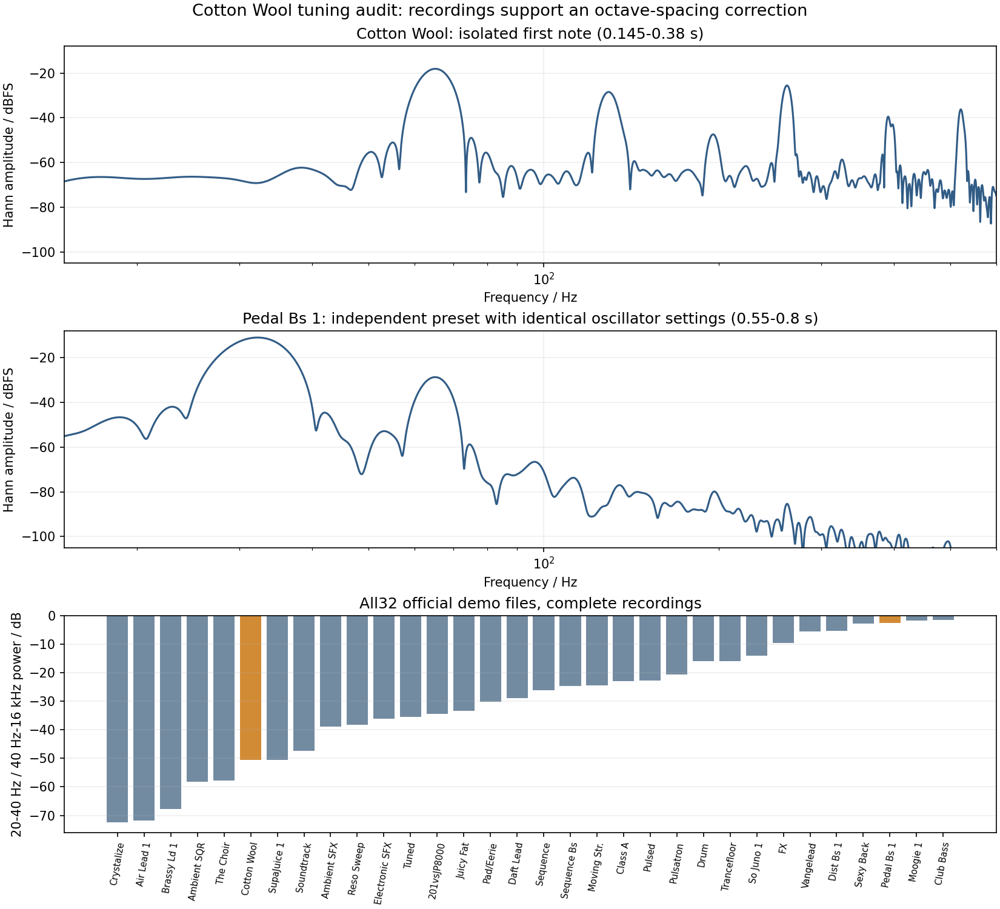

# Cotton Wool oscillator-spacing audit

2026-09-13. The strongest remaining Cotton Wool discrepancy is an oscillator
interval, not a demonstrated recording high-pass or relative oscillator gain.
The audio supports a low sine plus a Super Saw approximately one octave above
it. Literal interpretation of the published coarse values produces a
three-octave interval. Pedal Bs 1 independently supports the one-octave interval
with the same published oscillator settings.

## Evidence and limits

The [official Cotton Wool recording](https://www.rolandus.com/go/sh-201_patches/mp3/PAD/TOP8_Cotton_Wool.mp3)
has a strong low peak at about 65.15 Hz during its isolated first note
(0.145-0.380 s), consistent with C2 detuned by -7 cents. Strong higher peaks are
near 129.33, 262.06, 391.17 and 521.55 Hz: a stack based near C3. The intervening
third, fifth and seventh harmonics of the low peak are much weaker. Left and
right channels independently show this; mono cancellation is not responsible.
Repeated low C notes around 4.145, 8.145 and 12.145 s retain the 65.15 Hz peak.
Later windows contain prior-note/effect overlap, so their individual harmonic
amplitudes should not be treated as isolated oscillator measurements.

The sustained chord at 2.80-3.35 s has low peaks around 155, 174 and 219 Hz,
with higher stacks around 311, 349 and 440 Hz. This motivates raising the
current reconstructed note numbers by 12 semitones, assigning the lower peaks
to the sine and the higher stacks to Super Saw. Original MIDI, gates and
velocities remain unverified.

[Pedal Bs 1](https://www.rolandus.com/go/sh-201_patches/mp3/BASS/TOP8_PedalBs1.mp3)
uses the same published oscillator setup: Super Saw coarse 0/spread 41 plus
sine signed coarse -36/fine -7, both WIDE off, center balance. Its recording
has low/upper peak pairs approximately 32.22/65.06 Hz (0.55-0.80 s),
38.44/77.76 Hz (1.15-1.40 s) and 57.83/116.83 Hz (3.65-3.85 s).
Glide, short windows and detuning limit exact frequency estimates, but these
are near octave pairs, not three-octave pairs.

The corpus scan covers all 32 hash-verified official demos. Cotton's complete
recording has 20-40 Hz power about 50.5 dB below its 40 Hz-16 kHz power, while
Moogie 1, Pedal Bs 1 and Club Bass are within about 3 dB. Several recordings
retain substantial 20-30 Hz power. This gives no basis for adding one common
steep high-pass to fit Cotton. It does not prove that any recording is
unprocessed or establish a recording-chain transfer function.

## Correction to the prior documentation inference

The [MIDI Implementation, p. 5](https://static.roland.com/assets/media/pdf/SH-201_MI.pdf)
lists raw coarse 28-100 and displayed -36 to +36, with WIDE as a separate
switch; it does not specify its interaction with physical pitch units.
The [Owner's Manual, pp. 29 and 60](https://static.roland.com/assets/media/pdf/SH-201_OM.pdf)
says WIDE changes the knob range from one to three octaves and describes
semitone steps. Page 60 explicitly identifies listed values as Editor display
values. The Editor XML binds coarse to raw-minus-64 but does not prove the
DSP conversion. The earlier claim that these resources rule out
WIDE-dependent scaling was too strong.

Normal raw endpoints mapping to +/-12 semitones, and wide endpoints to +/-36,
fit these recordings and the documented knob ranges. Exact interior
quantization is not established by Cotton or Pedal. The broad polyphonic
Soundtrack recording inspected here did not resolve nearest-integer versus
another quantization table.

## Explicit diagnostic render

Before the codec correction, a diagnostic used the unchanged literal renderer,
raised all 27 reconstructed Cotton notes by 12, and changed only OSC2 coarse
raw 28 to 52 (-36 to -12 in that renderer). This is a **modified preset and
reconstructed MIDI**, not original-patch playback. No EQ, level fitting,
velocity fitting or gate changes were used. Original and diagnostic hashes,
the renderer hash and exact modifications are retained in the JSON.

| First five seconds | 20-40 Hz / 40 Hz-16 kHz power | Power centroid |
|---|---:|---:|
| Official audio | -50.75 dB | 316.3 Hz |
| Production before tuning correction | +6.00 dB | 74.6 Hz |
| Reconstructed notes +12 only | -1.79 dB | 100.6 Hz |
| Notes +12 and diagnostic one-octave oscillator interval | -39.08 dB | 188.4 Hz |

The octave interpretation explains most of the excess sub-bass without a gain
or EQ correction. It does not eliminate the remaining spectral difference.
Ratios use Welch 65536; centroids use Welch 8192 for compatibility with existing
comparisons. Both average channel power. These results are conditional on the
reconstruction and do not establish the correct Super Saw normalization.



Reproduce the recording audit with:

```sh
python3 Tools/analyze_cotton_tuning.py \
  --sources build-fidelity/hardware-benchmark/sources \
  --comparison build-fidelity/hardware-benchmark/filter-implementation/after/cotton-wool \
  --output /tmp/cotton-tuning-audit
```

The optional `--diagnostics` directory adds the two pre-correction diagnostic
WAVs and their `diagnostic-provenance.json`. Those session artifacts are at
`/tmp/septum-hw-benchmark/cotton-residual-audit`; the persisted
[audit JSON](cotton-tuning-audit.json) contains measurements, source URLs and
hashes, not third-party PCM or patch payloads.
