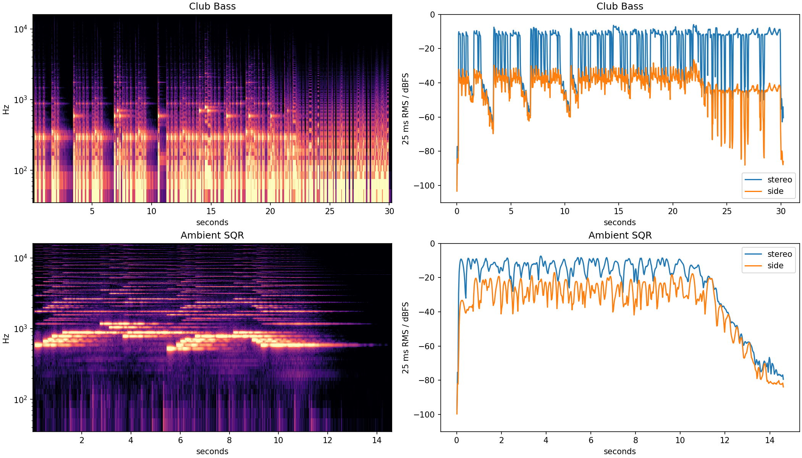
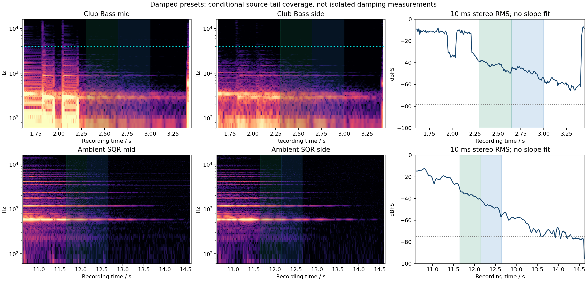

# Club Bass and Ambient SQR: damped-tail feasibility

**Neither selected late tail provides a direct HF-damping anchor above its
4 kHz corner.** Club Bass supplies useful lower-frequency reverb-tail checks;
Ambient SQR supplies a lower-frequency combined-effects check. No decay slope,
T60, shelf coefficient or candidate DSP was fitted.

This research follows the known Club/Ambient envelope regressions from the
reverb-return experiments. Preset selection is therefore a targeted follow-up,
not an independent generalization test. All tail intervals were frozen from the
complete original recordings before band measurements. The [support receipt](damped-reverb-tail-support-2026-09-15.json)
retains that chronology, and the [full audit](damped-reverb-tail-feasibility-2026-09-15.json)
retains sources, exact preset bytes, decoder hashes and every measured band.

## What the manual actually establishes

Printed p.63 specifies both LF/HF DAMP GAIN as **−36 to 0 dB**. The HF wording is:
“Adjusts the amount of damping applied to the high-frequency range.”
The LF wording substitutes the low-frequency range. Their frequency controls
separate the low/high ranges being reduced; HIGH CUT is a separate treble
control. This documents user-facing units and direction, **not** a feedback
network, per-loop attenuation, shelf order, transition shape or conversion to
decay time. Applying the stated dB gain on every feedback pass remains a model
assumption. [Roland Owner’s Manual, p.63](https://static.roland.com/assets/media/pdf/SH-201_OM.pdf#page=63)

The cached PDF was text-read and visually checked. SHA256:
`b4a2968d429c7f3e907a6243723d5e803ae2e0014e8e9107c85bd966deea8e79`.

## Original controls and attribution

| Control | Club Bass | Ambient SQR |
| --- | --- | --- |
| Raw reverb TIME | 77 | 89 |
| SIZE / PRE DELAY | 8 / 1 ms | 8 / 1 ms |
| HIGH CUT | 12,500 Hz | 12,500 Hz |
| LF frequency / gain | 4,000 Hz / 0 dB | 4,000 Hz / 0 dB |
| HF frequency / gain | 4,000 Hz / −36 dB | 4,000 Hz / −8 dB |
| Reverb Upper / Lower sends | 50 / 0 | 43 / 112 |
| Delay switch / active sends | Off / none | On / 40, 40 |
| Delay feedback / HF DAMP | Inactive | +20% / 1,600 Hz |
| Upper / Lower AMP release raw | 0 / 0 | 30 / 22 |

Both presets layer two centered tones. Club's short stored releases, disabled
delay and sole Upper reverb send improve the attribution of an earlier gap to
reverb. Its driven Upper and cutoff LFO still determine the preceding spectrum.
Ambient has driven square oscillators above a slowly attacking sine layer, two
releases and active modulated delay. Its side channel does not isolate reverb
from that delay. Density/diffusion are 127 in both presets.

The [Club Bass source](https://www.rolandus.com/go/sh-201_patches/mp3/BASS/TOP8_ClubBass.mp3)
and [Ambient SQR source](https://www.rolandus.com/go/sh-201_patches/mp3/LEAD/TOP8_AmbientSQR.mp3)
are official named-preset recordings. That association does not authenticate
performance MIDI, controller state, capture processing or the exact recorded
preset revision. Original archive/member/SysEx bytes were verified anew.

## Frozen conditional supports

| Recording | Training | Later check | Retained additional checks |
| --- | --- | --- | --- |
| Club Bass | 2.30–2.65 s | 2.65–3.00 s | 3.00–3.30; 5.95–6.30 / 6.30–6.65; 9.68–10.03 / 10.03–10.38 s |
| Ambient SQR | 11.65–12.15 s | 12.15–12.65 s | 12.65–13.15 s; 13.80–14.55 s floor diagnostic |

Club has visible direct-level breaks around 2.19–2.23, 5.83–5.88 and
9.56–9.62 s, followed by decaying gaps. These brackets are not measured MIDI
note-offs. The later gaps are not exact waveform duplicates of the first
(best stereo cosine 0.724 and 0.399 in the declared searches), but this does
not establish independent performances. No alignment from this duplication
check enters the tail supports.

Club's final direct sound continues to roughly 29.94 s, leaving only about
0.3 s before the file ends. Its terminal side behavior differs substantially
from the earlier tails. Terminal digital zeros may include codec padding;
this is not proof of an edit or an FX-switch event. The final section is
unsuitable for a sustained decay check.

Ambient's late side signal has substantial repeated lobes. The full recording
shows no newly distinct pitch family within the frozen tail, but delayed
excitation and AMP release cannot be excluded. The near-floor ending is
retained only as a diagnostic. An undocumented smooth capture fade is not
ruled out for either recording.

## Source-only band coverage

Same-file opening quiet references are Club 0.03–0.14 s and Ambient
0.03–0.07 s, with stereo RMS −78.12 and −75.10 dBFS respectively. These short
intervals are empirical references, not stationary hardware-noise estimates.
The frozen coverage guard requires band power at least 20 dB above the
corresponding quiet band; no noise is subtracted.

| Side-channel band | Club training / check above quiet | Ambient training / check above quiet |
| --- | --- | --- |
| 640–1,280 Hz | 26.86 / 20.99 dB | 40.38 / 30.64 dB |
| 1,280–2,560 Hz | 12.22 / 5.23 dB | 34.10 / 22.47 dB |
| 2,560–4,000 Hz | 1.75 / −0.25 dB | 26.60 / 12.38 dB |
| 4,000–8,000 Hz | −0.07 / −0.27 dB | 13.89 / 4.36 dB |

Across **both intervals and all stereo/mid/side channels**, Club has common
coverage at 80–640 Hz; Ambient at 320–1,280 Hz. Ambient's 1,280–2,560 Hz
band clears the guard in stereo/side, but its later MID value is 19.60 dB and
is retained as a sensitivity. Above-corner bands fail in both cases. The
other Club gaps repeat the lack of useful above-4-kHz tail power.

These lower bands can challenge a proposed damping model's tail behavior.
They cannot measure the −36/−8 dB high-frequency asymptote or establish where
a damping shelf belongs. Directly dividing the two recordings would also
confound different TIME values, excitation spectra and delay routing.





## Reproduction and numerical check

[inspect_damped_reverb_tails.py](../../../Tools/inspect_damped_reverb_tails.py)
decodes the original offered MP3s to native 44.1 kHz stereo float32. It uses
fixed 1,024-sample Hann Welch spectra with 75% overlap and density integration,
without gain changes or candidate-dependent bands. A known sinusoid verified
integrated power 0.005, an exact planted 20 dB ratio, and exact mid/side
cancellation for identical/opposite channels.

```sh
OPENBLAS_NUM_THREADS=1 VECLIB_MAXIMUM_THREADS=1 python3 Tools/inspect_damped_reverb_tails.py --sources build-fidelity/hardware-benchmark/sources --support Docs/fidelity/source-audits/damped-reverb-tail-support-2026-09-15.json --output build-fidelity/reverb-damped-tail-feasibility/reproduce-01
```

A subsequent hypothesis must keep these supports and failure flags, model the
possible release/delay contributions, and use held-out intervals. This audit
neither selects a damping law nor changes DSP.
