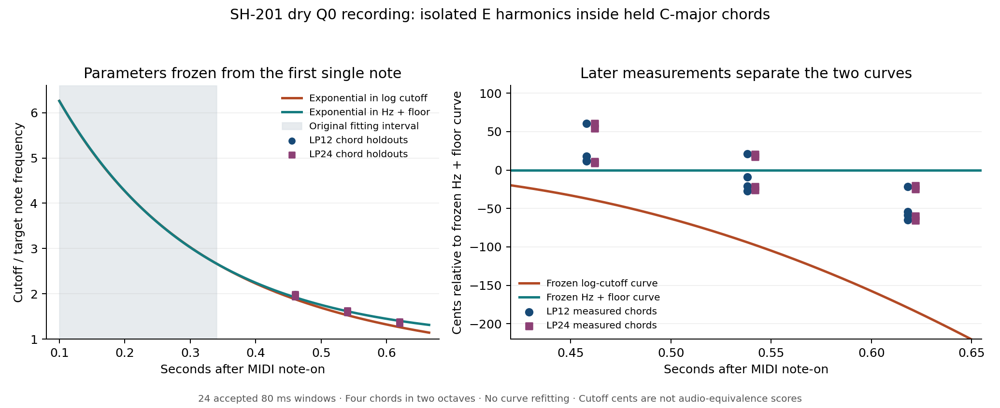

# Longer chords distinguish the frozen cutoff curves

**Late, independently measured chord harmonics favor the previously fitted
exponential-in-Hz trajectory toward a floor.** Its cutoff error is about
38 cents, versus 100–107 cents for the previously fitted exponential in
logarithmic cutoff. No curve parameters were refitted. This distinguishes
these two effective trajectories for the published dry recipe; it does not
identify a universal Roland envelope-control law. No DSP was changed.



## Original MIDI extends the observation interval

The [owner's filter comparison](https://www.deepsonic.ch/deep/htm/deepsonic_analytics_filter_comparison.php)
supplies original MIDI, LP12/LP24 Q0 recordings, and a dry single-saw recipe
with equal octave key tracking. Its isolated notes last no more than 0.4375 s,
but several three-note chords remain held for 0.6875 s.

The original MIDI explicitly confirms the simultaneous note-ons, velocity
127, and simultaneous velocity-zero note-offs for these selected chords:

| Onset | MIDI notes | Third selected for analysis |
| --- | --- | --- |
| 22.00, 28.00 s | 60 / 64 / 67, C major | E4, MIDI 64 |
| 22.75, 28.75 s | 48 / 52 / 55, C major | E3, MIDI 52 |
| 24.00 s | 60 / 65 / 69, F major | A4, MIDI 69 |
| 24.75 s | 48 / 53 / 57, F major | A3, MIDI 57 |
| 26.75 s | 50 / 55 / 59, G major | B3, MIDI 59 |

The tool verifies both original MP3 hashes and the MIDI hash against the
[acquisition catalog](deepsonic-acquisition-2026-09-15.json), then decodes the
originals into a fresh output directory. Every window is centered 0.46, 0.54
or 0.62 s after MIDI onset, with 80 ms primary width and 60/100 ms sensitivity
widths. The latest window ends before the original note-off. There are no
free per-note tuning, timing, EQ or curve adjustments.

## Separate the target from colliding chord partials

All three notes' harmonics below 8 kHz are included in one joint quadrature
fit, each component also having independent local linear amplitude ramps.
Adjacent partials closer than `1.5 / window width` Hz form a single nuisance
cluster at their mean frequency. **Any target partial in a multi-partial
cluster is excluded from target measurements.** This includes the almost
coincident C/G partials and, for example, E4 H4 near C4 H5.

Target H1, H2 and H3 must each remain separate, exceed a 20 dB coefficient
noise proxy, and place H2/H3 above −45 dB relative to H1. The matrix condition
number must be at most 100 and unexplained signal power at most 1%. The noise
proxy assumes white residuals; the independent engine and width controls
below also check structured leakage that the proxy alone cannot exclude.

Only H2/H1 and H3/H1 select one nuisance cutoff per window, using the established
Q0 damping 1.2 per two-pole section. Where usable, separate H5–H8 are held out.
Cutoff-response sensitivity must exceed 1 dB per octave of cutoff change;
a flat passband otherwise gives misleadingly precise amplitude estimates but
poorly determined cutoff.

Both C-major octaves pass. F/G chord thirds are rejected because their H3
collides with another note's partial. At the primary width, all **24 C-major
windows** have condition numbers at most 3.63, unexplained power at most
0.0206%, and required-harmonic noise proxies at least 28.95 dB. Across all
widths, cutoff-response sensitivity is at least 9.06 dB/octave.

The H2/H3 response-fit RMSE is 0.036 dB for LP12 and 0.061 dB for LP24.
LP12's 21 withheld harmonic observations have RMSE 0.190 dB. LP24 supplies
no eligible upper harmonics at these late cutoffs, so it does not have that
additional spectral validation. Its two independently measured low harmonics
and the synthetic control remain the available checks.

## Frozen predictions and held-out results

The [earlier single-note experiment](deepsonic-envelope-shape-2026-09-15.md)
fitted both models using only MIDI 36 at 1.5 s and offsets 0.10/0.18/0.26/0.34 s.
The full parameters are read unchanged from its tracked measurement record:

```text
Exponential in Hz:
r(t) = 0.9318832715 + 8.4984344071 exp(-t / 0.2140763348)

Exponential in logarithmic cutoff:
ln r(t) = -1.8394276531 + 4.1015196988 exp(-t / 0.9079432701)

r = cutoff / target note frequency; t = seconds after MIDI note-on
```

| Late time | Measured cutoff / f0 range, both slopes | Frozen Hz prediction | Frozen log-cutoff prediction |
| --- | ---: | ---: | ---: |
| 0.46 s | 1.933–1.992 | 1.923 | 1.881 |
| 0.54 s | 1.589–1.634 | 1.614 | 1.527 |
| 0.62 s | 1.349–1.385 | 1.401 | 1.262 |

| Window width | LP12 Hz-curve RMSE | LP12 log-curve RMSE | LP24 Hz-curve RMSE | LP24 log-curve RMSE |
| --- | ---: | ---: | ---: | ---: |
| 60 ms | 38.63 cents | 97.72 cents | 41.48 cents | 102.60 cents |
| 80 ms | 37.69 cents | 99.94 cents | 38.30 cents | 107.37 cents |
| 100 ms | 37.88 cents | 102.29 cents | 36.12 cents | 111.05 cents |

The Hz curve wins for each of the four accepted chord onsets individually,
both slopes, and all three widths. These are cents of **cutoff**, not note
pitch or an overall audio-equivalence score. The remaining error and repeated
chord variation are retained; there is no additional alignment to remove them.

## Independent polyphonic engine control

A separate C++ fixture renders the actual engine with known damping `[1.2,1.2]`,
the same seven chord shapes, and isolated versions of their target thirds.
It uses one saw, key follow 100, cutoff 34, envelope depth 21, decay 63,
zero attack, AMP level 50, velocity 127, and no effects/LFO/velocity response.
Moving sustain is zero; stationary controls sustain at 127. Chords last one
second with one-second gaps, leaving every analyzed window inside its gate.
The 93-sample engine latency is included. Known calibration values are supplied
explicitly through the public API; no audio is generated from the estimator.

For the moving controls, joint-chord cutoff estimates agree with independent
isolated-target estimates at 80 ms width:

| Slope | Polyphonic versus isolated cutoff RMSE | Maximum difference | H2/H3 ratio RMSE |
| --- | ---: | ---: | ---: |
| LP12 | 1.68 cents | 2.76 cents | 0.016 dB |
| LP24 | 3.90 cents | 8.43 cents | 0.073 dB |

Across 60/80/100 ms widths, cutoff RMSE stays below 1.88 cents for LP12 and
3.90 cents for LP24. These errors are much smaller than the separation of
the frozen predictions. The control validates target isolation under this
moving-filter recipe, not every polyphonic signal or recording chain.

The stationary bright-cutoff controls expose a useful failure case. Their
H2/H3 ratios agree within roughly 0.01–0.03 dB, but the low harmonics have
only 0.15–0.34 dB/octave cutoff sensitivity. Their inferred cutoffs vary by
tens to hundreds of cents and are explicitly rejected. Hardware late windows
and moving controls are in the much better constrained range of at least
9.06 and 8.01 dB/octave, respectively.

## What this establishes

The longer gates provide independent evidence that separates the two frozen
effective trajectories. They support the exponential-in-Hz-to-floor model
for this recipe more strongly than the exponential-in-log-cutoff alternative.
They do not establish the raw decay parameter, prove the asymptotic floor,
or distinguish envelope-control shape from its mapping into cutoff frequency.
Only the first 0.62 s centers are observed, at one unknown depth/base-cutoff
setting. Other depths, exact patch dumps and longer single-note holds are
still needed before selecting a universal DSP envelope law.

The initial peak and floor are **not newly measured endpoints**. The earliest
training center remains 0.10 s, after the source's onset/fade region; the
latest measured cutoff remains 1.35–1.38 × f0, above the fitted floor of
0.932 × f0. The model's t=0 value, 9.43 × f0, and its asymptote are both
extrapolations. Unknown capture delay and raw depth/decay prevent converting
those coefficients into Roland parameter values. Only an experimental
profile for this recipe is warranted, for example testing additive-Hz
envelope modulation against other depths with exact patches. These results
do not justify a default DSP implementation or a new raw decay table.

Reproduce the hardware result and figure with:

```sh
OPENBLAS_NUM_THREADS=1 python3 Tools/analyze_deepsonic_chord_envelope.py \
  --sources build-fidelity/deepsonic \
  --envelope-results Docs/fidelity/source-audits/deepsonic-envelope-shape-2026-09-15.json \
  --output build-fidelity/deepsonic/chord-envelope-reproduction
OPENBLAS_NUM_THREADS=1 python3 Tools/plot_deepsonic_chord_envelope.py \
  --results build-fidelity/deepsonic/chord-envelope-reproduction/results.json \
  --output build-fidelity/deepsonic/chord-envelope-reproduction/figure.png
```

The [durable measurement record](deepsonic-chord-envelope-2026-09-15.json)
retains all acceptance decisions, collision groups, frozen predictions,
window comparisons, original/tool hashes and complete independent C++/Python
control fixtures. Full hardware artifact:
`build-fidelity/deepsonic/chord-envelope-v2/results.json`, SHA-256
`bac7745b88b71876668213ae9fffd2eabd90a9b82edf484c6d44c3779e4c72fe`.
Full control artifact:
`build-fidelity/deepsonic/chord-envelope-control/results.json`, SHA-256
`315054fe96bb4cb54094013aebe5f43646ee29a9edb76dedb34c64000581d4c8`.
MP3 compression, missing raw patch/capture-chain calibration, ideal-source
assumptions and a single hardware unit remain limitations. Syntax, whitespace,
frozen-result replay and visual figure checks passed.
