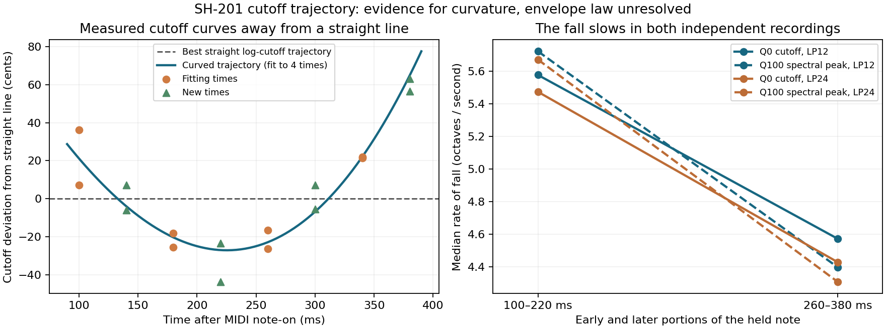

# Effective filter-envelope trajectory

**The measured cutoff fall curves in logarithmic frequency; its rate slows
through the held note.** Both the zero-resonance harmonic estimates and an
independent maximum-resonance spectral trace support this. The data do not
identify a unique envelope-control law, and no DSP envelope was changed.

A [later chord-holdout experiment](deepsonic-chord-envelope-2026-09-15.md)
extends independent observations to 0.62 s. Without refitting these curves,
it favors the exponential-in-Hz-to-floor prediction over the exponential
in logarithmic cutoff; it still does not identify the raw envelope law.



## Source and scope

The owner's [filter comparison](https://www.deepsonic.ch/deep/htm/deepsonic_analytics_filter_comparison.php)
provides the original MIDI and six SH-201 MP3s. Its recipe uses one saw,
effects/modulation/velocity response off, one-octave-per-octave key tracking,
and a filter sweep from roughly eight times the note frequency to its
fundamental in about one second. Raw patch controls and SysEx are unavailable.
Source identities are retained in the
[acquisition record](deepsonic-acquisition-2026-09-15.json).

The Q0 starting measurements are the recorded `rounded_candidate` local
cutoff estimates originally in `filter-shape-v4/results.json`, now retained in
the tracked `dry-filter-shape-2026-09-15.json`, using damping 1.2 per
two-pole section. Those cutoff values are conditional transfer estimates,
not a recovered Roland control table. The
[independent moving-filter control](filter-estimator-bias-2026-09-15.md)
checks that envelope movement does not create a false damping reduction.

## Separate fitting and evaluation

Only MIDI 36 at 1.5 seconds, measured 100, 180, 260 and 340 ms after MIDI
onset, fits the candidate curves. LP12 and LP24 provide eight observations
at those four times. Additional observations at 140, 220, 300 and 380 ms
are temporal holdouts. Five other notes, including a later repetition and
MIDI 57, are note holdouts; none changes the fitted parameters.

The new Q0 windows use the existing estimator: twelve or more joint
harmonics, independent local amplitude ramps, 80 ms windows and the known
MIDI fundamental. Their maximum unexplained signal-power fraction is
`0.000509`, well below one percent. Cutoffs normalize to the note frequency,
so key tracking does not add a free per-note multiplier. No EQ, changed MIDI,
per-note time alignment or curve refitting is used.

Let `r = cutoff / note frequency`, with `t` in seconds after MIDI onset.
Four model families were declared:

| Model | Form | Parameters |
| --- | --- | ---: |
| Straight logarithmic cutoff | `ln(r) = a + b t` | 2 |
| Exponential in logarithmic cutoff | `ln(r) = a + b exp(−t/τ)` | 3 |
| Exponential in Hz toward a floor | `r = a + b exp(−t/τ)` | 3 |
| Straight Hz cutoff | `r = a + b t` | 2 |

Errors are cents of **cutoff**, using `1200 log2(predicted/measured)`, rather
than pitch error or an overall audio similarity score.

| Model | Fitting times | New times, same note | Other notes, original times | Other notes and new times |
| --- | ---: | ---: | ---: | ---: |
| Straight logarithmic cutoff | 23.08 | 35.07 | 48.14 | 54.52 |
| Exponential in logarithmic cutoff | 7.92 | 9.00 | 42.09 | 40.41 |
| Exponential Hz with floor | 7.99 | 9.28 | 42.04 | 38.85 |
| Straight Hz cutoff | 89.05 | 148.14 | 101.54 | 158.27 |

Both curved models predict the withheld times much better than a straight
line. They remain nearly indistinguishable from each other inside the
observed interval. Small note-dependent offsets, about 33 cents mean bias
on the original-time note holdouts, remain unmodeled.

The Hz-exponential fit is approximately
`r(t) = 0.93188 + 8.49843 exp(−t/0.21408)`.
Its extrapolated floor near the fundamental agrees with the stated recipe.
The exponential-in-log-cutoff fit extrapolates to only `0.159 f0`. Neither
floor was measured: the selected single-note gates last less than 0.44 s.
The recording's approximate onset offset also affects the extrapolated
starting amplitude. **The 214 ms constant is not a raw decay-control value
or a measured complete decay duration.**

## Independent maximum-resonance check

The Q100 analysis uses local Hann-window spectra, without the Q0 harmonic
transfer model. It finds the largest peak between 1.3 and 10 times the
fundamental, with sub-bin interpolation. Widths of 30, 40 and 50 ms test
window sensitivity. A synthetic linear chirp whose instantaneous frequency
is 400 Hz at the window center measures 400.011 Hz.

The absolute peak is not an exact natural cutoff. Maximum resonance is
driven by the saw, and some windows show competing peaks or locking to source
harmonics. Q100 spectral peaks generally lie below the Q0-inferred cutoff.
For the five low/mid notes at 40 ms width, their paired discrepancies have
RMS values about 67 cents for LP12 and 86 cents for LP24. MIDI 57 is less
reliable: approximately 120 and 221 cents respectively. High-note LP24
windows visibly select source harmonics rather than a unique free chirp.

Despite these absolute-frequency limits, the five low/mid notes all show
the same slowing trend. A local regression measures `d ln(frequency)/dt`
over 100–220 ms and 260–380 ms:

| Observation, median across five notes | Earlier rate, s⁻¹ | Later rate, s⁻¹ |
| --- | ---: | ---: |
| Q0 cutoff, LP12 | −3.866 | −3.170 |
| Q100 spectral peak, LP12, 40 ms | −3.966 | −3.049 |
| Q0 cutoff, LP24 | −3.794 | −3.070 |
| Q100 spectral peak, LP24, 40 ms | −3.931 | −2.987 |

The Q100 fall becomes less steep on **every one of those five notes**, at
both slopes and all three window widths: 30 separate checks. Thus the
curvature is also visible without estimating the zero-resonance transfer
function. Q100 does not resolve the two competing curved model families.

## Consequence for the model

Under Septum's current exponential mapping from envelope amount to cutoff,
a linear envelope segment produces a straight logarithmic cutoff trajectory.
This recipe's measured effective trajectory deviates consistently from that
prediction. An isolated comparison at known raw envelope/cutoff/depth values
is needed before changing the envelope itself: the observed curvature could
also involve the conversion from envelope amount into cutoff.

The next discriminating recording should sustain a single note beyond the
full decay, repeat at multiple envelope depths and base cutoffs, and retain
the exact SysEx. That would separate the segment shape from its cutoff
mapping and measure the currently extrapolated floor.

## Reproduction

[The tool](../../../Tools/analyze_deepsonic_envelope.py) and
[measurement data](deepsonic-envelope-shape-2026-09-15.json) retain parameters,
all cutoff/ridge observations, source hashes and per-note/window slope checks.
The complete local result is
`build-fidelity/deepsonic/envelope-shape-v3/results.json`, SHA-256
`853ab9817e6300e3dcc0dbcbc75749b32cc70cad9da43d367d4d434ae64e3ad4`.

```sh
OPENBLAS_NUM_THREADS=1 python3 Tools/analyze_deepsonic_envelope.py \
  --sources build-fidelity/deepsonic \
  --filter-results Docs/fidelity/source-audits/dry-filter-shape-2026-09-15.json \
  --output build-fidelity/deepsonic/envelope-shape-reproduction
```

The tool verifies the catalog-pinned original MP3 hashes and decodes them into
its fresh output directory; no preexisting WAV preparation is required.
Replaying with the tracked Q0 results preserved every numeric model, cutoff,
ridge and slope result exactly. The local decodes are mono 44.1 kHz. The MP3
compression, capture chain, raw patch settings and replication across units
remain limitations. Python syntax/whitespace checks and visual figure review
passed.
