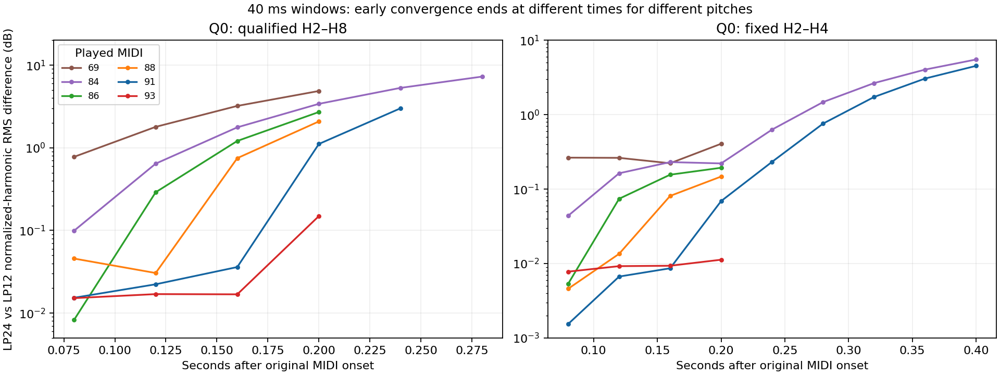

# High-note filter-state invariance

## Conclusion

**Q0 has an early high-note state whose normalized harmonic shape is nearly unchanged across LP12/LP24 and time. That state ends during the longer gates. Q50 does not share it.** The evidence supports an effectively open or otherwise insensitive **Q0** state; it does not justify an unconditional cutoff-only bypass, a recovered raw cutoff endpoint, or assigning the entire measured shape to the oscillator.

The early note93 Q0 waveform provides a strong constraint on the common source/output shape. Note91's first window is also useful, but its later 80 ms window begins to straddle the transition. Capture coloration or another fixed stage remains inseparable from oscillator shape using these recordings alone.



Only qualified harmonic groups are plotted. The right panel uses fixed H2–H4, which remain measurable later than the deepest high-frequency notches.

## Measurement and source identity

The [owner's comparison](https://www.deepsonic.ch/deep/htm/deepsonic_analytics_filter_comparison.php) provides the original MIDI and dry classic-Saw recipe. All original MIDI and Q000/Q050 LP12/LP24 MP3 hashes are checked against the tracked acquisition catalog before fresh decoding. This is one Saw, not SuperSaw; the raw patch/SysEx and capture chain remain unknown. The [primary-source review](sh201-high-note-source-feasibility-2026-09-15.md) found no documented SH-201-specific high-cutoff automatic-bypass algorithm; the recipe also excludes selecting explicit thru/bypass.

Selected original MIDI events are 69 at8.50s, 93 at18.25s, 91 at18.75s, 86 at19.25s, 88 at19.75s, and84 at20.25s, all velocity127. Notes91/84 have approximately437.5ms gates; the others have187.5ms gates. Offsets below are relative to those original MIDI events. With the roughly35ms audio onset convention, the final40ms windows nominally precede audible note-off. The short notes' +200ms windows have only about2.5ms margin: onset uncertainty or release behavior can affect their final edge. Earlier windows and the longer91/84 gates provide stronger timing evidence.

The estimator jointly fits all harmonics below20kHz on the full44.1kHz sample grid with quadratic complex-amplitude variation. Both independently established44.1kHz alias branches are included as nuisance components with linear complex variation; they do not inflate main-harmonic uncertainty. Maximum hardware matrix condition is6.75.

Ratios are `20log10(Ah/A1)`; tables labeled “saw removed” add`20log10(h)`. One H1 frequency refinement is frozen on the first LP12 80ms window per note and reused for other times and LP24. Nominal MIDI frequencies are a separate sensitivity check. Frequency shifts are−0.454 to+0.031 cents; they can include moving-filter phase and are not tuning measurements. Both frequency conventions and60/80/100ms windows give the same qualitative result.

H2–H8 must stay above−55dB/H1 and a20dB coefficient-noise proxy across the main width/frequency sensitivity cases. All seven harmonics qualify for every hardware note. This proxy includes residual model error and is not a statistical confidence interval. Late sweep windows report when the original group becomes too weak rather than silently changing its mask.

## Q0: early invariance and later divergence

These are RMS differences over normalized H2–H8, with80ms centers at+100/+160ms. Time differences pool both slopes; slope differences pool both times.

| Played note | Time difference | LP24 vs LP12 difference |
|---:|---:|---:|
| 69 | 3.192dB | 2.422dB |
| 84 | 2.270dB | 1.270dB |
| 86 | 1.738dB | 0.855dB |
| 88 | 1.030dB | 0.519dB |
| 91 | **0.070dB** | **0.065dB** |
| 93 | **0.010dB** | **0.015dB** |

Note93's maximum time difference is0.021dB; its maximum slope difference is0.040dB. Note91 is less invariant than a blanket “all bins within0.02dB” claim: its maximum differences are0.230dB over time and0.216dB across slopes. The+160ms,80ms window reaches+200ms, when the shorter-window sweep detects the transition.

The first LP12 window's saw-removed H1–H8 profiles are:

| Note | H1 | H2 | H3 | H4 | H5 | H6 | H7 | H8 |
|---:|---:|---:|---:|---:|---:|---:|---:|---:|
| 91 | 0 | −0.868 | −2.717 | −4.486 | −9.726 | −12.845 | **−27.691** | −24.523 |
| 93 | 0 | −1.199 | −3.921 | −6.505 | −17.015 | **−23.268** | −13.515 | −16.065 |

These are nonmonotone sampled shapes: note91's H7 is10975.9Hz and note93's H6 is10560Hz, followed by stronger higher harmonics. They do not locate a continuous notch exactly or distinguish an oscillator kernel from fixed filtering/capture response.

### Short-window transition check

The40ms sweep exposes where slope dependence becomes substantial. The final column is only the frozen low-note extrapolation
`fc(t)=f0×[0.931883+8.498434×exp(−t/0.214076)]`, evaluated at the window center in original-MIDI time. Its parameters are unchanged. It is **not** a measured high-note cutoff or raw knob mapping.

| Note | Earlier center / slope RMS | Next center / slope RMS | Extrapolated fc at those centers |
|---:|---:|---:|---:|
| 84 | +80ms /0.099dB | +120ms /0.643dB | 7096→6053Hz |
| 86 | +80ms /0.008dB | +120ms /0.290dB | 7965→6794Hz |
| 88 | +120ms /0.031dB | +160ms /0.749dB | 7626→6535Hz |
| 91 | +160ms /0.036dB | +200ms /1.113dB | 7772→6696Hz |
| 93 | +160ms /0.017dB | +200ms /0.149dB | 8724→7517Hz |

Note91 continues to3.005dB slope RMS at+240ms while H2–H8 remain qualified. At+400ms, the fixed H2–H4 group differs by about4.53dB; note84 differs by about5.52dB. Its higher harmonics have become too weak for the original full-group metric. The early invariance therefore is not a permanent shared capture EQ alone: a time-dependent filter contribution becomes observable. A common fixed coloration may still coexist with it.

The transition windows overlap a changing trajectory and have40ms support. Their center values cannot locate a precise cutoff discontinuity, establish a single maximum, or validate an eight-octave versus ten-octave control law.

## Q50: contrary evidence against an unconditional bypass

Q050 is the owner's file/recipe label, **not an authenticated raw50 or raw64 setting**. Q0 alone freezes the frequency refinement; Q50 does not tune the test. The clean40ms windows centered at+80ms already reject convergence:

| Note | Q50−Q0, LP12 RMS | Q50−Q0, LP24 RMS | Q50 LP24−LP12 RMS | Maximum residual signal power |
|---:|---:|---:|---:|---:|
| 91 | 9.85dB | 15.88dB | 6.17dB | 0.075% |
| 93 | 9.54dB | 15.57dB | 6.12dB | 0.042% |

All H2–H8 qualify there. In the same windows Q0's LP24−LP12 difference is only0.015dB. This is an output-state difference, not failure of the short-window harmonic model.

The alias comparison agrees. On note93 at+100ms, the10660Hz alias is17.81dB stronger in Q50 LP12 and25.73dB stronger in Q50 LP24 than in Q0. The low1860Hz alias changes only+0.16/−0.11dB. The frequency-dependent effect is consistent with an active resonant contribution, but no topology is fitted here. Some80ms note91 Q50 windows have1.17–2.63% residual power and are not accepted for precise stationary transfer inference; their raw diagnostic results remain in the data.

The Q0 open-state observation could involve resonance-dependent filter behavior, clamping, or undocumented recipe differences. It cannot be promoted to a cutoff-only bypass rule that also applies to Q50.

## Controls and remaining attribution limits

- The invariant synthetic source has a known notched harmonic vector, deliberate+3-cent carrier offset, different oscillator phase and capture gain between the two tracks, and independent320kb/s MP3 encodes. After the frozen frequency refinement, all H1–H8 values across tested widths recover with PCM maximum error0.000040dB; MP3 RMS error0.00375dB and maximum0.01850dB. It is not a comparison of identical input files.
- A known moving-filter source remains measurably different through the same estimator and codec. Even note93's lower H2–H4 group shows about0.428dB time change and0.224dB slope change in PCM. The estimator does not force high-note invariance.
- Nominal-frequency results, the frozen refinement and three window widths preserve the Q0 conclusion. The weaker/highest bins set its practical precision; the full data retain every sensitivity result.
- An integer-lag/scalar-gain check does not make the two hardware waveforms identical, but cannot authenticate separate underlying recordings or exclude fractional resampling, capture timing or phase effects. Magnitude invariance alone does not identify the source of fixed coloration.
- No original SysEx, raw controls, direct pre-filter oscillator capture, capture response or firmware algorithm was recovered. The early high notes constrain the **combined common source/output shape**, not uniquely the oscillator.

## Reproduction

Use fresh output directories:

```sh
python3 Tools/analyze_deepsonic_high_note_invariance.py \
  --sources build-fidelity/deepsonic \
  --output build-fidelity/deepsonic/high-note-invariance-v3
python3 Tools/compare_deepsonic_high_note_q50.py \
  --sources build-fidelity/deepsonic \
  --output build-fidelity/deepsonic/high-note-q50-v3
python3 Tools/summarize_deepsonic_high_note_invariance.py \
  --invariance build-fidelity/deepsonic/high-note-invariance-v3/results.json \
  --q50 build-fidelity/deepsonic/high-note-q50-v3/results.json \
  --output build-fidelity/deepsonic/high-note-invariance-summary-v1
```

The accompanying JSON retains source/tool hashes, all H1–H8 hardware observations, width/frequency sensitivities, qualified timing tables, control results and Q50 contrary evidence. Full uncompressed analysis output is reproducible with the first two commands. No DSP or candidate fitting is part of this audit.
