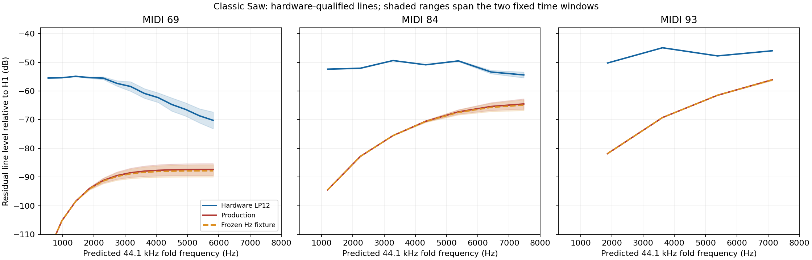

# Classic-Saw alias-line evidence

## Result and scope

**The dry SH-201 recordings contain a repeatable nonharmonic line family at `|44,100 − h × f0|`. The production classic Saw places weak aliases at those frequencies, but does not reproduce their recorded levels.** The result is supported by original MIDI, eight independent pitches, both Q0 filter slopes, two fixed time windows, measured background, and synthetic PCM/MP3 controls. No DSP setting or global internal sample rate was changed.

This identifies a **44.1 kHz folding signature in the recorded single classic Saw path**. It does not establish that every oscillator, filter or effects block runs at that rate, identify where in the source/capture path the fold originates, or say anything about SuperSaw. The PCM file rate alone is not the evidence.



Shading is the range between two time windows, not a statistical confidence interval. A weak model line can lie below the hardware eligibility floor while still being resolved above the much lower synthetic PCM background. Bins without sufficient local prominence or an actual peak are only residual-level bounds.

## Original sources and notes

The owner's [filter comparison and recipe](https://www.deepsonic.ch/deep/htm/deepsonic_analytics_filter_comparison.php) supplies the [original performance MIDI](https://www.deepsonic.ch/deep/audio_midi/deepsonic_-_filter_demo_-_comparsion_sequence.mid) and [Q0 LP12](https://www.deepsonic.ch/deep/audio_filter/roland_sh-201_-_filter_demo_-_lpf12_q000.mp3) / [Q0 LP24](https://www.deepsonic.ch/deep/audio_filter/roland_sh-201_-_filter_demo_-_lpf24_q000.mp3) recordings. The stated recipe is one classic saw with effects, modulation and velocity response off, full key tracking, and a filter sweep from approximately eight times the fundamental toward the fundamental. Raw patch controls and SysEx are unavailable.

All originals are verified against the tracked acquisition catalog before fresh decoding. MIDI SHA256 is `21ea21b9ba3ba14cc205931134fb7a320b09e67821bd3a3c70f97fa2e8b5d99a`; LP12 MP3 is `28e241247a0efb217eb4cb7154cc3b69713fcebca781639c45b8904b3dc8615b`; LP24 MP3 is `ebb6fa4e12136028bbff614633095aa510c31654fcce840af5e3a85b3a469d90`. Both MP3 streams are mono, 44.1 kHz, 320 kb/s. Original encoder and capture-clock details remain unknown.

| MIDI onset (s) | Played note | Nominal f0 (Hz) | MIDI gate (ms) |
|---:|---:|---:|---:|
| 8.50 | 69 | 440.000 | 187.506 |
| 12.50 | 76 | 659.255 | 187.506 |
| 13.25 | 81 | 880.000 | 187.506 |
| 18.25 | 93 | 1760.000 | 187.506 |
| 18.75 | 91 | 1567.982 | 437.506 |
| 19.25 | 86 | 1174.659 | 187.506 |
| 19.75 | 88 | 1318.510 | 187.506 |
| 20.25 | 84 | 1046.502 | 437.506 |

Velocity is 127 for every selected note. These are the original played notes, without the obsolete coarse-tuning interpretation used in older factory-preset studies.

## Detector and controls

The primary hypotheses are fixed at 32,000, 44,100 and 48,000 Hz. For each note they predict the first descending alias branch `f = Fs − h × f0`, with `Fs/2 < h × f0 ≤ Fs`. Only 300–15,000 Hz candidates more than 37.5 Hz from a true source harmonic are tested. This avoids reading harmonic shoulders or the MP3's highest band as aliases.

Each original-rate, 80 ms window is centered 100 or 160 ms after the original MIDI onset. A joint model removes all source harmonics below 20 kHz, allowing independent quadratic changes of complex amplitude. That accounts for local moving-filter amplitude and phase without calling those changes oscillator detuning. Residuals are Hann-windowed; zero-padding samples the spectrum every 0.168 Hz but does **not** create equivalent independent frequency resolution.

A candidate must be an actual interior local maximum within ±6 Hz of its prediction, at least 12 dB above the local median residual-amplitude background, and at least −75 dB relative to the fitted fundamental. Repeated lines must pass in both windows. Background is measured within ±250 Hz, excluding the line and true-harmonic neighborhoods. It is a diagnostic prominence proxy, not a calibrated statistical confidence interval.

The initial exploratory v1 detector allowed a search maximum on the boundary. Several alternate-rate “hits” were rising flanks of unrelated lines. V2 corrects this necessary local-maximum check uniformly for every hypothesis, recording and control; the 44.1 kHz pass counts did not change. This revision is retained in metadata rather than presented as a predeclared statistical test.

Controls use an additive, bandlimited classic saw with a moving complex filter response following the frozen effective Hz trajectory. It has only harmonic carriers by construction. The signal is analyzed as PCM and after a mono 320 kb/s libmp3lame round-trip. A positive control adds two 44.1 kHz-predicted lines per note at −60 dB relative to H1 after filtering. These are detector controls, not a claimed emulation of the original oscillator or original encoder.

## Frequency and background results

Each hypothesis has 16 windows: eight pitches × two times. The denominator counts eligible predicted line positions across those windows, not independent statistical observations.

| Signal | 32 kHz passing line windows | 44.1 kHz passing line windows | 48 kHz passing line windows | Notes with repeated 44.1 kHz lines |
|---|---:|---:|---:|---:|
| Hardware LP12 | 8/262 | **206/252** | 0/254 | 8/8 |
| Hardware LP24 | 6/262 | **177/252** | 1/254 | 8/8 |
| Bandlimited PCM negative | 0/262 | 0/252 | 0/254 | 0/8 |
| Bandlimited MP3 negative | 0/262 | 0/252 | 0/254 | 0/8 |
| Injected PCM positive | 0/262 | **32/252** | 0/254 | 8/8 |
| Injected MP3 positive | 0/262 | **32/252** | 0/254 | 8/8 |

The positive control contains exactly 32 injected line-window observations: all are recovered. PCM amplitude recovery has maximum absolute error 0.00491 dB; MP3 recovery has RMS error 0.04545 dB and maximum error 0.12066 dB. These describe this control, not the hardware measurement's total uncertainty.

LP12 has 100 distinct repeated 44.1 kHz lines; LP24 has 84. Among detected lines, LP12's absolute prediction error has median **0.369 Hz** and 90th percentile **0.903 Hz**. LP24 gives **0.890 / 2.246 Hz**, consistent with the greater phase movement possible in the moving four-pole filter; this does not estimate capture-clock accuracy. Median prominence is about **33.8 dB** for each slope, over median local backgrounds near **−90 dB relative to H1**.

The contrary 32 kHz-position hits are retained: four repeated lines on note84 in LP12, three on note84 in LP24, roughly −70 to −75 dB relative to H1. They do not form a multi-pitch 32 kHz signature. The single LP24 48 kHz hit does not repeat. Their exact origin is unresolved.

### Example levels at both fixed times

The following low/mid-frequency examples were selected for readability after the full test. They are not a separate training set. Full hardware-qualified comparisons retain every passing repeated line.

| Note | Parent h | Predicted alias (Hz) | Hardware LP12, +100/+160 ms (dB/H1) | Production LP12, same physical times (dB/H1) |
|---:|---:|---:|---:|---:|
| 69 | 97 | 1420.000 | −55.04 / −54.70 | −98.47 / −98.45 |
| 76 | 63 | 2566.928 | −51.19 / −51.24 | −84.15 / −84.64 |
| 81 | 43 | 6260.000 | −51.29 / −53.74 | −67.63 / −71.05 |
| 84 | 39 | 3286.412 | −49.44 / −49.31 | −75.54 / −75.58 |
| 86 | 35 | 2986.932 | −48.31 / −48.23 | −76.41 / −76.35 |
| 88 | 31 | 3226.183 | −47.90 / −47.87 | −73.96 / −73.90 |
| 91 | 27 | 1764.493 | −45.84 / −45.89 | −83.84 / −83.83 |
| 93 | 23 | 3620.000 | −44.92 / −44.91 | −69.31 / −69.24 |

The hardware LP24 values for the least time-dependent examples agree closely: note91 is −45.81/−45.94 dB; note93 is −44.95/−44.89 dB. Both slopes thus expose essentially the same low alias levels on those high notes. The local background and measured peak position for each observation are retained in JSON.

## Production comparison

The optional comparison uses immutable `b0f6c03` production and frozen `dry-hz-35ms` fixture renders. The original MIDI hash, WAV hash, SysEx hash, renderer hash and checkpoint source hashes are verified and retained. Those dry SysEx files reproduce a recipe; they are not original hardware patch dumps.

Hardware windows use original MIDI onset plus 100/160 ms. Engine centers use `MIDI onset + offset − 35 ms + 93/44100 s`: subtract the hardware onset convention and compensate the documented renderer delay once. The earlier dry-envelope replay's shift of −1406 samples differs by 1.009 ms; it is a fixed alignment convention difference, not a selected per-note correction. Exact high-frequency filter-envelope behavior remains a comparison limitation.

| Model | Slope | Hardware-qualified line windows | Median model−hardware level | Fixed-bin RMS level difference |
|---|---:|---:|---:|---:|
| Production | LP12 | 200 | −15.63 dB | 23.18 dB |
| Production | LP24 | 168 | −20.41 dB | 26.54 dB |
| Frozen Hz fixture | LP12 | 200 | −15.75 dB | 23.32 dB |
| Frozen Hz fixture | LP24 | 168 | −20.81 dB | 26.87 dB |

Eligibility uses hardware only; an engine candidate cannot remove an error by suppressing a line. Comparisons are of fixed predicted-bin residual levels. Many engine aliases are resolved above background even when below −75 dB/H1. Where a bin lacks a peak or enough prominence, its value is an upper-bound proxy and not a precise oscillator amplitude. Separate flags preserve this distinction.

The existing two-sample polyBLEP therefore does not already reproduce the measured signature. However, these figures are **not** overall sound-quality scores and are not a pure oscillator gain fit. Hardware high notes also have a nonmonotone main-harmonic shape and nearly unchanged spectra across the two slopes/times. Filter clamping, source shape or another unmodeled stage may contribute. A broad alias boost or a global sample-rate change is not justified by this audit.

## Other strong residual lines

Of the strongest 12 residual peaks per window, **188/192 LP12** and **190/192 LP24** fall within 6 Hz of either first 44.1 kHz branch: `44100 − h*f0` or `h*f0 − 44100`. The formal counts above test only the descending branch. Strong companions include note93 at 6940 Hz (`29×1760−44100`, about −49.8 dB/H1) and note91 at approximately 1371.4 Hz (`29×f0−44100`, about −50.6 dB/H1).

The remaining top peaks are preserved as unresolved observations. Several are close to half the played fundamental: approximately 439.4 Hz on note81, 783.8 Hz on note91, 876.5 Hz on note93 and 523–524 Hz on note84, around −54 to −58 dB/H1. LP24 also has a peak near592.7 Hz on note86. These may involve source modulation, transients, previous-note tails or codec behavior; the audit does not assign their cause or count them as rate evidence.

## Reproduction and reusable helper

```sh
python3 Tools/analyze_deepsonic_saw_aliases.py \
  --sources build-fidelity/deepsonic \
  --output build-fidelity/deepsonic/saw-alias-audit-v2 \
  --engine-root build-fidelity/envelope-hypothesis/dry-v2
python3 Tools/summarize_deepsonic_saw_aliases.py \
  --input build-fidelity/deepsonic/saw-alias-audit-v2/results.json \
  --output build-fidelity/deepsonic/saw-alias-summary-v2
```

Use fresh output directories. Omit `--engine-root` to reproduce the primary hardware and synthetic/codec evidence without the optional historical builds. The summary retains original and tool identities, contrary-rate results, all hardware-qualified engine comparisons and control diagnostics. Full line-window output is regenerated by the first command. The accompanying PNG was visually inspected.

For a new renderer, import `analyze_deepsonic_saw_aliases` and call `measure(mono_float_audio, shifted_onset_seconds, played_note, offset_seconds)`. Input must already be 44.1 kHz. The function performs no resampling or time alignment. `tested_alias_lines` exposes predicted/measured frequencies, relative H1 level, background, prominence and eligibility. `summary(rows)` reports repeated lines. Freeze a hardware-only mask before ranking an oscillator candidate.

**Next supported experiment:** a bounded classic-Saw source-shape/alias hypothesis with separate training and pitch/time holdouts, while retaining the real hardware line positions and the broader main-harmonic mismatch as independent constraints. No inferred firmware algorithm or DSP default is established here.
