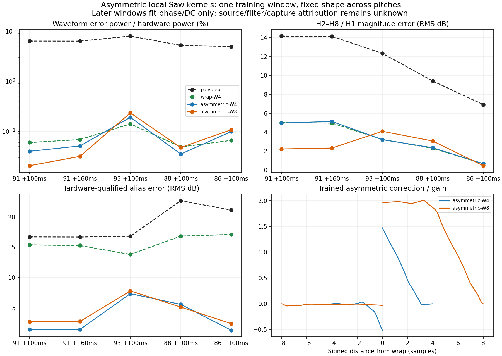

# Asymmetric Saw wrap kernels: better alias fit, unresolved pitch dependence

## Result

Relaxing the previous kernel's odd symmetry substantially improves the training alias fit. A width of four samples predicts the training note 91 alias levels within 2.57 dB and also predicts note 86 well. **Both predeclared widths still miss the measured alias notches on independent notes 93 and 88.** The wider kernel improves training waveform power while making several later waveform scores worse.

This completes the bounded localized-kernel family. No source/capture architecture is identified and no production DSP changes are justified by these results alone.

## Method and controls

[Tool](../../../Tools/fit_high_note_saw_asymmetric_kernels.py) and [full data](deepsonic-saw-asymmetric-kernels-2026-09-15.json).

The exact training and evaluation passages, nominal MIDI frequency, fixed-gain policy, and separate harmonic/alias metrics are inherited from the [symmetric-kernel audit](deepsonic-saw-wrap-kernels-2026-09-15.md):

- Train only the 80 ms LP12 Q000 window centered at original MIDI note 91 onset 18.75 s +100 ms.
- Freeze gain and every kernel coefficient. Evaluate note 91 +160 ms and notes 93, 88, 86 +100 ms with phase/DC only.
- Hash-check the original catalog MP3 and MIDI, freshly decode the MP3, and verify the exact float64 sample hashes against the previous experiment. No cached WAV is trusted. Source/decode/tool/helper hashes are retained in the data.
- Report both predeclared widths **W=4 and W=8 samples**. No per-note parameter fitting or later width selection occurs.

Each model has a gain-scaled naive Saw plus **independent correction coefficient vectors before and after the wrap**. Both sides use degree-3, C1 cubic B-splines with double interior knots every half sample. The endpoint value and slope are zero at each outer support boundary. Values and slopes on the two sides of zero remain independent; a residual jump is allowed. Negative coefficients directly give the signed pre-wrap correction, unlike the sign-times-magnitude convention in the symmetric model.

W4 has 32 correction coefficients plus gain/DC; W8 has 64 plus gain/DC. The fitted matrices have full ranks 34/66 and condition numbers 88.71/82.69, below the predeclared 1e6 rejection bound. Gain and all coefficients are subsequently frozen.

The highest tested fundamental is note 93 at 1760 Hz, whose period is 25.0568 samples. W8 leaves 4.5284 samples between its support boundary and the half-period point. Corrections therefore never overlap adjacent cycles. A direct periodic sum agrees exactly with the nearest-wrap construction at five phases and every tested pitch.

Both widths contain ordinary two-sample polyBLEP exactly. Continuous-grid spline nesting error is at most 1.00e−15, and a separate waveform comparison against the earlier ordinary-polyBLEP generator also passes at machine precision. Controls fit a planted polyBLEP and a planted asymmetric kernel at note 91, then recover newly phased note 93 signals with fixed gain/coefficients. The worst training/other-pitch residual power is 6.13e−19. Endpoint and periodic-sum checks pass. These controls validate the fitter and nesting, not a hardware implementation.

## Frozen measurements

Waveform numbers below are residual power as a percentage of hardware power. Harmonic scores are RMS magnitude errors in H2–H8/H1. Alias scores use the unchanged hardware-only eligibility mask: 9, 9, 8, 11 and 13 qualified lines in the five columns respectively.

| Waveform error power (%) | 91 +100 ms train | 91 +160 ms | 93 +100 ms | 88 +100 ms | 86 +100 ms |
|---|---:|---:|---:|---:|---:|
| Ordinary polyBLEP | 6.2831 | 6.2670 | 7.8864 | 5.1721 | 4.9021 |
| Symmetric W4 | 0.0595 | 0.0681 | 0.1401 | 0.0485 | 0.0656 |
| Asymmetric W4 | 0.0397 | 0.0508 | 0.1894 | 0.0350 | 0.0981 |
| Asymmetric W8 | 0.0205 | 0.0315 | 0.2319 | 0.0472 | 0.1070 |

| Harmonic RMS error (dB) | 91 +100 ms train | 91 +160 ms | 93 +100 ms | 88 +100 ms | 86 +100 ms |
|---|---:|---:|---:|---:|---:|
| Symmetric W4 | 5.015 | 4.959 | 3.222 | 2.290 | 0.657 |
| Asymmetric W4 | 4.967 | 5.132 | 3.208 | 2.344 | 0.659 |
| Asymmetric W8 | 2.218 | 2.318 | 4.088 | 3.060 | 0.447 |

| Alias RMS error (dB) | 91 +100 ms train | 91 +160 ms | 93 +100 ms | 88 +100 ms | 86 +100 ms |
|---|---:|---:|---:|---:|---:|
| Ordinary polyBLEP | 16.693 | 16.671 | 16.811 | 22.661 | 21.126 |
| Symmetric W4 | 15.391 | 15.275 | 13.818 | 16.827 | 17.100 |
| Asymmetric W4 | 1.467 | 1.480 | 7.366 | 5.601 | 1.354 |
| Asymmetric W8 | 2.761 | 2.791 | 7.819 | 5.158 | 2.440 |

Important line-level results:

- Note 91, approximately 8036 Hz: hardware −68.60 dBc; W4 −66.93 dBc and W8 −62.67 dBc. Asymmetric W4 now predicts this training minimum reasonably closely.
- Note 93, 10660 Hz: hardware −64.67 dBc; W4 −47.93 dBc and W8 −47.37 dBc. Both models miss the independent minimum by about **17 dB**. The same note's 7140 Hz line is 9.28/10.52 dB too weak.
- Note 88, approximately 7182 Hz: hardware −72.09 dBc; W4 −58.20 dBc and W8 −59.06 dBc. The neighboring 8500 Hz line is 11.52/8.95 dB too weak. The local notch pattern remains misplaced.
- Note 86: W4's 13 eligible aliases have only 1.35 dB RMS error, with maximum absolute error 3.15 dB. This useful contrary result is retained; the family does transfer some alias behavior across pitches.
- The training main-wave H7 notch remains 11.33 dB too deep for W4 and 4.61 dB too deep for W8. Improvement in one alias metric does not establish a joint harmonic/alias match.



## Frozen-candidate MP3 sensitivity

The previous codec control used planted lines. This additional check encodes the **actual frozen asymmetric W4 waveform**, including its strong notched harmonics, through `libmp3lame` at mono 44.1 kHz / 320 kbps. No phase, coefficient or gain is refitted. Each 80 ms test window has 0.5 s of periodic context on both sides before encoding, avoiding short-clip frame and boundary effects. [Codec tool](../../../Tools/assess_saw_asymmetric_codec.py) and [per-line data](deepsonic-saw-asymmetric-codec-2026-09-15.json).

All five gapless decodes contain exactly the original 47,628 samples. A diagnostic integer cross-correlation search over ±1152 samples peaks at **zero lag in every passage**, with correlation at least 0.9999926; no lag is applied. The clean model does not clip. The unchanged hardware-only alias masks score the same central sample ranges before and after encoding.

| Passage | Encoded-minus-clean line change, RMS dB | Maximum absolute change, dB |
|---|---:|---:|
| 91 +100 ms | 0.0328 | 0.0597 |
| 91 +160 ms | 0.0745 | 0.2117 |
| 93 +100 ms | 0.0142 | 0.0240 |
| 88 +100 ms | 0.0879 | 0.2118 |
| 86 +100 ms | 0.0476 | 0.1227 |

The disputed note 93 / 10660 Hz line changes from −47.9337 to −47.9279 dBc: only **+0.0058 dB**, leaving a **+16.7466 dB** error against hardware. Thus this codec roundtrip does not explain the independent notch mismatch, even with the candidate's actual strong spectrum. This bounds the tested encoder's effect; it does not identify the original MP3 encoder, capture interface, or any earlier conversion/processing.

## Interpretation and stopping point

The extra freedom repairs much of the training alias mismatch, so the earlier odd/small-support model was a meaningful restriction. Increasing support to eight samples does not repair the independent pitch-dependent notch errors. No width is selected from those later results.

Fitted phase and an asymmetric correction have an origin/delay ambiguity. The kernel's plotted shoulders therefore do not measure a physical delay or prove that the hardware transition itself is asymmetric. Source smoothing, filter behavior and the unspecified capture path remain confounded. Earlier slope/time invariance is strongest for the early note 93 window, while note 91's later window and the lower notes increasingly contain moving-filter contributions. The MP3 and procedural recipe provide no authenticated raw patch dump.

**Decision:** retain both models as exploratory failures of joint reproduction. They support further work on the mechanism behind the pitch-dependent notches, not adoption of either fitted kernel as a shipping oscillator. No low-register, other-cutoff, resonance, SuperSaw, live-engine or original-preset acceptance claim is made.

## Reproduce

```sh
python3 Tools/fit_high_note_saw_asymmetric_kernels.py \
  --sources build-fidelity/deepsonic \
  --output build-fidelity/high-note-shape/asymmetric-kernel-replay
python3 Tools/assess_saw_asymmetric_codec.py \
  --experiment build-fidelity/high-note-shape/asymmetric-kernel-replay \
  --output build-fidelity/high-note-shape/asymmetric-codec-replay
```

Both output directories must be new. The first command uses the tracked symmetric-baseline JSON plus catalog-pinned original MP3/MIDI, writes the protocol before fitting, and produces `results.json` and `comparison.png`. Tracked artifacts use `asymmetric-kernel-v2`; v2 adds an independent ordinary-polyBLEP waveform nesting check and explicit passage-count guard, with unchanged model fits from v1. The second command verifies that frozen experiment and generates the contextualized clean/MP3/decoded controls and `results.json`; tracked codec data uses `asymmetric-codec-v1`.
