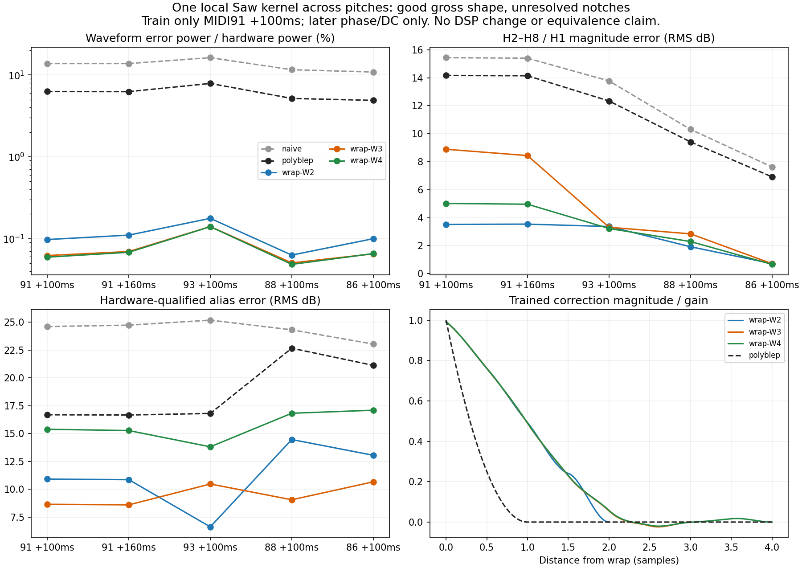

# A shared local Saw wrap kernel does not recover the hardware notches

## Result

A correction localized around each Saw reset explains the gross high-note waveform much better than an ordinary two-sample polyBLEP. The same fitted correction and gain transfer to other pitches. **None of the three frozen kernels reproduces the measured harmonic and alias notches together.** This remains a mathematical diagnostic; no production DSP or preset changed.

The widest kernel wins the training waveform objective, but its alias error is worse than the shorter kernels. Selecting a different width after inspecting those later alias scores would change the experiment's objective. All widths are retained below, including contrary results.

## Frozen experiment

The input is the catalog-pinned original deepsonic LP12 Q000 MP3 and original comparison MIDI. The tool verifies both original SHA-256 values and freshly decodes the MP3 to float PCM without resampling. Full source URLs, hashes, decode command, tool/dependency hashes, exact sample spans and float64 sample hashes are in the [data](deepsonic-saw-wrap-kernels-2026-09-15.json).

- Train one 80 ms window centered at original MIDI note 91 onset 18.75 s +100 ms. Gain, kernel, phase and DC are fitted here only.
- Freeze gain and all kernel coefficients. Evaluate note 91 +160 ms, note 93 onset 18.25 s +100 ms, note 88 onset 19.75 s +100 ms, and note 86 onset 19.25 s +100 ms. These windows fit phase and remove DC only.
- Use the original MIDI's nominal equal-tempered frequency and velocity 127. No frequency, time-warp, per-note gain, EQ or alias-level fit is allowed.
- Windows are centered in original MIDI time. The approximate 35 ms hardware onset delay is **not** subtracted from the recording. Models are synthesized directly within each window, so they have no renderer latency to compensate.
- Use the same 256-point phase search and bounded local refinement as the earlier FIR diagnostic. These are exploratory validation passages, not untouched blind holdouts.

For phase `p`, increment `d=f0/44100` and nearest signed wrap distance `t=p/d` after the wrap or `(p-1)/d` before it:

`y = gain*(2*p-1) + sign(t)*sum(coefficient[j]*B[j](abs(t)))`

The correction is zero outside `|t|<W`, with **W=2,3,4 samples** declared before fitting. Each magnitude curve uses degree 3 B-splines with 0.5-sample knots. Double interior knots give C1 continuity. Dropping the final two clamped basis functions makes both value and first derivative zero at W. Magnitude at zero remains free, allowing a residual jump; the sign at exactly zero is positive. There are 8, 12, 16 kernel coefficients respectively, plus gain and DC. No coefficient depends on pitch.

Double knots are deliberate: the standard polyBLEP magnitude `max(1-|t|,0)^2` is piecewise quadratic and C1 at one sample. Thus every tested width contains the ordinary two-sample polyBLEP **exactly**, rather than adding a spline approximation error. The uncorrected Saw and standard polyBLEP are additional baselines, each with one fitted training gain and phase.

## Measurements

Waveform error is residual power divided by mean-removed hardware power. The following numbers are percentages, so 0.1% means a relative error power of 0.001. No gain is refitted in later columns.

| Model | 91 +100 ms train | 91 +160 ms | 93 +100 ms | 88 +100 ms | 86 +100 ms |
|---|---:|---:|---:|---:|---:|
| Naive Saw | 13.814 | 13.815 | 16.293 | 11.611 | 10.874 |
| Ordinary polyBLEP | 6.283 | 6.267 | 7.886 | 5.172 | 4.902 |
| Wrap W2 | 0.0975 | 0.1105 | 0.1771 | 0.0630 | 0.0999 |
| Wrap W3 | 0.0622 | 0.0696 | 0.1404 | 0.0506 | 0.0652 |
| Wrap W4 | 0.0595 | 0.0681 | 0.1401 | 0.0485 | 0.0656 |

Low waveform power error can hide relatively large errors in quiet notches. Therefore harmonic and alias metrics are assessed separately. Harmonic scores use the fixed H2–H8/H1 group already qualified by the independent [high-note invariance audit](deepsonic-high-note-invariance-2026-09-15.md). The unchanged alias estimator removes the moving main-harmonic model and assesses only 44.1k descending-fold lines that pass its hardware-only level, local-background and interior-peak rules. Candidate lines never determine eligibility.

| Model | Harmonic RMS dB: train / 93 / 88 / 86 | Alias RMS dB: train / 93 / 88 / 86 |
|---|---|---|
| Ordinary polyBLEP | 14.17 / 12.34 / 9.42 / 6.92 | 16.69 / 16.81 / 22.66 / 21.13 |
| Wrap W2 | 3.52 / 3.36 / 1.92 / 0.71 | 10.92 / 6.64 / 14.47 / 13.06 |
| Wrap W3 | 8.89 / 3.31 / 2.84 / 0.71 | 8.66 / 10.48 / 9.07 / 10.68 |
| Wrap W4 | 5.02 / 3.22 / 2.29 / 0.66 | 15.39 / 13.82 / 16.83 / 17.10 |

Examples show why the remaining errors are substantive:

- W3 predicts the training note 91 alias minimum near 8036 Hz at −75.8 dBc, compared with hardware −68.6 dBc. But on note 93 the measured 10660 Hz minimum is −64.7 dBc while W3 gives −53.9 dBc; its 7140 Hz line is 20.0 dB too weak.
- W4 has the best training waveform power, but the note 93 measured 3620 Hz line is −44.9 dBc versus −68.4 dBc predicted. On note 91, several alias lines are 15–21 dB too weak.
- The quiet note 91 H7 notch is 7.0 dB too deep for W2, 22.5 dB too deep for W3 and 11.5 dB too deep for W4. These discrepancies survive the gain normalization. This is why more spline freedom improves the waveform objective without reliably improving the notch metric.



## Numerical controls and limits

Every fitted design is required to have full column rank and condition number below 1e6. Hardware W2/W3/W4 training designs have ranks 10/14/18 and condition numbers 40.09/39.98/40.02. The fitted gains are 0.28908/0.28978/0.29052. All three kernels leave a small residual wrap jump: −0.00610/−0.00416/−0.00420 in fitted output units.

Two controls per width recover an independently phased/gained ordinary polyBLEP and a non-polyBLEP free spline kernel. Coefficients trained at note 91 transfer to a newly phased note 93 signal without gain fitting. The worst training/other-pitch residual power is 1.51e−15. Direct continuous-grid polyBLEP nesting error is at most 1.34e−15, and endpoint value/slope constraints are exactly zero. These controls verify the model/fitter implementation, not a hardware architecture. The alias estimator's separate codec-negative and injected-line controls remain documented in the [alias audit](deepsonic-saw-aliases-2026-09-15.md).

The input MP3 and unspecified recording path may contain shared coloration. The original recipe does not authenticate a raw preset dump. Earlier high-note Q0 measurements establish early slope/time invariance most strongly at note 93; note 91's later window and lower notes increasingly contain a moving filter. Therefore fitting this family cannot uniquely assign the waveform shape to the oscillator. Nominal MIDI frequency is deliberately frozen even though frequency refinement finds small sub-cent deviations. No low-register, other-cutoff, resonance, SuperSaw, live-engine, or original-preset acceptance test is performed here.

**Decision:** retain this family as a failed joint waveform/alias model. Its broad shape improvement demonstrates that a short, pitch-shared local correction can approximate much of this recording. It does not identify the hardware correction width or establish oscillator attribution, and does not justify changing the shipping classic Saw. A subsequent engine candidate would require independently constrained alias-notch behavior and broader preset validation.

## Reproduce

From the repository root, with catalog-pinned originals acquired under `build-fidelity/deepsonic`:

```sh
python3 Tools/fit_high_note_saw_wrap_kernels.py \
  --sources build-fidelity/deepsonic \
  --output build-fidelity/high-note-shape/wrap-kernel-replay
```

The output directory must be new. The command writes the protocol before fitting, all model/control data to `results.json`, and the comparison figure. The tracked data and figure came from `wrap-kernel-v2`; v1 and v2 model/control numerics are unchanged, with the figure generator added in v2.
