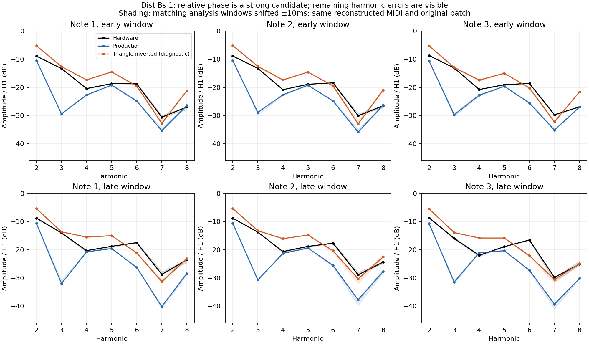

# Dist Bs 1: distortion and relative oscillator phase

Audited 2026-09-13 against production after the filter-decay update. **The strongest remaining Dist discrepancy is a relative oscillator phase/polarity interaction, rather than insufficient overdrive.** A diagnostic triangle inversion substantially improves six notes from the official recording. It does not establish a correct global triangle polarity: an independent Moogie comparison worsens some odd harmonics. Shipping DSP and original patch bytes were not changed by this audit.

## Sources and unchanged inputs

The reference is Roland's [Dist Bs 1 recording](https://www.rolandus.com/go/sh-201_patches/mp3/BASS/TOP8_DistBs1.mp3), associated by name with record 3 in its [BASS patch bank](https://www.rolandus.com/go/sh-201_patches/shl/SH-201_Patch_BASS.zip) on the [official BASS page](https://www.rolandus.com/go/sh-201_patches/patch_bass.html). Original MIDI, capture processing, system settings and authentication of the exact recorded patch revision remain unavailable. All velocities are the same unknown placeholder, 100. This is a conditional comparison using the published preset, not a controlled hardware null test.

The [Owner's Manual](https://cdn.roland.com/assets/media/pdf/SH-201_OM.pdf), printed p. 39, describes overdrive as amplification followed by distortion that produces additional overtones. Its diagram shows clipping, and distortion depth uses OVERDRIVE plus LEVEL; ordinary LEVEL independently controls volume. It supplies no numeric drive curve, output compensation, transfer function or internal signal level. Pages 28–30 describe oscillator waveforms and pulse width, without a phase-initialization law. The [MIDI Implementation](https://static.roland.com/assets/media/pdf/SH-201_MI.pdf), p. 5, specifies tone parameters and ranges, rather than their DSP curves. The triangle wording remains internally inconsistent; see the [oscillator semantics audit](oscillator-semantics.md#triangle-wording).

The original patch has these relevant settings:

| | Upper | Lower |
|---|---|---|
| Oscillators | Saw + sine | Pulse + triangle |
| Oscillator tuning | Both −36 semitones, fine 0 | Both −36 semitones, fine 0 |
| Mixer | MIX, balance 0 | MIX, balance 0 |
| LOW FREQ | BOOST | BOOST |
| Filter | LP24, cutoff 36, resonance 31 | LP24, cutoff 57, resonance 0 |
| Filter envelope | A0/D64/S0/R0, depth +22 | A0/D37/S0/R127, depth +15 |
| Overdrive | On, drive 100 | Off |
| Amp | Level 127, velocity sensitivity +8 | Level 127, velocity sensitivity +8 |

Both tones are SOLO with portamento, pitch envelope, arpeggio, delay and reverb off. The source preset and MIDI hashes are retained in the [measurement data](dist-overdrive-phase.json). Every diagnostic uses those unchanged inputs. Both independently built production controls reproduce the prior production WAV **byte for byte**.

## Method and controlled interventions

[analyze_dist_overdrive.py](../../../Tools/analyze_dist_overdrive.py) copies the current engine source and headers, builds isolated renderers, and retains each source copy, executable, hashes, command, render manifest and float PCM. It first declares drive/compensation/clip/saw-polarity interventions; the subsequent waveform stage declares triangle inversion, a quarter-cycle triangle offset, and square/square-root pulse-control curves preserving the existing endpoints. These are discrete probes, not a continuous parameter search or a fitted EQ.

The original crop covers source seconds 1.94–3.20 and three sounding notes near 38.74, 38.75 and 43.45 Hz. Joint least squares estimates harmonics 1–12 together with DC and a linear trend. Fundamental frequency is independently estimated for each note/source, allowing the hardware's small tuning offset. Early windows are 35–115 ms after estimated note-on; late windows are 105–25 ms before estimated note-off. Septum's retained 93-sample latency is included. Matching analysis windows are shifted by ±10 ms for sensitivity; they are not independently aligned to minimize errors.

The table uses RMSE of H2–H8 amplitudes relative to H1 in dB, over early and late windows. It measures these selected spectral features, **not perceptual quality or overall hardware fidelity**. Note 1 is the diagnostic note; notes 2 and 3 were held out from candidate selection, although they are from the same recording and preset. Centroid is a separate whole-crop description using a Welch power spectrum from 20–16000 Hz.

| Isolated intervention | Centroid, Hz | Note 1 error, dB | Held-out note 2 | Held-out note 3 |
|---|---:|---:|---:|---:|
| Hardware reference | 64.63 | — | — | — |
| Production | 49.38 | 7.95 | 7.41 | 7.75 |
| Compensation exponent −0.2 | 49.96 | 10.13 | 8.88 | 9.96 |
| No output compensation | 53.79 | 8.14 | 8.11 | 8.46 |
| Maximum drive gain +16 dB | 48.69 | 10.32 | 8.98 | 10.05 |
| Maximum drive gain +48 dB | 49.73 | 7.70 | 7.18 | 7.71 |
| Symmetric hard clip with ADAA | 49.48 | 7.94 | 7.40 | 7.73 |
| Saw polarity inverted | 51.25 | 6.02 | 5.50 | 5.65 |
| Triangle polarity inverted | 66.17 | 3.26 | 3.25 | 3.47 |
| Triangle offset by quarter cycle | 49.11 | 7.08 | 6.87 | 6.71 |
| Pulse control squared | 48.64 | 6.88 | 6.98 | 7.30 |
| Pulse control square root | 52.56 | 9.62 | 10.28 | 9.95 |

Upper-only and lower-only diagnostic renders are also retained to expose contribution and cancellation, not as candidate sounds. All full-mix diagnostics remain below the production output limiter's 0.9 knee, so that final limiter is inactive here. The modeled analog output path is linear in this range; this observation does not identify the external hardware recording chain.



## What the distortion probes rule out

At drive 100, production applies +25.20 dB before its tanh clipper and −10.08 dB afterward (`preGain^-0.4`). This compensation is an explicitly voiced assumption. The first note's isolated upper fundamental amplitude is about 0.028, versus 0.416 from the lower tone. Merely increasing the upper level is not enough: removing compensation deepens other cancellation and leaves H3 far below the hardware. Hard clipping makes almost no difference from tanh at this already strongly driven setting. Increasing maximum drive to +48 dB has little effect.

These results do not calibrate Roland's actual overdrive. They specifically show that the tested drive and compensation changes do not explain this preset's main harmonic deficit. No distortion law should be promoted from a better centroid alone.

## Evidence for a relative phase discrepancy

Production's early H3/H1 is approximately −29 dB on all three notes; the recording is about −13 dB. Lower-only is about −25 dB: much of the missing third harmonic already arises where pulse and triangle combine, before upper overdrive joins the mix. The current classic oscillator phases start together and, at equal tuning, keep their relative phase. The triangle's third harmonic partly cancels the pulse's third while their fundamentals reinforce one another.

Inverting the triangle leaves its isolated magnitude spectrum unchanged but reverses this interaction. Early H3/H1 becomes approximately −12.6, −12.5 and −12.9 dB. Other ratios remain imperfect: H2, H4 and H5 become too strong, and later H6 remains too weak. Across ±10 ms window shifts, aggregate errors remain 3.25–3.57 dB versus 7.41–7.95 dB for production.

There is evidence beyond magnitudes. Define `ψ3 = phase(H3) − 3 × phase(H1)`, wrapped to ±180°. This quantity is invariant to a common time shift and global signal-polarity inversion. Early-window values are:

| | Note 1 | Note 2 | Note 3 |
|---|---:|---:|---:|
| Hardware ψ3 | −119.5° | −120.0° | −121.0° |
| Production ψ3 | +59.3° | +59.5° | +61.4° |
| Triangle-inverted ψ3 | −131.8° | −132.1° | −130.7° |

The approximately 180° H3 discrepancy is consistent with the modeled cancellation. Unknown frequency-dependent capture phase and filter response can still alter ψ3; this is not direct observation of an isolated oscillator's starting phase.

## Additional notes and cross-patch limit

[validate_dist_triangle.py](../../../Tools/validate_dist_triangle.py) renders the six-note transcription prepared before this investigation. The opening three notes were outside the original diagnostic crop. The third note's late window is excluded because it contains an unreconstructed bend. On those extra opening notes, production errors are **7.77, 7.47 and 7.08 dB**, versus **3.27, 3.20 and 3.06 dB** with triangle inversion. The improvement is therefore repeatable across note timing, pitch and earlier voice history within this recording.

The independent [Moogie oscillator audit](moogie-oscillator-shape.json) does not confirm a universal triangle inversion. On three low Moogie notes, odd-harmonic H3/H5/H7 errors increase from **3.88/4.44/4.07 to 4.29/5.02/4.64 dB**. Moogie's unresolved even-harmonic topology also remains. A half-cycle relative phase correction is a useful **Dist diagnostic candidate**, but the current data do not distinguish waveform convention, oscillator initialization, source patch revision, oscillator level or capture response well enough to make it a global hardware correction. The next discriminating reference would be pulse+triangle and square+triangle recordings with fixed note/phase behavior and oscillator endpoints captured separately.

## Reproduction and artifacts

Run from the repository root after building `libSeptumDSP.a`; use new output directories:

```sh
OPENBLAS_NUM_THREADS=1 python3 Tools/analyze_dist_overdrive.py \
  --comparison build-fidelity/hardware-benchmark/filter-implementation/after/dist-bs-1 \
  --output build-fidelity/hardware-benchmark/dist-reproduction --jobs 2

OPENBLAS_NUM_THREADS=1 python3 Tools/validate_dist_triangle.py \
  --profiles build-fidelity/hardware-benchmark/dist-reproduction \
  --comparison build-fidelity/hardware-benchmark/filter-implementation/after/dist-bs-1 \
  --output build-fidelity/hardware-benchmark/dist-validation-reproduction
```

The current script can generate all 13 profiles in one invocation; the reported run used an initial drive stage and a subsequent waveform stage. Full retained manifests are `build-fidelity/hardware-benchmark/dist-overdrive-diagnostics-v2/results.json`, `dist-waveform-diagnostics/results.json`, and `dist-triangle-validation/validation.json`. Their hashes, exact input hashes, per-window amplitudes/phases, timing sensitivities and executable hashes are preserved in [dist-overdrive-phase.json](dist-overdrive-phase.json). The initial `dist-overdrive-diagnostics` directory contains an unsuccessful build caused by an include-path layout; no measurements came from it.
