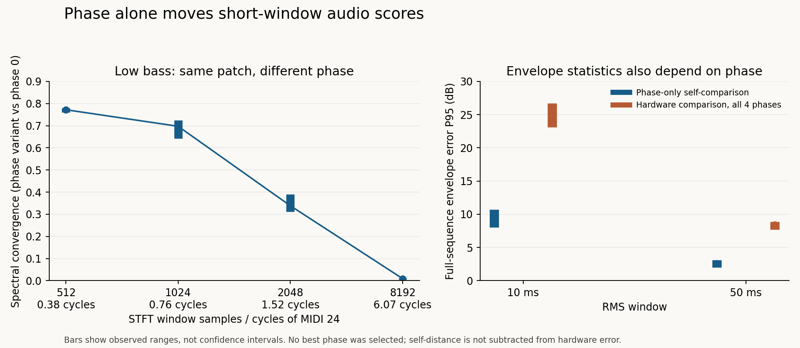

# Dry audio metrics: four-phase self-control

## Finding

**Short-window spectral and RMS distances are strongly sensitive to oscillator origin.** With the same frozen engine, patch and original MIDI, changing only global saw phase produces full post-training legacy spectral distances of **0.203–0.250** against phase zero. Hardware comparisons are **0.280–0.300**. The earlier distance near 0.28 therefore cannot be read as a percentage of audible mismatch.

This does **not** establish that the remaining hardware error is explained by phase. No best phase is selected, no self-distance is subtracted, and no equivalence margin is inferred. Phase changes can cause real attack and filter transients. The four fixed offsets do not represent every unknown hardware oscillator phase.



## Controlled inputs and validation

- Exactly four saw origins: 0, .25, .50, .75 cycles. Each profile sets only `waves.phase_cycles = [phase, 0, 0, 0, 0]`; the frozen engine's other default calibration, patch and MIDI stay fixed. No shipping DSP files were changed.
- All four binaries use one reconstructed source checkpoint, `b0f6c03`. The durable JSON includes every DSP/tool source hash, profile, renderer, raw render, patch, MIDI and decoder identity. Original hash-pinned MP3s are decoded privately for the run; decoder-dependent WAV hashes are recorded outputs, not required external inputs.
- Both phase-zero raw WAVs are byte-identical to the previously measured production Q0 replay: LP12 `e960507e…7484da`, LP24 `dd505cd6…56a33`.
- All eight renders are finite, have no full-scale samples and end with zero active voices. Raw peaks range from .21536 to .23701. The tiny stereo channel difference is at most 2.92e−11; comparisons use the left channel.
- Original deepsonic MIDI supplies 124 note-on/off pairs, velocity 127, with no channel controls. The sole omitted MIDI metadata event is FF20 channel-prefix 00; note timing is retained. FF54 SMPTE metadata is preserved. This remains a documented-recipe reconstruction, not an original SysEx patch.
- Frozen recipe: dry OSC1 saw, Q0, cutoff raw47, key follow raw74 (+100%), filter depth raw80 (+16), decay raw53, zero filter sustain, velocity-neutral envelopes, no effect or LFO depth. The original source documents a physical recipe without these exact raw values. See the [Q0 recipe audit](dry-end-to-end-2026-09-15.md).

## Fixed measurement policy

**Self-control:** compare every phase with phase zero at lag 0. Keep the common renderer latency and original MIDI time intervals. Primary gain is 1; a separate sensitivity uses one RMS scalar trained only on MIDI36 at 1.5 seconds, the exact reference/candidate gate **[66150,85444)** at 44.1 kHz. No per-note gain, phase, cutoff or timing fit occurs.

**Hardware comparison:** hold the physical 35 ms delay convention fixed. The candidate lookup is `candidate[t + lag]`, with `lag = round(93 + 44.1 − .035 × 44100) = −1406` samples. The 93 samples are renderer latency and 44.1 samples nominal filter attack. Hardware training remains [66150,85444); paired candidate training is [64744,84038). Fit one gain for each whole phase/slope replay and also retain the phase-zero hardware gain for every phase. This is the same declared convention as the [dry envelope replay](dry-envelope-engine-2026-09-15.md); no delay is selected from the new scores.

Training gains, dB:

| Phase | Slope | Self gain | Hardware gain |
|---:|---|---:|---:|
| 0.00 | LP12 | 0.00000 | 12.33397 |
| 0.00 | LP24 | 0.00000 | 11.75526 |
| 0.25 | LP12 | 0.00274 | 12.34153 |
| 0.25 | LP24 | 0.01764 | 11.76192 |
| 0.50 | LP12 | 0.05420 | 12.37871 |
| 0.50 | LP24 | 0.03982 | 11.78674 |
| 0.75 | LP12 | 0.05681 | 12.38999 |
| 0.75 | LP24 | 0.04333 | 11.78547 |

Held-out regions are evaluated separately: before training [0,1.45), after training [2,30.0408163), the same eight isolated note gates, seven complete chord gates, and seven late chord intervals [onset+.41,onset+.67). Negative-lag bounds crop the hardware interval consistently across phases. Exact bounds, frames and activity counts are in the JSON; no STFT frame spans an excluded region.

STFT uses Hann windows, hop one quarter, no extension or padding, and spectral convergence `norm(|candidate| − |reference|) / norm(|reference|)`. The inherited **legacy mean is 512/2048/8192**, not 512/1024/2048. This experiment adds 1024 separately and records both named means. At 44.1 kHz the four windows last 11.61/23.22/46.44/185.76 ms. Log errors use the inherited pairwise union activity mask and −80 dB floor; all activity counts remain available. RMS windows are 10/50 ms with a 220-sample hop; reported P95 is an absolute dB envelope error over union-active windows.

## Full post-training results

Legacy mean spectral convergence, evaluated on the same complete post-training region. All four phases are retained:

| Phase | Slope | Self gain 1 | Self training gain | Hardware training gain | Hardware phase-zero gain |
|---:|---|---:|---:|---:|---:|
| 0.00 | LP12 | 0.00000 | 0.00000 | 0.28616 | 0.28616 |
| 0.00 | LP24 | 0.00000 | 0.00000 | 0.29660 | 0.29660 |
| 0.25 | LP12 | 0.20930 | 0.20933 | 0.27989 | 0.27986 |
| 0.25 | LP24 | 0.20297 | 0.20319 | 0.30001 | 0.30000 |
| 0.50 | LP12 | 0.24969 | 0.25062 | 0.28774 | 0.28744 |
| 0.50 | LP24 | 0.23416 | 0.23478 | 0.29802 | 0.29794 |
| 0.75 | LP12 | 0.22078 | 0.22167 | 0.29195 | 0.29156 |
| 0.75 | LP24 | 0.21545 | 0.21611 | 0.29497 | 0.29489 |

Per-resolution self-control with gain 1:

| Phase | Slope | 512 SC | 1024 SC | 2048 SC | 8192 SC | 10 ms RMS P95 dB | 50 ms RMS P95 dB |
|---:|---|---:|---:|---:|---:|---:|---:|
| 0.25 | LP12 | 0.39236 | 0.25682 | 0.13363 | 0.10191 | 10.714 | 3.070 |
| 0.25 | LP24 | 0.38677 | 0.24646 | 0.12573 | 0.09642 | 9.583 | 3.141 |
| 0.50 | LP12 | 0.43172 | 0.29351 | 0.17805 | 0.13929 | 8.038 | 2.011 |
| 0.50 | LP24 | 0.42283 | 0.28174 | 0.15949 | 0.12016 | 8.220 | 1.988 |
| 0.75 | LP12 | 0.39549 | 0.26110 | 0.14757 | 0.11930 | 10.404 | 2.647 |
| 0.75 | LP24 | 0.38951 | 0.25081 | 0.14198 | 0.11484 | 9.385 | 2.482 |

The hardware 10 ms RMS P95 range is **23.08–26.70 dB**, versus **8.04–10.71 dB** in the nonzero-phase self-control. At 50 ms the ranges are **7.67–8.85 dB** and **1.99–3.14 dB**, respectively. These are observed ranges across the fixed grid, not confidence intervals. Phase sensitivity is substantial but does not erase the larger hardware envelope discrepancies. These envelope measurements also include silence thresholds, releases and transient effects and are not a listening threshold.

## Low notes and chords

MIDI24 is 32.7032 Hz. The four STFT windows contain only **.38/.76/1.52/6.07 fundamental cycles**. Means across its three held-out note gates at 0, .75 and 4.75 seconds show the resulting difference:

| Phase | Slope | 512 SC | 1024 SC | 2048 SC | 8192 SC | Mean 10 ms P95 dB | Mean 50 ms P95 dB |
|---:|---|---:|---:|---:|---:|---:|---:|
| 0.25 | LP12 | 0.76803 | 0.71886 | 0.31680 | 0.01021 | 9.776 | 1.264 |
| 0.25 | LP24 | 0.77182 | 0.71170 | 0.31243 | 0.00910 | 10.095 | 1.279 |
| 0.50 | LP12 | 0.77959 | 0.66929 | 0.38996 | 0.00738 | 12.132 | 1.846 |
| 0.50 | LP24 | 0.75916 | 0.64274 | 0.38419 | 0.00610 | 12.307 | 1.890 |
| 0.75 | LP12 | 0.77579 | 0.72514 | 0.31426 | 0.01136 | 9.701 | 1.315 |
| 0.75 | LP24 | 0.77721 | 0.71569 | 0.31175 | 0.01160 | 10.183 | 1.323 |

Longer windows substantially stabilize isolated low notes. They remain sensitive in passages containing changing note mixtures or transients. The following are means of the individual interval's 8192-sample SC, not pooled whole-audio measurements:

| Phase | Slope | Eight isolated notes | Seven full chords | Seven late chords |
|---:|---|---:|---:|---:|
| 0.25 | LP12 | 0.00608 | 0.08694 | 0.02776 |
| 0.25 | LP24 | 0.00619 | 0.06562 | 0.00508 |
| 0.50 | LP12 | 0.00368 | 0.15489 | 0.02801 |
| 0.50 | LP24 | 0.00293 | 0.11012 | 0.00651 |
| 0.75 | LP12 | 0.00577 | 0.12009 | 0.01993 |
| 0.75 | LP24 | 0.00671 | 0.11061 | 0.00332 |

## Independent harmonic control

The [joint quadrature harmonic control](dry-phase-harmonics-2026-09-15.md) uses the same renders, four fixed 80 ms windows per isolated note, phase-zero-only harmonic eligibility and common validity coverage. It retains 71/72 windows (31/32 LP12 held-out, 32/32 LP24 held-out, all eight training windows). Every rejected window remains visible.

Against phase zero, held-out H1–H16 ratio RMS is **.089–.103 dB for LP12** and **.265–.347 dB for LP24**. Fundamental amplitude with gain 1 is much more stable: **.005–.010 dB** and **.021–.029 dB**. Weak bins still matter: LP24 reaches 3.069 dB at a harmonic whose baseline level is −44.11 dB relative to H1. MIDI24 H2–H8 ratio RMS reaches .458 dB. A 1% total residual-power guard cannot guarantee each weak harmonic. The experiment cannot distinguish real phase-dependent transient dynamics from local estimator approximation in those bins.

## Consequence for fidelity work

Report each STFT resolution separately and interpret short-window/RMS errors with this phase control. Use longer isolated-note spectra and harmonic measurements with explicit weak-bin uncertainty alongside full-sequence measurements. The earlier envelope candidate comparisons remain measurements of those particular fixed-phase renders; this control does not quantify the phase stability of their ranking or invalidate independently observed hardware harmonic trajectories.

**Hardware output equivalence remains unestablished.** The recipe, capture response, compression and hardware phase remain uncertain; this experiment adds no exact raw patch or uncompressed hardware control. It neither promotes a DSP change nor selects a hardware phase.

## Reproduction and durable data

The primary JSON retains all four policies for every before/after, isolated and chord interval, including every SC/log statistic, RMS mean/P95, sample bound and active-bin count. Its compact STFT/RMS vectors have named column definitions. Raw audio stays outside Git. The JSON also pins the full local result, frozen experiment script, profiles, recipe and source manifests.

Run from the repository with Python 3.11, NumPy/SciPy, a C++ compiler and ffmpeg. The source directory needs only the original comparison MIDI and LP12/LP24 Q000 MP3s with the recorded hashes; output directories must be new:

```sh
OPENBLAS_NUM_THREADS=1 VECLIB_MAXIMUM_THREADS=1 python3 Tools/measure_dry_phase_sensitivity.py \
  --sources build-fidelity/deepsonic \
  --output build-fidelity/hardware-benchmark/dry-phase-control/NEW_RUN

OPENBLAS_NUM_THREADS=1 python3 Tools/analyze_dry_phase_harmonics.py \
  --experiment-dir build-fidelity/hardware-benchmark/dry-phase-control/NEW_RUN \
  --output NEW_HARMONICS.json

python3 Tools/plot_dry_phase_sensitivity.py \
  --results build-fidelity/hardware-benchmark/dry-phase-control/NEW_RUN/results.json \
  --output NEW_PHASE_PLOT.png
```

Artifacts: [complete interval data and provenance](dry-phase-sensitivity-2026-09-15.json), [harmonic observations](dry-phase-harmonics-2026-09-15.json). The original measured run is `build-fidelity/hardware-benchmark/dry-phase-control/run-01`. The measurement tool refuses a phase-zero production identity failure or source drift before reporting scores. This run exercised the complete build/render/measure pipeline; the generated plot was visually checked.
