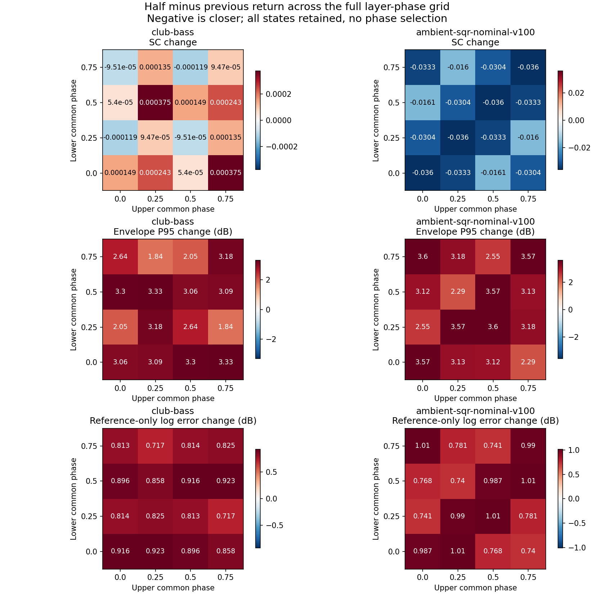

# Independent Upper/Lower phase sensitivity

**The half-return envelope regression persists across all 16 tested layer-phase states in both Club Bass and canonical Ambient SQR.** Allowing Upper and Lower to rotate independently changes the size of the regression, but does not reverse it. This extends the [common-phase audit](dual-reverb-phase-sensitivity-2026-09-15.md); it does not cover arbitrary individual oscillator phases or establish hardware equivalence.

## Frozen scope and controls

The full **4 × 4** grid uses Upper and Lower origins independently at **0, .25, .5, .75 cycles**. Within each layer, both classic oscillators share that origin. All 16 states were rendered for both previous return **0.8** and half return **0.4**, for both presets: **64 complete WAVs**. No state was selected, omitted or fitted to the reference. This is an exploratory sensitivity check declared after earlier reverb outcomes were known; its protocol was saved before these builds or scores.

Two isolated renderers start from frozen `b0f6c03`. Their only differences from that source are the audit-only common layer origins and, for the half-return build, the wet-return constant. Two explicit process environment values choose the origins once per process. No shipping DSP, plugin API, patch, MIDI, filter, delay, reverb network or feedback coefficient is edited.

The origins shift each classic waveform together with its BLEP/BLAMP correction. Normal oscillator clocks and note-to-note phase policy remain unchanged. Both patches use MIX, so the independent canonical SYNC clock is not involved. This is equivalent to shifting their initial waveform origins for these performances; it does not implement a new retrigger policy.

The [earlier source audit](dual-reverb-phase-sensitivity-2026-09-15.md#drysend-accumulation-audit) found no obvious extra DUAL-only dry/send multiplier: each already panned and leveled voice enters dry once and each send once. Unequal layer sends nevertheless permit different cancellations in `dry = U + L` and direct reverb input `sU × U + sL × L`. Club's reverb sends are **50/0**, Ambient's **43/112**. The independent grid addresses that ambiguity more directly than a common rotation.

All original MP3/SysEx and reconstructed MIDI hashes remain fixed. MP3s were decoded afresh; both comparison excerpts match the earlier source hashes. Club retains its 3.25-second phrase and first-quarter calibration. Ambient retains **nominal-v100**, source start 0, calibration end .405 s and duration .775 s. Its later first-gate-extension scenario is not included. All renders preserve channel 1, master level 100, stored patch tempo and a two-second tail.

For each layer pair, one previous-return prefix lag bounded to **±50 ms** and one prefix RMS gain are fitted and frozen for both returns. Primary evaluation uses identical later sample support within each pair. Hardware-only activity masks and the predeclared common-reference support `[calibration_end + 2205, excerpt_end − 2205]` samples provide the same diagnostics as the earlier audit. No candidate-specific gain, phase optimization, note retiming or EQ is used.

Controls passed:

- **All 16 diagonal WAVs and primary metric dictionaries exactly match** the earlier common-phase experiment, including the four original phase-zero previous/half candidates.
- Every complete WAV and render receipt hash was checked again after the run. All 64 renders are finite, below full scale and the output limiter knee, and end with zero active voices.
- All **32** simultaneous half-cycle comparisons, `(U,L)` versus `(U+.5,L+.5) modulo 1`, are exact negative PCM, with maximum `abs(x + y) = 0`. The 16 rendered states therefore provide eight distinct magnitude responses per preset/return, rather than 16 independent observations. No symmetry reduction was assumed before rendering.

## Results

All changes below are **half minus previous** under the same phase state; negative means a smaller error. Ranges cover the complete grid and are deterministic sensitivity ranges, not confidence intervals.

| Error change across all 16 states | Club Bass | Ambient SQR nominal-v100 |
|---|---:|---:|
| Envelope P95, dB | **+1.839 to +3.328**, all worse | **+2.288 to +3.597**, all worse |
| Envelope P95 on common reference support, dB | **+1.833 to +3.393**, all worse | **+2.763 to +3.743**, all worse |
| Hardware-mask log-spectrum error, dB | **+.717 to +.923**, all worse | **+.740 to +1.011**, all worse |
| Unmasked spectral convergence | −.000119 to +.000375; 4 improve, 12 worsen | −.036008 to −.016007; all improve |
| Stereo side-fraction error | +.001344 to +.001410; all worse | −.120742 to −.073096; all improve |
| Stereo balance error, dB | +.000551 to +.002404; all worse | −.587746 to −.151535; all improve |

Club's ordinary pair-specific log-spectrum error improves .938–1.048 dB in every state, while its hardware-only-bin error worsens in every state. Ambient's ordinary log metric changes sign across the grid (six improvements, ten regressions), while its hardware-only-bin error consistently worsens. Retaining both masks and unmasked spectral convergence avoids presenting the candidate-dependent activity mask as an unqualified improvement.

### Every envelope outcome

Entries are the paired envelope P95 change in dB. Rows are Lower phase; columns are Upper phase. All values are positive.

| Club Bass: Lower / Upper | 0 | .25 | .5 | .75 |
|---|---:|---:|---:|---:|
| 0 | +3.065 | +3.089 | +3.301 | +3.328 |
| .25 | +2.053 | +3.179 | +2.637 | +1.839 |
| .5 | +3.301 | +3.328 | +3.065 | +3.089 |
| .75 | +2.637 | +1.839 | +2.053 | +3.179 |

| Ambient SQR: Lower / Upper | 0 | .25 | .5 | .75 |
|---|---:|---:|---:|---:|
| 0 | +3.574 | +3.134 | +3.117 | +2.288 |
| .25 | +2.552 | +3.569 | +3.597 | +3.181 |
| .5 | +3.117 | +2.288 | +3.574 | +3.134 |
| .75 | +3.597 | +3.181 | +2.552 | +3.569 |

The experiment changes the phase-dependent mixture materially: Ambient's complete-render peak ranges .0597–.1221 and its fitted prefix gain ranges 7.393–11.342. The continued envelope regression is therefore not merely a duplicate of the common-phase measurements. Club's prefix gain ranges 1.813–1.827 and lag +.204 to +5.261 ms. **All 16 Ambient lags remain at the −50 ms search boundary.** The lag is an unresolved bounded nuisance fit, not a recovered recording delay. The conservative common-reference support retains the regression direction despite this limitation.



## What this identifies

The tested layer cancellation states cannot rescue the half-return envelope result in these two fixed reconstructed performances. Ambient's SC and stereo improvements coexist with its envelope and hardware-mask spectral regressions throughout the grid; Club's SC change remains tiny and mixed. No best-looking phase is proposed.

This does not bound continuous phase uncertainty or independent phase offsets between the two oscillators within a layer. Hardware phase policy, exact recorded patch revision, original MIDI/controllers and capture processing remain unknown. The SINGLE-versus-DUAL and neutral-versus-attenuated-damping distinction remains confounded. These outcomes supply no basis to exempt DUAL patches, infer Roland's send law, or claim equivalent output. Earlier supportive cases and these counterexamples should remain visible together.

## Reproduce

The run reuses the frozen input/source receipts from the existing common-phase and return-level experiments. Reproduce those prerequisite runs first if their ignored artifacts are absent; the [common-phase audit](dual-reverb-phase-sensitivity-2026-09-15.md#reproduce) gives its command and input dependencies.

```sh
OPENBLAS_NUM_THREADS=1 python3 Tools/compare_dual_layer_phase_sensitivity.py \
  --common-phase-run build-fidelity/hardware-benchmark/dual-reverb-phase/run-01 \
  --legacy-run build-fidelity/hardware-benchmark/reverb-gain-candidates/run-01 \
  --new-run build-fidelity/hardware-benchmark/reverb-new-preset-validation/run-01 \
  --sources build-fidelity/hardware-benchmark/sources \
  --output build-fidelity/hardware-benchmark/dual-layer-phase/reproduction
```

Recorded run: `dual-layer-phase/run-01`. Pre-build protocol SHA-256: `b5a72021526e7ea3fead65af7908c5197097f26921b447d476f9e1a02829261a`.

The [tool](../../../Tools/compare_dual_layer_phase_sensitivity.py) preserves the frozen source, exact two build diffs, profiles, explicit phase environment values, original input hashes, decoder commands, complete WAV/receipt hashes and every metric. The [durable JSON](dual-layer-phase-sensitivity-2026-09-15.json) retains the full result, all controls and range summaries. No shipping source changed and no phase was selected.
