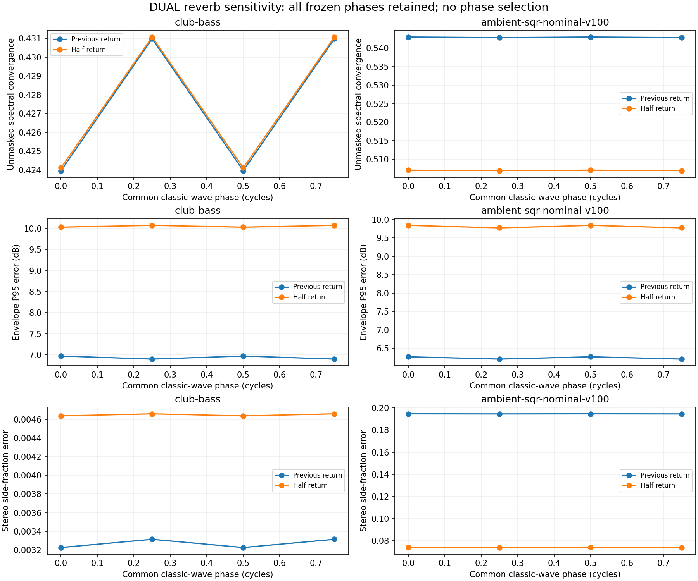

# DUAL reverb comparisons: common-phase sensitivity

**The envelope regressions in Club Bass and Ambient SQR persist under every tested common classic-oscillator phase.** No obvious DUAL-only dry/send multiplier was found. This narrow experiment does not disentangle keyboard mode from damping, or explore independent phase differences between oscillators and layers.

The protocol was written before new builds or scores. These are exploratory checks after the earlier return-level outcomes were known. No phase was selected, no prior outcome was discarded, and no shipping source or preset was changed.

## Dry/send accumulation audit

In the frozen `b0f6c03` engine, each voice's panned and leveled sample is accumulated once into dry L/R. The same sample enters the delay and reverb buses once, multiplied by that voice's respective send depth / 127. Part enable, expression, tone balance and patch level precede both paths. The reverb receives the combined stereo send and combined wet-delay return once. There is no additional DUAL-only factor in that accumulation.

This does not authenticate Roland's layer/headroom/send law. It also leaves a real cancellation ambiguity:

`dry = U + L`, while `direct reverb input = sU * U + sL * L`.

The layer sends differ: Club Bass reverb U/L is **50/0** and delay is 65/20; Ambient SQR reverb is **43/112** and delay is 40/40. Cancellation in dry can therefore leave a substantial effect input. A scalar output gain cannot remove that change in the dry/wet ratio.

The five supportive active-reverb references in the earlier comparison are SINGLE patches; the two contrary/mixed, attenuated-damping references here are DUAL. Their outcomes therefore cannot be attributed uniquely to damping or layer mode.

## Frozen experiment

Eight isolated builds start from `b0f6c03`: common classic-wave phase **0, 0.25, 0.5, 0.75 cycles**, each with previous return 0.8 and half return 0.4. The existing bounded `phase_cycles` profile sets all five classic waveform origins together; no other profile field is supplied. Waveform and BLEP/BLAMP correction move together.

This preserves the engine's normal phase policy: reset initializes oscillator clocks, and note triggering does not reset classic phases. Both patches use classic oscillators in MIX mode, so the separate canonical SYNC clock is not involved. It is a common waveform-origin shift; it does **not** explore arbitrary independent oscillator/layer phase offsets, inactive-clock policies or hardware randomness.

The exact published SysEx, frozen MIDI, original MP3 and comparison excerpts are pinned. Original MP3s are decoded afresh and their cropped source WAVs must reproduce the earlier source hashes. Club uses its unchanged 3.25 s phrase and first-quarter calibration; Ambient uses the original nominal-v100 scenario, duration 0.775 s and calibration end 0.405 s. The later first-gate-extension case is not included. Both preserve master level 100, MIDI channel 1, stored patch tempo and the complete two-second render tail.

For **each phase**, one previous-return prefix lag bounded to ±50 ms and one prefix RMS gain are fit, then frozen across the previous/half pair. Both use identical later sample supports. No candidate-specific gain, note timing, phase fit or EQ is allowed. Reference-only activity masks and a conservative common-reference-support check were also declared before scoring.

All four phase-zero complete WAVs are byte-identical to the previously frozen previous/half candidates. Their primary scores reproduce the earlier **fixed-previous-gain** scores exactly. These differ slightly from earlier tables using candidate-specific prefix gains; the distinction is intentional.

## All phase outcomes

Each pair is **previous / half return**. Lower errors indicate closer agreement under these fixed assumptions. SC is unmasked spectral convergence, not a fidelity percentage.

| Preset | Common phase | SC | Envelope P95 error dB | Prefix lag |
|---|---:|---|---|---:|
| Club Bass | 0 | .423962 / .424112 | 6.969 / 10.034 | +5.261 ms |
| Club Bass | .25 | .430980 / .431074 | 6.896 / 10.075 | +0.680 ms |
| Club Bass | .5 | .423962 / .424112 | 6.969 / 10.034 | +5.261 ms |
| Club Bass | .75 | .430980 / .431074 | 6.896 / 10.075 | +0.680 ms |
| Ambient SQR nominal-v100 | 0 | .543031 / .507023 | 6.266 / 9.840 | −50 ms, bound |
| Ambient SQR nominal-v100 | .25 | .542873 / .506894 | 6.204 / 9.773 | −50 ms, bound |
| Ambient SQR nominal-v100 | .5 | .543031 / .507023 | 6.266 / 9.840 | −50 ms, bound |
| Ambient SQR nominal-v100 | .75 | .542873 / .506894 | 6.204 / 9.773 | −50 ms, bound |

Half return worsens Club's envelope P95 by **3.065–3.179 dB**, and Ambient's by **3.569–3.574 dB**. Ambient retains its SC and stereo-side-fraction improvements; Club's SC changes are tiny and adverse. All five summary errors and complete measurements are retained in the JSON.

The identical half-cycle scores have a concrete explanation. A post-score control compares each 0/.5 and .25/.75 complete PCM pair at both returns: **all eight pairs are exact polarity inversions, with maximum `abs(x + y)` equal to zero**. The four grid points thus provide only two distinct responses for these magnitude-based metrics. This explanatory check did not select a phase or refit anything.

### Mask and evaluation-support checks

Club's ordinary pair-specific log-spectrum metric improves by about 0.97–1.04 dB, but the same bins are not necessarily active for both models. With a mask determined solely by hardware, its log-spectrum error instead **worsens 0.825–0.916 dB**. Ambient's hardware-mask log error worsens 0.987–0.990 dB. The unmasked SC includes candidate-only energy; the hardware-only mask omits it, so neither view should replace the other silently.

The conservative cross-phase diagnostic evaluates the same reference support `calibration_end + 2205` through `excerpt_end − 2205` samples, accounting for the predeclared maximum lag. It retains the envelope-regression direction: Club **+3.193–3.255 dB**, Ambient **+3.424–3.426 dB**. This check prevents small phase-dependent support changes from explaining the result. Ambient's alignment remains at the search boundary in all four phases; the analysis does not treat that lag as a recovered recording delay.

## Interpretation

This excludes the tested common phase origin as a rescue for the two contrary envelope results. It does not exclude an independent Upper/Lower or oscillator-relative phase effect: common rotations preserve many relative phase relationships. The source audit excludes an obvious extra DUAL-only accumulator multiplier, not every possible layer calibration error.

Keep the prior SINGLE improvements and these DUAL counterexamples together. The data supplies no basis to exempt DUAL patches, select a better-looking phase, infer a damping normalization rule, or claim matched hardware output.



## Reproduce

```sh
OPENBLAS_NUM_THREADS=1 python3 Tools/compare_dual_reverb_phase_sensitivity.py \
  --legacy-run build-fidelity/hardware-benchmark/reverb-gain-candidates/run-01 \
  --new-run build-fidelity/hardware-benchmark/reverb-new-preset-validation/run-01 \
  --sources build-fidelity/hardware-benchmark/sources \
  --output build-fidelity/hardware-benchmark/dual-reverb-phase/reproduction
```

Recorded run: `dual-reverb-phase/run-01`; pre-build protocol SHA-256 `9d55b5afbfcc6d5f279422c843fa02ff7acaf97b43bc2146deb3ab9aa2979e77`.

The [tool](../../../Tools/compare_dual_reverb_phase_sensitivity.py) preserves all copied source/profile/build hashes and guarded original inputs. The [durable JSON](dual-reverb-phase-sensitivity-2026-09-15.json) retains the full run and explanatory polarity-control data with reproducible control code. Sixteen complete renders are finite, unclipped and end with zero active voices. Equivalence remains unestablished.
