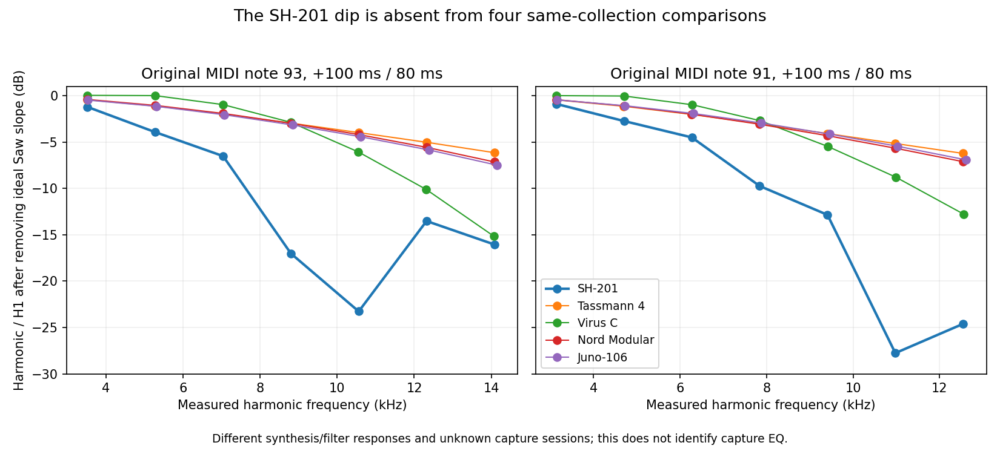

# High-note comparisons from the same filter collection

## Finding

The SH-201's high-note harmonic dip and subsequent rebound are absent from
four other original recordings in the creator's filter collection. This weakens
an explanation based on a universal coloration applied to the whole collection.
It **does not exclude a different SH-201 capture path** or identify which
SH-201 synthesis stage produces the shape.



The graph removes the ideal Saw's `1/h` harmonic slope, normalizing each window
to its fundamental. It compares the observed combined responses; it does not
divide out each instrument's filter or estimate capture EQ.

## Original recordings and fixed protocol

The [creator's filter comparison](https://www.deepsonic.ch/deep/htm/deepsonic_analytics_filter_comparison.php)
links the SH-201, AAS Tassmann 4, Access Virus C, Clavia Nord Modular and Roland
Juno-106 recordings under a common one-Saw, no-effects, filter-envelope recipe
and original performance MIDI. The
[source audit](deepsonic-capture-chain-controls-2026-09-15.md) retains exact
URLs, acquisition hashes, tags, decoder receipts and the substantial capture
provenance limits. All five selected files are mono 44.1 kHz/320 kb/s MP3s
tagged 2010; a common tag is not proof of a common session.

Comparator selection came from the source inventory before inspecting their
spectra: one software synthesizer, two virtual analog units and one analog
unit. An exploratory spectrum inspection confirmed octave-unshifted carriers
near the expected original MIDI pitches. The formal descriptive protocol then
freezes notes 93 and 91, centers at +100 and +160 ms, and 60/80 ms widths for
every recording. These are overlapping views of two notes, not eight independent
observations per instrument.

Each source/note estimates one local fundamental within ±1% of nominal on its
first 80 ms window and reuses that value for every other window. Main harmonics
below 20 kHz have quadratic complex amplitudes; no alias model, gain, EQ,
cross-source time shift or DSP candidate is fitted. The carrier refinement
includes changing filter phase and cannot be interpreted as oscillator tuning.
Exact note/velocity identities are checked against the original MIDI.

## Fixed neighboring-harmonic contrasts

These ranges cover all four width/time views per note. Positive values denote
a rebound after the SH-201's observed dip. The contrasts use Saw-slope-removed
levels; they describe sampled harmonics rather than locate a continuous notch.

| Source | Note 93: H7 − H6 | Note 91: H8 − H7 |
| --- | ---: | ---: |
| SH-201 | +9.72 to +9.76 dB | +3.13 to +3.16 dB |
| Tassmann 4 | −1.16 to −1.05 dB | −1.17 to −1.07 dB |
| Virus C | −4.55 to −4.02 dB | −4.20 to −3.98 dB |
| Nord Modular | −1.89 to −1.38 dB | −1.86 to −1.45 dB |
| Juno-106 | −2.06 to −1.42 dB | −2.06 to −1.46 dB |

H5–H8 coefficient SNR proxies remain at least 18.57 dB for SH-201 and
30.19 dB for the comparators. Maximum harmonic-model residual power fraction
is 0.000225 across all 40 windows. Those residual-based proxies include aliases
and other unresolved components; they are not confidence intervals or evidence
that the entire waveform is identified.

Independent additive controls plant smooth or notched harmonic shapes at both
pitches with a +0.5% carrier shift. The complete refinement/window procedure
recovers H1–H8 within 3.5e−12 dB in these noise-free controls. This checks the
harmonic estimator; it does not model the source codecs or capture circuits.

## Interpretation limits

The different filters need not reach equivalent cutoff states at these times.
Their audio onset offsets, raw patch values and original recording routes are
not authenticated. Smooth additional filtering could also conceal features of
a shared response. Consequently, the comparison does not identify a transferable
capture correction, establish an SH-201 pre-filter waveform, or justify adding
the observed dip to every oscillator. The separate slope/time evidence still
constrains the SH-201's combined high-note response.

**Decision:** keep the SH-201 spectral shape as an instrument-specific recorded
constraint. Continue testing oscillator/filter mechanisms; do not apply a
collection-wide capture-EQ correction. No shipping DSP change follows from
this comparison alone.

## Reproduce

[Tool](../../../Tools/inspect_filter_collection_high_notes.py) and
[full measurements](filter-collection-high-notes-2026-09-15.json).

```sh
OPENBLAS_NUM_THREADS=1 python3 Tools/inspect_filter_collection_high_notes.py \
  --sources build-fidelity/deepsonic \
  --comparators build-fidelity/public-waveforms/deepsonic-capture-chain-2026-09-15/acquisition-comparators.json \
  --output build-fidelity/deepsonic/collection-high-notes-replay
```

The retained `collection-high-notes-v2` adds the plotted figure without changing
any v1 measurement or control. All source MP3s are hash-checked and freshly
decoded. Exact input, output, tool, MIDI-parser, receipt and window identities
are preserved. The figure has been visually inspected. Original audio remains
local and is not committed.
