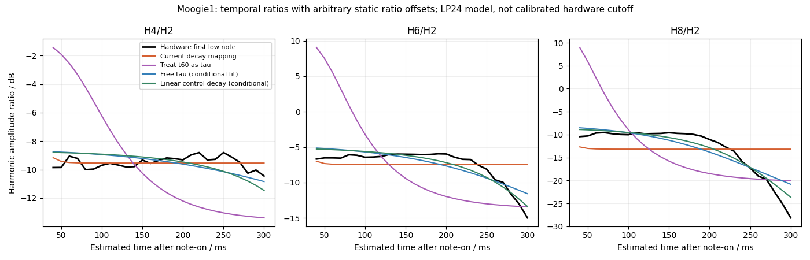

# Why the bass references stay brighter: conditional filter-envelope evidence

The clearest finding is that **the reference's brightness stays high substantially longer** than the current filter-envelope mapping permits. For Moogie 1, the engine maps upper CUTOFF 30 to 102.83 Hz and DEPTH +22 to a peak of 1157.02 Hz. DECAY 49 maps to 57.38 ms *to −60 dB*, an exponential time constant of only **8.31 ms**. Consequently the modeled cutoff is already 106.58 Hz after 35 ms and 102.86 Hz after 75 ms. These are computations from Septum's chosen mappings, not Roland specifications.

In three opening hardware low Eb notes, H8/H2 stays near **−10 dB through 150 ms**, then falls to approximately −17 to −19 dB at 250 ms and −21 to −25 dB at 270–290 ms. H6/H2 remains near −6 dB through approximately 200 ms before falling. This delayed spectral change is a reproducible reason to investigate filter-envelope timing and shape, alongside cutoff scaling.



## Documented settings and unresolved calibration

The downloaded Roland patch has these raw values:

| Tone | Cutoff | Resonance | Filter A/D/S/R | Depth |
|---|---:|---:|---|---:|
| Moogie upper | 30 | 0 | 0 / 49 / 0 / 0 | +22 |
| Moogie lower | 47 | 0 | 0 / 37 / 0 / 127 | +15 |
| Dist upper | 36 | 31 | 0 / 64 / 0 / 0 | +22 |
| Dist lower | 57 | 0 | 0 / 37 / 0 / 127 | +15 |

**Every filter sustain is zero.** The lower tone's 127 is release, not sustain. Both patches use dual tones and LPF/−24 dB. Roland supplies the parameter addresses/ranges and describes how cutoff, resonance and ADSR affect the sound, but the inspected owner/MIDI manuals do not give cutoff-in-Hz, resonance-Q or envelope-time calibration tables. The service tests inspected concern controls and audio operation, not numerical synthesis curves. Additional public searches found no verified SH-201 filter/time calibration dataset. [Official recording/bank association](https://www.rolandus.com/go/sh-201_patches/patch_bass.html), [MIDI Implementation](https://static.roland.com/assets/media/pdf/SH-201_MI.pdf), [Owner's Manual pp. 34–38, 60–61](https://static.roland.com/assets/media/pdf/SH-201_OM.pdf)

Moogie upper is PULSE + SINE; lower is SQUARE + TRIANGLE, with overdrive disabled. If the square and triangle are symmetric and the path is linear, harmonics 2, 4, 6 and 8 above the fundamental isolate the upper pulse. **This is an assumption:** Roland's triangle description inconsistently mentions even harmonics in both English and Japanese, and the isolated hardware waveform remains unmeasured. See [the waveform audit](oscillator-semantics.md). Fixed pulse duty, LOW FREQ shelf, recording EQ and gain affect each ratio by a constant; they do not explain its change over time under those assumptions. Nonlinearity, waveform asymmetry and undisclosed controllers can invalidate the isolation.

## Held-out comparison of decay hypotheses

The reusable analysis fits **only the first low note**, at 0.029 seconds. The notes at 0.939 and 1.901 seconds are held out. They receive the same fitted timing and per-ratio constant offsets, without refitting either. All cases retain the current base/peak cutoff mapping; no engine parameters or shipping presets were changed.

The first model assumes the analog equivalent of Septum's two SVF stages at resonance zero, with damping 2 and 1.2. Numbers below are RMS errors of H4/H2, H6/H2 and H8/H2 temporal trajectories, in dB. They are diagnostic residuals, not hardware-accuracy scores.

| Envelope hypothesis | Time parameter | Training note | Held-out note 2 | Held-out note 3 |
|---|---:|---:|---:|---:|
| Current exponential in cutoff-control amount | 8.31 ms tau | 3.306 | 3.248 | 2.549 |
| Interpret the existing −60 dB duration as tau | 57.38 ms tau | 6.147 | 6.415 | 6.178 |
| Fitted exponential in cutoff-control amount | 265.58 ms tau | 1.615 | 1.923 | 1.232 |
| Fitted linear segment in cutoff-control amount | 418.99 ms duration | 1.092 | 1.583 | 0.945 |
| Fitted exponential in cutoff Hz | 134.66 ms tau | 1.361 | 1.741 | 1.065 |

Thus a **roughly 0.4-second linear control segment is a supported diagnostic candidate** at raw D=49 and the current cutoff/depth mapping. Multiplying decay time by 6.907 is not supported: it sweeps through the measured frequency band too early and performs worse on both held-out notes.

The result is not unique. Substituting an ideal fourth-order Butterworth low-pass gives a fitted linear duration of **397.53 ms**, with errors **0.375 / 1.178 / 0.708 dB**. An exponential-in-Hz model under that topology also generalizes, at **123.92 ms tau**, with errors **0.714 / 1.265 / 0.576 dB**. These different models have similar held-out behavior. They cannot establish the hardware's topology, resonance law or global decay curve.

## Archived exploratory bounds and sensitivity

The following broader probes are archived in the JSON report. They were run in the scratch research analysis and are **not regenerated by the reusable CLI below**; that CLI reproduces the held-out table and a separate training-note-only window/shift sensitivity sweep.

A separate pooled fit over all three notes was repeated with 30/40/60/80 ms windows, ±20 ms timeline shifts, and each note individually. Under the current SVF topology and fixed base/peak, the fitted linear duration ranges approximately **383–493 ms** across these deterministic perturbations. The individual-note fits are 419, 442 and 411 ms. This is a sensitivity range, not a statistical confidence interval; overlapping analysis frames are correlated.

When base cutoff and peak amount are also fitted, identifiability deteriorates. Several exponential models hit imposed bounds of 20 kHz peak or twelve octaves of depth. Across plausible low-pass variants the **effective cutoff around 300 ms** often lies near 190–230 Hz, but the asymptotic base and initial peak differ widely. This conditional frequency estimate must not be substituted for a measured hardware cutoff table.

The full recordings do not provide a clean late sustain to resolve the ambiguity. Moogie's final held Eb near 14.85–15.30 seconds keeps H8/H2 near −10 dB substantially longer than the opening notes, followed by a pitch bend. The recording may contain control changes; treating that segment as the same fixed envelope would be unjustified. Dist's longer holds include clear pitch bends, and its upper overdrive regenerates harmonics after filtering. A reliable independent estimate of lower-tone D=37 or the Dist resonance law cannot be obtained from these mixtures in this audit.

## Reproduce

```sh
OPENBLAS_NUM_THREADS=1 python3 Tools/analyze_hardware_filter_envelope.py \
  --hardware build-fidelity/hardware-benchmark/comparison-final/moogie-1/hardware-decoded-full.wav \
  --output /tmp/moogie-filter-audit
```

The script requires NumPy and SciPy and downloads nothing. It reads float PCM, fits a fundamental in 38–39 Hz for each note, then estimates twelve harmonic amplitudes by simultaneous least squares with a constant and linear nuisance term. Default windows are 40 ms, spaced by 10 ms, starting at note-on +40 ms and ending before note-off −35 ms. Only the first note estimates the constant per-ratio offsets and time parameter; the others remain held out. It reproduces the main held-out table and its own training-note-only sensitivity sweep. Formulas, source hashes, observations and the separately archived exploratory probes are preserved in [the JSON report](filter-envelope-conditional-fit.json).

A diagnostic engine candidate can test a roughly 0.4-second linear filter decay at D=49, with other values explicitly interpolated. That would be an empirical experiment. These observations do not establish the remaining slider values, the amplifier/pitch envelope curves, or a uniquely calibrated replacement for the filter model.
