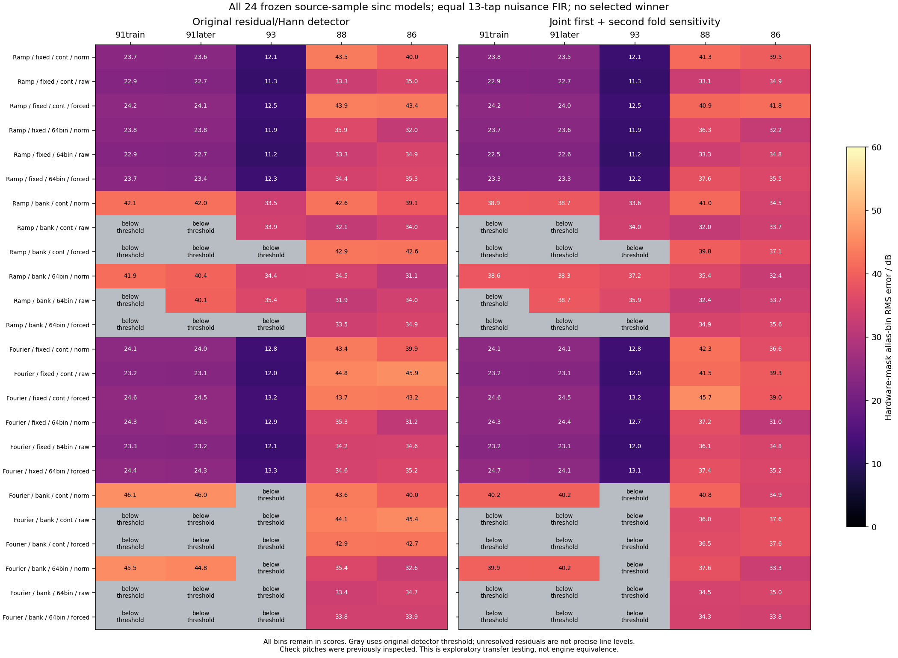

# High-note Saw: eight-source-sample sinc models

## Result

**None of the 24 frozen, waveform-trained candidates reproduces the measured
alias pattern across pitches.** The tested finite lookup, cutoff bank and
unity-base approximation do not resolve the earlier mismatch. No oscillator
model is selected and no production DSP is changed.

All 120 passage predictions, coefficients, source identities, per-line levels,
detector flags and source-free control failures are retained in the
[complete audit](high-note-sinc-models-2026-09-15.json). The final numerical run,
including controls, took 378.1 seconds. This is a failed bounded mechanism
probe, not evidence against every possible table-based oscillator.



## What was frozen

The [proposal and amendments](windowed-sinc-interpolation-proposal-2026-09-15.md)
define a 24-row factorial:

- Two 32-sample source tables: sampled ramp and finite Fourier saw.
- Constant half-source-rate cutoff or a fixed pitch-selected cutoff bank.
- Continuous fractional lookup or 64-bin left lookup.
- Normalized convolution, raw convolution, or the unity-base approximation
  applied to the **same raw weights**.

Every row uses eight source samples, the same declared continuous Hann/sinc
kernel, and 13 signed output FIR taps at offsets −6…+6. This FIR includes gain
and remains an unidentified source/filter/capture contribution. These are
mathematical waveform models, not actual-engine renders or oscillator-only tests.

The [primary-source audit](roland-integrated-interpolation-patent-2026-09-15.md)
motivates the mechanism. It does not associate the patent with the SH-201 or
supply the coefficients used here. N32, the two source tables, Hann window,
lookup rounding and arithmetic precision are declared experimental choices.
The implied root pitch is 1378.125 Hz. The fixed bank gives `q=1/3` on notes 91/93
and `q=0.5` on notes 88/86; the `q=0.25` branch is exercised synthetically only.
Neither the root nor bank thresholds were fitted to the source.

Only the LP12 Q0 note 91 window, MIDI onset 18.75 s +100 ms, trains taps, gain,
phase and DC. The same taps/gain then transfer to note 91 +160 ms, note 93
onset 18.25 s +100 ms, note 88 onset 19.75 s +100 ms, and note 86 onset 19.25 s
+100 ms. Those passages fit phase/DC only. All windows contain 3528 samples
at 44.1 kHz, centered directly on the stated MIDI offsets; no extra onset shift
is added. All five sample hashes and original hardware line masks match the
earlier [wavetable study](high-note-wavetable-models-2026-09-15.md).

All check pitches were previously inspected. This is exploratory transfer
testing, not untouched validation. The two note 91 windows overlap 20 ms.

## Outcome across every row

Training residual waveform power ranges from **0.05021% to 0.05843%**, but
training H2…H8/H1 magnitude RMSE remains **3.78–5.07 dB**. Small total power
error does not imply accurate weaker harmonics or aliases.

The smallest training alias-bin RMS error across all 24 rows is **22.86 dB**.
Every row has at least one different-pitch error of **33.95 dB or more**. The
joint first-plus-second-fold sensitivity gives corresponding minima of 22.54
and 33.97 dB. These are descriptive extrema, not model selections or acceptance
thresholds.

The following paired continuous-lookup ramp rows illustrate the three weight
policies; every Fourier/64-bin result is retained in the plot and JSON.

| Cutoff / weights | 91 training | 91 later | 93 | 88 | 86 |
| --- | ---: | ---: | ---: | ---: | ---: |
| Constant / normalized | 23.75 | 23.63 | 12.09 | 43.53 | 40.05 |
| Constant / raw direct | 22.86 | 22.73 | 11.29 | 33.27 | 35.01 |
| Constant / forced base | 24.19 | 24.07 | 12.49 | 43.94 | 43.42 |
| Banked / normalized | 42.11 | 41.96 | 33.50 | 42.56 | 39.12 |
| Banked / raw direct | 44.38 | 44.23 | 33.87 | 32.06 | 33.95 |
| Banked / forced base | 41.38 | 41.22 | 33.01 | 42.92 | 42.56 |

Values are RMS dB errors at the original hardware-qualified alias positions.
Several banked rows produce no candidate line passing the complete original
detector on a passage; the plot marks those cells below threshold. Their raw
residual-bin values remain in the JSON/table but are **not precise attenuation
measurements**. Other cells can also mix resolved and unresolved bins. Inspect
the per-line flags rather than treating all large errors as equally precise.

The raw-direct/forced-base definitions isolate the base substitution before
fitting. Their separately trained nuisance FIR and phase can compensate parts
of that difference, so differences between final scores are not a direct
measurement of that component's audible effect.

## Measurement policy

The original unchanged residual/Hann detector supplies the hardware-only mask:
9, 9, 8, 11 and 13 first-descending 44.1 kHz fold lines in passage order. Every
eligible hardware position remains in the candidate comparison. No candidate
threshold may delete a difficult comparison, and no new alias-specific fitting
weights are introduced.

A second measurement jointly fits main harmonics and both first/second fold
families, then scores the **same first-descending mask**. Higher-fold components
serve as nuisance terms; this does not claim that the hardware contains every
modeled component. As in the [separation audit](saw-alias-separation-2026-09-15.md),
center amplitudes and Hann-window averages are different measurements when a
signal changes. Their disagreement is a sensitivity result, not a correction
or statistical confidence interval. Both methods leave large cross-pitch
failures for every candidate.

## Controls, failures and corrections

Two source-free runs stopped before any hardware audio was loaded. Both are
embedded in the durable audit rather than discarded.

1. **Continuity guard failure:** the first test incorrectly demanded continuity
   from forced-base interpolation. With raw weight sum `s`, this branch differs
   from raw convolution by `(1−s)*Y0`. When the leftmost base sample advances,
   that term can jump even with continuous lookup. The corrected test checks
   the analytic jump using circular source indices; direct convolution retains
   its continuity check. The model definitions did not change.
2. **Single-basin phase-search failure:** the second run's Fourier/floor64
   planted case reached 3.21e−6 other-note relative power error, exceeding the
   fixed 1e−6 gate. Refining only the best coarse phase was insufficient in the
   presence of almost equivalent phase/FIR shifts. That run's planted signals
   also reused the fitted design helper, so it did not satisfy the intended
   independent-synthesis requirement.
3. **Frozen correction before hardware:** full planted waveforms now come from
   a separate scalar interpolation implementation and `np.convolve(valid)`.
   The search retains up to 16 strict cyclic local coarse minima, including a
   global-minimum fallback, and refines each with three 65-point grids. Only
   training loss selects the phase. The gate remains 1e−6. Independent floor64
   controls also use 4096 coarse phases instead of 256. No hardware check score
   selected a phase-search change or coefficient basin.

The final run passes:

- Every hardware training matrix has rank 14; maximum condition number 39.84.
- All 12 planted training cases, 36 other-note predictions and six dense-search
  comparisons pass; maximum other-note error power is 4.993e−13.
- Scalar kernel, circular indexing, exact/neighboring lookup bins, coefficient
  sums and shifted FIR columns pass their numerical identities. The sum is not
  silently normalized in raw branches.
- All 20 frozen historical comparator predictions reproduce their earlier PCM
  hashes exactly. These references retain their old coefficients/phase solver;
  they were not refitted or substituted for a new factorial row.

The separate [independent math/control review](windowed-sinc-math-independent-review-2026-09-15.json)
checks all 24 core models, full waveform/FIR reconstruction, lookup bins, saved
planted predictions and historical hashes. Its independently generated full
waveforms agree within 3.89e−16 absolute amplitude; saved planted error powers
agree within 4.94e−20. It does not rerun the optimizer or establish global
optimality of the bounded phase search.

## Decision and limits

Retain the 24 candidates as failed exploratory fits. Do not change the production
Saw, infer a global alias boost, or transplant this patent's illustrative rates
into an SH-201 cutoff law.

The negative result applies to the specified tables, kernels, lookup policy,
normalization/base choices, phase search and waveform-power objective. It does
not exclude arbitrary source tables, alternate interpolation kernels, coefficient
quantization, other banks, a different fitting objective or a frequency-dependent
source/filter stage. The short signed FIR cannot identify where coloration
occurs. Unknown capture transfer, lossy source encoding and effective high-note
filter behavior remain limitations. No patent/firmware identity, universal DSP
sample-rate conclusion or whole-instrument equivalence follows.

## Reproduce

The source MP3 and original MIDI must match the pinned acquisition catalog.
Use fresh output directories:

```sh
OPENBLAS_NUM_THREADS=1 python3 Tools/fit_high_note_sinc_models.py \
  --sources build-fidelity/deepsonic \
  --output build-fidelity/high-note-shape/sinc-replay
python3 Tools/summarize_high_note_sinc_models.py \
  --run build-fidelity/high-note-shape/sinc-replay \
  --output build-fidelity/high-note-shape/sinc-replay/summary
```

The [fitter](../../../Tools/fit_high_note_sinc_models.py) freezes the protocol
before controls and loads hardware only after the numerical gates pass. The
[summary tool](../../../Tools/summarize_high_note_sinc_models.py) preserves every
model and can recover the earlier failed-control receipts from the durable
audit if the original scratch directories are absent. Original recordings and
decoded PCM remain outside version control. No production source changed. Invalid training rows would remain flagged in the
summary and plot without replacement; descriptive extrema use valid rows only.
All 24 rows in this run are valid.
