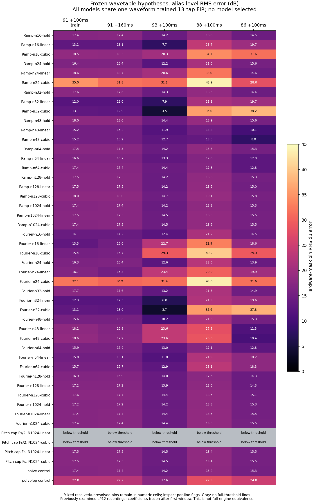

# High-note Saw: finite wavetable and interpolation hypotheses

## Result

**None of the 48 frozen, waveform-trained table/FIR models reproduces the measured
alias pattern across these pitches.** This supplies negative evidence against
the tested simple table families. It does not identify Roland's oscillator
algorithm, exclude arbitrary wavetable synthesis, or justify a DSP change.

All models, coefficients, source hashes, per-line levels and detection flags are
retained in the [complete results](high-note-wavetable-models-2026-09-15.json).
No model was selected and no production source was changed.



## Falsifiable hypothesis and fixed experiment

A periodic table with fixed contents has a spectrum indexed by waveform harmonic
number. Interpolation shapes that spectrum and creates additional table-image
harmonics. For a table of length `N`, continuous left-hold and linear lookup have
coefficients proportional to `DFT(table)[h mod N] × sinc(h/N)` and
`DFT(table)[h mod N] × sinc(h/N)^2`, respectively; left hold also adds a half-cell
delay. Sampling the resulting waveform folds harmonics above output Nyquist into
audible frequencies. This differs from correcting a discontinuity over a fixed
number of output samples. A fixed table and interpolation rule therefore make
testable cross-pitch predictions once their common downstream transfer is frozen.

The declared family contains:

- **42 fixed tables:** lengths 16, 24, 32, 48, 64, 128 and 1024; either sampled
  ramp values `2n/N−1`, or a finite Fourier saw with harmonics `1…N/2−1`;
  periodic left hold, linear, or four-point cubic Lagrange interpolation.
- **Four pitch-dependent tables:** 1024 samples, with a deterministic harmonic
  cap of `floor(Fs/(2f0))` or `floor(Fs/f0)`, using linear or cubic interpolation.
- **Two controls:** naive Saw and ordinary two-sample polyBLEP.

**Every model, including both controls, uses the same 13-tap signed FIR allowance.**
Tap offsets are −6…+6 samples. These coefficients absorb known main-spectrum
coloration; they are not identified as an oscillator, filter or recording-chain
implementation. This experiment does not contain new oscillator-only or actual
engine renders. The prior equal-FIR polyBLEP result is reproduced below.

The [fitting tool](../../../Tools/fit_high_note_wavetable_models.py) saves the
protocol before fitting hardware. Each model fits its taps, gain, DC and phase
only on LP12 Q0 note 91 at MIDI onset 18.75 s +100 ms. The phase search uses 256
fixed grid points plus bounded refinement. Taps and gain then remain frozen;
only phase and DC may vary for the other passages. There is no alias-specific
objective and no selection using validation results.

| MIDI note | Original onset | Window center relative to MIDI onset | Role |
| --- | ---: | ---: | --- |
| 91 | 18.75 s | +100 ms | Training |
| 91 | 18.75 s | +160 ms | Later same note |
| 93 | 18.25 s | +100 ms | Different pitch |
| 88 | 19.75 s | +100 ms | Different pitch |
| 86 | 19.25 s | +100 ms | Different pitch |

Each window contains exactly 3528 samples, or 80 ms at 44.1 kHz. These offsets
refer to the original MIDI time directly; **no further 35 ms shift is added to
the sample positions**. The known approximate physical-onset delay is used only
when checking window coverage against the original gates. Original velocity is
127. The MIDI parser must pair all 124 original notes. The two note-91 windows
overlap by 20 ms. All passages have been examined in earlier studies, so the
different-pitch passages are held out from coefficient fitting, not blind data.

## Measured outcome

The smallest training waveform residual is 0.04818% of centered hardware power.
Nevertheless, the smallest training alias-bin RMS error among all 48 models is
11.98 dB. Every model has at least one different-pitch alias-bin RMS error of
13.47 dB or more. These are descriptive extrema across the complete declared
family, not acceptance thresholds or a selected winner.

The following rows illustrate the frozen outcomes; the plot and JSON preserve
all 48. Errors are RMS dB differences over the fixed hardware alias mask.

| Model, always with 13-tap FIR | Training waveform error | 91 +100 ms | 91 +160 ms | 93 | 88 | 86 |
| --- | ---: | ---: | ---: | ---: | ---: | ---: |
| Ramp N32, linear | 0.05869% | 11.98 | 11.97 | 7.91 | 21.05 | 19.72 |
| Fourier N32, cubic | 0.04818% | 13.09 | 13.00 | 3.73 | 35.62 | 37.78 |
| Pitch cap Fs, N1024 linear | 0.38563% | 17.46 | 17.50 | 14.52 | 18.36 | 15.50 |
| Pitch cap Fs/2, N1024 linear | 0.05748% | Below threshold | Below threshold | Below threshold | Below threshold | Below threshold |
| Ordinary polyBLEP control | 0.05219% | 22.82 | 22.70 | 17.58 | 27.95 | 24.82 |

The N32 cubic Fourier row has the smallest training waveform loss, but that
does not establish waveform equivalence: its H2…H8/H1 magnitude RMSE on that
same window is 6.08 dB. A power-weighted fit can neglect quiet harmonics and
aliases. Its 3.73 dB alias result on note 93 also fails to transfer to notes
88 and 86. It has eight resolved candidate lines out of the hardware mask's
11 and 13 lines on those notes. Missing lines remain in the score.

Specific examples show why a single matching dip is insufficient. Values below
are level relative to each signal's fitted fundamental:

| Hardware-qualified line | Hardware | N32 cubic Fourier/FIR | Difference |
| --- | ---: | ---: | ---: |
| Note 91, parent harmonic 23, 8036.42 Hz | −68.60 dB/H1 | −52.65 dB/H1 | +15.96 dB |
| Note 93, parent harmonic 19, 10660 Hz | −64.67 dB/H1 | −62.79 dB/H1 | +1.88 dB |
| Note 88, parent harmonic 28, 7181.71 Hz | −72.09 dB/H1 | −71.80 dB/H1 | +0.29 dB |

Even the apparent note-88 dip match coexists with a 35.62 dB aggregate alias-bin
error for that passage. Neither an isolated notch nor low total error power
supports promoting this model.

Both Nyquist-capped 1024-point variants produce **no line passing the complete
detector threshold** on any tested hardware-mask position. Their raw residual-bin
errors exceed 98 dB in some rows, but those numbers are not precise attenuation
measurements. The plot marks the rows below threshold. These variants fail to
provide the observed first-fold alias family at its measured levels.

## Measurement and numerical checks

The unchanged [alias detector](../../../Tools/analyze_deepsonic_saw_aliases.py)
subtracts fitted main harmonics, then searches for genuine interior Hann-spectrum
peaks near the first descending `44100−h×f0` branch. The hardware alone determines
the mask: 9, 9, 8, 11 and 13 lines in passage order. A peak must be within ±6 Hz,
at least 12 dB above its local residual median, and at least −75 dB/H1. All masked
positions remain in candidate scores even if the model has no detectable line.
An unresolved candidate value is a residual upper-bound proxy, not a reliable
line amplitude. No arbitrary 32/48 kHz rate or recording-chain identity is fitted.

The independent [simultaneous alias audit](saw-alias-separation-2026-09-15.md)
supports retaining this detector for the earlier frozen kernel comparisons:
including both first and second fold families changes LP12 hardware levels by
at most 0.520 dB. That audit does not calibrate an uncertainty interval for every
new table prediction. The quieter lines retain lower confidence than strong
partials, and extra folds or nonstationarity may contaminate individual bins.

Implementation controls:

- Four-point Lagrange interpolation reproduces degree-0…3 polynomials with
  maximum absolute error `2.22e−16`.
- Independently integrated continuous Fourier coefficients match the expected
  hold/linear interpolation formulas to `1.50e−8` maximum complex error across
  30 cases, including table images.
- Three planted table/FIR signals, including a pitch-dependent harmonic cap,
  recover a different-pitch waveform with at most `1.94e−17` relative error
  power. This checks waveform recovery, not uniqueness of the FIR/phase split.
- All 48 hardware training matrices have rank 14; maximum condition number is
  137.18, below the frozen `1e6` exclusion guard.
- The equal-13-tap ordinary polyBLEP control reproduces all 50 line comparisons
  in the earlier FIR audit within `8.11e−12` dB, with identical hardware sample
  hashes and masks.

## What remains unresolved

This run tests two standard table contents, three interpolation rules, seven
lengths, two deterministic pitch caps and one waveform-fitting objective. It
does not test arbitrary table contents, phase-increment quantization, arbitrary
table banks, other resamplers, or a jointly alias-weighted fit. Negative results
for these candidates cannot reject all table-based oscillators.

A frequency-dependent source or filter remains possible. The results do not
favor it over untested tables, and the common FIR cannot locate the observed
coloration within the instrument or capture chain. The
[capture-source review](deepsonic-capture-chain-controls-2026-09-15.md) likewise
does not establish the 2010 recording path. Raw patch values, maximum-cutoff
behavior, capture transfer and lossy encoding remain limitations. No firmware
identity, global sample-rate claim or full-engine equivalence follows.

**Decision:** retain these candidates as failed exploratory families. Do not
change the production Saw or fit another global alias boost from these scores.

## Provenance and reproduction

The original MIDI and LP12 Q0 MP3 must match the
[acquisition catalog](deepsonic-acquisition-2026-09-15.json). The tool freshly
decodes the pinned MP3 to mono float PCM using ffmpeg, verifies sample rate and
finite samples, and saves source, decoder-command, decoded-WAV, per-window,
tool and helper identities. Original audio is not committed.

Use a fresh output directory, then regenerate the durable summary:

```sh
OPENBLAS_NUM_THREADS=1 python3 Tools/fit_high_note_wavetable_models.py \
  --sources build-fidelity/deepsonic \
  --output build-fidelity/high-note-shape/wavetable-replay
python3 Tools/summarize_high_note_wavetable_models.py \
  --results build-fidelity/high-note-shape/wavetable-replay/results.json \
  --output build-fidelity/high-note-shape/wavetable-replay/summary
```

The retained run is `build-fidelity/high-note-shape/wavetable-v1`. The
[summary tool](../../../Tools/summarize_high_note_wavetable_models.py) asserts
protocol identity, fitting-tool identity, declared model count/rank, planted
cross-pitch recovery and historical control agreement. The complete JSON embeds
the full run plus these checks; it retains all candidates with
`selected_model: null`.
