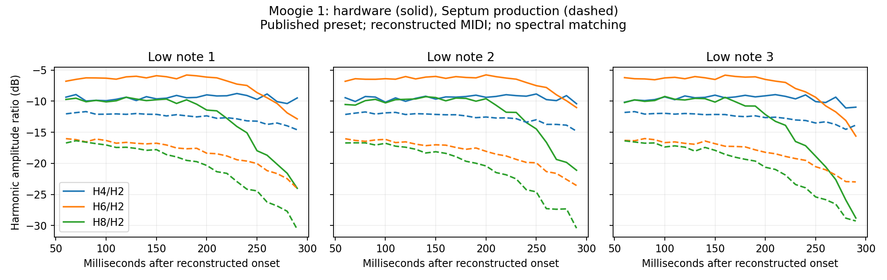

# Moogie 1 residual oscillator/filter shape

**Conclusion:** changing pulse width alone cannot explain the remaining even harmonics. A resonant LP24 can reproduce a selected subset, but its prediction fails additional harmonics that were withheld from that fit. These recordings therefore do not identify a unique new waveform or resonance correction. An independently proposed triangle-polarity change gives Moogie only a small overall improvement and worsens its odd-harmonic match. This audit changes no production DSP or preset.

## Evidence and source identity

The [official BASS page](https://www.rolandus.com/go/sh-201_patches/patch_bass.html) associates [Moogie 1's MP3](https://www.rolandus.com/go/sh-201_patches/mp3/BASS/TOP8_Moogie1.mp3) with the named preset in the [100 BASS bank](https://www.rolandus.com/go/sh-201_patches/shl/SH-201_Patch_BASS.zip). The MP3 SHA-256 is `32a354043a57a6cac3b85d6366dbe9cb253a67964f478f412ee2ceab38505e9e`; the ZIP hash is `782e04766bec4dc8b8485e82499a0a7f12fe2408a8a04141a5e1db098c7f36fc`. The association does not authenticate the exact patch revision or processing used in the recording, and original MIDI remains unavailable.

The [MIDI Implementation p. 5](https://static.roland.com/assets/media/pdf/SH-201_MI.pdf) and Roland's public [Editor 1.10](https://static.roland.com/assets/media/dmg/SH201_Editor110_osx.dmg) agree on the waveform IDs. In `PatchOsc.xml`, square is 1, pulse is 2, triangle is 3 and sine is 4. Moogie 1's Upper block contains pulse+sine, PW57, MIX, BOOST, LP24, cutoff30, resonance0, filter A0/D49/S0/R0/depth+22. Lower contains square+triangle, MIX, FLAT, LP24, cutoff47, resonance0, A0/D37/S0/R127/depth+15. Both tones' filter velocity/key follow and LFO depths are zero. Thus published patch modulation does not explain the even-harmonic discrepancy.

The [Owner's Manual pp. 28 and 30](https://static.roland.com/assets/media/pdf/SH-201_OM.pdf) describes a square with odd harmonics, a sine without overtones, and pulse width controlling the high portion of a rectangular cycle. The triangle's “even harmonics” wording also appears in the Japanese manual; it remains inconsistent with a mathematically symmetric triangle and is not an isolated hardware measurement. Source hashes and editor reading-copy locations are retained in [the oscillator semantics audit](oscillator-semantics.md). Triangle polarity and relative oscillator initialization are not specified by these sources.

Inputs are the **archived production-linear benchmark**, not an assertion about whatever executable currently occupies the build path:

| Input | Local path under `build-fidelity/hardware-benchmark/filter-implementation/after/moogie-1-octave-revision/` | SHA-256 |
|---|---|---|
| Decoded hardware | `hardware-decoded-full.wav` | `46fa72b890e918f1d62b2a467cb6dc11aade820167879ba6a19b2930c71e1502` |
| Production render | `septum-raw.wav` | `29ab1181af4bb9c20b4befe2a04f95df9d6a678117221110da90efab011003b9` |
| Complete preset | `original-patch.syx` | `33d39a6b1cbf47abd830ecf879e1ef6774b50eb6a4eb4db6997749f4f7cffabc` |
| Reconstructed performance | `reconstructed-performance.mid` | `9d77bb66f59b7cc304208830b99608cc86271c29cf5976a9a558c4c3c6ccbbc7` |

The analyzed low-note intervals are 0.029–0.400, 0.939–1.315 and 1.901–2.245 seconds. Harmonic frequencies are estimated from each recorded note, near 38.6 Hz. Septum windows include its retained 93/44100-second latency. This audit does not determine which MIDI note number produces that frequency under a revised coarse-tuning interpretation.

## A constraint that pulse-width changes cannot overcome

Let `Rn = |Hn/H2|`. For an ideal rectangular pulse with duty `d`, let `a = |cos(2πd)|`:

```text
P4/P2 in magnitude = a
P6/P2 in magnitude = |4a² − 1| / 3 = b
b ≤ max(1/3, a), for every 0 ≤ a ≤ 1
```

For a monotonically falling linear response, its relative magnitudes satisfy `0 ≤ A6 ≤ A4 ≤ 1`. Consequently:

```text
R6 = b A6 ≤ max(A6/3, a A6) ≤ max(1/3, R4)
```

This includes nonresonant low-pass filtering and a monotonically falling low-frequency boost shelf; absolute gain and pulse phase cancel. Under the symmetric-waveform assumption, Lower square/triangle have no even harmonics, and Upper sine has only H1, so their relative phases cannot change this test. Time-varying filtering, an additional even-harmonic source, nonmonotone recording response or nonlinear processing can violate its assumptions.

At 150 ms after each onset, with 60 ms analysis windows:

| Note | Hardware H4/H2 | Hardware H6/H2 | Hardware H8/H2 | Hardware exceeds bound | Production exceeds bound |
|---|---:|---:|---:|---:|---:|
| 1 | −9.64 dB | −5.91 dB | −9.78 dB | +3.63 dB | −7.23 dB |
| 2 | −9.68 dB | −6.03 dB | −9.42 dB | +3.52 dB | −7.48 dB |
| 3 | −9.04 dB | −6.52 dB | −10.15 dB | +2.52 dB | −7.30 dB |

The positive bound excess survives separate left/right channels, 40/60/80 ms windows, 12/24/40 modeled harmonics, and linear harmonic-amplitude variation inside 60/80 ms windows. Across these checks it ranges **+2.47 to +3.69 dB**. Main-window harmonic-fit residual power is approximately 0.2–0.4%. Short 40 ms windows with independent amplitude ramps are ill conditioned and are deliberately excluded; the tool rejects condition numbers above 100.



## Isolation and resonance hypotheses

Diagnostic renders retain the original MIDI and modify only explicitly recorded preset fields or master level. Their WAVs, manifests and byte-change records are under `/tmp/septum-hw-benchmark/oscillator-shape/`. A master20 dual render has the same harmonic ratios as master100 production. Upper-only changes the first note's H4/H2, H6/H2 and H8/H2 by about 0.02, 0.15 and 0.20 dB; it does not remove the roughly 10 dB sixth-harmonic mismatch. Lower-only measured even power is 38–45 dB below its odd power in these windows; its small residual comes from the finite-window/dynamic-filter measurement, not evidence of an extra oscillator source. This rejects ordinary output limiting or linear Lower-phase interference as the explanation in the current engine.

Resonance is still a plausible *model family*. No free harmonic offsets or recording EQ were fitted. The following models use rectangular pulse coefficients and the existing BOOST shelf approximation, fitting only the first low note; the other two retain the same parameters:

| Conditional model | Fitted harmonic ratios | Note 1 RMS | Note 2 RMS | Note 3 RMS |
|---|---|---:|---:|---:|
| Existing duty, pole damping and cutoff trajectory | H4/H2, H6/H2, H8/H2 | 8.09 dB | 8.57 dB | 7.61 dB |
| Duty only, existing filter | Same three | 3.90 dB | 4.10 dB | 4.02 dB |
| Free duty, exponential cutoff trajectory, one variable pole damping | Same three | 2.00 dB | 1.97 dB | 2.58 dB |
| Free duty, cutoff trajectory, equal variable pole dampings | Same three | 1.53 dB | 1.67 dB | 2.05 dB |
| Equal variable pole dampings, now including H10/H2 and H12/H2 | Five ratios | 2.71 dB | 3.07 dB | 3.06 dB |

The three-ratio, equal-damping fit has duty approximately 0.70874, `k=0.62676` for both second-order stages (`Q≈1.60`), and `cutoff(t)=392.52 exp(−1.91347t)` Hz. But its **withheld H10/H2 and H12/H2 predictions are 9.7–13.2 dB too weak on average**, with 11.0–13.7 dB RMS error across notes. Fitting those additional harmonics nearly doubles inferred initial cutoff to 733.25 Hz and the decay slope to 3.94243/s. The apparently good three-ratio fit therefore does not uniquely establish the hardware filter or pulse shape.

Base cutoff and full linear-control decay duration are also exactly confounded until the sustain floor is reached: `cutoff=peak·exp(−log(peak/base)·t/T)`. For the three-ratio fit, base20, base50 or base100 Hz imply full durations 1.556, 1.077 or 0.715 seconds and produce the same analyzed trajectory. These are equivalent hypotheses, not measured envelope durations. The model also retains an unmeasured BOOST shelf and ignores possible recording processing. **Do not promote a new resonance-at-zero or pulse-width law from this fit.**

## Independent triangle-polarity check

The isolated renderer `build-fidelity/hardware-benchmark/dist-waveform-diagnostics/triangle-polarity/SeptumRenderMidi` inverts triangle polarity, including its BLAMP correction, without altering another waveform. It was proposed from Dist Bs 1, not fitted to Moogie. The Moogie render preserves the exact MIDI/SysEx hashes above, master100, sample rate and tail. Its WAV is `/tmp/septum-hw-benchmark/oscillator-shape/moogie-triangle-invert-master100.wav`, SHA-256 `a446941ae2b9535734ede448a595f2ca299a975088c739be33c7f857d3725889`.

| Moogie measure | Archived production | Triangle inverted | Hardware |
|---|---:|---:|---:|
| Whole 3.7 s power centroid, 20–16000 Hz | 60.75 Hz | 61.66 Hz | 75.54 Hz |
| Note 1 H2–H8/H1 RMS error | 6.94 dB | 6.66 dB | Reference |
| Note 2 H2–H8/H1 RMS error | 7.32 dB | 7.11 dB | Reference |
| Note 3 H2–H8/H1 RMS error | 6.66 dB | 6.45 dB | Reference |
| Note 1 odd H3/H1, H5/H1, H7/H1 RMS error | 3.88 dB | 4.29 dB | Reference |
| Note 2 odd-ratio RMS error | 4.44 dB | 5.02 dB | Reference |
| Note 3 odd-ratio RMS error | 4.07 dB | 4.64 dB | Reference |

The even ratios normalized to H2 barely change. Normalized 160–320 Hz power rises from −18.49 to −17.73 dB of total 20–16000 Hz power; hardware is −13.09 dB. At 320–640 Hz the corresponding values are −24.95, −24.37 and −18.13 dB. Thus the polarity change gives a small broad improvement while moving H3 farther from hardware. This is a useful cross-preset limitation, not strong validation of globally correct relative triangle phase.

## Reproduction and limits

Run the self-contained [analysis tool](../../../Tools/analyze_moogie_oscillator_shape.py) against the retained audio:

```sh
OPENBLAS_NUM_THREADS=1 python3 Tools/analyze_moogie_oscillator_shape.py \
  --comparison build-fidelity/hardware-benchmark/filter-implementation/after/moogie-1-octave-revision \
  --diagnostics /tmp/septum-hw-benchmark/oscillator-shape \
  --triangle-render /tmp/septum-hw-benchmark/oscillator-shape/moogie-triangle-invert-master100.wav \
  --output Docs/fidelity/source-audits/moogie-oscillator-shape.json
```

The optional diagnostic folder and triangle argument can be omitted to reproduce the core pulse-bound/filter analysis. The [JSON](moogie-oscillator-shape.json) contains input hashes, frame observations, robustness checks, fit bounds/parameters, withheld-harmonic errors, diagnostic hashes and full normalized band statistics. Triangle comparison validates identical MIDI, SysEx and replay settings before analysis. The plotted audio is neither EQ-matched nor compressed or time-warped.

The harmonic estimator was checked against a synthetic 12-harmonic signal: maximum amplitude error was `2.35e-15`. An independent 100,000-duty/random-monotone-response check found no violation of the derived pulse bound. Candidate fitting uses seeded numerical searches and does not prove a unique global optimum. Fits use note1 only, but all three notes belong to the same recording and had already been used to assess the preceding envelope change; repeated-note results are not a new independent hardware dataset.

The next discriminating hardware evidence would be dry isolated Upper pulse, Lower square and Lower triangle recordings, with filter bypass and then fixed cutoff/resonance0. Those would separate extra source harmonics, relative phase and nonmonotone filtering. Until then, retain these residuals as unresolved rather than fitting a static harmonic correction into the instrument.
