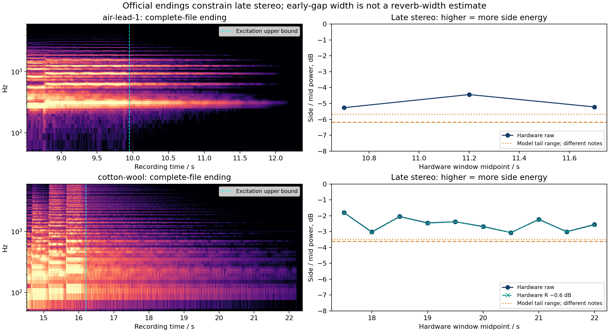

# Official complete-file reverb tails

**Cotton's complete hardware decay is wider than the production control, while its early gaps were narrower.** Air's late hardware tail is also slightly wider. The complete endings therefore constrain a proposed universal reduction in reverb-return width. They do not establish a replacement width value: original excitation histories and recorded patch/controller/capture state remain unknown.

The [opening/control audit](official-stereo-feasibility-2026-09-15.md) explains the mismatch during notes. The [full tail JSON](official-reverb-tails-2026-09-15.json) retains every analyzed window, band power, coherence, stationarity flag, channel correction and source hash. No parameters were fitted.



## Source and coverage

The complete official MP3s were decoded privately to stereo float32 at44.1kHz, without gain or clipping. The decoder version/hash and resulting WAV hashes are recorded; only original MP3 identity is required to reproduce the analysis.

| File | Duration | Original MP3 SHA-256 |
|---|---:|---|
| [Air Lead1](https://www.rolandus.com/go/sh-201_patches/mp3/LEAD/TOP8_AirLead1.mp3) | 12.565s | `eda084781108d6de6961f6b6807fff283eac097173b5675dc52c678dc2ad3d3b` |
| [Cotton Wool](https://www.rolandus.com/go/sh-201_patches/mp3/PAD/TOP8_Cotton_Wool.mp3) | 23.171s | `abf9d3ad400119ab0546fd724ab7a7442ea724bb164f8e9d024c642c791a1379` |

Inspection of the spectrogram and50ms RMS history puts the last obvious new Air pitch near8.70–8.85s, followed by held sound until approximately9.9s. The conservative last-excitation upper bound is9.95s. Primary windows10.95–11.45 and11.45–11.95s start at least1s after this bound. The extra10.45–10.95s window is an earlier sensitivity, only0.5s after the bound. All three are more than1s after the observed pitch onset. The ending after12s accelerates toward silence and is not used to identify a natural decay law.

Cotton's final obvious pitched attack is near15.60–15.80s. Strong excitation has ended by the conservative16.20s bound. Ten0.5s windows start at17.25s and end at22.25s. The last is below the declared level guard and remains in the result. The visually edited final drop near22.2s and the remaining low-level end material are not used as a reverb-decay measurement. These are coarse audio observations, not recovered note-on/off events.

The model controls use the existing unchanged reconstructed performances, with final note-offs3.445s(Air) and4.75s(Cotton). Their windows are1–2s after those events, removing the known93-sample renderer latency. The model's first note group, pitches and final chord differ from the complete hardware endings. No temporal alignment or amplitude matching between these unrelated tails is claimed.

## Fixed measurements and guards

Side/mid power uses mid=(L+R)/2 and side=(L−R)/2. Channel cosine describes zero-lag normalized cross-power. Per-band magnitude-squared coherence averages18 overlapping4096-sample Hann STFT frames per0.5s window; overlapping frames are not independent observations.

Each row retains an operational level guard(RMS≥−65dBFS), a second-half level-rise guard(≤+1dB), and an octave-power-shape guard(cosine≥0.90 between normalized first/second-half band distributions). These exploratory guards were chosen after inspecting coverage and before computing the band trajectories. They are not perceptual thresholds and cannot prove that no note was played. Every row remains visible. Bands80–160,160–320,320–640,640–1280,1280–2560,2560–5120 and5120–10240Hz include their power fractions so negligible bands need not be interpreted.

All primary Air and the first nine Cotton windows pass. Air half-window spectral-shape cosine is0.986–0.999 in the primary windows; Cotton's is0.949–0.992. Every window decays between halves. Cotton's last22s-centered window has RMS−68.26dBFS and fails only the level guard. This provides useful sustained-tail coverage, while retaining frequency-dependent decay and modulation as limitations of strict stationarity.

## Trajectory

| Hardware interval(s) | RMS dBFS | Side/mid dB | Channel cosine |
|---|---:|---:|---:|
| Air10.45–10.95, earlier sensitivity | −33.36 | −5.27 | .542 |
| Air10.95–11.45 | −42.83 | −4.44 | .473 |
| Air11.45–11.95 | −57.43 | −5.22 | .543 |
| Cotton17.25–17.75 | −36.05 | −1.80 | .207 |
| Cotton17.75–18.25 | −39.68 | −3.02 | .338 |
| Cotton18.25–18.75 | −43.36 | −2.05 | .234 |
| Cotton18.75–19.25 | −47.00 | −2.45 | .279 |
| Cotton19.25–19.75 | −50.90 | −2.38 | .268 |
| Cotton19.75–20.25 | −54.00 | −2.68 | .303 |
| Cotton20.25–20.75 | −57.89 | −3.07 | .339 |
| Cotton20.75–21.25 | −61.11 | −2.23 | .254 |
| Cotton21.25–21.75 | −64.86 | −3.01 | .334 |
| Cotton21.75–22.25, low-level sensitivity | −68.26 | −2.55 | .290 |

The model Air tail is−5.68/−6.18dB side/mid, cosine.575/.612; model Cotton is−3.48/−3.61dB, cosine.381/.394. These controls are narrower than the corresponding late hardware trajectories. They are **not matched-output differences**, because the excitation spectra differ.

Cotton's fixed early right-channel imbalance is tested separately by lowering hardware R by0.6dB. Every late side/mid value moves less than0.03dB; the conclusion is unchanged. This is a capture sensitivity, not a DSP width change. Air's early passage is already wet, so it supplies no equally clean channel-gain estimate and receives no such correction.

The caution also appears within energetic Cotton bands. Across the nine primary windows, hardware320–640Hz side/mid is approximately−1.40…−0.04dB, with14–29% of total STFT power; the model controls are−4.70/−4.26dB in that band. At640–1280Hz the hardware is+0.40…+2.03dB, with4–10% power, versus model−7.35/−7.21dB. This is frequency-dependent behavior, not a single global stereo-gain discrepancy. Harmonic excitation and wet/dry proportions remain different, and other bands vary substantially with time.

## Implication

A narrower global reverb-return hypothesis can improve early wet/dry balances while moving its late output away from these recorded stereo statistics. The experiment should retain both outcomes and the nine other preset checks. The evidence motivates investigating wet contribution and frequency-dependent decay/routing, rather than selecting a width from one early gap. No original FDN topology or universal width is identified here; the broad equivalence goal remains unproven.

## Reproduction

After generating the fixed controls from the [opening audit](official-stereo-feasibility-2026-09-15.md):

```sh
OPENBLAS_NUM_THREADS=1 VECLIB_MAXIMUM_THREADS=1 python3 Tools/assess_official_reverb_tails.py \
  --corpus build-fidelity/hardware-benchmark/final-production-linear-lfo \
  --sources build-fidelity/hardware-benchmark/sources \
  --controls build-fidelity/hardware-benchmark/stereo-feasibility/run-02 \
  --output build-fidelity/hardware-benchmark/stereo-feasibility/tails-reproduction
```

The tool decodes hash-pinned original MP3s into the new output directory; it does not require another machine's decoded WAV container hash. The production controls are hash-verified against their manifest. Recorded run:`stereo-feasibility/tails-02`. All code is tracked; raw audio remains in the ignored build directory.
