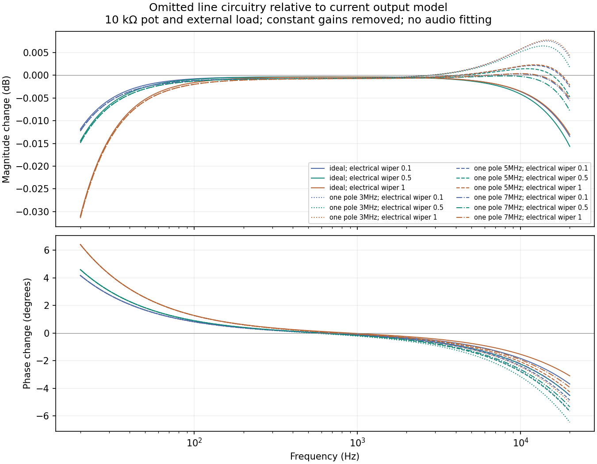

# Omitted line circuit: calculated response

**The omitted small-signal stages make a very small magnitude change.** Across
144 declared electrical scenarios, the largest change relative to the current
normalized reconstruction model is 0.046 dB from 20 Hz to 20 kHz. Phase changes
reach 10.13 degrees in the broad sensitivity grid. These are circuit predictions,
not audibility thresholds or measurements of a complete SH-201.

The [primary-source audit](output-stage-primary-sources-2026-09-15.md) traces the
original Roland schematic and amplifier datasheets. The calculation includes
the loaded reconstruction input, volume coupling/pot, shared line/phones input
loading, line driver, output coupling, series resistors, RF capacitors and an
explicit external load. It assumes normal unmuted operation with **both stereo
line jacks inserted**. L/MONO alone joins the two driver paths and is outside
this independent-channel calculation.

## Declared cases and normalization

- Nominal pot: 10k. The original sweep also retains 20k, 50k and 100k as broad
  resistance sensitivities; those values are not alternative authenticated
  SH-201 parts. The source audit subsequently corroborated nominal 10k.
- Electrical wiper fractions: 0.1, 0.5 and 1. These do not identify knob angles.
- External loads: 10k, 20k and 100k. Benchmark recording loads are unknown.
- Amplifiers: ideal, or a one-pole open-loop sensitivity with 100 dB DC gain
  and 3/5/7 MHz bandwidth. These are declared exploratory bounds, not an exact
  M5218/KIA4559 model at the SH-201's ±8 V rails. The M5218's published typical
  DC gain is 110 dB at different supply conditions.
- Remove only constant nominal amplifier gain and resistive pot/load loss.
  No frequency anchor, hardware recording, gain fit or EQ fit selects a case.

Finite amplifier gain is solved **inside** the active reconstruction feedback
loop. It is not appended as an unrelated low-pass. Ferrite beads are treated
as wires at audio frequencies, not as the resistance of their RF impedance
rating. Unpopulated parts are omitted. The normal phones input resistor branch
still loads the master wiper when headphones are unplugged.

## Nominal 10k pot, full volume, 10k external load

The table shows the ideal-amplifier case relative to the present circuit,
after the specified constant-gain normalization.

| Frequency | Magnitude change | Phase change |
| --- | ---: | ---: |
| 20 Hz | −0.03101 dB | +6.420° |
| 1 kHz | −0.00040 dB | −0.027° |
| 20 kHz | −0.01305 dB | −3.094° |

The passive coupling networks slightly reduce bass; they do not explain
several dB of missing upper-bass or midrange body. Nevertheless, phase changes
can affect transient peaks, so actual full-engine renders are needed before
judging whether their effect matters for the user's listening observations.



## Independent verification and reproduction

The existing simplified input-coupling approximation differs from the fully
loaded ideal reconstruction circuit by at most 0.000164 dB and 0.000331°.
An [independent node-equation review](output-stage-math-independent-review-2026-09-15.md)
solves all 144 cases at 801 frequencies, with explicit physical nodes, amplifier
feedback and output resistors. Its largest complex discrepancy from this tool
is 2.34e−15; magnitude/phase summary differences remain below 3.02e−14.

```sh
python3 Tools/analyze_output_stage_circuit.py \
  --service /tmp/septum-hardware-fidelity/service.pdf \
  --output build-fidelity/output-stage-investigation/new-circuit
```

The tool requires the pinned original service-document hash and writes its
protocol before calculating results. Use a fresh output directory. The
[compact receipt](output-stage-circuit-calculation-2026-09-15.json) retains every
scenario, source/tool pins, selected-frequency values and original result hash.
No production DSP or preset is changed by this calculation.
