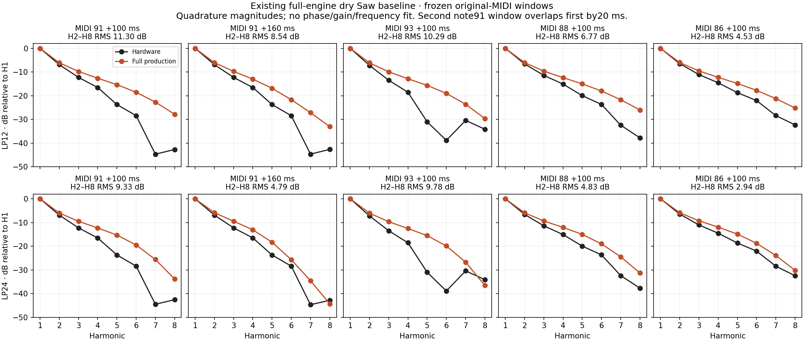

# Full-engine high-note Saw baseline

**The existing complete engine still has a substantial upper-harmonic and alias mismatch.** Its filter/output stages improve some harmonic ratios relative to the earlier oscillator-only comparator, but do not reproduce the recorded notches. This receipt measures existing audio only. No new rendering, waveform/phase fit, coefficient search or production edit was performed.

## Frozen inputs and measurements

The original Deepsonic single-Saw Q0 LP12/LP24 recordings and original 124-note MIDI are hash-pinned in the [acquisition receipt](deepsonic-acquisition-2026-09-15.json). The full-engine outputs are the default `production` renders from `build-fidelity/envelope-hypothesis/dry-v2`, with the existing [dry recipe](dry-end-to-end-2026-09-15.json): Single Upper, OSC1 Saw only, Q0, cutoff47, key follow74 (+100%), depth80 (+16), filter decay53, zero filter sustain, zero modulation depths, no overdrive/delay/reverb. Filter/AMP/pitch settings and original note events remain unchanged. This is a physical recipe reconstruction, **not the original unit's SysEx**; capture transfer is unknown.

Both WAVs, original MIDI, complete reconstructed SysEx bytes, renderer, build manifest, all frozen build inputs and original source hashes were verified. The native renderer uses `b0f6c03` DSP, an empty default calibration profile, and the ordinary complete voice/output path. Current DSP differs only by the subsequent reverb return0.8→0.4 correction and its comment; reverb is off with a fresh reset here. The exact current-source diff is retained. Thus these are applicable dry shipping baselines, not a claim that the older binary was compiled from the current revision.

| Baseline | Complete float32 stereo WAV SHA-256 |
|---|---|
| LP12 | `e960507e6c9404554980eceae90d51e1253347d22fbe7e661f48730dce7484da` |
| LP24 | `dd505cd6a020417a5b86c52083a8dd6091b3f18edbad7c28a0de431df2356a33` |

All original MIDI channel events are note messages: 124 on/off pairs, with every selected gate checked. The sole omitted event remains the documented FF20 channel-prefix metadata. Both renders are finite, have zero active voices at end, and extend beyond the final MIDI event. Left/right maximum sample differences are only9.1e−13/3.6e−12; the measured channel is left, compared with original mono.

Timing/gain are copied from the existing [phase-control policy](dry-phase-sensitivity-2026-09-15.md). Compare `hardware[a:b]` against `gain * engine[a−1406:b−1406,0]`. The lag is `round(93 renderer samples +44.1 nominal1ms filter attack −0.035*44100 physical source decay-start convention)`. There is **no second93-sample shift**. Gains4.137125725839024/3.870462967942607 (LP12/LP24) came from note36 only: hardware samples66150–85444 and engine64744–84038. They are reused without refitting.

The five80ms windows are exactly the [asymmetric-W4 study's](deepsonic-saw-asymmetric-kernels-2026-09-15.md) original windows. LP12 float64 sample hashes and every hardware harmonic/eligible-alias magnitude reproduce that receipt within1e−9dB. The second note91 window overlaps the first by882samples/20ms and remains a diagnostic. All five were previously inspected; none is blind validation here.

| MIDI, center offset | Original MIDI onset | Hardware sample range | Engine sample range |
|---|---:|---:|---:|
| 91,+100ms | 18.75s | 829521–833049 | 828115–831643 |
| 91,+160ms | 18.75s | 832167–835695 | 830761–834289 |
| 93,+100ms | 18.25s | 807471–810999 | 806065–809593 |
| 88,+100ms | 19.75s | 873621–877149 | 872215–875743 |
| 86,+100ms | 19.25s | 851571–855099 | 850165–853693 |

Ranges are half-open. Nominal equal-tempered MIDI frequencies remain fixed. The unchanged harmonic estimator fits sine/cosine amplitudes with quadratic ramps below20kHz, then compares H2–H8/H1. This measures spectral magnitudes without aligning waveform phase. Such magnitudes are phase-insensitive for stationary harmonics; finite-window dynamics and weak-line estimation retain the previously documented [phase-control limitations](dry-phase-harmonics-2026-09-15.md).

## Actual harmonic mismatch



The JSON retains every hardware and engine H2–H8/H1 ratio and signed difference. The figure shows all of them. Positive error means the engine harmonic is stronger relative to H1.

| Window | LP12 H2–H8 RMS dB | LP24 H2–H8 RMS dB | Prior oscillator-only polyBLEP, LP12 dB | LP12/LP24 H1 error dB, fixed gain |
|---|---:|---:|---:|---:|
| 91,+100ms | 11.296 | 9.327 | 14.168 | +0.258 / +0.291 |
| 91,+160ms, overlapping | 8.536 | 4.794 | 14.147 | +0.283 / +0.352 |
| 93,+100ms | 10.292 | 9.784 | 12.341 | +0.355 / +0.387 |
| 88,+100ms | 6.770 | 4.833 | 9.415 | +0.193 / +0.240 |
| 86,+100ms | 4.526 | 2.945 | 6.919 | +0.178 / +0.220 |

Examples: note91,+100ms LP12 H7 is−22.678dBc versus hardware−44.652 (+21.974dB); H8 is−27.795 versus−42.654 (+14.859dB). At note93 the LP12 H5/H6 excesses are15.348/19.822dB. H1 is already within0.39dB with the frozen gain. This supports further examination of harmonic shape; a global level change cannot correct these ratios.

The hardware ratios are nearly unchanged across note91's two windows, while the engine's upper harmonics fall substantially. That moving-filter/recipe contribution is another reason to compose any future source correction through the actual engine. It is not evidence that the oscillator alone caused every difference.

## First-fold aliases: both excesses and deficits

The fixed44.1kHz descending-fold hypothesis predicts `44100−h*f0`, not a proven internal sample rate. The unchanged residual-Hann estimator searches±6Hz, excludes bins within37.5Hz of true harmonics, and requires an interior peak,12dB local prominence and at least−75dBc. The **original LP12-only masks contain9/9/8/11/13 lines**, independent of engine output. LP24 uses those same IDs; all of its hardware observations also pass. Engine failures are retained as fixed-search-maximum proxies, not treated as resolved line amplitudes or dropped.

| Window | Fixed lines | Engine resolved, LP12/24 | Complete-mask search-maximum RMS difference dB, LP12/24 | Median signed difference dB, LP12/24 |
|---|---:|---:|---:|---:|
| 91,+100ms | 9 | 8 / 8 | 17.165 / 18.569 | −6.120 / −12.445 |
| 91,+160ms, overlapping | 9 | 8 / 8 | 17.898 / 21.399 | −11.100 / −16.618 |
| 93,+100ms | 8 | 7 / 7 | 16.550 / 16.825 | −8.040 / −11.325 |
| 88,+100ms | 11 | 9 / 9 | 23.364 / 25.144 | −10.264 / −15.488 |
| 86,+100ms | 13 | 10 / 8 | 22.265 / 25.707 | −13.740 / −18.763 |

These aggregate proxy differences preserve complete coverage; they are not an audibility score or a certified RMS error of resolved physical aliases. Every line, frequency, peak, prominence and validity flag is in the JSON. Two disputed **resolved** notches remain too shallow in full production:

| LP12,+100ms | Hardware dBc | Full engine dBc | Engine minus hardware | Prior fitted source-only W4 dBc, context |
|---|---:|---:|---:|---:|
| MIDI93,10660Hz | −64.67 | −49.06 | +15.61dB | −47.93 |
| MIDI88,7181.71Hz | −72.09 | −58.97 | +13.12dB | −58.20 |

The opposite direction is also substantial: note91's1764.49Hz hardware line is−45.84dBc, while the full-engine local maximum is−83.85dBc (below the−75dBc eligibility threshold). Note88's589.16Hz observation is−48.07 versus−105.11dBc. A single broad attenuation cannot both deepen the excessive notches and restore these weak folded components. Quiet proxies still retain codec/background/interference uncertainty.

## Keep waveform residual separate

With the original gain and **unfitted** canonical engine phase, raw error power divided by hardware power is:

| Window | LP12 | LP24 |
|---|---:|---:|
| 91,+100ms | 3.3412 | 3.5034 |
| 91,+160ms | 3.3593 | 3.4677 |
| 93,+100ms | 2.6314 | 3.2916 |
| 88,+100ms | 0.2900 | 0.5298 |
| 86,+100ms | 1.5325 | 2.1949 |

These are raw fixed-phase diagnostics, **not percentages of audible mismatch**. They cannot be ranked against the previous oscillator-only polyBLEP6.2831% or W4.0397% training residuals, whose phase/DC/gain were fitted. No phase floor is subtracted. The spectral evidence above confirms a real shape mismatch without needing such a waveform comparison.

## Receipt and reproduction

Run directory: `build-fidelity/production-high-note-saw/run-03`. The [complete JSON receipt](production-high-note-saw-2026-09-15.json) is byte-identical to its results; SHA-256 `b9e9b36981c6960cf49c6d4abbf6e536e4575b426207186cc54315064bb33afd`. Tool hash `3e75a920f0c0a7174e4ae39eeefec4171c25b7ab66714e034abdcb42ee31071a`; plot hash `0acd758364fd145d473a3640b075c9c01f9648fca1a429a08050ac60bdf9a140`. The figure was visually inspected. No source or raw render changed.

```sh
OPENBLAS_NUM_THREADS=1 VECLIB_MAXIMUM_THREADS=1 python3 Tools/assess_production_high_note_saw.py \
  --sources build-fidelity/deepsonic \
  --engine-root build-fidelity/envelope-hypothesis/dry-v2 \
  --output build-fidelity/production-high-note-saw/reproduction
```

The script requires the existing pinned production bundle; it does not build or render. It privately decodes original MP3s and records the decoder version/hash; changed output paths or WAV containers may alter receipt hashes, while LP12 passage PCM identity and reproduced hardware measurements are strict guards. Source/current-DSP changes beyond the inactive return correction are rejected.

**Decision:** the minimum full-engine baseline prerequisite is satisfied. A later composed, single-stage improvement experiment can use these errors and retained counterexamples; no W4 coefficients are selected here, no earlier nuisance FIR is transplanted, and whole-instrument equivalence remains unestablished.
