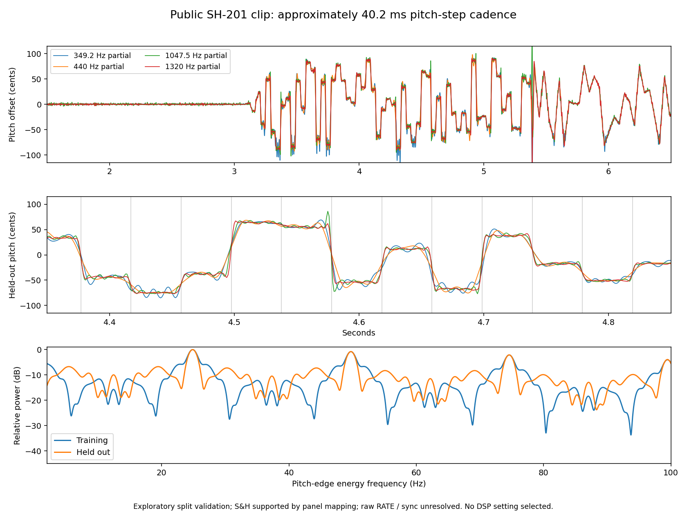

# Public SH-201 video: fast LFO clock corroboration

## Finding

A short passage in the creator's [maximum-LFO section](https://www.youtube.com/watch?v=OB3J7AQBla0) contains shared pitch steps with an approximately **40.2 ms cadence**. The primary 1320 Hz partial gives **40.2147 ms** from one second of training audio; its frozen grid predicts 22 later detected edges with **0.590 ms P95 absolute timing error**. A separate 1047.5 Hz partial and band-width sensitivity support the same cadence.

This is consistent with deep!sonic's published **40.22 ms** fast-LFO endpoint, already used in the shipping mapping. It **corroborates that endpoint; it does not select a new value or measure the complete rate table**. The original source audit is [here](2026-09-15-new-sources.md). No DSP files changed.



## Independent visual evidence

The [video acquisition and control audit](synth-love-video-acquisition-2026-09-15.md) maps the selected LED at 4 s to **sample-and-hold (S&H)** by position against the [official Owner's Manual, p40](https://cdn.roland.com/assets/media/pdf/SH-201_OM.pdf), with moderate-high confidence. This visual inference was made independently of the clock estimate. The manual defines S&H as changing its value once per LFO cycle, so a repeating update grid is meaningful even though the values themselves do not repeat. LFO1 appears selected with moderate confidence.

The author labels the first 50 seconds as maximum LFO speeds, and RATE looks unchanged across sparse frames. The exact stored raw RATE, tempo-sync state and complete routing were not captured. The operator changes depth/shape and other controls during the section. Physical knob appearance and chapter intent therefore remain weaker evidence than an original SysEx capture.

## Audio provenance and selection

- Offered original YouTube Opus/WebM SHA-256: `6ed77a823dde937f4bf87bf9cf803a7293dd21a97056f36694704355b8b15f4c`.
- The first 50 seconds are privately decoded with ffmpeg to 48 kHz float stereo, SHA-256 `8e2babd5e54375b8b6454dd4271c5a9c95b16e29e634e4219069c5eb19727131`. No playback normalization, EQ or denoising is applied. The analyzer pins the original compressed media, records its decoder and output hash, and does not require a particular WAV container as external input.
- A broad first-pass scan evaluated all 25 nonoverlapping two-second regions in each of five audio bands. All 125 rows and their three largest 2–100 Hz amplitude-spectrum peaks remain in the JSON. These are candidates, not asserted LFO rates; high-frequency bands can be very quiet.
- Pitch traces in the early passage show the same changing cents offset in two carrier families near 349.2 and 440 Hz and their third harmonics near 1047.5 and 1320 Hz.
- The passage **3.35–5.35 s** was selected after viewing these traces. Training is **[3.35,4.35)**; internal validation is **[4.35,5.35)**. This is an exploratory split, not an untouched or preregistered external validation set. No part of the remaining changing patch is silently treated as a repeat of this state.

## Frozen analysis

Analysis uses the arithmetic mean of the stereo channels. Each listed partial is isolated with a sixth-order zero-phase Butterworth bandpass. A Hilbert phase estimate is differentiated with a 241-sample quadratic Savitzky–Golay filter at 48 kHz, then resampled to 1 kHz and converted to cents. A seven-sample quadratic derivative yields pitch-change velocity; its square emphasizes the repeated transitions regardless of their direction or random height.

Feature extraction operates on the same first seven seconds and is noncausal: the zero-phase filters and Hilbert transform can use samples across the split boundary. Only the declared training samples enter the windowed frequency/phase fit. The later interval therefore tests a frozen grid within this exploratory analysis; it is not a separately processed blind recording.

The largest training derivative-energy periodogram peak is searched over **2–100 Hz**, with no 40.22 ms prior. A bounded continuous frequency refinement and one grid phase use training alone. The resulting frequency and phase remain fixed when scoring later edges. Edge detection uses absolute pitch-derivative prominence of 1500 cents/second and at least 20 ms separation. It does not discard detected edges that disagree with the grid. Small transitions can fall below the detector; missing observations and false/ringing edges are limitations, not proof of a different clock.

All four partial attempts are retained:

| Partial / band half-width | Training clock Hz | Period ms | Edges train / later | Later P95 absolute grid error ms |
|---|---:|---:|---:|---:|
| 349.2 ±50 Hz | 24.9207 | 40.1272 | 23 / 22 | 10.279 |
| 440 ±35 Hz | 24.8594 | 40.2263 | 25 / 23 | 15.906 |
| 1047.5 ±150 Hz | 24.8653 | 40.2167 | 24 / 23 | 1.613 |
| 1320 ±150 Hz | 24.8665 | 40.2147 | 24 / 22 | 0.590 |

The narrower low-partial tracks have materially worse edge timing and spurious ringing peaks. They support the broad cadence but are not precise clock estimators. The two higher partials independently locate the cadence, with the 1320 Hz track giving the cleanest transitions. The figure shows later edge positions against the unchanged training grid.

**Do not interpret numerical optimizer precision as clock accuracy.** The recording/capture clock was not calibrated; zero padding only interpolates the finite-window spectrum. The tiny difference between 40.2147 and 40.22 ms is not evidence for changing the endpoint.

## Sensitivities and controls

Keeping the same 1320 Hz center and every other analysis choice:

| Band half-width | Training period ms | Later edges | Later P95 grid error ms |
|---|---:|---:|---:|
| ±100 Hz | 40.21450 | 21 | 0.819 |
| ±150 Hz | 40.21473 | 22 | 0.590 |
| ±200 Hz | 40.22048 | 22 | 0.604 |

The periods span **40.21450–40.22048 ms**. This is an observed analysis sensitivity range, not a confidence interval. The grid fit does not depend on the edge-detection prominence; lowering the detection threshold includes more small or ringing transitions:

| Prominence, cents/s | Edges train / later | Later P95 grid error ms |
|---:|---:|---:|
| 750 | 25 / 25 | 2.544 |
| 1500 | 24 / 22 | 0.590 |
| 3000 | 23 / 21 | 0.592 |

Two synthetic controls pass through the same 1320 Hz analysis and split:

1. Two carrier families with a seeded held-random pitch clock at **17.3 Hz** return **17.3053 Hz**, with 17 later edges and **1.039 ms P95** timing error. This demonstrates that the procedure can recover a cadence away from the proposed SH-201 endpoint.
2. Static two-tone beating with **no LFO** produces a strong **90.805 Hz** amplitude peak but **zero detected pitch edges** in either scored region. The public early audio also has prominent amplitude peaks around 90.7 Hz, so ordinary amplitude periodicity alone would be misleading.

These are bounded estimator controls, not simulations of the complete SH-201 or a statistical false-positive calibration. The source remains compressed and its raw patch/MIDI are unavailable. Random-value statistics, smoothing shape, per-voice/global behavior, other rates and tempo-sync behavior are not identified by this experiment.

## Reproduction and data

The [complete result](public-lfo-clock-2026-09-15.json) pins source, decoder, exact analyzer and independent visual-audit hashes; it retains every fit, every detected edge and residual, both controls, sensitivities and the full 50-second broad scan. Original audio/video stay outside Git.

From the repository, with Python 3.11, NumPy/SciPy, matplotlib and ffmpeg:

```sh
OPENBLAS_NUM_THREADS=1 VECLIB_MAXIMUM_THREADS=1 python3 Tools/analyze_public_lfo_clock.py \
  --source-webm build-fidelity/public-waveforms/synth-love/OB3J7AQBla0.f251.webm \
  --output build-fidelity/public-waveforms/synth-love/lfo-periodicity/NEW_RUN
```

The output directory must be new. The measured final run is `build-fidelity/public-waveforms/synth-love/lfo-periodicity/run-02`; `run-01` has identical numerical measurements but predates the independent S&H visual finding and the final labels. The full tool ran successfully, synthetic controls passed, and the figure was visually inspected. **No rate/default change or instrument-output equivalence claim follows from this corroboration.**
