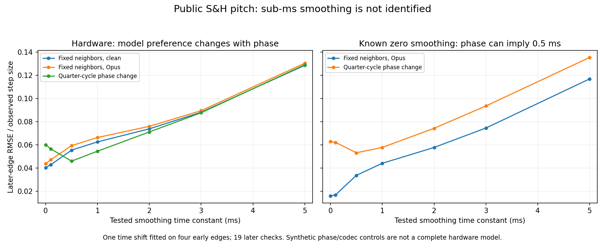

# Public S&H pitch-step smoothing: bounded feasibility

## Conclusion

**This recording does not identify sub-millisecond S&H smoothing well enough to change the DSP.** In the forward controls, a signal with zero smoothing but a quarter-cycle change of carrier phase appears to favor a 0.5 ms smoothing model. The hardware comparison changes preference with the same phase variation. This provides a concrete ambiguity, beyond simply observing a small difference between two fitted curves.

The shipping code also corrects the premise: **there is no one-pole smoothing on S&H pitch**. The LFO returns its held random value, and the pitch destination converts that value directly into oscillator increments at eight-sample control ticks. The **2.5 ms** `controlSlewSeconds` constant belongs to the filter's parameter-side path; it is not applied to pitch. A pitch recording cannot establish that separate filter smoothing constant. No shipping source, raw depth, sign, rate or patch was changed.



## Frozen source evidence

The inspected `Engine::Lfo::advance` S&H case returns `heldValue`; `Engine::updateVoiceControls` adds mapped LFO cents to oscillator notes and immediately assigns `voice.inc1/inc2`. `renderVoiceTick` uses those increments. `controlInterval` is eight samples, about .167 ms at the analysis sample rate. The source hashes are recorded in the JSON.

The filter route separately applies `1 − exp(−tickSamples / (sampleRate × controlSlewSeconds))` to cutoff parameter octaves, envelope depth and damping. Its 2.5 ms constant is explicitly labeled as a voiced dezipper in the source. No common LFO-value smoothing is present.

## Input and local protocol

- Same original offered [public video audio](https://www.youtube.com/watch?v=OB3J7AQBla0), source SHA-256 `6ed77a823dde937f4bf87bf9cf803a7293dd21a97056f36694704355b8b15f4c`, privately decoded to 48 kHz float stereo. Decoder, command and output hashes are pinned.
- Reuse the [prior S&H clock result](public-lfo-clock-2026-09-15.md): approximately 40.2147 ms per observed step. Its clock and origin are fixed; they are not refitted in this experiment.
- Reuse the 1320 Hz and 1047.5 Hz partial extractors with ±150 Hz bands: sixth-order zero-phase Butterworth, Hilbert phase, 241-sample quadratic phase derivative at 48 kHz, resample to 1 kHz. Static offsets come from 1.8–2.8 s. Shared noncausal feature extraction uses the first seven seconds; it is not a separately processed blind test.
- In 3.35–5.35 s, derive each unknown random step's plateau once from +15 to +27 ms after the frozen grid. These input levels stay identical across every model. This uses later recorded plateau values to reconstruct the unknown random input; later checks assess transition shape, not prediction of new random values.
- Keep all 23 transitions with an absolute step of at least 60 cents. The first four qualifying edges are training, at approximately 3.3716, 3.4521, 3.4923 and 3.5727 s. All 19 remaining edges are later checks. Every selected edge, step height and score is retained.
- Each profile spans −12 to +15 ms around its grid time, at 1 ms spacing, and is normalized by the same source-derived before/after difference. Adjacent grid events are about 40 ms apart. No per-edge timing shift, level, gain, depth/sign fit or EQ is allowed.
- Each model gets only **one shared time shift within ±6 ms**, fit to both partials on the four training edges. It remains frozen for the later checks. No fit hits that bound.

This is an exploratory local experiment. Plateau values can retain some settling and the true unsmoothed random targets are unavailable. These limitations apply to every model, especially the slower hypotheses.

## Forward models and controls

Test one-pole time constants **0, .1, .5, 1, 2, 3 and 5 ms**, operating in cents at eight-sample ticks before conversion to frequency. Tau0 represents the shipping pitch-target behavior; the other values are hypothetical. These are synthetic sinusoidal carriers and neighbors, **not complete Engine or Roland renders**.

The stationary source at 1.8–2.8 s supplies two base-frequency families and joint sine/cosine amplitudes/phases through 8 kHz. The static mixture fit leaves .0004804 of the source variance unexplained. This only establishes a local stationary mixture; it does not identify the filter or capture response during a pitch transition.

Every tau is forwarded through three conditions and the identical feature extractor:

1. Fixed source-derived carrier/neighbor mixture, clean PCM.
2. The same mixture through one stereo Opus roundtrip: 128 kbit/s VBR, 20 ms frames, audio mode. The original offered stream averages about 136 kbit/s including its container; its actual encoder settings and earlier capture processing are unknown. This is a codec sensitivity, not an exact recreation of that chain.
3. Clean PCM with both waveform origins shifted by a quarter cycle: each harmonic phase changes by its harmonic number ×π/2. Stationary amplitudes, target steps and smoothing remain unchanged.

All 21 synthetic audio files are finite and their hashes are recorded. Every known planted tau under the Opus and phase conditions is also compared against all seven members of the unchanged clean library. The closest **training** model is recorded diagnostically; no hardware smoothing value is selected.

## Hardware transition residuals

Later-edge RMS residual divided by the observed step size, pooled across both partials:

| Hypothetical tau ms | Fixed mixture, clean | Opus128 sensitivity | Quarter-cycle phase change |
|---:|---:|---:|---:|
| 0 | 0.04025 | 0.04371 | 0.05999 |
| 0.1 | 0.04277 | 0.04711 | 0.05648 |
| 0.5 | 0.05540 | 0.05927 | 0.04590 |
| 1 | 0.06250 | 0.06628 | 0.05446 |
| 2 | 0.07376 | 0.07592 | 0.07108 |
| 3 | 0.08810 | 0.08945 | 0.08765 |
| 5 | 0.12861 | 0.13046 | 0.12911 |

The clean and Opus conditions favor tau0 on both training and later data. The quarter-cycle condition favors .5 ms. This reversal also appears in the stronger 1320 Hz partial by itself: tau0/.5 later errors are .01989/.02403 for the fixed phase and .02440/.01967 for the quarter-cycle phase. The weaker 1047.5 Hz partial is substantially more phase sensitive; both attempts are retained.

Specific 3 and 5 ms models fit worse under all three conditions. That is a statement about these fixed forward models, **not a calibrated upper bound on an internal hardware parameter**. Unknown instrument/capture filtering, phase-dependent transients and reconstruction of the target levels remain unresolved. Normalized profile residuals are not percentages of audible mismatch.

## Planted-signal check

Each row compares a known planted signal against the clean library using the same four training edges and frozen-shift later checks:

| True planted tau ms | Perturbation | Closest training tau ms | Later error at the true tau |
|---:|---|---:|---:|
| 0 | neighbors-opus128 | 0 | 0.01579 |
| 0 | neighbors-phase-quarter | 0.5 | 0.06277 |
| 0.1 | neighbors-opus128 | 0.1 | 0.01645 |
| 0.1 | neighbors-phase-quarter | 0.5 | 0.05963 |
| 0.5 | neighbors-opus128 | 0.5 | 0.01641 |
| 0.5 | neighbors-phase-quarter | 0.5 | 0.03190 |
| 1 | neighbors-opus128 | 1 | 0.01679 |
| 1 | neighbors-phase-quarter | 1 | 0.01760 |
| 2 | neighbors-opus128 | 2 | 0.01509 |
| 2 | neighbors-phase-quarter | 2 | 0.00908 |
| 3 | neighbors-opus128 | 3 | 0.01479 |
| 3 | neighbors-phase-quarter | 3 | 0.00619 |
| 5 | neighbors-opus128 | 5 | 0.01512 |
| 5 | neighbors-phase-quarter | 5 | 0.00389 |

The decisive counterexample is **true tau0 plus only a phase change → apparent .5 ms smoothing**. True .1 ms with that phase change also favors .5 ms. In the Opus .1 ms control, fitting true .1 versus zero yields later errors .01645 versus .01665, very small separation compared with the codec residual itself. The stronger planted 1–5 ms models are recovered in this closed library, so the experiment is useful for identifying its limited resolution rather than declaring every measurement meaningless.

These are deterministic nuisance controls, not a statistical false-positive calibration. No confidence interval, universal separability threshold or best-phase search is inferred. The hardware's exact waveform origin is unknown, and the source-derived static spectrum does not model its dynamic filter/capture response.

## Reproduction and stopping point

With Python 3.11, NumPy/SciPy and ffmpeg/libopus, choose a new directory:

```sh
OPENBLAS_NUM_THREADS=1 VECLIB_MAXIMUM_THREADS=1 python3 -B Tools/assess_public_lfo_step_smoothing.py \
  --source-webm build-fidelity/public-waveforms/synth-love/OB3J7AQBla0.f251.webm \
  --output build-fidelity/public-waveforms/synth-love/lfo-step-shape/NEW_RUN

python3 Tools/plot_public_lfo_step_smoothing.py \
  --results build-fidelity/public-waveforms/synth-love/lfo-step-shape/NEW_RUN/results.json \
  --output NEW_PLOT.png
```

The tool pins the original offered media and existing clock record, privately decodes the source, freezes its analysis tools and records all synthesis/codec commands. It depends on no ignored experiment script. The measured final run is `build-fidelity/public-waveforms/synth-love/lfo-step-shape/run-02`. The first run reached model scoring but failed to serialize a Python cache directory hash; the final tool restricts script hashing to Python files and completed the same specified grid.

The [durable JSON](public-lfo-step-smoothing-2026-09-15.json) retains all models, planted controls, per-edge errors, training shifts, raw source measurements, target levels, carrier mixtures and hashes. Only large predicted-window arrays are omitted from this projection; the full generated result is hash-pinned and those arrays reproduce from the tracked tool. The plot was visually inspected.

**Bounded subtask stopped:** current zero pitch smoothing cannot be separated reliably from reasonable sub-ms alternatives under the tested phase uncertainty. No pitch or filter smoothing correction follows. This result does not change the earlier clock-cadence corroboration or establish instrument-output equivalence.
