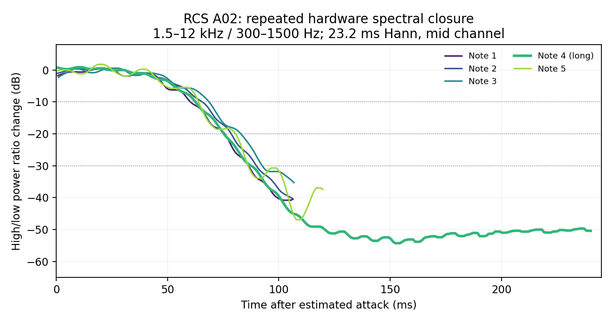

# RCS A02 spectral closure — 2026-09-20

**Five hardware attacks share a slow spectral closure.** This supports testing a conditional negative-filter-attack hypothesis with the original patch. It does not identify the filter attack's completion time, a cutoff endpoint, or the complete control curve.

The [author's direct YouTube recording](https://www.youtube.com/watch?v=8LKRnrs8DcQ), independently labelled A02 in this passage, supplies the [hardware-selected five-note case](../reconstructions/expanded/rcs-a02-moogbass-pw.json). [Pitch/gate observations](rcs-a02-hardware-observations-2026-09-20.md) predate any synthesis comparison. The first selected attack is approximately 21.210 s; later attacks validate the same landmark method.

The measurement divides summed 1.5–12 kHz power by 300–1500 Hz power, removing common volume scaling. The early reference is the median ratio 15–35 ms after estimated onset. Each reported drop must persist for 10 ms. Hann windows of 512/1024/2048 samples, left/right/mid channels, and onset shifts of −10/0/+10 ms produce **27 sensitivity observations per note**, not independent recordings. Every search stops 30 ms before the reconstructed gate ends.

| Attack | Nominal gate | 10 dB drop | 20 dB drop | 30 dB drop |
|---|---:|---:|---:|---:|
| 21.210 s | 137 ms | 60.48 ms | 76.44 ms | 86.42 ms |
| 21.347 s | 137 ms | 66.15 ms | 79.12 ms | 90.28 ms |
| 21.484 s | 137 ms | 68.83 ms | 83.80 ms | 91.87 ms* |
| 21.621 s | 271 ms | 62.54 ms | 75.51 ms | 90.66 ms |
| 21.892 s | 150 ms | 64.92 ms | 80.06 ms | 93.49 ms |

Values are median time after estimated attack. All 135 observations reach the 10/20 dB landmarks. *Nine third-note observations are censored before the 30 dB landmark; its median uses the other 18. All other 30 dB landmarks are observed.

The first note's full uncertainty ranges are **53.47–73.11 ms**, **65.62–88.07 ms** and **77.41–101.04 ms** for the three drops. The long fourth note gives 52.72–74.17, 63.69–88.14 and 79.48–100.66 ms; its closure occurs far before the following attack. This is the strongest check against a note-off explanation.

Upper has a negative-depth filter envelope and active overdrive; Lower supplies a separate sine layer. Changes in filter trajectory, nonlinear harmonic generation and layer amplitude can all change this ratio. The low-frequency waveform persists while the high band collapses, but the settled high-frequency floor does not identify cutoff or resonance. These timings must therefore remain **spectral landmarks**, not an assumed 80–140 ms filter-attack setting.

[The analyzer](../../../Tools/analyze_rcs_a02_closure.py) reads only the verified hardware crop and frozen reconstruction, checks their hashes, sample rate and finite stereo PCM, and records every observation. It takes `--audio <verified-youtube-19-26.wav> --output <new-directory>`. [The concise JSON](rcs-a02-closure-2026-09-20.json) retains exact values, provenance and the ignored full-analysis location. Python compilation passed.

An attack-anchor experiment should improve several whole-engine note trajectories while retaining the original patch and explicit gate/velocity/phase uncertainty, then pass independent-preset checks. Matching one ratio crossing by changing cutoff or overdrive would not identify the attack law. No production DSP or published patch bytes changed for this measurement.
