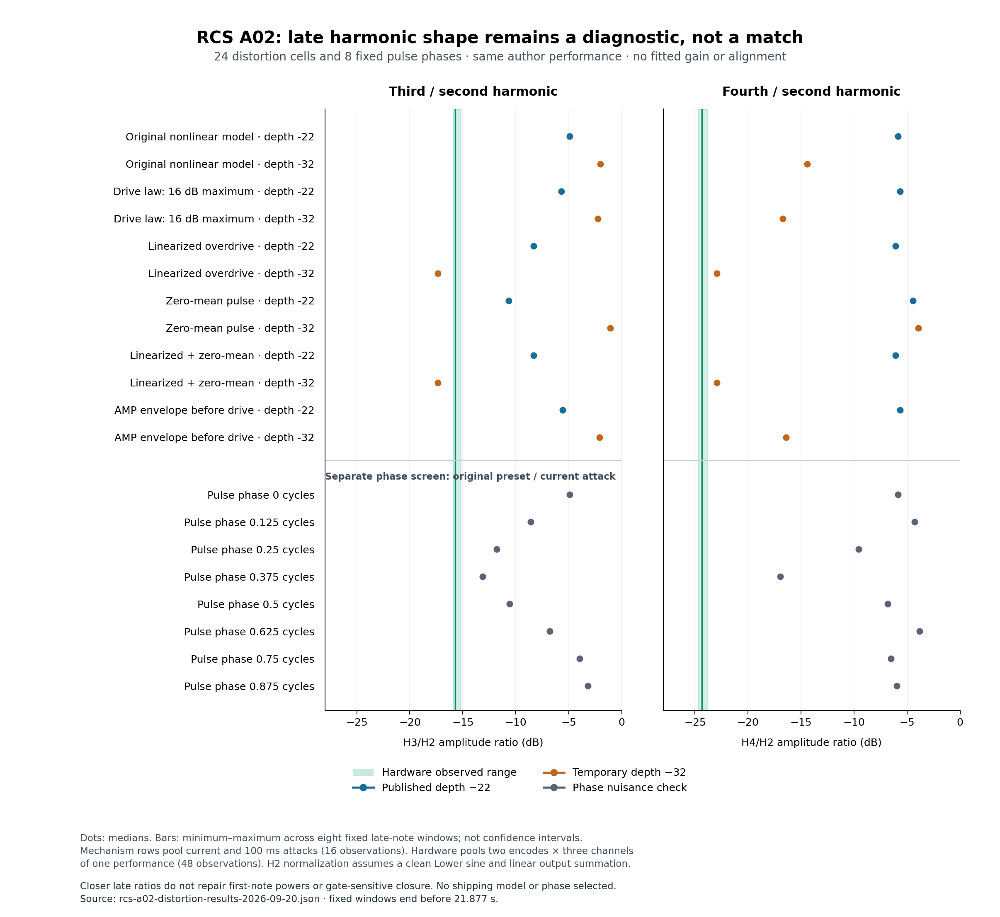

# RCS A02 distortion and phase diagnostics — 2026-09-20

**No shipping candidate or phase was selected.** The screen identifies sensitivity to nonlinear distortion and pulse DC in the current model. Its closer late spectra still fail the combined timing, level and harmonic checks.

The [author page](https://www.rcssound.com/index.php?page=6) links the eight-preset bank and [demo video](https://www.youtube.com/watch?v=8LKRnrs8DcQ). Decoded labels identify A02 at 20, 25 and 30 seconds. The slideshow does not establish live control values, and the author's SMF contains patch SysEx without performance notes. MIDI, velocity and gates are reconstructed. YouTube and SoundCloud supply two encodes of **one performance**. All A02 observations in this study were already inspected; none is unseen validation.



## Declared experiments

The 24-cell screen crosses current/100 ms filter attack and depths −22/−32 with six mechanisms: unchanged model, 16 dB maximum drive law, matched linearized ADAA, zero-mean Pulse, linearized ADAA plus zero-mean Pulse, and AMP-envelope-before-overdrive. Cutoff stays 120. Four independently built controls reproduce earlier WAVs byte for byte; 20 waveforms are new diagnostics. A separate screen tests eight fixed Pulse phase offsets with the original patch and current model.

Before compilation/output, the draft's mistaken “raw 16 with fixed compensation” interpretation was corrected to a **16 dB maximum gain law with the existing compensation formula recomputed**. The superseded draft and corrected design are retained. The builder uses a separate plan. Phase analysis later restored the prior baseline's local time-array arithmetic solely for exact numerical reproduction; samples and windows did not change. The initial difference was at most 4.2 × 10⁻¹³ dB in the checked window.

## Measured results

Late ratios below are medians of fixed fourth-note windows ending before 21.877 s. H3/H2 and H4/H2 avoid the mixed fundamental denominator only under the clean Lower-sine and linear-output assumptions.

| Late shape | H2/H1 | H3/H2 | H4/H2 |
|---|---:|---:|---:|
| Hardware | −7.01 dB | −15.72 dB | −24.37 dB |
| Original model, depth −22 | −9.79 dB | −4.90 dB | −5.86 dB |
| Linearized overdrive, depth −22 | −1.92 dB | −8.31 dB | −6.10 dB |
| Linearized overdrive, depth −32 | −11.25 dB | −17.35 dB | −22.96 dB |

Pulse centering changes nonlinear H3/H2 by **−5.77 dB** at depth −22 and nonlinear H4/H2 by **+10.49 dB** at depth −32. Its corresponding late-shape changes with linearized ADAA are below **0.00033 dB**. This supports DC-dependent harmonic regeneration **inside this software model**; it does not identify the hardware algorithm or a uniformly helpful correction.

The linearized depth −32/100 ms example illustrates the remaining joint failure. Its first-note high-band drop is −50.08 dB versus hardware −30.71 dB, while its low-band drop is −9.75 versus −2.31 dB. All 27 original-window timing combinations cross the 10/20/30 dB thresholds too early, by 7.14–10.14 / 6.15–12.13 / 11.13–15.12 ms. Its adjoining-gate fourth note starts already dark and yields only 3/27 crossings at each threshold, versus hardware 27/27. Prior gate probes establish performance sensitivity; these observations do not recover an attack law.

Across all eight sampled phases/windows, H3/H2 spans −13.14…−3.16 dB versus hardware −15.89…−15.19; H4/H2 spans −16.98…−3.79 versus −24.69…−23.84. Neither range overlaps. This excludes agreement for the sampled states, **not every unsampled phase or phase-history model**.

## Limits and reproducibility

Linearization removes compression as well as generated harmonics. Analytic Pulse centering changes DC/startup behavior and is not an analog DC blocker. The weaker drive law changes Upper gain; envelope relocation changes its nonlinear excitation. Unknown Upper oscillator phase, gate history, capture processing and possible live edits remain confounds. Raw powers use uncalibrated capture gain. Window/channel/encode ranges are sensitivity observations, not independent trials or confidence intervals.

The [machine-readable audit](rcs-a02-distortion-results-2026-09-20.json) retains all 24 compact result rows, eight phase results, exact artifact paths/hashes, corrected design provenance and reproduction commands. Hardware harmonic fits reproduce exactly: 66 rows for the distortion analysis and 48 for phase; phase zero reproduces eight prior endpoint fits. Control WAVs and original closure rows are exact; tiny extended STFT reductions are recorded in the pinned QA. Full media/builds/results remain ignored. No production source changed and no different-patch confirmation was performed for these mechanisms.

Regenerate the standalone [SVG](rcs-a02-distortion-results-2026-09-20.svg) and PNG from the retained JSON without media:

```sh
python3 Docs/fidelity/source-audits/rcs-a02-distortion-results-2026-09-20-figure.py
```
