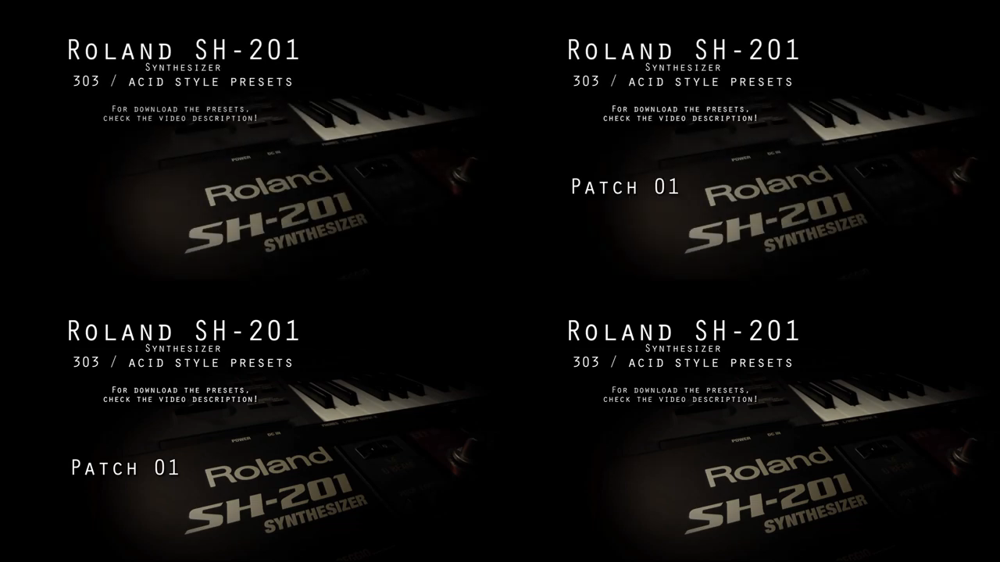
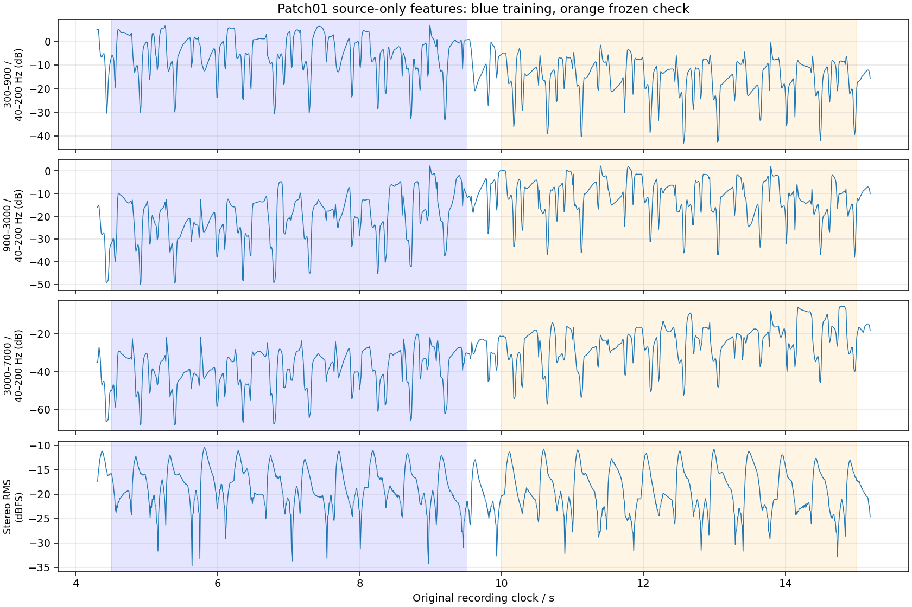

# RCS Acid Patch01: LFO cadence remains confounded

**Result: no raw88 LFO-rate anchor.** The card is long enough for many cycles
under the current interpolation, but its strongest measured brightness cadence
coincides with the source level cadence. Known synthetic note sequences produce
the same result without an LFO. No hardware rate, performed MIDI or production
correction is inferred.

The [tool](../../../Tools/audit_rcs_acid_patch01.py) and
[complete receipt](rcs-acid-patch01-feasibility-2026-09-15.json) preserve all
declared features, window/grid-phase sensitivities and controls. No candidate
Septum audio was viewed, fitted or generated.

## Source and exact visible support

This uses the creator's original archive and associated AAC/video pinned by the
[source extraction](rcs-acid-source-extraction-2026-09-15.json). The archive,
Patch01 SHE and all four media/metadata files are verified against their recorded
SHA-256 values. The original AAC is freshly decoded to float stereo 44.1 kHz.
The source preset was validated against official Editor schema/resources in the
earlier extraction; this audit does not add an Editor export round trip or prove
the file was unchanged during the recording.

Patch01 text is visible on frames **92–400 inclusive at 25 fps**, or
**[3.68, 16.04) seconds**, lasting 12.36 seconds. A fixed image-region/template
test reproduces that contiguous support. The four boundary frames below are
3.64, 3.68, 16.00 and 16.04 seconds. These are visible-card boundaries, not
authenticated audio patch-switch or physical-control timestamps.



## Relevant stored controls

| Group | Original Patch01 controls |
| --- | --- |
| Routing/source | SINGLE Upper; mix balance1 selects oscillator1 Saw; pitch envelope0; portamentooff |
| Filter | LP24, cutoff71, resonance52; keyfollow raw69, velocity raw127 (+63) |
| Filter envelope | A4 / D49 / S48 / R43, depth+24 |
| AMP | A0 / D127 / S127 / R1; velocity+8; overdriveon, depth127 |
| LFO1 | SIN, FILTER depth+10, rate88; key triggeroff, tempo syncoff, fade0; AMP depth0 |
| LFO2 | Both modulation depths0 |
| Effects | Delay on/send13, time67, feedback68, modulation rate5/depth44; reverb on/send15, time80/size7 |
| Sequencing | Stored arpeggiatoroff; performed notes, velocities and gates unavailable |

The maximum stored cutoff-velocity sensitivity and nonzero filter envelope make
unknown performance especially consequential. Overdrive can create new upper
harmonics; modulated delay and reverb combine sounds from earlier notes. A
repeatable high/low frequency-band ratio is therefore not an isolated filter
transfer or authenticated LFO phase.

The current provisional raw88 interpolation is approximately **3.661 Hz**,
which would permit roughly 45 cycles within the visible interval. That is a
model hypothesis, not a hardware frequency. The present limitation is source
separation, unlike Patch06's fewer-than-two-cycle coverage.

## Frozen within-card diagnostic

Before fitting audio features, the tool saves first support **4.5–9.5 s** and
later support **10.0–15.0 s**. These are disjoint intervals within one recording,
not independent performances. These limits label window centers: the raw Hann
windows extend 30 or 40 ms on each side. The 500 ms gap keeps the two raw sample
supports disjoint, and all windows remain inside the visible card. Every
feature's sinusoidal cadence is estimated
only on the first support, then its amplitude and phase remain fixed for the
later check. No feature, offset, phase or frequency is selected by later results.

Features are 300–900, 900–3000 and 3000–7000 Hz power divided by 40–200 Hz power;
stereo powers are averaged before the ratio, with separate L/R controls.
Stereo RMS and side-power fraction provide additional diagnostics. Fixed
sensitivities use 60/80 ms Hann windows and 0/5 ms offsets of a 10 ms feature
grid. The descriptive sinusoid search covers 0.5–12 Hz in 0.01 Hz steps after
linear-trend removal. The grid spacing is **not measurement precision**.

The later-check correlation removes its own constant/linear trend from both
observed feature and fixed predicted sinusoid. This is a diagnostic correlation;
it does not refit the oscillation's amplitude or phase. The separate full
prediction RMSE retains the original training coefficients and trend.

### Results at the primary 60 ms / zero-offset setting

| Feature | Strongest training cadence | Training variance explained | Frozen later correlation |
| --- | ---: | ---: | ---: |
| 300–900 / 40–200 Hz | 2.10 Hz | 33.7% | 0.474 |
| 900–3000 / 40–200 Hz | 2.11 Hz | 25.4% | 0.418 |
| 3000–7000 / 40–200 Hz | 2.11 Hz | 20.6% | 0.418 |
| Stereo RMS | 2.10 Hz | 55.4% | 0.675 |
| Side-power fraction | 2.10 Hz | 15.0% | 0.514 |

Individual L/R features retain the same 2.10–2.11 Hz cadence. All four declared
window/grid-phase settings also retain 2.10–2.11 Hz for the three brightness
bands and RMS. Their brightness check correlations range 0.418–0.620, while
RMS ranges 0.655–0.711. Feature-grid stability and cross-channel agreement do
not distinguish LFO motion from the shared note/level pattern.



## Positive and negative controls

These independent additive signals are measurement controls, **not Roland DSP
models**. They use a saw-like harmonic source, a simple changing spectral rolloff,
strong `tanh` saturation, and optionally a fixed four-note pattern repeated at
0.48-second note spacing with unequal stereo delays. Two carrier starting phases
test sensitivity to sampled waveform phase. No source waveform or candidate
coefficient is fitted into the controls.

| Control | Three brightness features' strongest training cadences |
| --- | --- |
| Sequenced notes, **no LFO**, carrier phase0 | 2.08, 2.09, 2.09 Hz |
| Same no-LFO sequence, carrier phase0.37 cycles | 2.08, 2.09, 2.09 Hz |
| Steady tone, planted3.7 Hz spectral modulation | 3.70, 3.70, 3.70 Hz |
| Sequenced notes plus planted3.7 Hz modulation | 2.08, 3.69, 2.09 Hz |

The steady positive recovers 3.7 Hz in every band with later correlation
0.966–0.973; the tool asserts this recovery. No-LFO sequences nonetheless yield
strongly transferable brightness cadences, with correlations 0.503–0.841.
When the same known modulation is mixed with sequencing, two of three features
again favor the note cadence. This demonstrates both false attribution risk
and concealment of a real modulation. It does not establish the exact source
of any component in the hardware recording.

## Decision and limits

Do not convert the observed approximately 2.1 Hz feature cadence into a raw88
rate correction, nor treat the lack of a dominant 3.661 Hz feature as evidence
that the current rate is wrong. A stronger test would require an authenticated
held-note passage or repeated-note performance with known velocities/gates,
controllable effects and independent modulation-phase evidence. The still-card
video does not supply those conditions.

This bounded audit does not exclude a weaker recoverable LFO signature with a
different source-separation method. It does establish that these predefined
band-power, channel and analysis-grid controls are insufficient. No production
change, MIDI reconstruction or whole-instrument equivalence claim follows.

## Reproduce

```sh
OPENBLAS_NUM_THREADS=1 python3 Tools/audit_rcs_acid_patch01.py \
  --sources build-fidelity/rcs-acid-feasibility/sources \
  --output build-fidelity/rcs-acid-feasibility/patch01-reproduction
```

The retained run is `patch01-audit-v2`; it improves plot labels and asserts the
known positive-control result. All source features, cadence probes and control
measurements are exactly equal to run v1. The receipt preserves source/preset,
tool/protocol, decoded PCM, feature-array and image identities. Original media
remain in the ignored cache. Both plot and exact boundary frames were inspected.
