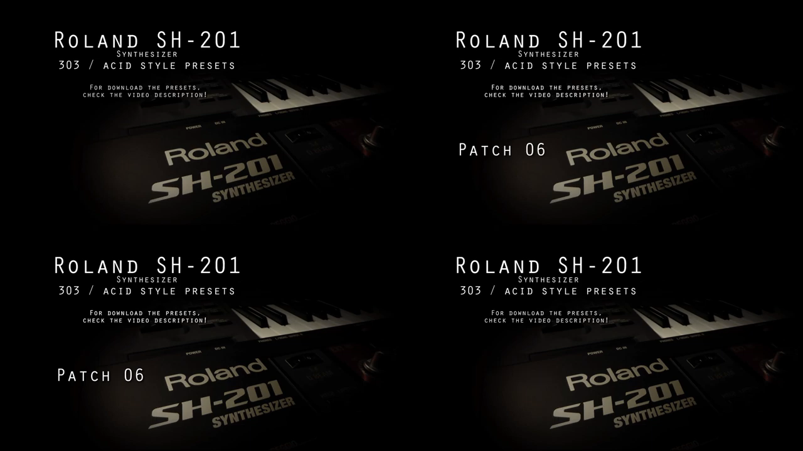
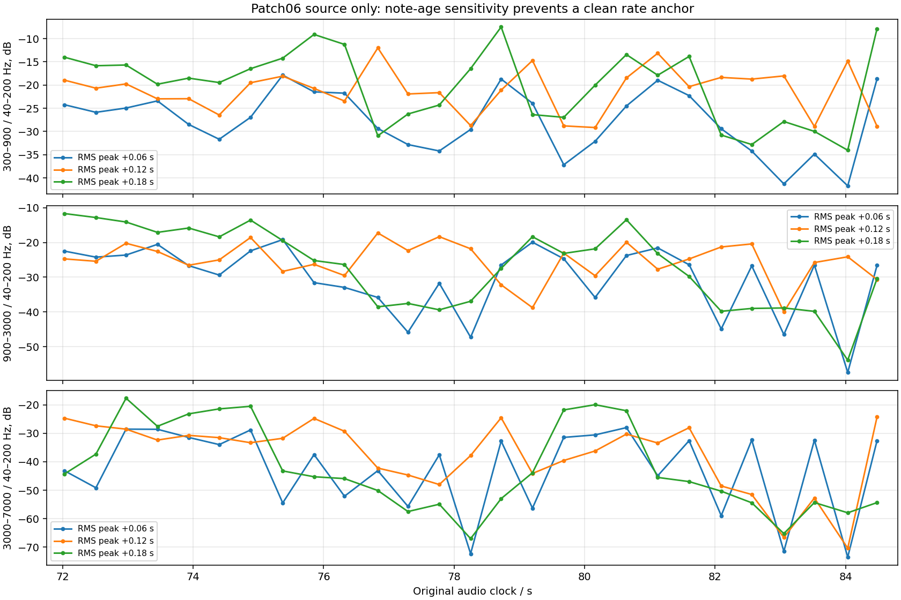

# RCS Acid Patch06: source-only feasibility

**Result: no static-cutoff anchor and insufficient evidence for a raw21 LFO-period anchor.** The stored modulation destination was initially misread: Patch06 routes a sine LFO to **FILTER**, not PW1. No Septum render, performance reconstruction, period fit, raw-control correction or parameter search was performed.

## Sources and extraction

The [creator page](https://www.rcssound.com/index.php?page=8) supplies a [ZIP](https://www.rcssound.com/download.php?kod=8) containing nine `.she` presets. The [associated video](https://www.youtube.com/watch?v=7jW2GIgOOv8), uploaded 2020-11-07, displays numbered patch cards over a static photograph. Its title and ZIP readme say nine patches while the video description says eight. No performed MIDI or live panel state is provided. All nine stored arpeggiator switches are off; the notes heard in the recording therefore are not established by those switches/pattern data.

The observed 1525-byte SHE layout is a 256-byte header, 29-byte System block, and 22 packed patch blocks totaling 1240 bytes. The extractor validates the header, seven-bit payload, all field widths/types/ranges and exact block sizes against the previously audited official Editor `BufferModel.xml`. It retains all System and patch fields. All nine extractions pass and reproduce the same native SysEx hashes as the initial extraction. This is schema validation, **not an Editor export round-trip** or proof of the state used in the recording.

The [complete extraction receipt](rcs-acid-source-extraction-2026-09-15.json) pins original archive/audio/video/metadata and official Editor resources. The [Patch06 receipt](rcs-acid-patch06-feasibility-2026-09-15.json) pins the extraction, exact preset, video frames, acoustic landmarks and all descriptive measurements. Cached audio/video and decoded WAVs remain outside version control.

## Exact active Patch06 controls

| Group | Stored controls |
|---|---|
| Part / oscillator | SINGLE Upper, poly; oscillator1 SAW, coarse/fine centered; mix balance1 gives oscillator1 only; FLAT low-frequency mode |
| Filter | LP24, cutoff81, resonance42, key follow0, cutoff velocity0 |
| Filter envelope | A0 / D14 / S2 / R4, signed depth+16 |
| AMP | A0 / D127 / S127 / R0; level64, velocity+8; overdrive **off** |
| LFO1 | **Sine, raw rate21, FILTER depth+30**, AMP depth0; free-running, key triggeroff, sync off |
| LFO2 | Triangle, both depths0 |
| Pitch / effects | Pitch envelopes0; portamentooff; delayon/send16, feedback raw85, delay modulation depth23; reverboff |

Official `Resource.xml` defines destination1 in the order `PITCH1, PW1, FILTER, AUDIO-FIL`; `PatchLfo.xml` binds the raw destination field directly to this table and displays depth with offset −64. Thus destination-1 raw value 2 with depth 94 means FILTER/+30. The [Owner's Manual](https://static.roland.com/assets/media/pdf/SH-201_OM.pdf), page 42, independently describes that destination as cutoff modulation. The revised extractor checks the exact official bindings and records named LFO destinations for every preset.

## Video and audio coverage

The **Patch06 text is visible on frames 1794–2119 inclusive at 25 fps: [71.76, 84.80) seconds**, a 13.04-second support. The preceding/following sampled frames have no patch label. These are exact visible-card boundaries, not certified audio patch-switch times. The still image cannot establish unchanged physical controls, external MIDI/controller state, backing content, processing or edit synchronization.



Within that support, the source has 27 prominent RMS landmarks spaced a median .47991 seconds apart. They are acoustic peaks, not reconstructed MIDI onsets. Descriptive 60 ms Hann windows at peak +.06/+.12/+.18 seconds yield substantially different brightness: median within-landmark offset ranges are **11.65, 10.82 and 16.27 dB**, respectively, for 300–900, 900–3000 and 3000–7000 Hz powers divided by 40–200 Hz power. Stereo powers are averaged before ratios. These bands do not constitute phase-invariant harmonic estimates or a filter transfer function.



Changing brightness is consistent with the stored active filter LFO, but its cause and phase are not independently authenticated. Low-frequency transients and additional line families leave performed notes/gates, possible backing content and delay contributions unresolved. At the current interpolation hypothesis of approximately 7.3 seconds per cycle, the visible interval contains fewer than two cycles. This duration is not a measured hardware period. The combination of limited cycles and feature dependence does not justify fitting a precise raw 21 correction; no preferred period is selected.

Patch03 remains a negative control for filter isolation: its original overdrive is **on at depth127**, with delay and portamento active. Neither candidate provides the proposed stationary raw-filter anchor.

## Reproduction

Use the hash-pinned original cached sources and the three previously audited official Editor XML reading copies; decoded WAV container identity is generated and recorded per run.

```sh
OPENBLAS_NUM_THREADS=1 VECLIB_MAXIMUM_THREADS=1 \
  /Library/Frameworks/Python.framework/Versions/3.11/bin/python3 \
  Tools/inspect_rcs_acid_sources.py \
  --sources build-fidelity/rcs-acid-feasibility/sources \
  --editor-xml /tmp/septum-hw-benchmark/research-official/editor-resources/BufferModel.xml.utf8.txt \
  --output build-fidelity/rcs-acid-feasibility/reproduction

OPENBLAS_NUM_THREADS=1 VECLIB_MAXIMUM_THREADS=1 \
  /Library/Frameworks/Python.framework/Versions/3.11/bin/python3 \
  Tools/audit_rcs_acid_patch06.py \
  --sources build-fidelity/rcs-acid-feasibility/sources \
  --extraction build-fidelity/rcs-acid-feasibility/reproduction \
  --output build-fidelity/rcs-acid-feasibility/reproduction-patch06
```

| Asset | SHA-256 |
|---|---|
| Original ZIP | `c713703c0fc3b548135f8a8cc5a66d63e6d41e5ec7aac420c65d088983c316b6` |
| Original Patch06 SHE | `fb770fa1657f775ea9db8befb276001dba4bc4b8c6cba4f7249a69d8199cc246` |
| Extracted Patch06 SysEx | `5604a98324e4c92c8e1ba43fa3035563da4f341a259365e77ddb8b7f1c993c8b` |
| Original AAC/M4A | `7b0e82d0f0edd1ad7ca43d1aadf44485aa6ab3ef59d2dcdfac20526d0f0d7dcf` |
| Original H.264/MP4 | `c3eb7568c1fa4e9e77ddaa0facc6ed58564c45b634b0dc91fae5d0a3c1f1bd07` |

This audit rejects an unsupported calibration opportunity. It does not reject the usefulness of the creator's presets for a future explicitly reconstructed performance comparison, and it makes no whole-instrument equivalence claim.
