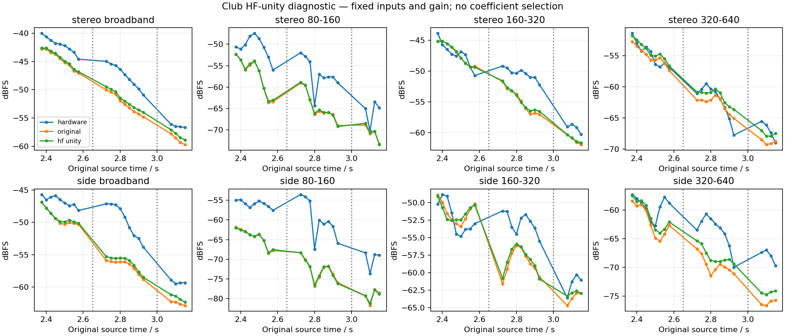

# HF feedback damping: unity ablation leaves the main mismatch

**Removing the current HF feedback shelf does not resolve Club's low-band/Side deficit or Ambient's stereo excess.** It changes waveform phase/state substantially and gives some modest level improvements, with retained Mid-band regressions. This is a diagnostic endpoint, not a shipping proposal, a bound on intermediate settings, or an identified hardware parameter.

## Frozen experiment and identity controls

The [verified decomposition](reverb-tail-bus-decomposition-2026-09-15.md) passed independent review before this experiment. Its exact captured input buses, full effect histories, tick boundaries and per-sample output gain/pan streams are reused. A single isolated copied renderer changes only the **gain argument** of `reverbHighShelf` to1. The corner/coefficient and lowpass state update remain; LF damping, line feedback, time/size, diffusion, pre-delay, output high-cut, returns, delay, limiter and original patch/MIDI bytes remain unchanged. Production source was not edited.

Club's original HF setting is−36 dB at4 kHz; Ambient's is−8 dB at4 kHz. Cotton is already neutral. This intervention changes the feedback path's phase as well as attenuation; altered modal frequencies/excitation can make waveform difference much larger than its RMS level change. No modal frequencies were fitted here.

Before scoring:

- The new executable's original-shelf mode reproduces **every byte of all three prior six-channel raw renders**, including pre-output, pre-limiter and final PCM across their complete controlled extensions.
- Cotton's HF-unity mode reproduces all raw bytes and the same exported WAV as its original mode. Both exported WAV SHA-256 values are `a85d29c5fdb7b5dcaca47d662f67df485d3278ba1d172db752626463d36de2f1`.
- All six full outputs remain below the limiter; maximum peak is0.23155.
- Every original-channel analysis window reproduces the inherited Club Stereo/Side estimator exactly. Mid is added with the same normalization.

The [complete receipt](reverb-hf-unity-ablation-2026-09-15.json) retains source/build/binary/input hashes, all output raw hashes, every window and guard, and every counterexample. It contains the exact numerical object from the run, serialized compactly for repository size.

## Comparison policy

The protocol was written before building or scoring. It follows the earlier result, so this is explicitly a **post-result mechanism investigation**. Both models use the old production-prefix lag and gain, with no refitting:

| Case |Lag, samples |Gain |Original source supports |
|---|---:|---:|---|
|Club |+232 |1.8256797473972683 |2.30–2.65;2.65–3.00;3.00–3.25 s diagnostic |
|Ambient nominal-v100 |−2205 |7.46790500635611 |.405–.775 s opening |
|Cotton |−1346 |3.5906029484109427 |1.25–5.00 s opening |

Common coverage is inherited unchanged. Club's last diagnostic support ends at source sample143093, approximately3.244739 s; the first two supports are complete. Ambient's alignment is at the old50 ms search boundary and maps to model.355–.725 s, before final gate.730 s. It is an opening-performance check, not a late-decay test. No untranscribed final Cotton/Ambient performance is compared.

Primary150 ms and fixed100/200 ms symmetric-Hann windows use25 ms hops and remain wholly inside each support. The 80–160,160–320 and320–640 Hz band powers use the inherited one-sided FFT normalization. Broadband RMS is unweighted. Mid=(L+R)/2; Side=(L−R)/2. All rows remain; original-only guards flag bands below−120 dBFS or0.1% of that channel's total Hann-windowed power. Overlapping windows are not independent trials. No slope or reverberation time was fitted.

## Club: improvements are incomplete and frequency dependent

Whole-support model-minus-original-recording RMS level errors, dB:

| Support |Stereo: current → unity |Mid: current → unity |Side: current → unity |
|---|---:|---:|---:|
|2.30–2.65 s |−2.693 →−2.482 |−3.270 →−2.998 |−1.598 →−1.484 |
|2.65–3.00 s |−4.791 →−4.183 |−2.717 →−2.060 |−7.355 →−6.854 |
|Later diagnostic |−1.653 →−.829 |−.523 →+.293 |−3.002 →−2.165 |

The check-minus-training Side deficit still grows **5.370 dB**, versus5.757 dB with the current shelf. The fixed later whole-stereo signal changes by1.192 relative waveform RMS, despite only+.607 dB in its level; Side waveform difference is1.231. These are waveform-difference norms, not removed power fractions or perceptual scores.

Primary150 ms later-window error RMS against hardware,2.65–3.00 s:

| Channel / band |Current → unity error RMS, dB |Result across100/150/200 ms |
|---|---:|---|
|Stereo broadband |4.918 →4.339 |Improves at every width; large error remains |
|Stereo80–160 Hz |7.950 →7.912 |Small improvement at every width |
|Stereo160–320 Hz |4.562 →4.350 |Improves at every width |
|Stereo320–640 Hz |1.624 →1.679 |Worsens100/150 ms; improves200 ms |
|Mid160–320 Hz |4.571 →4.647 |Worsens at every width |
|Mid320–640 Hz |4.474 →5.445 |Worsens at every width |
|Side broadband |7.167 →6.644 |Improves at every width; large deficit remains |
|Side80–160 Hz |13.125 →13.148 |Mixed tiny changes; large deficit remains |
|Side160–320 Hz |6.163 →5.716 |Improves at every width |
|Side320–640 Hz |6.437 →4.965 |Improves at every width |

Every Club band window passes the original-source guards. Current/unity trajectories stay close in80–160 and160–320 Hz, where much of the original discrepancy remains. A shelf-free endpoint is therefore insufficient as a complete low-band correction. This does **not** prove that every intermediate gain, different shelf law, or different topology has a monotonic error bounded by these two endpoints.



## Ambient and neutral Cotton remain visible

Ambient's whole-opening stereo error changes from−1.486 to−1.459 dB; Side excess grows from+13.134 to+13.343 dB. Primary broadband window RMSE improves2.100→2.028 dB for Stereo but worsens13.245→13.289 dB for Side. The100 ms Side change is a tiny improvement, while200 ms worsens; none resolves the excess. **Every Ambient80–320 Hz band window fails original relative-power coverage**, so their large numeric errors remain recorded but cannot calibrate damping. The populated320–640 Hz Side remains strongly mismatched. Two layers, modulated delay, reconstruction/capture uncertainty and the boundary alignment remain.

Cotton is an exact neutral negative control. All original/unity samples and measurements are identical, including the whole-opening Side excess+2.561 dB. Its separate long hardware decay observation is unaffected and remains outside this opening-only comparison.

## Decision

No production change follows. The current feedback shelf contributes to Club's tail levels and modal pattern, but removing it preserves most of the low-band/Side mismatch and adds Mid-band regressions. It also fails to resolve the independent Ambient stereo problem. There is no evidence here for setting hardware HF damping to unity, a new time multiplier or a uniquely preferred intermediate gain.

These controls support investigating the network's response/state and capture/excitation assumptions instead of attributing the remaining gap to continuing current-model release or active Club delay. Any next coefficient or topology trial needs an independent source constraint and the same retained counterexamples; these two endpoints alone do not supply that constraint.

## Reproduce

After reproducing the verified decomposition and assessment:

```sh
OPENBLAS_NUM_THREADS=1 VECLIB_MAXIMUM_THREADS=1 python3 \
  Tools/ablate_reverb_feedback_hf_shelf.py \
  --decomposition-run build-fidelity/reverb-tail-buses/run-01 \
  --assessment build-fidelity/reverb-tail-buses/run-01/assessment-04/results.json \
  --output build-fidelity/reverb-hf-unity/reproduction
```

The retained run is `build-fidelity/reverb-hf-unity/run-01`. Original media were reused from the hash-pinned cache. The experiment preserves the existing performance transcription and comparison gain, and does not edit production DSP.
