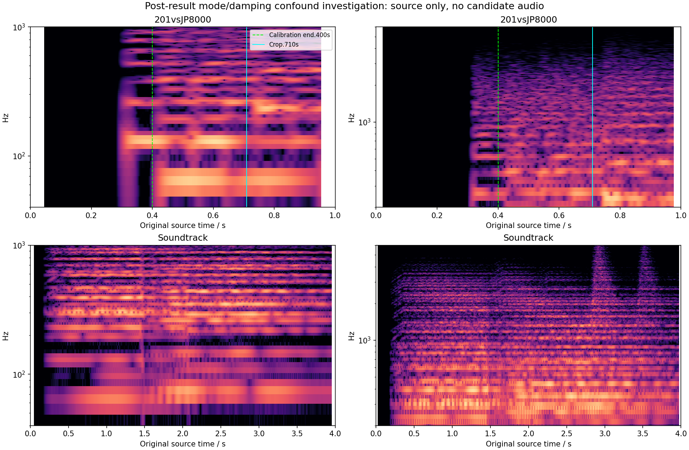

# Reverb mode/damping confound: source-only openings

**Status: 201vsJP8000 has a conditional two-pitch reconstruction with two gate assumptions; Soundtrack is not transcribed.** These presets were selected after earlier reverb candidate outcomes to investigate the correlation between keyboard mode and damping. This is a post-result confound investigation, not blind validation. No candidate render or score was used to select these pitches, gates, boundaries or source windows.

## Exact published presets

Both presets come from the original PAD bank. The MP3 and bank association is by published name; the recorded patch revision, original performance MIDI, velocities, controllers and recording chain remain unauthenticated. The [machine receipt](reverb-mode-damping-confound-openings-2026-09-15.json) retains the original bytes, full decoded controls, source spectra, decoder identity and every input hash.

| Control | 201vsJP8000 / pad-06 | Soundtrack / pad-02 |
|---|---|---|
| Active parts | SINGLE Upper | DUAL Upper + Lower |
| Delay / reverb switches | Both on | Both on |
| Delay / reverb sends | 40 / 40 | 75 / 45 on both parts |
| Reverb TIME / SIZE | 80 / 7 | 77 / 7 |
| Reverb predelay | 100 ms | 100 ms |
| Reverb HIGH CUT | Bypass | 2500 Hz |
| LF / HF damping gain | 0 / −10 dB | 0 / 0 dB |
| AMP ADSR | 0 / 0 / 127 / 61 | Upper 52 / 74 / 112 / 79; Lower 48 / 127 / 100 / 79 |
| Filter velocity / AMP velocity | 0 / +8 | 0 / +8 on both parts |

201 uses two untransposed Super Saws, widths 101/86, equal balance, no pitch envelope, overdrive, portamento or arpeggiator. Its LP12 filter is cutoff 85, resonance 10, key follow 0, envelope 0/41/18/61 with depth +3. A free-running filter LFO has raw rate 14/depth +34; another free LFO applies pitch depth −2 to oscillator 1. Thus a simple pitch sequence does not imply a stationary timbre or an isolated reverb return.

Soundtrack's Upper mixes only oscillator 2, a Super Saw with decoded coarse +8 semitones and pitch-envelope depth −19/decay 24. The Lower mixes two untransposed Super Saws. Slow attacks, long releases and Upper filter modulation obscure event attribution. Its neutral damping also coexists with a 2.5 kHz high cut, so it would not be a clean mode-only counterpart.

## Frozen 201 opening

The original begins near silence. A strong direct onset occurs around .320 s: the 130.8 Hz family and approximately 261.6/392.4/523.2 Hz multiples support C3 (MIDI 48). A new 65.4 Hz family, including its odd 196.2 Hz harmonic, supports C2 (MIDI 36) near .425 s. A further approximately 233 Hz family appears in the .725–.750 s bracket and is excluded. Stereo powers are averaged before extracting peaks; downmix cancellation is avoided. Zero-padding improves plotting, not independent frequency resolution.

| Event | Onset | Source onset bracket | Held scenario off | C3-release sensitivity off |
|---|---:|---:|---:|---:|
| C3 / MIDI 48 | .320 s | .315–.325 s | .710 s, crop-censored | .390 s, assumed |
| C2 / MIDI 36 | .425 s | .405–.435 s | .710 s, crop-censored | .710 s, crop-censored |

Both cases start at source time zero and include all preceding silence and events. Velocity is 100. The calibration prefix is **[0, .400] s**; later evaluation is **[.400, .710] s**, retaining at least .260 s after a lag bounded to ±50 ms. The later C2 onset is outside training. Use one production-prefix lag and gain shared across models, identical sample coverage, and a separately labeled candidate-prefix gain sensitivity.

The gates are not recovered. Once C2 enters, its even harmonics overlap C3. AMP release 61, filter movement and both effects make a held C3 and a releasing C3 difficult to separate. The .390 s alternative reflects early upper-harmonic diminution but is not evidence of a key-up or a confidence bound. Both C2 gates remain crop-censored. There is no matched final key-up or post-off decay interval. Retain both scenarios rather than selecting one from model error.

Uniform velocity sensitivities are omitted: the active cutoff velocity is zero and current AMP velocity +8 acts as a common post-filter voice gain, with no active second layer or overdrive. In the current model, uniform velocities 80/120 differ from 100 by only −.1804/+.1767 dB, largely absorbed by the per-case calibration gain. Unrecovered *relative* note velocity remains relevant: the current model's full 1–127 span is 1.170 dB. This is a model calculation, not a measured hardware velocity law.

Frozen files:

- [Held opening JSON](../reconstructions/reverb-validation/201-vs-jp8000-held-opening.json) and [MIDI](../reconstructions/reverb-validation/201-vs-jp8000-held-opening.mid).
- [C3-release sensitivity JSON](../reconstructions/reverb-validation/201-vs-jp8000-gate-sensitivity/201-vs-jp8000-c3-release-opening.json) and [MIDI](../reconstructions/reverb-validation/201-vs-jp8000-gate-sensitivity/201-vs-jp8000-c3-release-opening.mid).

## Soundtrack: negative feasibility

The opening contains persistent families around 65/98/131/196/233/294/311/392 Hz, with overlapping harmonics and Super Saw side components. Upper transposition and pitch-envelope motion versus the untransposed Lower prevent a unique key count or octave assignment. Slow AMP attacks and long releases blur note-on and key-up. No short isolated plateau supplied both a defensible event assignment and a later independent note check. The source spectra are retained; no MIDI or score is produced for this case.



## Provenance and reproduction

Original media: [201vsJP8000 MP3](https://www.rolandus.com/go/sh-201_patches/mp3/PAD/TOP8_SH-201vsJP-8000.mp3), [Soundtrack MP3](https://www.rolandus.com/go/sh-201_patches/mp3/PAD/TOP8_Soundtrack.mp3). Reproduction requires the cached original MP3s and `SH-201_Patch_PAD.zip`, not the decoded WAV containers. The tool decodes private WAVs, verifies original media and exact extracted SysEx identities, and parses both generated MIDIs back to two note-ons/two note-offs within one sample of their declared times.

```sh
OPENBLAS_NUM_THREADS=1 VECLIB_MAXIMUM_THREADS=1 \
  /Library/Frameworks/Python.framework/Versions/3.11/bin/python3 \
  Tools/reconstruct_reverb_confound_openings.py \
  --sources build-fidelity/hardware-benchmark/sources \
  --output build-fidelity/reverb-confound-openings/reproduction
```

| Asset | SHA-256 |
|---|---|
| PAD ZIP | `d00b19491c2cec27ee640147e0dfb6d1b8a47bcb70831a93a819a70d21a2a222` |
| 201 original MP3 | `0681718b242a89b23d350237e3f2aad2085e877ee5818256a004eca921d49e2c` |
| 201 exact SysEx | `70e44e7665a3e6b46faabf733588fda615dcf2161a85dea693e70c319a3f1501` |
| Soundtrack original MP3 | `b0352755c05b15b1c52248800330baeb4674df6cae2d8726ad9d9fbb699d21ae` |
| Soundtrack exact SysEx | `dc8844cda1f6ed4ee913945ecba9b485ff199a1c9e8a8b0b847d17112f075cbf` |
| Held JSON / MIDI | `6b8cb5ac8e4efaf6371cc4b3316a812d4fbcd790521eb0ac97300718a08d28e8` / `668e9f8ca445f4f47c9399371e84ab99d9d855c6904f861edb5985a29ef08610` |
| C3-release JSON / MIDI | `3dcb24707f47b05ead8e0116f6a9f780cf732a64e643445616a1c5c58a52ad9e` / `7395134a3c6264e7599f77447fce12ad3dce308df1cfddd535638b6f1d789270` |
| Measurement receipt | `3f6395f1215039ce50a9749ecc5b723413c977b81fe1b6d1f6a323b0bfd7e79b` |

The case schema is compatible with `Tools/evaluate_reverb_validation_cases.py --exploratory`: source start zero, top-level calibration boundary, original media/SysEx hashes and frozen adjacent MIDI. Both gate scenarios must be reported. No DSP change or equivalence conclusion follows from this feasibility receipt.
