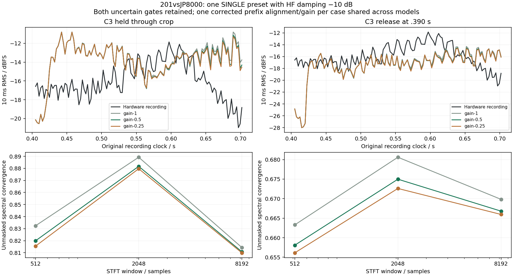

# 201vsJP8000: a SINGLE preset with damped reverb

**This short reference gives small spectral improvements with half reverb
return, alongside worse stereo side-fraction error. It does not identify a
damping correction or establish matched output.** Both uncertain gate
scenarios remain in the result; neither is selected as the true performance.

The [source-only protocol](reverb-mode-damping-confound-openings-2026-09-15.md)
was committed in `c5cfc50` before candidate scores. It fixes C3 at .320 s and
C2 at .425 s, source start zero, calibration ending .400 s, and a .710 s
crop. C3 is either held through the crop or released at .390 s; C2 remains
crop-censored. The original named preset is unchanged. This was selected
after earlier reverb results to investigate the mode/damping association,
so it is exploratory. It is one recording with two input hypotheses.

The active Upper part has two Super Saws, free-running pitch/filter LFOs,
delay and reverb sends 40/40, and HF damping −10 dB. This adds a SINGLE
damped case to the prior five SINGLE neutral references and two DUAL damped
counterexamples. Its other parameters and performance differ; it is not a
controlled experiment that changes only keyboard mode or damping.

## Corrected timing measurement

The first run exposed an [alignment numerical error](alignment-silence-regression-2026-09-15.md):
FFT correlation divided by almost-zero candidate-window variance selected
a silent portion of the release scenario as a false perfect match. The
unclipped reported correlation was 52.72, while direct Pearson correlation
at that position was .0293. Those release-scenario scores are superseded.

The corrected scorer centers the candidate envelope before calculating
rolling variance and excludes negligible-variance windows relative to the
candidate's full prefix energy. The second run retains **all six complete
WAVs byte-for-byte**, with the same source, preset and MIDI. Both scenarios
now align at **+132 samples / +2.993 ms**, with prefix correlation .99172.
Their shared-within-case gains are 4.41603 and 4.44326 respectively. Later
comparison uses the same reference samples **17640–31179** in both cases;
calibration and later comparison remain disjoint.

No performance event or DSP value was changed to fix the scorer. The first
run remains locally available as historical evidence, not the accepted
release-scenario comparison.

## All corrected outcomes

Each entry is previous / half / quarter return; smaller errors indicate
closer agreement under these reconstruction assumptions. Quarter return
remains a sensitivity and is not selected.

| Metric | C3 held | C3 release at .390 s |
|---|---|---|
| Unmasked spectral convergence | .84534 / .83748 / .83503 | .67123 / .66662 / .66489 |
| Pair-mask log-spectrum error, dB | 13.567 / 13.513 / 13.511 | 10.811 / 10.733 / 10.721 |
| Reference-mask log-spectrum error, dB | 9.929 / 9.912 / 9.929 | 7.849 / 7.825 / 7.838 |
| Envelope P95 error, dB | 6.526 / 5.932 / 5.686 | 8.293 / 8.293 / 8.293 |
| Stereo side-fraction error | .001842 / .008539 / .010242 | .000048 / .008778 / .010957 |
| Stereo balance error, dB | 1.546 / 1.429 / 1.367 | 1.457 / 1.397 / 1.365 |

Half return changes spectral convergence only −.00786/−.00461, and the
equal-bin log error only −.0163/−.0247 dB. The held case's .594 dB envelope
improvement is smaller than the current model's full relative-note velocity
range of 1.17 dB; that is a sensitivity scale, not an uncertainty interval.
The release case's P95 is unchanged. Both stereo side-fraction errors worsen.
Candidate-specific prefix gains give identical measurements because the
calibration prefix precedes the first modeled reverb return.



The large plotted envelope differences remain. The smaller return does not
produce the large contrary envelope result seen in Club/Ambient, but this
short, mostly direct-sound passage has no isolated final decay and weak
power to diagnose damping. It does not justify attributing the earlier
counterexamples to DUAL mode, exempting DUAL patches, or changing the HF law.

## Verification and reproduction

The [summary tool](../../../Tools/summarize_reverb_confound_followup.py)
checks all six render/receipt hashes, finite/unclipped output and zero final
voices. It independently recalculates the metrics from WAVs, using FFT
convolution for envelope averages; maximum discrepancy is **6.36e−13**.
Both original-MIDI reconstructions and native preset inputs remain frozen.
The [durable receipt](reverb-mode-damping-followup-2026-09-15.json) includes
the evaluator protocol, masks, all models and the unchanged-WAV checks.

Run `Tools/evaluate_reverb_validation_cases.py --exploratory` with both JSONs
linked in the source-only protocol, the original source cache and frozen
`reverb-gain-candidates/run-01` builds. Use the corrected assessor. Then run:

```sh
OPENBLAS_NUM_THREADS=1 python3 Tools/summarize_reverb_confound_followup.py \
  --run build-fidelity/hardware-benchmark/reverb-mode-damping-followup/run-02 \
  --output build-fidelity/hardware-benchmark/reverb-mode-damping-followup/reproduction-summary
```

Original MIDI, exact recorded patch revision, modulation phases, gate times,
relative velocities and recording processing remain unauthenticated.
Successful software checks do not establish equivalent SH-201 output.
