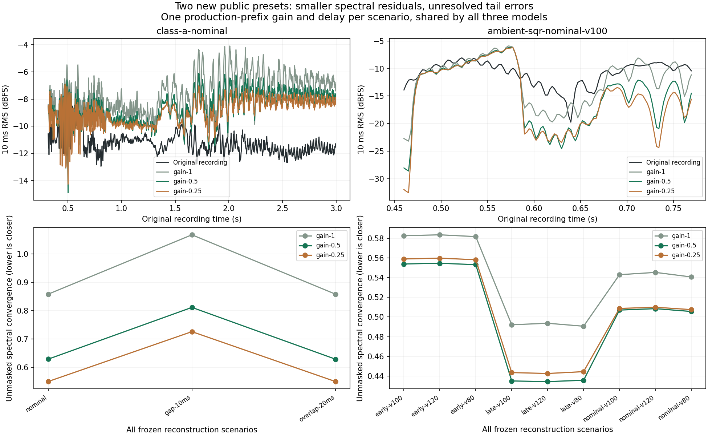

# Reverb return: two new public preset checks

**Reduce the current engine's reverb return from 0.8 to 0.4 as a provisional voicing correction.** Five independent neutral-damping recordings support the smaller return: Air Lead 1, Brassy Ld 1, Cotton Wool, SupaJuce 1 and the newly reconstructed Class A. The two damped references, Club Bass and Ambient SQR, retain significant envelope regressions. This is an overall improvement to the present model, **not an identified Roland coefficient or proof of matching output**. Damping calibration must revisit the return level.

The change scales only the final wet reverb return. It preserves feedback, time, size, diffusion, damping, stereo width, delay, preset bytes and performance inputs. The earlier [candidate and isolation experiments](reverb-return-candidates-2026-09-15.md) establish that the candidate family performs precisely this operation. Quarter return is retained as a sensitivity, not selected.

## Inputs and method frozen before scores

- A [structural inventory of the other 14 official presets](reverb-reference-openings-2026-09-15.md) selected Class A and Ambient SQR before rendering their candidate audio. They use neutral and −8 dB HF damping respectively.
- [Class A](class-a-performance-protocol-2026-09-15.md): 12 source-derived notes and 83 reconstructed pitch-bend messages, with nominal, 10 ms gap and 20 ms overlap gate variants. Calibration ends at 0.30 s; later comparison ends at 3.0 s. Four diagnostic regions were declared in advance. The final synthetic note-off is an artificial crop; its ensuing tail is excluded.
- [Ambient SQR](ambient-sqr-performance-feasibility-2026-09-15.md): three source-derived notes, D5/E5/F5. Calibration ends at 0.405 s; later comparison ends at 0.775 s. All combinations of three gate hypotheses and nominal velocities 80/100/120 are retained. The nine scenarios are uncertainty controls from **one recording**.
- Commit `b483c45` freezes all reconstruction JSON/MIDI files before scores. Commit `3f639ec` freezes the evaluator. Half return is the primary hypothesis; quarter return is a sensitivity. All three renderers come from the previously frozen `b0f6c03` gain family.
- The evaluator checks MP3, bank, extracted SysEx, reconstruction, MIDI, renderer and receipt hashes. One production-only prefix lag, bounded to ±50 ms, and one production-only prefix RMS gain are shared by every model. Calibration and later evaluation use disjoint sample support. No later-event, per-note, pitch, EQ or gain optimization is performed.
- Candidate-specific prefix gains are reported separately as a sensitivity. They do not drive the primary results or new listening copies.

Original performance MIDI, key releases, velocity and the exact recorded patch revision remain unauthenticated. The pitch bend is inferred from the same recording being evaluated, not independently supplied controller data. This is prospective evaluation of **DSP candidates under frozen reconstruction hypotheses**, not a blind validation of the source performance.

The [independent evaluator review](reverb-validation-independent-review-2026-09-15.md) includes planted delay/gain controls and a check that changing all later audio leaves calibration unchanged. Raw audio and every score are retained in `build-fidelity/hardware-benchmark/reverb-new-preset-validation/run-01`; the [durable data](reverb-new-preset-validation-2026-09-15.json) retain the protocol, all summary results, masks and predeclared regions.

## What improves and what does not

For nominal Class A, spectral convergence falls **0.8581 → 0.6289**, log-spectrum error **8.234 → 6.628 dB**, and envelope P95 error **6.170 → 4.712 dB**. Both stereo errors also improve. Every articulation variant and every declared region improves in spectral convergence. The nominal unbent-note, new-G4, bend and final held regions change respectively:

| Region | Original return | Half return |
|---|---:|---:|
| Later unbent notes | 0.6394 | 0.5289 |
| New G4 plateau | 0.5904 | 0.3763 |
| Source-derived bend | 0.8286 | 0.5728 |
| Held maximum bend | 1.0654 | 0.7962 |

Ambient SQR's spectral convergence improves in all nine scenarios, but its envelope and log-spectrum errors worsen in all nine. With nominal gates/velocity 100, convergence changes **0.5430 → 0.5070**, while envelope P95 changes **6.266 → 9.840 dB**. This is a material counterexample to a globally calibrated reverb module, not a result to discard because its spectrum improves.

Six Ambient scenarios hit the −50 ms alignment bound. The late-gate variants have interior −37.53 ms lags and still show approximately **4.67 dB worse** envelope P95 with half return. Boundary alignment therefore does not explain away the regression. These lags do not identify capture latency or justify choosing a preferred gate variant after scoring.

Spectral convergence measures the relative difference between STFT magnitudes and includes every bin. It is not a percentage of fidelity. The plotted model levels show substantial remaining differences even in the improved Class A result.

## Equal-bin sensitivity

The original assessment's log-spectrum and envelope activity masks use the maximum activity of each reference/candidate pair. Their supports can therefore differ between models. After the primary scores, a separately labeled diagnostic uses **reference-only activity masks**, fixed across all candidates, with the same −60 dB activity and −80 dB floor conventions.

That check preserves the conclusions and strengthens the Ambient qualification:

| Nominal case | Reference-mask log error: original / half / quarter return |
|---|---|
| Class A | 6.626 / 5.419 / 5.227 dB |
| Ambient SQR, velocity 100 | 11.272 / 12.259 / 13.466 dB |

Across all Ambient scenarios the half-return reference-mask error worsens approximately **0.90–1.17 dB**. Envelope P95 is unchanged by this mask choice in these cases. Reference-only masks omit energy where only the candidate is active; the unmasked primary convergence still counts that energy. This sensitivity is not a replacement protocol or a new acceptance threshold.

## Why make this limited correction

The [earlier ten-preset experiment](reverb-return-candidates-2026-09-15.md) already showed broadly favorable results on four neutral-damping recordings, with five byte-identical zero-send controls and the Club Bass counterexample. The new Class A result repeats the improvement on a separately chosen preset and frozen articulations, including with a shared production gain. The isolated model checks rule out unintended changes to delay, dry synthesis, stereo pan or feedback.

That supports lowering an otherwise unmeasured voicing constant in the **current** network. It does not establish an optimum across the original preset range. The HF-damped counterexamples suggest that frequency-dependent network energy, unknown articulation and other model differences still matter. No patch-specific exception is introduced to conceal them. Quarter gain is not selected: the previous corpus has worse Club/Cotton tail errors and mixed log-spectrum changes, and the new Ambient errors grow further.

The apparent damping association is confounded with layering: all five supportive active references use SINGLE mode, while Club Bass and Ambient SQR use DUAL. Code inspection finds no mode-specific send multiplier; each already scaled voice sample feeds both dry and effect buses. Unequal layer sends, excitation, phase and network modes can still change wet/dry balance. Both contrary presets' stored HF corner is **4000 Hz**, well above most of Club's measurable tail energy. The negative HF gain alone does not identify the cause. The [separate first-key extension](ambient-first-note-followup-2026-09-15.md) also retains Ambient's regression; it neither recovers MIDI nor replaces the original scenarios.

Decay evidence also does not justify a universal time multiplier. [Cotton's longer tail](cotton-reverb-decay-2026-09-15.md) supports a conditional 8.2–8.5 s effective broadband decay versus the model's 7.01 s target. [Class A's shorter, bass-dominated tail](class-a-reverb-decay-2026-09-15.md) instead gives approximately 3.4–3.6 s versus 3.87 s, with significant short-window/modal and fade uncertainty. Time and damping remain separate investigations.

## Reproduce

`Tools/evaluate_reverb_validation_cases.py` takes the nine Ambient JSONs, Class A nominal JSON and two Class A sensitivity JSONs from `Docs/fidelity/reconstructions/reverb-validation`, the catalog-verified source directory, and the frozen reverb gain run. It writes the full protocol before rendering. No reference file is modified.

`Tools/summarize_reverb_validation.py --run build-fidelity/hardware-benchmark/reverb-new-preset-validation/run-01 --output <new-directory>` creates the equal-bin sensitivity, full scenario table and plot. The retained final summary is `summary-02`; it adds hardware-excerpt hash checking and reproduces `summary-01` numerically.

The [independent completed-run check](reverb-validation-independent-results-2026-09-15.md) verifies all 36 candidate receipts, 48 listening arrays and 108 measurements from WAVs, with maximum numerical discrepancy 4.48e−12. The [shipping integration check](reverb-return-integration-2026-09-15.md) passes all 34 configured tests once and reproduces all 22 complete half-return WAVs byte-for-byte. The five unaffected presets remain identical to the previous baseline.

The [universal build receipt](reverb-level-universal-build-2026-09-15.json) records successful Release AU, VST3 and standalone builds, both arm64/x86_64 slices, binary hashes and verified local ad hoc signatures. No new DAW playback or installation was performed. The goal remains open: neither these comparisons nor successful software tests establish matching SH-201 output.

## All frozen scenarios

| Frozen scenario | SC 1 / 0.5 / 0.25 | Log error dB 1 / 0.5 / 0.25 | Envelope P95 dB 1 / 0.5 / 0.25 | Lag ms |
|---|---|---|---|---|
| ambient-sqr-early-v100 | 0.583 / 0.554 / 0.559 | 15.069 / 15.269 / 16.004 | 7.976 / 13.477 / 18.690 | -50.00 (bound) |
| ambient-sqr-early-v120 | 0.584 / 0.555 / 0.560 | 15.065 / 15.268 / 16.005 | 7.975 / 13.473 / 18.696 | -50.00 (bound) |
| ambient-sqr-early-v80 | 0.582 / 0.553 / 0.558 | 15.068 / 15.269 / 16.006 | 7.978 / 13.482 / 18.684 | -50.00 (bound) |
| ambient-sqr-late-v100 | 0.492 / 0.435 / 0.443 | 13.034 / 13.221 / 14.007 | 4.896 / 9.565 / 12.896 | -37.53 |
| ambient-sqr-late-v120 | 0.494 / 0.434 / 0.442 | 13.058 / 13.242 / 14.030 | 4.878 / 9.554 / 12.905 | -37.53 |
| ambient-sqr-late-v80 | 0.491 / 0.436 / 0.444 | 13.013 / 13.200 / 13.985 | 4.913 / 9.577 / 12.887 | -37.53 |
| ambient-sqr-nominal-v100 | 0.543 / 0.507 / 0.509 | 14.905 / 15.197 / 16.030 | 6.266 / 9.840 / 12.626 | -50.00 (bound) |
| ambient-sqr-nominal-v120 | 0.545 / 0.508 / 0.510 | 14.924 / 15.218 / 16.048 | 6.236 / 9.846 / 12.481 | -50.00 (bound) |
| ambient-sqr-nominal-v80 | 0.541 / 0.506 / 0.507 | 14.891 / 15.181 / 16.013 | 6.297 / 9.834 / 12.776 | -50.00 (bound) |
| class-a-nominal | 0.858 / 0.629 / 0.550 | 8.234 / 6.628 / 6.128 | 6.170 / 4.712 / 4.039 | -12.45 |
| class-a-gap-10ms | 1.067 / 0.811 / 0.726 | 9.087 / 7.576 / 7.045 | 7.527 / 5.900 / 5.267 | -30.39 |
| class-a-overlap-20ms | 0.858 / 0.629 / 0.550 | 7.750 / 6.148 / 5.636 | 6.167 / 4.710 / 4.043 | -12.45 |
