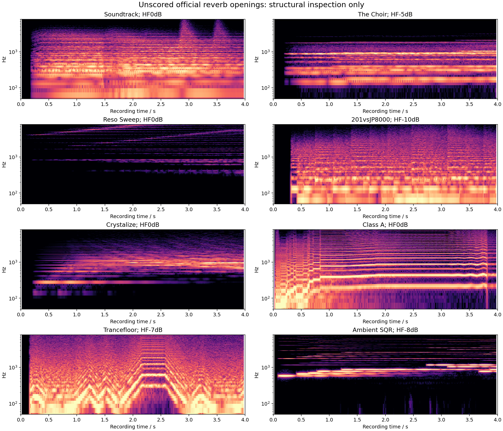

# Additional unscored reverb reference openings

**Class A is the clearest additional neutral-damping reference. Ambient SQR is the clearest contrasting-damping opening, with explicit layered-envelope limits.** 201vsJP8000 is a backup with weaker note isolation. Selection uses original patch structure and recording inspection; no reverb candidate render, score or parameter fit was used.

All 14 named recordings outside the existing ten-case corpus were checked. Eight have an active reverb path; six have the reverb switch off. Every remaining preset stores neutral LF damping. Four active presets have nonzero HF attenuation, but none repeats Club Bass's −36 dB setting. That coverage gap must remain explicit in any gain-generalization claim.

## Inventory

The [complete JSON](reverb-reference-openings-2026-09-15.json) retains the native codec's oscillator/coarse/envelope/routing decode, original MP3 and bank hashes, exact unchanged SysEx exports, all raw effect bytes and 25 ms opening RMS histories. The bank ZIPs, internal members, all 14 MP3s and all extracted SysEx hashes were reverified. Source recordings were freshly decoded to private float32 WAVs without normalization. No performance MIDI was created for this inventory.

| Preset | Active parts | Reverb on | Direct sends U/L | HF / LF damping dB | Structural finding |
|---|---|---|---|---|---|
| Sexy Back | U+L | No | 30 / 20 | 0 / 0 | Delay only; reverb-inactive control |
| Juicy Fat | U+L | No | 20 / 0 | 0 / 0 | Both effects off |
| Sequence Bs | L | No | — / 20 | 0 / 0 | Arpeggiator; opening state already ambiguous |
| Soundtrack | U+L | Yes | 45 / 45 | 0 / 0 | Several transposed Super Saws, slow envelopes and pitch-family overlap |
| The Choir | U | Yes | 100 / — | −5 / 0 | Noise/Super Saw, slow attack and overlapping families |
| Reso Sweep | Split U/L | Yes | 47 / 47 | 0 / 0 | Resonant sweeps, filter/AMP modulation, strong modulated delay |
| Pulsatron | L | No | — / 36 | 0 / 0 | Reverb inactive |
| 201vsJP8000 | U | Yes | 40 / — | −10 / 0 | Backup: two Super Saws, pitch/filter LFO and overlapping releases |
| Crystalize | U | Yes | 90 / — | 0 / 0 | Single feedback source, slow attack and moving filter/PW; source-model uncertainty |
| Moving Str. | U | No | 47 / — | 0 / 0 | Reverb inactive |
| Class A | U | Yes | 48 / — | 0 / 0 | Preferred neutral reference: octave saw pair, no pitch modulation or drive |
| Daft Lead | U+L | No | 20 / 20 | 0 / 0 | Reverb inactive |
| Trancefloor | U | Yes | 20 / — | −7 / 0 | Strong pitch envelope/glides, Super Saws and maximum delay modulation |
| Ambient SQR | U+L | Yes | 43 / 112 | −8 / 0 | Preferred contrast: clearly stepped opening; dual-layer AMP and drive remain confounds |

Stored nonzero sends do not make a switched-off reverb active. All active reverbs also receive their active delay return in the current engine routing. “Neutral damping” means LF/HF damping gains both 0 dB; HIGH CUT and the rest of the reverb still apply.



## Ranked openings

### 1. Class A — neutral damping

Single Upper, two saws at net offsets 0/−12 semitones after physical coarse +12/0 and tone octave −1, fine 0/0, balance −26. AMP ADSR is 0/0/127/0. SOLO LEGATO is stored, portamento is off, both LFO depths are zero, both pitch-envelope depths are zero, and overdrive is off. Its filter envelope remains active; that uncertainty cannot be reassigned to reverb gain.

The opening contains a rapid succession of pitched plateaus before a longer held tone around 0.9 s. The first isolated plateau is approximately 0.05–0.20 s; inspection range 0.03–4.0 s. These are source-inspection bounds, not recovered note gates. The early run must not be represented as only three notes if more events are needed to preserve the wet-state history. Later fixed reconstruction should retain those events before testing the long held tone.

- Delay raw bytes: `70,59,17,5,10`; Upper send 24.
- Reverb raw bytes: `86,10,7,19,127,127,19,36,0,36`; Upper send 48. LF/HF gains 0/0 dB; pre-delay raw 10 = 1 ms.
- Original recording: `build-fidelity/hardware-benchmark/sources/TOP8_ClassA.mp3`, SHA `88dc73e66c854e6ea57d976a96cd884dddb85275d56f73719000806f1609b886`.
- Exact SysEx: `build-fidelity/reverb-reference-expansion/run-02/lead-01/original-patch.syx`, SHA `5ac5ab7f052f6f17c48cc342bf4493ee5919572fc66dabf7daaddd25178b95e9`.
- Full decoded recording: same directory, `hardware-full.wav`, SHA `32c418c77f476d52427d5c01f6dea7316de91378323814982741cb50eead78f1`.

### 2. Ambient SQR — HF damping −8 dB

The first three obvious rising pitched plateaus have approximate interior windows 0.08–0.38, 0.45–0.58 and 0.64–0.76 s. These show a clearer short sequence than the other non-neutral candidates; they are not MIDI gates or proof of dry isolation.

Both layers are active. Upper uses two squares at coarse 0, fine +1/−3 cents, balance −1, overdrive on at 30, SOLO LEGATO and portamento 20. Lower uses two sines at coarse 0, fine −5/+6 cents, SOLO and portamento off. Tone octaves are both 0; no pitch-envelope/LFO depth is active. Upper AMP ADSR is 23/72/118/30; Lower is 76/127/100/22. The slow Lower entrance and different layer sends complicate wet/dry balance even when played pitches are clear.

- Delay raw bytes: `83,59,9,5,10`; sends 40/40.
- Reverb raw bytes: `89,10,7,19,127,127,19,36,0,28`; sends 43/112. HF gain −8 dB, LF gain 0 dB, pre-delay 1 ms.
- Original recording: `build-fidelity/hardware-benchmark/sources/TOP8_AmbientSQR.mp3`, SHA `d113bb3d65c34bb6827d29561e29dd9c9d4a6236143d5528685643f84a86e565`.
- Exact SysEx: `build-fidelity/reverb-reference-expansion/run-02/lead-07/original-patch.syx`, SHA `1e420e8a04502d790a1018f4547167377bdfd4470e21bb6602853d09218aff07`.
- Full decoded recording: same directory, `hardware-full.wav`, SHA `ccde7bbc4aceb5b8653a9cdad60a77c40fd6a472bd6c1ea75667c9fc4dcb4fc7`.

### 3. 201vsJP8000 — HF damping −10 dB, backup only

Single Upper uses two Super Saws at coarse/fine 0, centered mix, no pitch envelope, AMP ADSR 0/0/127/61. Oscillator1 pitch LFO depth −2 and filter LFO depth +34 are active. The low sequence begins around 0.30 s; a lower family enters around 0.42 s while earlier sound persists. Polyphony and the release make a three-note gate model less certain than Ambient SQR. This is a possible additional damping case after a credible overlap protocol, not a ready isolated reference.

- Delay raw bytes: `66,63,17,2,3`; send 40.
- Reverb raw bytes: `80,125,7,20,127,127,19,36,0,26`; send 40. HF gain −10 dB, LF gain 0 dB, pre-delay 100 ms, HIGH CUT bypass.
- Original recording: `build-fidelity/hardware-benchmark/sources/TOP8_SH-201vsJP-8000.mp3`, SHA `0681718b242a89b23d350237e3f2aad2085e877ee5818256a004eca921d49e2c`.
- Exact SysEx: `build-fidelity/reverb-reference-expansion/run-02/pad-06/original-patch.syx`, SHA `70e44e7665a3e6b46faabf733588fda615dcf2161a85dea693e70c319a3f1501`.
- Full decoded recording: same directory, `hardware-full.wav`, SHA `6afa661ac53703ff8a46795b4758ab6bee1041850ae8a9fe2b2a56ed9fbcbca5`.

## Freeze before scoring

The next step may reconstruct Class A and Ambient SQR independently from hardware, preserving their exact SysEx. Freeze pitch/onset hypotheses, gate and velocity sensitivities, training/held-out regions and comparison transforms before rendering or inspecting candidate gain scores. No preset should be dropped merely because the candidate later worsens it. This inventory does not accept any reverb-gain or damping change.

Reproduction uses original pinned banks/MP3s and the tracked native inventory:

```sh
OPENBLAS_NUM_THREADS=1 python3 Tools/inventory_reverb_validation_openings.py \
  --sources build-fidelity/hardware-benchmark/sources \
  --output build-fidelity/reverb-reference-expansion/reproduction
```

Recorded run: `reverb-reference-expansion/run-02`. The tool regenerates unchanged SysEx files, private decoded audio, full inventory JSON and the structural opening plot. No ignored preparation script is required.
