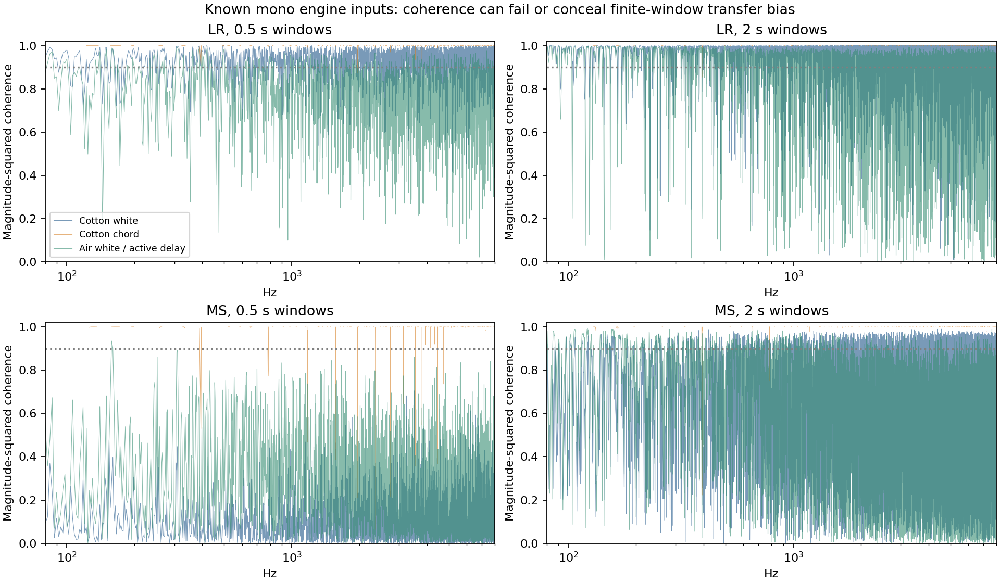

# Stereo-transfer feasibility: original Single presets

**Result: the tested finite-window estimator does not provide a defensible broadband reverb calibration.** Cotton Wool has the cleanest routing, but actual-engine controls produce biased transfer estimates even with high coherence and near-perfect invariance to oscillator phase. No reverb topology, time, return, or damping change follows from this audit. This bounded failure does not exclude a different estimator or a future controlled recording.

The [frozen protocol](reverb-stereo-transfer-protocol-2026-09-15.json) predates transfer results and new controls. The [receipt](reverb-stereo-transfer-feasibility-2026-09-15.json) retains source hashes, all window-size summaries, coverage, controls, and artifact hashes. Raw results are `build-fidelity/reverb-stereo-transfer/run-04/results.json`.

## What could cancel the performance

For one mono excitation through settled linear, time-invariant paths, `L = HL·X` and `R = HR·X`. Thus `R/L = HR/HL`; with `M=(L+R)/2` and `S=(L−R)/2`, `S/M=(HL−HR)/(HL+HR)`. The unknown input cancels at each frequency. This requires suitable signal support; averaging short, windowed spectra does not generally preserve that exact cancellation. Coherence concerns the relationship between the measured signals, rather than proving a particular physical transfer estimate is unbiased. See Julius O. Smith’s [Coherence Function](https://www.dsprelated.com/freebooks/mDFT/Coherence_Function.html) and the [cross-spectrum convention](https://docs.scipy.org/doc/scipy-1.16.0/reference/generated/scipy.signal.csd.html).

The current reverb uses fixed delays and linear filters once parameter transitions settle. Its read-head crossfades respond to parameter edits. Cotton controls below verify time invariance within numerical precision. This establishes a control property of our implementation; it does not authenticate the original unit’s topology or capture chain.

## Original patch and passage scope

All four downloadable patches are Single Upper, centered, and have overdrive disabled. Original banks, extracted complete SysEx, and MP3s are hash-checked. Roland associates the files by patch name; exact recording patch revision, controller activity, and capture processing remain unknown.

| Original | Delay/reverb sends, raw | Important constraint | Frozen train / check, seconds |
|---|---:|---|---|
| [Cotton Wool](https://www.rolandus.com/go/sh-201_patches/mp3/PAD/TOP8_Cotton_Wool.mp3) | 0 / 35 | Super Saw + lower-pitched sine; delay switch on but send zero | 0.5–8 / 8–15.5 |
| [Air Lead 1](https://www.rolandus.com/go/sh-201_patches/mp3/LEAD/TOP8_AirLead1.mp3) | 35 / 88 | Triangle + saw, pitch modulation; active delay | 0.5–4.5 / 4.5–8.5 |
| [SupaJuce 1](https://www.rolandus.com/go/sh-201_patches/mp3/LEAD/TOP8_SupaJuce1.mp3) | 24 / 48 | Octave-separated square oscillators; active delay | 0.5–8 / 8–16 |
| [Class A](https://www.rolandus.com/go/sh-201_patches/mp3/LEAD/TOP8_ClassA.mp3) | 24 / 48 | Octave-separated saw oscillators; active delay | 0.5–8 / 8–16 |

The three active delays have modulation depth 10. The current delay uses time-varying quadrature modulation, so their total effects path cannot serve as an isolated static reverb measurement. [Full original recordings](../plots/reverb-stereo-transfer-sources.png) were inspected before freezing support; these intervals contain changing musical notes, not authenticated stationary broadband probes. Tails are excluded.

## Estimator and controls

We use `mean(conj(X)·Y)/mean(|X|²)` with periodic Hann windows of 0.25, 0.5, 1, and 2 seconds, 75% overlap, no padding, and 80–8000 Hz support. Both power spectra must exceed −50 dB relative to their respective in-range maxima; Side/Mid also requires side power at least −35 dB relative to mid. Coherence ≥0.9 and at least eight frames are reported as guards. Overlapping frames and neighboring harmonic bins are not independent observations. Coverage and retained target power are reported before and after coherence selection.

Eight actual-engine renders use known mono EXT-IN, bypassed voice filter, constant AMP, and exact original effect blocks/sends: Cotton has two independent white inputs, two fixed C3/E3/G3 harmonic chords differing only in phase, and impulses launched at 4 and 12 seconds; Air has two white inputs. Startup is excluded. Input/output filters remain, so these are whole-engine controls. The complete Cotton impulse responses are folded modulo each FFT length to obtain transfer at the estimator’s exact bins. Their terminal-second powers are −302.71 and −158.59 dB relative to full-response power, passing the frozen −100 dB guard. Impulse-launch transfer difference P95 is below 1.1×10⁻⁸.

| Cotton input / measure | 0.25 s | 0.5 s | 1 s | 2 s |
|---|---:|---:|---:|---:|
| White: L/R weighted coherence | .924 | .930 | .944 | .963 |
| White: coherent-bin L/R error P95 | .454 | .367 | .277 | .197 |
| White: Side/Mid weighted coherence | .052 | .115 | .284 | .530 |
| Fixed chord: L/R weighted coherence | .990 | .990 | .991 | .993 |
| Fixed chord: coherent-bin Side/Mid error P95 | 6.905 | 6.738 | 4.700 | 2.589 |

Error means `|estimated transfer − impulse transfer| / |impulse transfer|`, a mathematical diagnostic, not a perceptual percentage. At 2 seconds, the white-input Side/Mid coherence mask retains only **4.63% of active side power**, despite retaining 2,743 bins. The chord’s coherent-bin median Side/Mid error remains .606. Its phase-only change nevertheless gives Side/Mid transfer difference P95 just .00136. Sparse harmonic leakage can therefore appear coherent and phase-invariant while describing a nearby spectral line instead of the nominal bin’s transfer.

A short known stereo FIR positive control reaches weighted coherence ≥.999991 and error P95 ≤.000605 with both white inputs and all window sizes. Independent L/R noise has no eligible coherent bins. These controls distinguish finite-window reverberant/sparse-input limitations from a gross estimator convention error.



## Original-recording feasibility

At the longest window, Cotton’s raw Side/Mid weighted coherence is .654/.675 across train/check. Coherent bins retain .157/.190 of active side power, with only **165 bins common to both passages**. A separately reported fixed R-channel −0.6 dB correction, inherited from the earlier channel-gain observation without refitting, reduces common support to **115 bins** and retained side power to .132/.112. L/R coherence stays high (.974/.975), but the controls show why that alone is insufficient.

SupaJuce and Class A retain 481 and 364 common Side/Mid bins; their active modulated delays prevent reverb-only attribution. Air’s 2-second analysis has only five frames per interval and fails the predeclared minimum-frame guard. All sizes and failed cases remain in the receipt. No surviving-bin count is presented as independent broadband coverage, and no original/model network fit was attempted.

**Narrow conclusion:** these sources describe stereo texture and its variation, but this protocol supplies no dependable source-independent reverb parameter anchor. Unknown capture gain, musical excitation, finite-window convolution, sparse leakage, and active delay must remain explicit. It supplies no hardware-equivalence evidence.

## Reproduction

Run from the repository with the catalog’s cached source MP3/ZIP files and the pinned integration verification receipt available:

```sh
OPENBLAS_NUM_THREADS=1 VECLIB_MAXIMUM_THREADS=1 python3 Tools/assess_reverb_stereo_transfer.py --protocol Docs/fidelity/source-audits/reverb-stereo-transfer-protocol-2026-09-15.json --output build-fidelity/reverb-stereo-transfer/reproduce
```

The tool independently extracts original patches, decodes native 44.1 kHz stereo float32 without resampling, verifies exact WAV hashes, freezes source, and builds controls. Run 04 reused all eight hash-verified run-02 controls after checking protocol, current/frozen source, original SysEx, fixture, binary, raw, and WAV identities; it directly redecoded the originals. Its numerical results agree with run 03 within 10⁻¹². The receipt verifies 176 saved spectral arrays and their hashes. No essential dependency on the earlier scratch inspection files remains.
